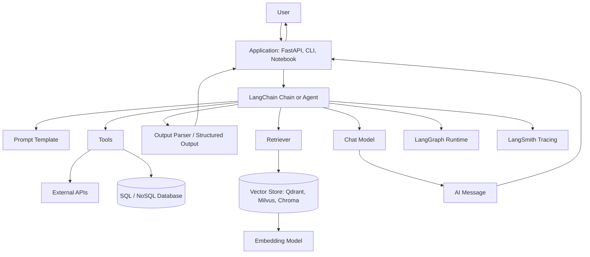
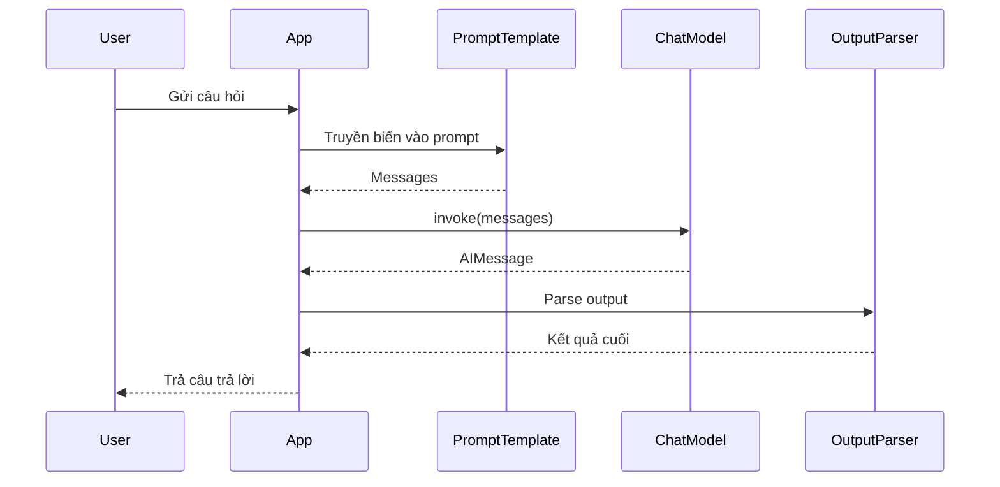
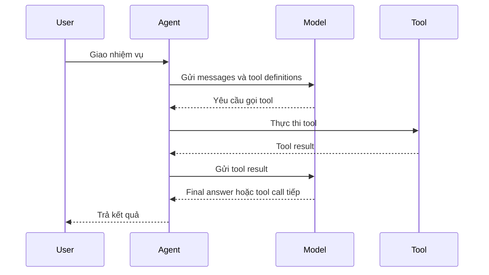
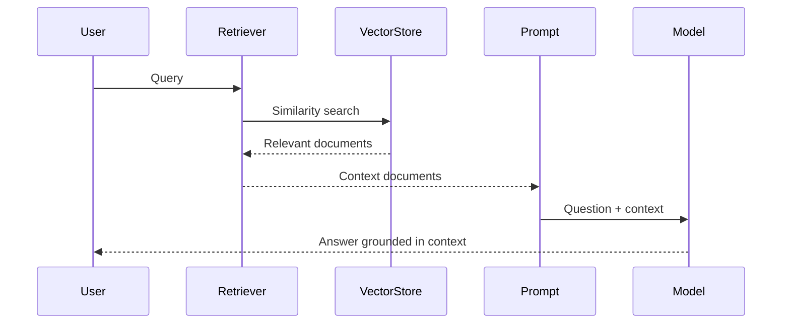
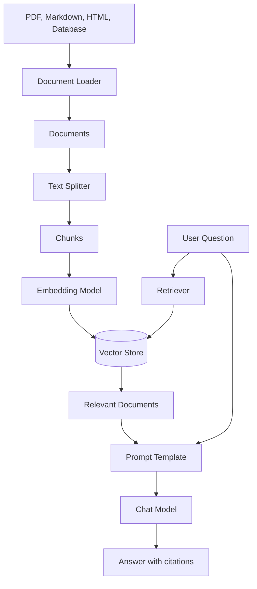
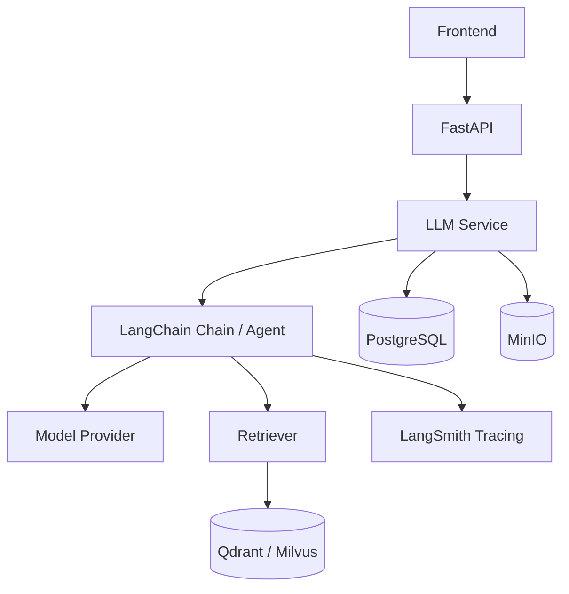

# LangChain: Cơ sở lý thuyết, kiến trúc và thực hành

## 1. Mục tiêu tài liệu

Tài liệu này trình bày LangChain theo hướng lý thuyết kết hợp thực hành, giúp người học nắm được:

- LangChain là gì và vì sao framework này thường được dùng để xây dựng ứng dụng LLM, chatbot, agent và hệ thống RAG.
- Các khái niệm cốt lõi như chat model, message, prompt template, runnable, tool, agent, retriever, document, embedding và vector store.
- Cách LangChain chuẩn hóa việc gọi nhiều model provider khác nhau như OpenAI, Anthropic, Google, Ollama, HuggingFace hoặc các provider tương thích OpenAI API.
- Cách xây dựng chain đơn giản bằng prompt, model và output parser.
- Cách xây dựng agent có khả năng gọi tool bằng `create_agent`.
- Cách kết hợp LangChain với vector database trong bài toán Retrieval-Augmented Generation.
- Sự khác nhau giữa LangChain, LangGraph và LangSmith trong hệ sinh thái LangChain.
- Các lỗi thiết kế thường gặp khi xây dựng ứng dụng LLM bằng LangChain.

Tài liệu này tập trung vào LangChain Python v1.x. Một số API cũ của LangChain v0.x đã thay đổi hoặc được chuyển sang package khác, vì vậy khi làm dự án thực tế nên kiểm tra tài liệu chính thức đúng phiên bản đang dùng.

## 2. Tổng quan về LangChain

LangChain là một framework mã nguồn mở dùng để xây dựng ứng dụng dựa trên Large Language Model. Thay vì chỉ gọi trực tiếp một API model, LangChain cung cấp các abstraction để kết nối model, prompt, tool, dữ liệu ngoài, memory, agent và tracing thành một workflow có thể mở rộng.

Một ứng dụng LLM thực tế thường không chỉ có một lời gọi model. Nó có thể cần:

- Chuẩn hóa prompt theo template.
- Gọi nhiều model khác nhau.
- Parse output về JSON hoặc Pydantic model.
- Truy xuất dữ liệu từ vector database.
- Gọi API bên ngoài như weather, search, SQL database hoặc hệ thống nội bộ.
- Giữ lịch sử hội thoại.
- Theo dõi từng bước chạy để debug.
- Xử lý retry, streaming, batch hoặc async.

LangChain giải quyết các nhu cầu này bằng cách đưa ra một tập interface thống nhất. Nhờ đó, ứng dụng có thể thay model provider, thay vector store hoặc thêm tool mà không phải viết lại toàn bộ kiến trúc.

LangChain thường được dùng cho:

- Chatbot hỏi đáp tài liệu.
- RAG trên PDF, website, database hoặc tài liệu nội bộ.
- Agent có khả năng dùng tool.
- Trợ lý SQL hoặc data analysis.
- Workflow tự động hóa có LLM tham gia.
- Semantic search.
- Structured extraction từ văn bản.
- Tóm tắt, phân loại, sinh nội dung, sinh báo cáo.

### 2.1. Đặc điểm nổi bật

| Đặc điểm | Ý nghĩa |
| --- | --- |
| Model abstraction | Gọi nhiều model provider qua interface thống nhất. |
| Message abstraction | Chuẩn hóa input/output hội thoại bằng `system`, `user`, `assistant`, `tool`. |
| Prompt template | Tái sử dụng prompt và truyền biến động vào prompt. |
| Runnable interface | Chuẩn hóa `invoke`, `stream`, `batch`, async và composition. |
| LCEL | Dùng toán tử `|` để nối prompt, model, parser và các bước xử lý. |
| Tools | Định nghĩa hàm Python để agent có thể gọi khi cần hành động. |
| Agents | Cho phép model lập luận, chọn tool và lặp lại cho đến khi có kết quả. |
| Retrieval | Kết nối document loader, embedding, vector store và retriever cho RAG. |
| Structured output | Trả kết quả theo schema thay vì text tự do. |
| LangGraph integration | Agent của LangChain được xây trên runtime graph của LangGraph. |
| LangSmith integration | Hỗ trợ tracing, debug, evaluation và observability. |

## 3. Cơ sở lý thuyết

### 3.1. Ứng dụng LLM

Ứng dụng LLM là ứng dụng dùng model ngôn ngữ lớn để hiểu, sinh hoặc chuyển đổi dữ liệu ngôn ngữ tự nhiên. Một ứng dụng LLM cơ bản có thể chỉ gồm:

```text
User input -> Prompt -> LLM -> Response
```

Tuy nhiên ứng dụng thực tế thường phức tạp hơn:

```text
User input
  -> Kiểm tra quyền
  -> Truy xuất tài liệu liên quan
  -> Tạo prompt
  -> Gọi model
  -> Parse output
  -> Gọi tool nếu cần
  -> Lưu lịch sử
  -> Trả kết quả
```

LangChain giúp biểu diễn các bước trên bằng component có interface rõ ràng.

### 3.2. Chat model

Chat model là model nhận vào một danh sách message và trả về message mới. Khác với completion model cũ chỉ nhận một chuỗi text, chat model làm việc tự nhiên hơn với hội thoại.

Ví dụ input:

```text
System: Bạn là trợ lý học SQL.
User: Giải thích INNER JOIN.
```

Output:

```text
Assistant: INNER JOIN trả về các dòng khớp giữa hai bảng...
```

Trong LangChain, chat model có thể đến từ nhiều provider khác nhau. Ta có thể dùng `init_chat_model` để khởi tạo model theo provider.

### 3.3. Message

Message là đơn vị ngữ cảnh cơ bản khi làm việc với chat model. Mỗi message thường có:

| Thành phần | Ý nghĩa |
| --- | --- |
| Role | Vai trò như `system`, `user`, `assistant`, `tool`. |
| Content | Nội dung text, image, audio hoặc dữ liệu khác tùy model. |
| Metadata | Thông tin phụ như token usage, id, tool call hoặc response metadata. |

Ví dụ:

```python
messages = [
    {"role": "system", "content": "Bạn là trợ lý học database."},
    {"role": "user", "content": "PostgreSQL là gì?"},
]
```

LangChain chuẩn hóa message để giảm sự khác biệt giữa các provider.

### 3.4. Prompt template

Prompt template là prompt có biến. Thay vì nối chuỗi thủ công, ta khai báo template rõ ràng:

```python
from langchain_core.prompts import ChatPromptTemplate

prompt = ChatPromptTemplate.from_messages(
    [
        ("system", "Bạn là trợ lý học {topic}."),
        ("human", "Giải thích khái niệm: {concept}"),
    ]
)

messages = prompt.invoke({"topic": "database", "concept": "index"})
```

Prompt template giúp:

- Tránh prompt bị rải rác trong code.
- Dễ truyền biến.
- Dễ tái sử dụng.
- Dễ kiểm thử.
- Dễ quản lý khi prompt dài.

### 3.5. Runnable và LCEL

Runnable là interface chuẩn của nhiều component LangChain. Một runnable thường có các phương thức:

| Phương thức | Ý nghĩa |
| --- | --- |
| `invoke()` | Chạy một input đồng bộ. |
| `ainvoke()` | Chạy một input bất đồng bộ. |
| `batch()` | Chạy nhiều input. |
| `stream()` | Stream output từng phần. |
| `with_retry()` | Thêm retry logic. |
| `bind()` | Gắn tham số cấu hình. |

LCEL là viết tắt của LangChain Expression Language. LCEL cho phép nối các runnable bằng toán tử `|`.

Ví dụ:

```python
chain = prompt | model | parser
```

Ý nghĩa:

```text
Input -> PromptTemplate -> ChatModel -> OutputParser -> Output
```

Cách viết này giúp chain rõ ràng, dễ debug và có sẵn nhiều khả năng như async, batch hoặc streaming.

### 3.6. Tool

Tool là một hàm mà agent có thể gọi để lấy thông tin hoặc thực hiện hành động. Ví dụ:

- Tìm kiếm web.
- Query database.
- Tính toán.
- Gọi API thời tiết.
- Đọc file.
- Gửi email.
- Tạo ticket.

Trong LangChain, tool có thể được tạo bằng decorator `@tool`.

```python
from langchain.tools import tool

@tool
def multiply(a: int, b: int) -> int:
    """Nhân hai số nguyên."""
    return a * b
```

Docstring của tool rất quan trọng vì model dùng mô tả đó để quyết định khi nào nên gọi tool.

### 3.7. Agent

Agent là hệ thống trong đó LLM có thể:

1. Nhận mục tiêu từ người dùng.
2. Suy nghĩ về bước tiếp theo.
3. Chọn tool phù hợp.
4. Gọi tool.
5. Quan sát kết quả.
6. Tiếp tục lặp cho đến khi có câu trả lời cuối cùng.

Khác với chain tuyến tính, agent có tính linh hoạt hơn. Chain phù hợp khi workflow đã biết trước. Agent phù hợp khi chưa biết cần gọi tool nào hoặc cần gọi bao nhiêu lần.

Trong LangChain v1.x, cách tạo agent tiêu chuẩn là `create_agent`.

### 3.8. Retrieval và RAG

Retrieval là quá trình lấy thông tin liên quan từ nguồn dữ liệu ngoài tại thời điểm người dùng hỏi. RAG là Retrieval-Augmented Generation, tức là dùng thông tin truy xuất được để bổ sung ngữ cảnh cho LLM.

Vấn đề RAG giải quyết:

- LLM có context window hữu hạn.
- LLM không biết dữ liệu riêng của tổ chức.
- LLM có thể trả lời sai nếu thiếu nguồn.
- Dữ liệu thay đổi sau thời điểm model được huấn luyện.

Quy trình RAG cơ bản:

1. Load tài liệu.
2. Chia tài liệu thành chunk.
3. Tạo embedding cho từng chunk.
4. Lưu embedding vào vector store.
5. Khi user hỏi, embed câu hỏi.
6. Tìm chunk liên quan.
7. Đưa chunk vào prompt.
8. Model trả lời dựa trên context.

### 3.9. Structured output

Structured output giúp model trả về dữ liệu có schema rõ ràng thay vì text tự do.

Ví dụ thay vì trả:

```text
Tên: Nguyễn Văn A, email: a@example.com
```

Ta muốn trả:

```json
{
  "name": "Nguyễn Văn A",
  "email": "a@example.com"
}
```

Structured output hữu ích cho:

- Trích xuất thông tin.
- Phân loại dữ liệu.
- Tạo JSON cho API.
- Sinh object theo Pydantic model.
- Workflow cần dữ liệu máy đọc được.

### 3.10. Memory và context

Trong ứng dụng LLM, "context" có nhiều nghĩa:

| Loại context | Ý nghĩa |
| --- | --- |
| System prompt | Luật và vai trò của model. |
| Message history | Lịch sử hội thoại đưa vào model. |
| Runtime context | Dữ liệu chỉ có trong một lần chạy, ví dụ `user_id`. |
| Retrieved context | Tài liệu lấy từ database hoặc vector store. |
| Long-term memory | Thông tin lưu qua nhiều phiên trò chuyện. |

LangChain và LangGraph hỗ trợ nhiều cách quản lý context. Với agent phức tạp, LangGraph thường là lớp phù hợp hơn để kiểm soát state, checkpoint và long-running workflow.

## 4. Kiến trúc LangChain

### 4.1. Sơ đồ kiến trúc Mermaid



Sơ đồ trên cho thấy LangChain đóng vai trò lớp điều phối các thành phần LLM application. Nó không thay thế model, database hay vector database. Nó giúp các thành phần đó làm việc với nhau qua interface thống nhất.

### 4.2. Các thành phần quan trọng

| Thành phần | Vai trò |
| --- | --- |
| Chat model | Gọi model ngôn ngữ lớn. |
| Message | Biểu diễn hội thoại và output của model. |
| Prompt template | Tạo prompt có biến và cấu trúc rõ ràng. |
| Runnable | Interface chuẩn để chạy, stream, batch và compose component. |
| Tool | Hàm hoặc API mà agent có thể gọi. |
| Agent | Vòng lặp model + tool để giải quyết nhiệm vụ linh hoạt. |
| Document | Đơn vị text và metadata dùng trong retrieval. |
| Embedding model | Chuyển text thành vector. |
| Vector store | Lưu và tìm kiếm vector. |
| Retriever | Interface truy xuất document liên quan. |
| Output parser | Chuyển output model sang định dạng ứng dụng cần. |
| LangGraph | Runtime graph cho agent/workflow phức tạp. |
| LangSmith | Tracing, evaluation và observability. |

### 4.3. LangChain, LangGraph và LangSmith

| Công cụ | Vai trò chính |
| --- | --- |
| LangChain | Framework cấp cao để xây agent, chain và tích hợp model/tool. |
| LangGraph | Runtime cấp thấp hơn để xây workflow/agent có state, graph, checkpoint, human-in-the-loop. |
| LangSmith | Nền tảng quan sát, trace, debug, evaluation và quản lý prompt. |

Cách chọn:

- Dùng LangChain khi muốn xây chatbot, chain, agent hoặc RAG nhanh.
- Dùng LangGraph khi workflow phức tạp, có nhiều node, cần kiểm soát state hoặc cần chạy dài.
- Dùng LangSmith khi cần debug, theo dõi chất lượng, đánh giá output và quan sát production.

## 5. Vòng đời xử lý request

### 5.1. Luồng chain đơn giản



Chain phù hợp với workflow đã biết trước, ví dụ:

- Tóm tắt văn bản.
- Dịch văn bản.
- Phân loại sentiment.
- Trích xuất JSON từ email.
- Sinh câu trả lời dựa trên context đã truy xuất.

### 5.2. Luồng agent có tool



Agent phù hợp với tình huống:

- Không biết trước cần gọi tool nào.
- Cần nhiều bước suy luận.
- Cần truy xuất dữ liệu động.
- Cần kết hợp nhiều nguồn như SQL, search, API và vector store.

### 5.3. Luồng RAG



RAG nên được dùng khi câu trả lời cần dựa trên dữ liệu ngoài, dữ liệu riêng hoặc dữ liệu mới.

## 6. Các khái niệm cốt lõi

### 6.1. Model

Model là thành phần sinh hoặc xử lý ngôn ngữ. Trong LangChain, model có thể là:

- Chat model.
- Embedding model.
- Completion model cũ.
- Model local chạy qua Ollama.
- Model cloud qua OpenAI, Anthropic, Google, AWS Bedrock hoặc provider khác.

Ví dụ khởi tạo model:

```python
from langchain.chat_models import init_chat_model

model = init_chat_model("openai:gpt-5.4")
```

Trong thực tế, thay `"openai:gpt-5.4"` bằng model mà provider của bạn hỗ trợ.

### 6.2. Messages

Các role phổ biến:

| Role | Ý nghĩa |
| --- | --- |
| `system` | Chỉ dẫn nền cho model. |
| `user` hoặc `human` | Nội dung người dùng gửi. |
| `assistant` hoặc `ai` | Nội dung model trả lời. |
| `tool` | Kết quả trả về từ tool. |

Ví dụ:

```python
response = model.invoke(
    [
        {"role": "system", "content": "Bạn là trợ lý học Python."},
        {"role": "user", "content": "Giải thích list comprehension."},
    ]
)

print(response.content)
```

### 6.3. Prompt template

Prompt template giúp tạo messages từ biến input.

```python
from langchain_core.prompts import ChatPromptTemplate

prompt = ChatPromptTemplate.from_messages(
    [
        ("system", "Bạn là trợ lý dạy {subject}."),
        ("human", "Hãy giải thích {concept} bằng ví dụ đơn giản."),
    ]
)
```

Khi chạy:

```python
messages = prompt.invoke(
    {
        "subject": "SQL",
        "concept": "foreign key",
    }
)
```

### 6.4. Runnable

Runnable là interface chung để nối component. Nhiều object như prompt, model, parser, retriever có thể tham gia chain.

Ví dụ:

```python
chain = prompt | model
```

Chạy:

```python
result = chain.invoke(
    {
        "subject": "SQL",
        "concept": "foreign key",
    }
)
```

### 6.5. Output parser

Output parser chuyển output model sang dạng dễ dùng hơn.

Ví dụ dùng `StrOutputParser` để lấy string:

```python
from langchain_core.output_parsers import StrOutputParser

parser = StrOutputParser()
chain = prompt | model | parser

answer = chain.invoke(
    {
        "subject": "SQL",
        "concept": "foreign key",
    }
)
```

Nếu ứng dụng cần JSON hoặc object có schema, nên dùng structured output thay vì parse text thủ công bằng regex.

### 6.6. Tool

Tool cần tên, mô tả và schema input rõ ràng. Với decorator `@tool`, LangChain tự suy ra schema từ type hints.

```python
from langchain.tools import tool

@tool
def get_course_info(course_code: str) -> str:
    """Tra cứu thông tin môn học theo mã môn."""
    data = {
        "DB101": "Cơ sở dữ liệu: SQL, transaction, index.",
        "AI101": "Nhập môn AI: search, ML, neural networks.",
    }
    return data.get(course_code, "Không tìm thấy môn học.")
```

Mô tả tool nên ngắn nhưng đủ rõ để model biết lúc nào dùng.

### 6.7. Agent

Agent kết hợp model và tool. Ví dụ:

```python
from langchain.agents import create_agent
from langchain.tools import tool

@tool
def multiply(a: int, b: int) -> int:
    """Nhân hai số nguyên."""
    return a * b

agent = create_agent(
    model="openai:gpt-5.4",
    tools=[multiply],
    system_prompt="Bạn là trợ lý toán học. Hãy dùng tool khi cần tính toán.",
)

result = agent.invoke(
    {
        "messages": [
            {"role": "user", "content": "23 nhân 47 bằng bao nhiêu?"}
        ]
    }
)

print(result["messages"][-1].content)
```

Agent có thể gọi tool nhiều lần nếu nhiệm vụ yêu cầu.

### 6.8. Document

Document là đơn vị dữ liệu text kèm metadata, thường dùng trong RAG.

```python
from langchain_core.documents import Document

doc = Document(
    page_content="PostgreSQL là hệ quản trị cơ sở dữ liệu quan hệ mã nguồn mở.",
    metadata={"source": "postgresql.md", "topic": "database"},
)
```

Metadata giúp truy ngược nguồn, filter theo quyền hoặc hiển thị citation.

### 6.9. Embedding

Embedding là vector số biểu diễn ý nghĩa của text. Hai đoạn text gần nghĩa thường có vector gần nhau.

Ví dụ:

```text
"máy tính xách tay cho sinh viên"
"laptop học tập pin lâu"
```

Hai câu trên không giống toàn bộ từ khóa nhưng có ý nghĩa gần nhau. Embedding giúp vector database tìm được mối liên quan này.

### 6.10. Vector store và retriever

Vector store lưu document embedding và hỗ trợ similarity search. Ví dụ:

- Chroma.
- Qdrant.
- Milvus.
- PGVector.
- Elasticsearch.
- Pinecone.

Retriever là interface lấy document liên quan từ vector store hoặc nguồn khác. Trong LangChain, retriever có thể được dùng như runnable trong chain.

### 6.11. Structured output

Structured output cho phép agent trả kết quả theo schema.

```python
from pydantic import BaseModel, Field
from langchain.agents import create_agent

class ContactInfo(BaseModel):
    name: str = Field(description="Tên người liên hệ")
    email: str = Field(description="Email")
    phone: str = Field(description="Số điện thoại")

agent = create_agent(
    model="openai:gpt-5.4",
    tools=[],
    response_format=ContactInfo,
)

result = agent.invoke(
    {
        "messages": [
            {
                "role": "user",
                "content": "Trích xuất: Nguyễn Văn A, a@example.com, 0909123456",
            }
        ]
    }
)

print(result["structured_response"])
```

Kết quả nằm trong key `structured_response`.

### 6.12. LangSmith tracing

Khi chain hoặc agent có nhiều bước, debug bằng `print` rất khó. LangSmith giúp ghi lại:

- Prompt đã gửi.
- Model nào được gọi.
- Tool nào được gọi.
- Input/output từng bước.
- Latency, token usage, lỗi và retry.

Cấu hình tracing thường dùng:

```bash
export LANGSMITH_TRACING=true
export LANGSMITH_API_KEY=...
```

Trên Windows PowerShell:

```powershell
$env:LANGSMITH_TRACING="true"
$env:LANGSMITH_API_KEY="..."
```

## 7. Cài đặt và cấu hình

### 7.1. Yêu cầu

LangChain Python v1.x yêu cầu Python phiên bản mới, thường nên dùng Python 3.10+.

Kiểm tra:

```bash
python --version
```

Tạo virtual environment:

```bash
python -m venv .venv
```

Kích hoạt trên Windows PowerShell:

```powershell
.\.venv\Scripts\Activate.ps1
```

Kích hoạt trên macOS/Linux:

```bash
source .venv/bin/activate
```

### 7.2. Cài LangChain

```bash
pip install -U langchain
```

Cài integration OpenAI:

```bash
pip install -U "langchain[openai]"
```

Hoặc cài package provider riêng:

```bash
pip install -U langchain-openai
pip install -U langchain-anthropic
pip install -U langchain-google-genai
pip install -U langchain-ollama
```

Tùy dự án, có thể cần thêm:

```bash
pip install -U langchain-community
pip install -U langchain-text-splitters
pip install -U langchain-qdrant
pip install -U langchain-milvus
```

### 7.3. Cấu hình API key

Ví dụ với OpenAI:

```bash
export OPENAI_API_KEY="..."
```

Windows PowerShell:

```powershell
$env:OPENAI_API_KEY="..."
```

Không nên hard-code API key trong source code hoặc commit vào Git.

### 7.4. Test model

```python
from langchain.chat_models import init_chat_model

model = init_chat_model("openai:gpt-5.4")

response = model.invoke("Giải thích LangChain trong 3 câu.")
print(response.content)
```

Nếu lỗi authentication, kiểm tra lại API key và package provider.

## 8. Ví dụ sử dụng LangChain

### 8.1. Chain đơn giản

```python
from langchain.chat_models import init_chat_model
from langchain_core.output_parsers import StrOutputParser
from langchain_core.prompts import ChatPromptTemplate

model = init_chat_model("openai:gpt-5.4")

prompt = ChatPromptTemplate.from_messages(
    [
        ("system", "Bạn là trợ lý học lập trình, trả lời ngắn gọn."),
        ("human", "Giải thích khái niệm {concept}."),
    ]
)

chain = prompt | model | StrOutputParser()

answer = chain.invoke({"concept": "API"})
print(answer)
```

Luồng xử lý:

```text
dict input -> prompt -> messages -> model -> AIMessage -> string
```

### 8.2. Streaming

```python
for chunk in chain.stream({"concept": "transaction trong database"}):
    print(chunk, end="", flush=True)
```

Streaming giúp giao diện người dùng phản hồi nhanh hơn, đặc biệt khi câu trả lời dài.

### 8.3. Batch

```python
questions = [
    {"concept": "primary key"},
    {"concept": "foreign key"},
    {"concept": "index"},
]

answers = chain.batch(questions)

for answer in answers:
    print(answer)
```

Batch hữu ích khi cần xử lý nhiều input tương tự nhau.

### 8.4. Agent với tool tính toán

```python
from langchain.agents import create_agent
from langchain.tools import tool

@tool
def add(a: int, b: int) -> int:
    """Cộng hai số nguyên."""
    return a + b

@tool
def multiply(a: int, b: int) -> int:
    """Nhân hai số nguyên."""
    return a * b

agent = create_agent(
    model="openai:gpt-5.4",
    tools=[add, multiply],
    system_prompt="Bạn là trợ lý toán học. Dùng tool khi cần tính chính xác.",
)

result = agent.invoke(
    {
        "messages": [
            {"role": "user", "content": "Tính (12 + 8) * 5"}
        ]
    }
)

print(result["messages"][-1].content)
```

Agent có thể tự quyết định gọi `add`, sau đó gọi `multiply`.

### 8.5. Structured extraction

```python
from typing import Literal
from pydantic import BaseModel, Field
from langchain.agents import create_agent

class Ticket(BaseModel):
    category: Literal["bug", "feature", "question"]
    priority: Literal["low", "medium", "high"]
    summary: str = Field(description="Tóm tắt ngắn nội dung ticket")

agent = create_agent(
    model="openai:gpt-5.4",
    tools=[],
    response_format=Ticket,
)

result = agent.invoke(
    {
        "messages": [
            {
                "role": "user",
                "content": "App bị crash khi tôi bấm nút thanh toán. Cần xử lý gấp.",
            }
        ]
    }
)

print(result["structured_response"])
```

Ứng dụng có thể dùng object `Ticket` để lưu database hoặc route sang team phù hợp.

### 8.6. Semantic search tối giản

```python
from langchain_core.documents import Document
from langchain_core.vectorstores import InMemoryVectorStore
from langchain_openai import OpenAIEmbeddings

documents = [
    Document(
        page_content="PostgreSQL hỗ trợ transaction ACID.",
        metadata={"source": "postgresql.md"},
    ),
    Document(
        page_content="Qdrant là vector database dùng cho semantic search.",
        metadata={"source": "qdrant.md"},
    ),
    Document(
        page_content="MinIO là object storage tương thích S3.",
        metadata={"source": "minio.md"},
    ),
]

embeddings = OpenAIEmbeddings(model="text-embedding-3-large")
vector_store = InMemoryVectorStore(embeddings)
vector_store.add_documents(documents)

results = vector_store.similarity_search("database vector để tìm kiếm ngữ nghĩa", k=1)

for doc in results:
    print(doc.page_content, doc.metadata)
```

`InMemoryVectorStore` phù hợp để học hoặc test nhỏ. Dự án thật nên dùng Qdrant, Milvus, PostgreSQL/pgvector, Elasticsearch hoặc vector store phù hợp hơn.

## 9. LangChain trong hệ thống RAG

### 9.1. Sơ đồ RAG với LangChain



LangChain không bắt buộc bạn dùng một vector store cụ thể. Nó cung cấp interface để đổi vector store dễ hơn.

### 9.2. Các bước xây RAG

1. Chọn nguồn dữ liệu.
2. Load dữ liệu thành `Document`.
3. Chia document thành chunk.
4. Tạo embedding cho từng chunk.
5. Lưu vào vector store.
6. Tạo retriever.
7. Khi user hỏi, retriever lấy chunk liên quan.
8. Prompt đưa chunk vào context.
9. Model trả lời dựa trên context.
10. Trả citation hoặc source metadata nếu cần.

### 9.3. Thiết kế prompt RAG

Prompt RAG nên có quy tắc rõ:

```text
Bạn là trợ lý hỏi đáp tài liệu.
Chỉ trả lời dựa trên context được cung cấp.
Nếu context không có thông tin, nói rằng không tìm thấy trong tài liệu.
Luôn trích dẫn source nếu có.

Context:
{context}

Question:
{question}
```

Quy tắc này giúp giảm hallucination.

### 9.4. Agentic RAG

RAG truyền thống thường có luồng cố định:

```text
retrieve -> answer
```

Agentic RAG cho phép agent quyết định khi nào cần retrieve, retrieve nguồn nào, có cần gọi SQL/API hay không.

Ví dụ:

- Nếu câu hỏi là "tóm tắt tài liệu", dùng retriever tài liệu.
- Nếu câu hỏi là "doanh thu tháng này", gọi SQL tool.
- Nếu câu hỏi là "so sánh với thông tin mới nhất", gọi web search tool.

Agentic RAG mạnh hơn nhưng khó kiểm soát hơn. Cần logging, evaluation và guardrails cẩn thận.

## 10. LangChain trong hệ thống backend

### 10.1. Kiến trúc FastAPI + LangChain



Trong backend, nên tách LangChain ra service layer thay vì viết trực tiếp trong route.

Ví dụ cấu trúc:

```text
app/
  api/
    routes/
      chat.py
  core/
    config.py
  services/
    llm_service.py
    retrieval_service.py
  repositories/
    document_repository.py
```

### 10.2. Service layer

Ví dụ service đơn giản:

```python
class ChatService:
    def __init__(self, chain):
        self.chain = chain

    def answer(self, question: str) -> str:
        return self.chain.invoke({"question": question})
```

Lợi ích:

- Route FastAPI gọn hơn.
- Dễ test chain riêng.
- Dễ thay model hoặc retriever.
- Dễ thêm logging, tracing, rate limit.

### 10.3. Cấu hình bằng environment

Ví dụ `.env`:

```text
OPENAI_API_KEY=...
LANGSMITH_TRACING=true
LANGSMITH_API_KEY=...
MODEL_NAME=openai:gpt-5.4
VECTOR_DB_URL=http://localhost:6333
```

Không nên để secret trong code.

## 11. So sánh LangChain với cách gọi API trực tiếp

| Tiêu chí | Gọi API trực tiếp | Dùng LangChain |
| --- | --- | --- |
| Ứng dụng đơn giản | Rất phù hợp | Có thể hơi dư |
| Nhiều model provider | Tự viết adapter | Có abstraction sẵn |
| Prompt template | Tự quản lý | Có component rõ ràng |
| Tool calling | Tự xử lý schema và loop | Có tool và agent abstraction |
| RAG | Tự nối loader, embedding, vector store | Có interface và integrations |
| Streaming/batch/async | Tự viết logic | Runnable hỗ trợ sẵn |
| Debug nhiều bước | Khó hơn | Tích hợp LangSmith tốt |
| Kiểm soát tối đa | Cao | Có thêm layer abstraction |

Kết luận thực tế:

- Nếu chỉ gọi model một lần, gọi API trực tiếp có thể đủ.
- Nếu cần RAG, tool, agent, nhiều provider hoặc tracing, LangChain giúp tiết kiệm nhiều công sức.

## 12. LangChain và các công nghệ trong repo này

Repo này có tài liệu về Docker, FastAPI, PostgreSQL, Elasticsearch, Qdrant, Milvus và MinIO. LangChain có thể kết nối các phần đó thành hệ thống AI hoàn chỉnh.

| Công nghệ | Vai trò khi kết hợp với LangChain |
| --- | --- |
| FastAPI | Expose API chatbot/RAG cho frontend. |
| PostgreSQL | Lưu user, document metadata, lịch sử, phân quyền. |
| Qdrant | Vector store cho semantic search/RAG. |
| Milvus | Vector database cho dữ liệu vector quy mô lớn. |
| Elasticsearch | Full-text search, hybrid search hoặc log/search service. |
| MinIO | Lưu PDF, ảnh, tài liệu gốc, dataset. |
| Docker | Đóng gói backend, vector database, object storage và service phụ thuộc. |

Ví dụ hệ thống RAG học tập:

```text
PDF/Markdown -> MinIO
Metadata -> PostgreSQL
Chunks + embeddings -> Qdrant hoặc Milvus
API -> FastAPI
LLM workflow -> LangChain
Tracing -> LangSmith
```

## 13. Thiết kế ứng dụng LangChain

### 13.1. Chọn chain hay agent

| Nhu cầu | Nên dùng |
| --- | --- |
| Workflow cố định | Chain |
| Tóm tắt, dịch, phân loại | Chain |
| RAG 2 bước đơn giản | Chain |
| Cần model tự chọn tool | Agent |
| Cần nhiều bước không biết trước | Agent |
| Workflow có state phức tạp | LangGraph |

Không nên dùng agent cho mọi thứ. Agent mạnh nhưng khó debug, khó kiểm soát chi phí và latency hơn chain cố định.

### 13.2. Thiết kế prompt

Prompt nên có:

- Vai trò rõ ràng.
- Nhiệm vụ rõ ràng.
- Input format.
- Output format.
- Quy tắc khi thiếu thông tin.
- Ví dụ nếu task khó.

Prompt RAG nên yêu cầu model không bịa nếu context thiếu thông tin.

### 13.3. Thiết kế tool

Tool nên:

- Làm một nhiệm vụ rõ ràng.
- Có type hints.
- Có docstring mô tả khi nào dùng.
- Trả output ngắn gọn, có cấu trúc nếu được.
- Xử lý lỗi rõ ràng.
- Không cấp quyền vượt mức cần thiết.

Không nên đưa tool nguy hiểm cho agent nếu chưa có guardrail, ví dụ tool xóa dữ liệu, gửi email thật hoặc chạy lệnh hệ thống.

### 13.4. Thiết kế retrieval

Các yếu tố quyết định chất lượng RAG:

- Chất lượng tài liệu nguồn.
- Cách chunking.
- Embedding model.
- Vector store và distance metric.
- Metadata filtering.
- Prompt grounding.
- Cách đánh giá kết quả.

LangChain giúp nối các bước, nhưng chất lượng RAG phụ thuộc mạnh vào dữ liệu và thiết kế retrieval.

### 13.5. Thiết kế observability

Ứng dụng LLM nên được trace từ sớm:

- Input user.
- Prompt cuối cùng.
- Document được retrieve.
- Tool call.
- Model response.
- Latency.
- Token usage.
- Error.

Nếu không có tracing, rất khó biết vì sao model trả lời sai.

## 14. Tối ưu và vận hành

### 14.1. Quản lý chi phí

Chi phí LLM thường phụ thuộc:

- Số request.
- Model được dùng.
- Số token input.
- Số token output.
- Số tool call.
- Số bước agent.
- Embedding số lượng lớn.

Nên:

- Giới hạn context.
- Dùng model nhỏ cho task đơn giản.
- Cache kết quả nếu phù hợp.
- Giới hạn số vòng lặp agent.
- Theo dõi token usage bằng tracing.

### 14.2. Giảm hallucination

Các cách giảm hallucination:

- Dùng RAG với nguồn đáng tin.
- Yêu cầu trả lời dựa trên context.
- Trả "không biết" khi thiếu thông tin.
- Dùng structured output cho dữ liệu cần chính xác.
- Kiểm tra output bằng rule hoặc model khác.
- Log và đánh giá truy vấn thực tế.

### 14.3. Streaming UX

Streaming giúp người dùng thấy câu trả lời đang được sinh ra. Tuy nhiên với structured output hoặc tool calling, cần thiết kế UI cẩn thận vì output có thể đến theo nhiều event khác nhau.

### 14.4. Retry và timeout

Model provider hoặc tool bên ngoài có thể lỗi. Nên có:

- Timeout cho tool.
- Retry có giới hạn.
- Fallback model nếu phù hợp.
- Error message rõ ràng.
- Circuit breaker cho API không ổn định.

### 14.5. Evaluation

Không nên đánh giá RAG/agent chỉ bằng cảm giác. Nên tạo bộ câu hỏi mẫu và đo:

- Câu trả lời đúng không.
- Có citation đúng không.
- Có bịa không.
- Retriever lấy đúng tài liệu không.
- Latency có chấp nhận được không.
- Chi phí trên mỗi request.

## 15. Ưu điểm và hạn chế

### 15.1. Ưu điểm

- Giúp xây ứng dụng LLM nhanh hơn so với tự nối từng API.
- Có nhiều integration với model, tool, retriever, vector store và document loader.
- Runnable/LCEL giúp compose workflow rõ ràng.
- `create_agent` giúp tạo agent có tool nhanh.
- Tích hợp tốt với LangGraph cho workflow phức tạp.
- Tích hợp LangSmith giúp debug và quan sát hệ thống.
- Phù hợp cho RAG, chatbot, extraction, assistant và agent.

### 15.2. Hạn chế

- API thay đổi khá nhanh giữa các phiên bản lớn.
- Có thêm lớp abstraction nên đôi khi khó debug nếu chưa hiểu bên dưới.
- Dùng agent không cẩn thận có thể tăng latency và chi phí.
- Chất lượng RAG vẫn phụ thuộc vào dữ liệu, chunking, embedding và retriever.
- Không thay thế việc hiểu model provider, token limit, rate limit và bảo mật.
- Một số integration nằm ở package riêng, cần cài đúng package.

## 16. Các lỗi thiết kế thường gặp

### 16.1. Dùng agent cho workflow cố định

Nếu bài toán chỉ cần một chuỗi bước rõ ràng, chain thường tốt hơn agent. Agent có thêm vòng lặp quyết định tool nên khó kiểm soát hơn.

### 16.2. Prompt không có quy tắc khi thiếu thông tin

Nếu không nói rõ "không biết thì nói không biết", model dễ bịa. Đặc biệt trong RAG, prompt nên yêu cầu trả lời dựa trên context.

### 16.3. Tool mô tả mơ hồ

Tool docstring quá ngắn hoặc mơ hồ làm model chọn tool sai. Mỗi tool cần mô tả rõ input, output và tình huống sử dụng.

### 16.4. Không kiểm soát quyền của tool

Agent có thể gọi tool theo cách không mong muốn. Tool truy cập database, gửi email, xóa file hoặc gọi API tốn tiền cần guardrail và permission rõ ràng.

### 16.5. Chunking kém trong RAG

Chunk quá dài làm loãng thông tin. Chunk quá ngắn thiếu ngữ cảnh. Cần thử nghiệm chunk size, overlap và metadata.

### 16.6. Không lưu source metadata

Nếu document không có metadata như `source`, `page`, `document_id`, hệ thống khó trích dẫn và khó debug retrieval.

### 16.7. Không bật tracing khi hệ thống phức tạp

Agent/RAG nhiều bước mà không trace sẽ rất khó biết lỗi nằm ở prompt, retriever, tool hay model.

### 16.8. Hard-code model và secret

Không nên hard-code API key hoặc model name trong nhiều file. Nên đưa vào config/environment.

### 16.9. Không giới hạn số bước agent

Agent có thể lặp nhiều lần nếu nhiệm vụ mơ hồ hoặc tool lỗi. Nên có giới hạn iteration, timeout và logging.

### 16.10. Tin structured output tuyệt đối mà không validate

Structured output giúp giảm lỗi nhưng vẫn cần validate theo business rule. Ví dụ email phải hợp lệ, số tiền không âm, enum đúng domain.

## 17. Bài tập thực hành

### Bài 1: Cài LangChain

Tạo virtual environment, cài:

```bash
pip install -U langchain
pip install -U "langchain[openai]"
```

Chạy một model call đơn giản bằng `init_chat_model`.

### Bài 2: Viết chain giải thích khái niệm

Tạo chain:

```text
PromptTemplate -> ChatModel -> StrOutputParser
```

Input gồm:

- `subject`
- `concept`
- `level`

Output là lời giải thích phù hợp với trình độ.

### Bài 3: Viết tool tính toán

Tạo hai tool:

- `add`
- `multiply`

Tạo agent và yêu cầu tính biểu thức:

```text
(15 + 27) * 3
```

Kiểm tra agent có gọi tool đúng không.

### Bài 4: Structured extraction

Tạo Pydantic model `StudentInfo` gồm:

- `name`
- `student_id`
- `major`
- `email`

Yêu cầu agent trích xuất thông tin từ một đoạn văn bản tiếng Việt.

### Bài 5: Semantic search

Tạo 5 document ngắn về:

- PostgreSQL
- Qdrant
- Milvus
- MinIO
- Docker

Tạo embedding và lưu vào `InMemoryVectorStore`. Truy vấn:

```text
công cụ lưu vector để tìm kiếm ngữ nghĩa
```

Kiểm tra document nào được trả về.

### Bài 6: Thiết kế RAG cho repo này

Thiết kế hệ thống hỏi đáp trên thư mục `docs`:

- File markdown lưu ở đâu?
- Metadata lưu ở đâu?
- Vector store dùng Qdrant hay Milvus?
- LangChain dùng ở layer nào?
- FastAPI expose endpoint nào?
- Có cần LangSmith tracing không?

## 18. Lộ trình học đề xuất

1. Hiểu cách gọi chat model bằng `init_chat_model`.
2. Học message và prompt template.
3. Học Runnable và LCEL.
4. Viết chain đơn giản với output parser.
5. Viết tool và agent bằng `create_agent`.
6. Học document, embedding, vector store và retriever.
7. Xây RAG đơn giản.
8. Thêm metadata filtering và citation.
9. Bật LangSmith tracing.
10. Khi workflow phức tạp hơn, học LangGraph.

## 19. Kết luận

LangChain là framework mạnh để xây dựng ứng dụng LLM có nhiều thành phần như prompt, model, tool, retriever, agent và structured output. Thay vì tự viết toàn bộ logic kết nối giữa các provider và hệ thống dữ liệu, LangChain cung cấp interface thống nhất để phát triển nhanh hơn và dễ thay đổi kiến trúc hơn.

Về mặt kỹ thuật, LangChain xoay quanh các abstraction như message, prompt template, runnable, tool, agent, document, embedding và retriever. Với LCEL, các bước xử lý có thể được nối thành chain rõ ràng. Với `create_agent`, model có thể dùng tool để giải quyết nhiệm vụ linh hoạt hơn.

Trong hệ thống AI thực tế, LangChain thường không đứng một mình. Nó kết hợp với FastAPI để expose API, PostgreSQL để lưu metadata, Qdrant hoặc Milvus để lưu vector, MinIO để lưu tài liệu gốc và LangSmith để trace/evaluate. Khi workflow có nhiều trạng thái, cần chạy lâu hoặc cần kiểm soát sâu hơn, LangGraph là lựa chọn phù hợp để mở rộng từ LangChain.

Khi dùng LangChain, cần chú ý thiết kế prompt, tool, retrieval, structured output, tracing và guardrails. Framework giúp nối các mảnh ghép, nhưng chất lượng cuối cùng vẫn phụ thuộc vào dữ liệu, model, đánh giá và cách thiết kế hệ thống.

## 20. Tài liệu tham khảo

- LangChain Documentation: https://docs.langchain.com/oss/python
- LangChain Overview: https://docs.langchain.com/oss/python/langchain/overview
- LangChain Install: https://docs.langchain.com/oss/python/langchain/install
- LangChain v1 Release Notes: https://docs.langchain.com/oss/python/releases/langchain-v1
- LangChain Models: https://docs.langchain.com/oss/python/langchain-models
- LangChain Agents: https://docs.langchain.com/oss/python/langchain/agents
- LangChain Tools: https://docs.langchain.com/oss/python/langchain/tools
- LangChain Retrieval: https://docs.langchain.com/oss/python/langchain/retrieval
- LangChain Semantic Search Tutorial: https://docs.langchain.com/oss/python/langchain/knowledge-base
- LangChain Structured Output: https://docs.langchain.com/oss/python/langchain/structured-output
- LangGraph Overview: https://docs.langchain.com/oss/python/langgraph/overview
- LangSmith: https://smith.langchain.com/
