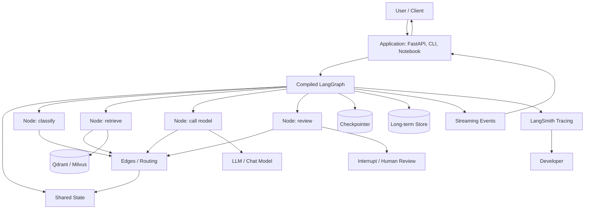
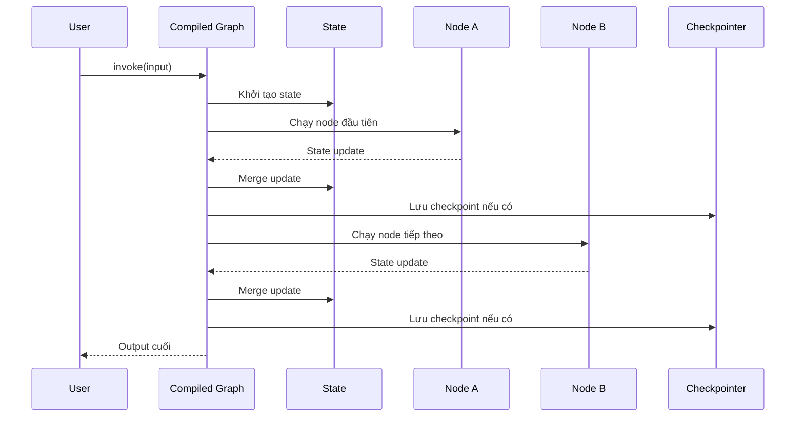
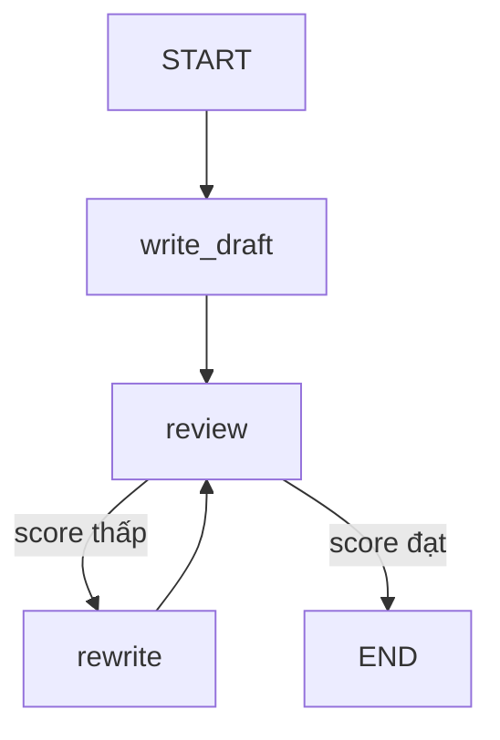
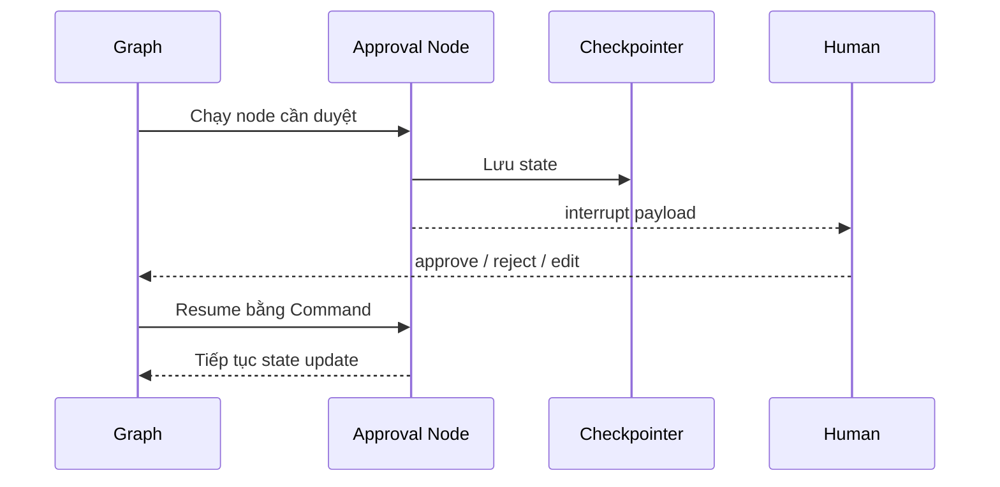
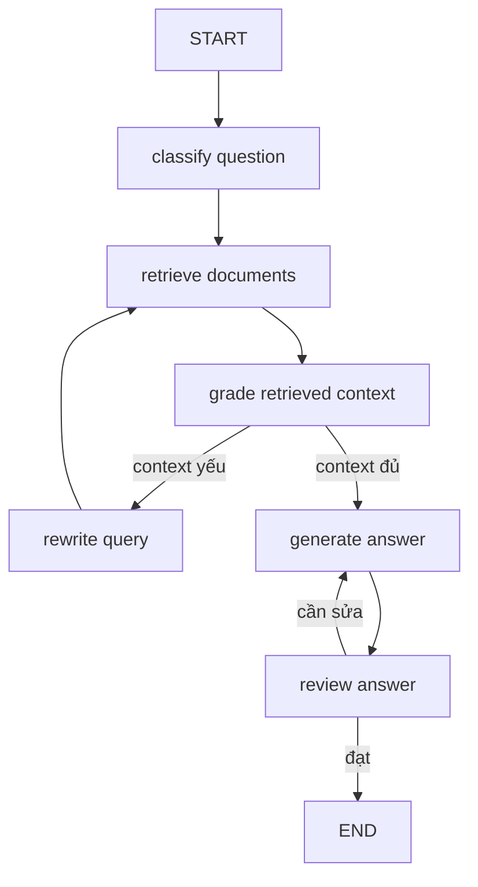
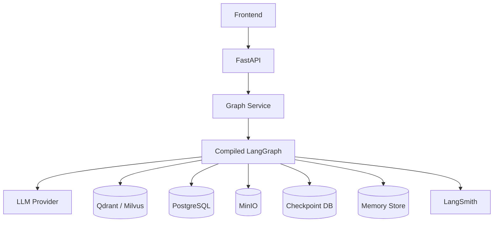

# LangGraph: Cơ sở lý thuyết, kiến trúc và thực hành

## 1. Mục tiêu tài liệu

Tài liệu này trình bày LangGraph theo hướng lý thuyết kết hợp thực hành, giúp người học nắm được:

- LangGraph là gì và vì sao nó quan trọng khi xây dựng agent hoặc workflow LLM có nhiều bước, có trạng thái và cần chạy bền vững.
- Sự khác nhau giữa LangGraph, LangChain và LangSmith trong hệ sinh thái LangChain.
- Các khái niệm cốt lõi như graph, state, node, edge, conditional edge, `START`, `END`, checkpoint, thread, interrupt, command, store và subgraph.
- Cách xây dựng workflow bằng Graph API với `StateGraph`.
- Cách dùng Functional API với `@entrypoint` và `@task`.
- Cách thêm memory, persistence, human-in-the-loop và streaming vào ứng dụng AI.
- Cách kết hợp LangGraph với LangChain, FastAPI, vector database và các hệ thống backend trong dự án thực tế.
- Các lỗi thiết kế thường gặp khi xây agent/workflow bằng LangGraph.

Tài liệu này tập trung vào LangGraph Python v1.x. Một số API có thể thay đổi theo phiên bản, đặc biệt ở các phần nâng cao như deployment, streaming format, checkpointer backend và LangGraph Platform. Khi làm dự án thực tế nên đối chiếu thêm với tài liệu chính thức đúng phiên bản đang dùng.

## 2. Tổng quan về LangGraph

LangGraph là framework và runtime cấp thấp để xây dựng **stateful agent workflow**. Nếu LangChain giúp xây agent nhanh bằng abstraction cấp cao như model, tool và `create_agent`, thì LangGraph cho phép kiểm soát sâu hơn cách workflow chạy qua từng bước, trạng thái được cập nhật ra sao, khi nào rẽ nhánh, khi nào dừng, khi nào cần con người duyệt và cách resume sau khi bị gián đoạn.

LangGraph đặc biệt phù hợp với các bài toán:

- Agent cần nhiều bước suy luận và gọi tool.
- Workflow có trạng thái phức tạp.
- Cần human-in-the-loop trước khi thực hiện hành động nguy hiểm.
- Cần lưu tiến trình để resume sau lỗi hoặc sau nhiều ngày.
- Cần streaming từng bước ra frontend.
- Cần memory theo cuộc hội thoại hoặc memory dài hạn theo user.
- Cần multi-agent hoặc subgraph cho từng vai trò.
- Cần quan sát, debug, time travel và kiểm thử luồng agent.

Ví dụ một workflow đơn giản:

```text
User question
  -> classify intent
  -> retrieve context
  -> call model
  -> review answer
  -> if answer is weak, rewrite
  -> final response
```

Với LangChain chain thông thường, workflow tuyến tính như trên có thể làm được. Nhưng khi có vòng lặp, rẽ nhánh, resume, human approval hoặc state dài hạn, LangGraph trở nên phù hợp hơn.

### 2.1. Đặc điểm nổi bật

| Đặc điểm | Ý nghĩa |
| --- | --- |
| Graph-based workflow | Biểu diễn workflow bằng node và edge thay vì một chuỗi tuyến tính. |
| Shared state | Mỗi node đọc và ghi vào state chung của graph. |
| Conditional routing | Rẽ nhánh dựa trên state hiện tại. |
| Cycles | Cho phép vòng lặp, phù hợp với agent cần revise hoặc retry. |
| Persistence | Lưu checkpoint sau từng bước để resume, memory và debug. |
| Durable execution | Workflow có thể tiếp tục sau lỗi, restart hoặc human approval. |
| Human-in-the-loop | Dừng workflow bằng `interrupt` và chờ con người quyết định. |
| Streaming | Stream state update, token, task event hoặc custom progress. |
| Subgraphs | Chia workflow lớn thành nhiều graph nhỏ, hữu ích cho multi-agent. |
| Functional API | Thêm persistence, task, interrupt vào code Python dạng hàm. |
| LangSmith integration | Trace graph, debug state transition và đánh giá workflow. |

## 3. Cơ sở lý thuyết

### 3.1. Graph workflow

Graph workflow là cách mô hình hóa một quy trình bằng các node và edge.

```text
Node A -> Node B -> Node C
```

Mỗi node là một bước xử lý. Edge quyết định node nào chạy tiếp theo.

Trong workflow LLM, node có thể là:

- Gọi model.
- Gọi retriever.
- Gọi tool.
- Kiểm tra output.
- Cập nhật state.
- Xin con người phê duyệt.
- Ghi log.
- Chọn nhánh tiếp theo.

LangGraph dùng graph vì agent không phải lúc nào cũng tuyến tính. Agent có thể cần quay lại bước trước, chạy nhiều nhánh song song hoặc dừng tạm để chờ người dùng.

### 3.2. State

State là dữ liệu chung của workflow tại một thời điểm. Node nhận state hiện tại và trả về phần state cần cập nhật.

Ví dụ state của một workflow RAG:

```python
class RAGState(TypedDict, total=False):
    question: str
    documents: list[str]
    draft_answer: str
    final_answer: str
    needs_rewrite: bool
```

Ý tưởng quan trọng:

```text
Node không cần trả toàn bộ state.
Node chỉ trả phần state muốn cập nhật.
LangGraph merge phần cập nhật đó vào state hiện tại.
```

Thiết kế state tốt là nền tảng của graph tốt. State nên đủ thông tin để các node phối hợp, nhưng không nên chứa dữ liệu quá lớn hoặc không serializable.

### 3.3. Node

Node là hàm xử lý một bước trong graph. Một node thường:

1. Nhận state.
2. Đọc các trường cần thiết.
3. Thực hiện logic.
4. Trả về dict chứa update cho state.

Ví dụ:

```python
def write_draft(state: State) -> dict:
    topic = state["topic"]
    return {"draft": f"Bản nháp về {topic}"}
```

Node có thể gọi LLM, database, API hoặc tool. Tuy nhiên nếu node có side effect như ghi file, gửi email hoặc gọi API tốn tiền, cần thiết kế idempotent hoặc dùng task/persistence cẩn thận để tránh chạy lặp khi resume.

### 3.4. Edge

Edge quyết định thứ tự chạy node.

Normal edge:

```text
node_a -> node_b
```

Conditional edge:

```text
node_review -> node_rewrite nếu cần sửa
node_review -> END nếu đã tốt
```

LangGraph hỗ trợ:

- Edge cố định.
- Conditional edge.
- Conditional entry point.
- Dynamic routing bằng `Command`.
- Parallel execution khi một node có nhiều outgoing edge.

Với mỗi node, nên chọn một kiểu routing rõ ràng. Không nên vừa dùng edge cố định vừa trả `Command(goto=...)` từ cùng node nếu không thật sự hiểu hành vi, vì cả hai đường có thể cùng chạy.

### 3.5. START và END

`START` và `END` là hai node đặc biệt:

| Node | Ý nghĩa |
| --- | --- |
| `START` | Điểm bắt đầu graph. |
| `END` | Điểm kết thúc graph. |

Ví dụ:

```python
builder.add_edge(START, "write_draft")
builder.add_edge("finalize", END)
```

Graph không tự biết bắt đầu từ đâu nếu không khai báo entry point.

### 3.6. Checkpoint và thread

Checkpoint là snapshot của state tại một bước chạy. Khi graph được compile với checkpointer, LangGraph có thể lưu state sau từng bước.

Thread là định danh cho một phiên chạy hoặc một cuộc hội thoại.

Ví dụ:

```python
config = {"configurable": {"thread_id": "user-42-session-1"}}
```

Thread ID giúp LangGraph biết state nào thuộc cuộc hội thoại nào. Nếu resume hoặc tiếp tục một conversation, cần dùng cùng thread ID.

Checkpoint cần cho:

- Memory ngắn hạn.
- Human-in-the-loop.
- Time travel debugging.
- Fault tolerance.
- Resume workflow sau lỗi.

### 3.7. Interrupt

Interrupt là cơ chế dừng graph giữa chừng để chờ input bên ngoài. Đây là nền tảng của human-in-the-loop.

Ví dụ:

```text
Agent chuẩn bị xóa 1000 bản ghi.
Graph gọi interrupt để hỏi người dùng duyệt.
Người dùng approve/reject/edit.
Graph resume từ checkpoint.
```

Interrupt cần:

- Checkpointer.
- Thread ID.
- Payload JSON-serializable.
- Resume bằng `Command(resume=...)`.

### 3.8. Durable execution

Durable execution nghĩa là workflow có thể lưu tiến trình và tiếp tục sau khi bị gián đoạn. Điều này quan trọng vì agent thực tế có thể:

- Gọi API lâu.
- Chờ người duyệt.
- Bị restart server.
- Gặp lỗi mạng.
- Cần chạy nhiều giờ hoặc nhiều ngày.

LangGraph hỗ trợ durable execution thông qua persistence/checkpoint. Khi thiết kế durable workflow, cần chú ý determinism và idempotency: nếu resume, những bước đã hoàn thành không nên gây side effect lần nữa.

### 3.9. Memory

LangGraph có hai kiểu memory chính:

| Loại memory | Ý nghĩa |
| --- | --- |
| Short-term memory | Memory trong một thread hoặc conversation, thường nằm trong state và được lưu bằng checkpointer. |
| Long-term memory | Memory lưu qua nhiều thread hoặc nhiều session, thường nằm trong store. |

Ví dụ:

- Short-term: lịch sử message của một cuộc chat.
- Long-term: user thích câu trả lời ngắn, user đang học database, user dùng tiếng Việt.

### 3.10. Graph API và Functional API

LangGraph có hai cách chính để xây workflow:

| API | Khi nên dùng |
| --- | --- |
| Graph API | Khi muốn biểu diễn workflow rõ bằng state, node và edge. Phù hợp để visualize, rẽ nhánh, subgraph, multi-agent. |
| Functional API | Khi đã có code Python dạng hàm và muốn thêm checkpoint, task, interrupt, streaming mà không viết graph rõ ràng. |

Graph API phù hợp để học LangGraph nền tảng vì nó làm rõ state và control flow. Functional API tiện khi muốn giữ code gần với Python control flow bình thường.

## 4. Kiến trúc LangGraph

### 4.1. Sơ đồ kiến trúc Mermaid



LangGraph là runtime điều phối workflow. Nó không thay thế model, vector database, backend hay frontend. Nó giúp các bước tương tác với nhau bằng state và control flow rõ ràng.

### 4.2. Các thành phần quan trọng

| Thành phần | Vai trò |
| --- | --- |
| `StateGraph` | Builder để định nghĩa graph dựa trên state schema. |
| State schema | Kiểu dữ liệu mô tả state của graph. |
| Node | Hàm xử lý một bước, nhận state và trả state update. |
| Edge | Quy định node nào chạy tiếp. |
| Conditional edge | Rẽ nhánh theo kết quả routing function. |
| `START` | Điểm bắt đầu graph. |
| `END` | Điểm kết thúc graph. |
| Compiled graph | Graph sau khi `compile()`, có thể `invoke`, `stream`, `batch`. |
| Checkpointer | Lưu checkpoint state theo thread. |
| Store | Lưu dữ liệu dài hạn, ví dụ memory xuyên session. |
| Interrupt | Tạm dừng graph và chờ input bên ngoài. |
| Command | Điều khiển resume, update, goto hoặc routing động. |
| Subgraph | Graph dùng như node trong graph khác. |

### 4.3. LangGraph trong hệ sinh thái LangChain

| Công cụ | Vai trò |
| --- | --- |
| LangChain | Framework cấp cao để gọi model, tạo agent, tool, RAG và chain. |
| LangGraph | Runtime cấp thấp cho workflow/agent có state, checkpoint, streaming và human-in-the-loop. |
| LangSmith | Observability, tracing, evaluation và debug. |

Mối quan hệ thường gặp:

```text
LangChain cung cấp model/tool/retriever.
LangGraph điều phối workflow nhiều bước.
LangSmith ghi trace và hỗ trợ debug/evaluation.
```

Trong LangChain v1.x, agent tạo bằng `create_agent` được xây trên LangGraph runtime. Nếu cần custom workflow sâu hơn, có thể dùng LangGraph trực tiếp.

## 5. Vòng đời xử lý graph

### 5.1. Luồng chạy cơ bản



Mỗi bước chạy thường gồm:

1. Graph chọn node cần chạy.
2. Node nhận state hiện tại.
3. Node trả state update.
4. LangGraph merge update.
5. LangGraph quyết định node tiếp theo qua edge.
6. Nếu có checkpointer, state được lưu.

### 5.2. Luồng conditional routing



Conditional routing giúp workflow tự quyết định đường đi dựa trên state. Đây là lý do LangGraph phù hợp với agent và workflow có vòng lặp.

### 5.3. Luồng human-in-the-loop



Điểm quan trọng: khi resume sau interrupt, node chứa `interrupt()` có thể chạy lại từ đầu. Vì vậy code trước `interrupt()` phải an toàn khi chạy lại hoặc side effect phải được bọc trong task/idempotent.

## 6. Các khái niệm cốt lõi

### 6.1. State schema

State schema mô tả các trường trong state. Có thể dùng `TypedDict`, Pydantic model hoặc schema phù hợp.

Ví dụ:

```python
from typing_extensions import TypedDict

class State(TypedDict, total=False):
    topic: str
    draft: str
    review: str
    score: int
```

Dùng `total=False` trong ví dụ học tập giúp input ban đầu không cần chứa tất cả field.

### 6.2. State update

Node không mutate state trực tiếp. Node trả về dict update:

```python
def write_draft(state: State) -> dict:
    return {"draft": f"Bản nháp về {state['topic']}"}
```

LangGraph sẽ merge:

```text
state cũ + update -> state mới
```

### 6.3. Reducer

Một số field trong state cần cách merge đặc biệt. Ví dụ `messages` thường không muốn ghi đè mà muốn append message mới.

LangGraph cung cấp state đặc biệt như `MessagesState` để xử lý message history theo cách phù hợp.

Ví dụ:

```python
from langgraph.graph import MessagesState
```

Khi dùng `MessagesState`, node có thể trả:

```python
return {"messages": [{"role": "ai", "content": "hello"}]}
```

Message mới sẽ được thêm vào history theo reducer phù hợp.

### 6.4. Node

Node có thể là sync hoặc async function:

```python
def classify(state: State) -> dict:
    question = state["question"]
    if "SQL" in question:
        return {"intent": "database"}
    return {"intent": "general"}
```

Node nên có trách nhiệm nhỏ, rõ ràng. Nếu node làm quá nhiều việc, graph khó debug và khó checkpoint hiệu quả.

### 6.5. Normal edge

Normal edge dùng khi luồng cố định:

```python
builder.add_edge("step_1", "step_2")
```

Ví dụ:

```text
load -> split -> embed -> store
```

### 6.6. Conditional edge

Conditional edge dùng khi luồng phụ thuộc state.

```python
def route_after_review(state: State) -> str:
    if state["score"] < 7:
        return "rewrite"
    return "done"

builder.add_conditional_edges(
    "review",
    route_after_review,
    {
        "rewrite": "rewrite",
        "done": END,
    },
)
```

Routing function nên đơn giản, dễ test và không có side effect.

### 6.7. Command

`Command` dùng cho các tình huống cần kết hợp update state và routing động trong một node, hoặc resume sau interrupt.

Hai pattern phổ biến:

```python
from langgraph.types import Command

return Command(update={"x": 1}, goto="next_node")
```

và:

```python
graph.invoke(Command(resume=True), config=config)
```

Không nên trộn `Command(goto=...)` với edge cố định từ cùng node nếu không muốn nhiều nhánh cùng chạy.

### 6.8. Checkpointer

Checkpointer lưu state theo từng thread.

Ví dụ học tập:

```python
from langgraph.checkpoint.memory import InMemorySaver

checkpointer = InMemorySaver()
graph = builder.compile(checkpointer=checkpointer)
```

`InMemorySaver` chỉ phù hợp demo/local vì dữ liệu mất khi process tắt. Production nên dùng checkpointer bền vững như PostgreSQL, Redis hoặc backend được hỗ trợ.

### 6.9. Thread ID

Thread ID là khóa định danh một phiên graph:

```python
config = {
    "configurable": {
        "thread_id": "student-123-chat-1"
    }
}
```

Dùng cùng thread ID để:

- Tiếp tục conversation.
- Resume interrupt.
- Lấy lại state.
- Debug checkpoint.

Nếu đổi thread ID, LangGraph coi đó là một phiên khác.

### 6.10. Store

Store dùng cho long-term memory hoặc dữ liệu cần dùng xuyên nhiều thread.

Ví dụ:

```text
thread A: user hỏi về SQL
thread B: user hỏi về Docker
store: lưu preference "user thích câu trả lời ngắn"
```

Store khác với checkpointer:

| Thành phần | Vai trò |
| --- | --- |
| Checkpointer | Lưu state theo thread và từng bước chạy. |
| Store | Lưu memory/dữ liệu dài hạn có thể truy cập qua nhiều thread. |

### 6.11. Interrupt

Interrupt dừng graph và trả payload ra ngoài.

```python
from langgraph.types import interrupt

def approval_node(state: State) -> dict:
    approved = interrupt(
        {
            "question": "Bạn có duyệt hành động này không?",
            "draft": state["draft"],
        }
    )
    return {"approved": approved}
```

Payload nên JSON-serializable.

### 6.12. Streaming

LangGraph hỗ trợ nhiều stream mode:

| Stream mode | Ý nghĩa |
| --- | --- |
| `values` | Stream toàn bộ state sau mỗi step. |
| `updates` | Stream phần state update sau mỗi step. |
| `messages` | Stream token/message từ LLM call. |
| `custom` | Stream dữ liệu tự định nghĩa từ node/tool. |
| `checkpoints` | Stream checkpoint events. |
| `tasks` | Stream task start/finish/error. |
| `debug` | Stream thông tin debug chi tiết. |

Streaming giúp frontend hiển thị tiến trình graph thay vì chờ toàn bộ workflow hoàn tất.

### 6.13. Subgraph

Subgraph là graph được dùng bên trong graph khác. Có hai pattern chính:

| Pattern | Khi dùng |
| --- | --- |
| Gọi subgraph trong node | Parent và child có state schema khác nhau. |
| Thêm subgraph như node | Parent và child chia sẻ state key. |

Subgraph hữu ích cho:

- Multi-agent.
- Tách workflow lớn thành module.
- Cho team khác nhau phát triển từng phần.
- Tái sử dụng workflow con.

## 7. Cài đặt và cấu hình

### 7.1. Cài LangGraph

```bash
pip install -U langgraph
```

Nếu workflow dùng LangChain model/tool:

```bash
pip install -U langchain
pip install -U "langchain[openai]"
```

Nếu cần LangSmith tracing:

```bash
export LANGSMITH_TRACING=true
export LANGSMITH_API_KEY=...
```

Windows PowerShell:

```powershell
$env:LANGSMITH_TRACING="true"
$env:LANGSMITH_API_KEY="..."
```

### 7.2. Ví dụ hello world

```python
from langgraph.graph import StateGraph, MessagesState, START, END


def mock_llm(state: MessagesState) -> dict:
    return {"messages": [{"role": "ai", "content": "hello world"}]}


builder = StateGraph(MessagesState)
builder.add_node("mock_llm", mock_llm)
builder.add_edge(START, "mock_llm")
builder.add_edge("mock_llm", END)

graph = builder.compile()

result = graph.invoke(
    {"messages": [{"role": "user", "content": "hi!"}]}
)

print(result["messages"][-1].content)
```

Ví dụ này cho thấy cấu trúc tối thiểu:

```text
StateGraph -> add_node -> add_edge -> compile -> invoke
```

## 8. Ví dụ Graph API

### 8.1. Workflow tuần tự

```python
from typing_extensions import TypedDict
from langgraph.graph import StateGraph, START, END


class State(TypedDict, total=False):
    topic: str
    draft: str
    review: str
    final: str


def write_draft(state: State) -> dict:
    return {"draft": f"Bản nháp ngắn về {state['topic']}."}


def review_draft(state: State) -> dict:
    return {"review": f"Review: {state['draft']} Nội dung ổn."}


def finalize(state: State) -> dict:
    return {"final": f"{state['draft']}\n\n{state['review']}"}


builder = StateGraph(State)
builder.add_node("write_draft", write_draft)
builder.add_node("review_draft", review_draft)
builder.add_node("finalize", finalize)

builder.add_edge(START, "write_draft")
builder.add_edge("write_draft", "review_draft")
builder.add_edge("review_draft", "finalize")
builder.add_edge("finalize", END)

graph = builder.compile()

result = graph.invoke({"topic": "LangGraph"})
print(result["final"])
```

Đây là graph tuyến tính. Nếu workflow chỉ tuyến tính đơn giản, LangChain chain cũng có thể đủ. LangGraph trở nên hữu ích hơn khi có branching, loop, checkpoint hoặc human-in-the-loop.

### 8.2. Conditional routing và vòng lặp

```python
from typing_extensions import TypedDict
from langgraph.graph import StateGraph, START, END


class State(TypedDict, total=False):
    topic: str
    draft: str
    score: int
    attempts: int


def write_draft(state: State) -> dict:
    attempts = state.get("attempts", 0) + 1
    return {
        "draft": f"Bản nháp lần {attempts} về {state['topic']}.",
        "attempts": attempts,
    }


def review(state: State) -> dict:
    attempts = state.get("attempts", 1)
    score = 5 if attempts < 2 else 8
    return {"score": score}


def rewrite(state: State) -> dict:
    return {
        "draft": state["draft"] + " Đã bổ sung ví dụ và giải thích rõ hơn."
    }


def route_after_review(state: State) -> str:
    if state["score"] >= 7:
        return "done"
    return "rewrite"


builder = StateGraph(State)
builder.add_node("write_draft", write_draft)
builder.add_node("review", review)
builder.add_node("rewrite", rewrite)

builder.add_edge(START, "write_draft")
builder.add_edge("write_draft", "review")
builder.add_conditional_edges(
    "review",
    route_after_review,
    {
        "rewrite": "rewrite",
        "done": END,
    },
)
builder.add_edge("rewrite", "review")

graph = builder.compile()

result = graph.invoke({"topic": "LangGraph"})
print(result)
```

Graph này có vòng lặp:

```text
write_draft -> review -> rewrite -> review -> END
```

Trong workflow thật, nên đặt giới hạn số lần retry/rewrite để tránh vòng lặp vô hạn.

### 8.3. Graph có LLM call

```python
from typing_extensions import TypedDict
from langchain.chat_models import init_chat_model
from langgraph.graph import StateGraph, START, END


class State(TypedDict, total=False):
    question: str
    answer: str


model = init_chat_model("openai:gpt-5.4")


def answer_question(state: State) -> dict:
    response = model.invoke(
        [
            {"role": "system", "content": "Bạn là trợ lý học database."},
            {"role": "user", "content": state["question"]},
        ]
    )
    return {"answer": response.content}


builder = StateGraph(State)
builder.add_node("answer_question", answer_question)
builder.add_edge(START, "answer_question")
builder.add_edge("answer_question", END)

graph = builder.compile()
result = graph.invoke({"question": "Giải thích transaction trong PostgreSQL."})
print(result["answer"])
```

LangGraph không bắt buộc dùng LangChain model, nhưng LangChain components thường được dùng để gọi model/tool/retriever thuận tiện hơn.

## 9. Persistence và memory

### 9.1. Thêm short-term memory bằng checkpointer

```python
from langgraph.checkpoint.memory import InMemorySaver
from langgraph.graph import StateGraph, MessagesState, START, END


def chatbot(state: MessagesState) -> dict:
    last_message = state["messages"][-1].content
    return {
        "messages": [
            {
                "role": "ai",
                "content": f"Bạn vừa nói: {last_message}",
            }
        ]
    }


checkpointer = InMemorySaver()

builder = StateGraph(MessagesState)
builder.add_node("chatbot", chatbot)
builder.add_edge(START, "chatbot")
builder.add_edge("chatbot", END)

graph = builder.compile(checkpointer=checkpointer)

config = {"configurable": {"thread_id": "chat-1"}}

graph.invoke(
    {"messages": [{"role": "user", "content": "Xin chào"}]},
    config=config,
)

result = graph.invoke(
    {"messages": [{"role": "user", "content": "Bạn nhớ gì không?"}]},
    config=config,
)

print(result["messages"])
```

Với cùng `thread_id`, graph có thể giữ message history trong state.

### 9.2. Checkpointer production

`InMemorySaver` phù hợp demo. Production cần checkpointer bền vững:

- PostgreSQL.
- Redis.
- Cloud database.
- Backend checkpointer được LangGraph hỗ trợ.

Lý do:

- Process restart không mất state.
- Human approval có thể kéo dài.
- Workflow dài cần resume.
- Cần debug checkpoint sau lỗi.

### 9.3. Long-term memory bằng store

Short-term memory gắn với thread. Long-term memory gắn với user, organization hoặc application.

Ví dụ use case:

```text
User A thích câu trả lời ngắn.
User A đang học SQL.
User A muốn ví dụ bằng tiếng Việt.
```

Thông tin này nên nằm trong store hoặc database riêng để nhiều thread có thể dùng lại.

Trong production, nên cân nhắc rõ:

- Memory nào được phép lưu.
- Lưu trong bao lâu.
- Có chứa thông tin nhạy cảm không.
- Người dùng có quyền xóa memory không.

## 10. Human-in-the-loop

### 10.1. Interrupt cơ bản

```python
from typing_extensions import TypedDict
from langgraph.checkpoint.memory import InMemorySaver
from langgraph.graph import StateGraph, START, END
from langgraph.types import Command, interrupt


class State(TypedDict, total=False):
    action: str
    approved: bool
    result: str


def approval_node(state: State) -> dict:
    approved = interrupt(
        {
            "question": "Bạn có duyệt hành động này không?",
            "action": state["action"],
        }
    )
    return {"approved": approved}


def execute_action(state: State) -> dict:
    if not state["approved"]:
        return {"result": "Hành động bị từ chối."}
    return {"result": f"Đã thực hiện: {state['action']}"}


builder = StateGraph(State)
builder.add_node("approval", approval_node)
builder.add_node("execute", execute_action)
builder.add_edge(START, "approval")
builder.add_edge("approval", "execute")
builder.add_edge("execute", END)

graph = builder.compile(checkpointer=InMemorySaver())

config = {"configurable": {"thread_id": "approval-1"}}

result = graph.invoke(
    {"action": "Xóa dữ liệu cũ"},
    config=config,
)

print(result["__interrupt__"])

result = graph.invoke(
    Command(resume=True),
    config=config,
)

print(result["result"])
```

Khi graph gặp `interrupt`, nó dừng lại và trả payload. Sau đó dùng `Command(resume=...)` với cùng `thread_id` để tiếp tục.

### 10.2. Khi nào cần human-in-the-loop

Nên dùng human-in-the-loop cho:

- Xóa dữ liệu.
- Gửi email/tin nhắn thật.
- Thực hiện thanh toán.
- Tạo ticket production.
- Chạy câu lệnh SQL ghi dữ liệu.
- Triển khai code.
- Thực hiện hành động không dễ rollback.

Không phải mọi bước đều cần con người duyệt. Nếu duyệt quá nhiều, workflow chậm và mất giá trị tự động hóa.

### 10.3. Quy tắc khi dùng interrupt

Các nguyên tắc quan trọng:

- Payload đưa vào `interrupt()` nên JSON-serializable.
- Graph cần checkpointer.
- Khi resume phải dùng cùng `thread_id`.
- Code trước `interrupt()` có thể chạy lại khi resume.
- Không nên đặt side effect không idempotent trước `interrupt()`.
- Không nên bọc `interrupt()` trong `try/except` nếu không hiểu cơ chế runtime.

## 11. Streaming

### 11.1. Stream updates

```python
for update in graph.stream(
    {"topic": "LangGraph"},
    stream_mode="updates",
):
    print(update)
```

`updates` chỉ stream phần state thay đổi sau mỗi node, phù hợp để hiển thị tiến trình gọn.

### 11.2. Stream values

```python
for state in graph.stream(
    {"topic": "LangGraph"},
    stream_mode="values",
):
    print(state)
```

`values` stream toàn bộ state sau mỗi step. Hữu ích khi debug, nhưng có thể lớn nếu state lớn.

### 11.3. Stream nhiều mode

```python
for chunk in graph.stream(
    {"topic": "LangGraph"},
    stream_mode=["updates", "debug"],
):
    print(chunk)
```

Trong ứng dụng frontend, streaming giúp render:

- Node nào đang chạy.
- Output từng node.
- Token từ model.
- Custom progress.
- Interrupt cần user duyệt.

### 11.4. Custom streaming

Custom streaming hữu ích khi muốn node báo tiến trình:

```python
from langgraph.config import get_stream_writer


def research_node(state: State) -> dict:
    writer = get_stream_writer()
    writer("Đang tìm tài liệu liên quan...")
    writer("Đang tổng hợp kết quả...")
    return {"research": "Kết quả nghiên cứu"}
```

Chạy:

```python
for chunk in graph.stream(
    {"topic": "LangGraph"},
    stream_mode="custom",
):
    print(chunk)
```

## 12. Functional API

### 12.1. Khi dùng Functional API

Functional API phù hợp khi:

- Workflow đã có dạng hàm Python.
- Muốn thêm checkpoint mà không viết graph node/edge rõ ràng.
- Muốn dùng `if`, `for`, function call bình thường.
- Muốn bọc các tác vụ lâu hoặc side effect bằng `@task`.
- Muốn hỗ trợ interrupt/resume trong code dạng hàm.

### 12.2. Ví dụ Functional API

```python
from langgraph.checkpoint.memory import InMemorySaver
from langgraph.func import entrypoint, task


@task
def is_even(number: int) -> bool:
    return number % 2 == 0


@task
def format_message(even: bool) -> str:
    if even:
        return "Số này là số chẵn."
    return "Số này là số lẻ."


checkpointer = InMemorySaver()


@entrypoint(checkpointer=checkpointer)
def workflow(inputs: dict) -> str:
    even = is_even(inputs["number"]).result()
    return format_message(even).result()


config = {"configurable": {"thread_id": "number-1"}}
result = workflow.invoke({"number": 7}, config=config)

print(result)
```

Functional API vẫn hỗ trợ persistence, streaming và interrupt, nhưng control flow nằm trong code Python thay vì graph edge rõ ràng.

### 12.3. Task và side effect

Task đại diện cho một đơn vị công việc có thể checkpoint. Nếu workflow resume, task đã hoàn thành có thể không cần chạy lại.

Nên bọc trong task:

- API call lâu.
- File write.
- Database write.
- Randomness.
- Lời gọi model đắt tiền.
- Bất kỳ thao tác nào không muốn chạy lặp khi resume.

Input/output của `entrypoint` và `task` nên JSON-serializable để checkpoint hoạt động ổn định.

## 13. Subgraphs và multi-agent

### 13.1. Vì sao cần subgraph

Subgraph giúp chia workflow lớn thành module nhỏ:

```text
Main graph
  -> Research subgraph
  -> SQL subgraph
  -> Writing subgraph
  -> Review subgraph
```

Lợi ích:

- Dễ đọc.
- Dễ test.
- Dễ tái sử dụng.
- Dễ chia team phát triển.
- Phù hợp multi-agent.

### 13.2. Hai cách dùng subgraph

| Cách dùng | Khi phù hợp |
| --- | --- |
| Gọi subgraph bên trong node | Parent và child có state schema khác nhau. |
| Thêm compiled subgraph như node | Parent và child chia sẻ state key. |

Nếu subgraph cần memory, interrupt hoặc state inspection, parent graph thường cần được compile với checkpointer.

### 13.3. Multi-agent bằng LangGraph

LangGraph phù hợp để xây multi-agent vì mỗi agent có thể là:

- Một node.
- Một subgraph.
- Một LangChain agent được gọi trong node.
- Một workflow riêng có state riêng.

Ví dụ pattern:

```text
Supervisor
  -> Research Agent
  -> SQL Agent
  -> Writing Agent
  -> Reviewer Agent
  -> Final Answer
```

Supervisor có thể route dựa trên intent hoặc kết quả từng agent.

## 14. LangGraph trong hệ thống RAG

### 14.1. Sơ đồ RAG có kiểm soát bằng LangGraph



LangGraph cho phép RAG có vòng lặp:

- Rewrite query nếu retrieval kém.
- Retrieve lại.
- Kiểm tra answer có bám context không.
- Rewrite answer nếu cần.
- Dừng khi đạt tiêu chí.

### 14.2. State cho RAG

Ví dụ:

```python
class RAGState(TypedDict, total=False):
    question: str
    rewritten_question: str
    documents: list[str]
    answer: str
    grounded: bool
    attempts: int
```

Các node:

| Node | Vai trò |
| --- | --- |
| `classify` | Xác định loại câu hỏi. |
| `retrieve` | Lấy documents từ Qdrant/Milvus. |
| `grade_context` | Kiểm tra context có đủ trả lời không. |
| `rewrite_query` | Viết lại query nếu retrieval yếu. |
| `generate` | Sinh câu trả lời. |
| `review` | Kiểm tra grounded/citation. |

### 14.3. Kết hợp với vector database

LangGraph không lưu vector. Nó điều phối workflow gọi vector database:

```text
LangGraph node -> LangChain retriever -> Qdrant/Milvus -> documents -> state
```

Trong repo này, có thể kết hợp:

- Qdrant cho semantic search đơn giản.
- Milvus cho vector database quy mô lớn.
- MinIO để lưu file gốc.
- PostgreSQL để lưu metadata.
- FastAPI để expose endpoint.

## 15. LangGraph trong backend

### 15.1. Kiến trúc FastAPI + LangGraph



Nên tách graph vào service layer:

```text
app/
  api/routes/chat.py
  services/graph_service.py
  graphs/rag_graph.py
  graphs/approval_graph.py
  core/config.py
```

### 15.2. Graph service

Ví dụ:

```python
class GraphService:
    def __init__(self, graph):
        self.graph = graph

    def run(self, user_id: str, message: str):
        config = {
            "configurable": {
                "thread_id": f"user-{user_id}"
            }
        }
        return self.graph.invoke(
            {"messages": [{"role": "user", "content": message}]},
            config=config,
        )
```

Tách service giúp:

- Route API gọn.
- Dễ test graph riêng.
- Dễ thêm tracing.
- Dễ quản lý thread ID.
- Dễ đổi checkpointer/store.

### 15.3. Thread ID trong backend

Thread ID nên được thiết kế rõ:

```text
user-{user_id}-conversation-{conversation_id}
```

Không nên dùng random thread ID mỗi request nếu muốn giữ memory hội thoại. Cũng không nên dùng chung một thread ID cho nhiều user.

### 15.4. Streaming ra frontend

FastAPI có thể stream event từ graph ra frontend bằng Server-Sent Events hoặc WebSocket.

Ý tưởng:

```text
Frontend gửi message
FastAPI gọi graph.stream(...)
Mỗi chunk được gửi dần về frontend
Frontend render node progress/token/update
```

Với agent cần human approval, frontend có thể hiển thị card duyệt khi nhận interrupt payload.

## 16. So sánh LangGraph với LangChain chain/agent

| Tiêu chí | LangChain chain | LangChain agent | LangGraph |
| --- | --- | --- | --- |
| Workflow tuyến tính | Rất phù hợp | Có thể dư | Có thể dùng nhưng hơi nhiều cấu trúc |
| Tool calling đơn giản | Không phải trọng tâm | Rất phù hợp | Phù hợp nếu cần kiểm soát sâu |
| State phức tạp | Hạn chế hơn | Có runtime bên dưới | Rất phù hợp |
| Branching/loop rõ ràng | Cần tự viết | Agent tự quyết | Graph biểu diễn rõ |
| Human-in-the-loop | Tự thiết kế | Có thể dùng qua agent middleware | Rất phù hợp |
| Checkpoint/resume | Không phải trọng tâm | Dựa trên LangGraph | Trọng tâm |
| Multi-agent | Cần tự thiết kế | Có thể đơn giản | Rất phù hợp |
| Debug từng node | Hạn chế hơn | Có trace | Rõ ràng với state/node |

Nguyên tắc chọn:

- Dùng LangChain chain cho workflow cố định.
- Dùng LangChain agent cho tool-calling agent đơn giản.
- Dùng LangGraph khi cần kiểm soát state, routing, checkpoint, human-in-the-loop hoặc multi-agent.

## 17. Thiết kế workflow LangGraph

### 17.1. Thiết kế state trước

Trước khi viết node, nên trả lời:

- Input chính là gì?
- Output cuối là gì?
- Node nào cần đọc field nào?
- Node nào ghi field nào?
- Field nào cần append thay vì overwrite?
- Field nào quá lớn và nên lưu ngoài state?

State tốt giúp graph dễ hiểu.

### 17.2. Node nên nhỏ và rõ

Một node tốt:

- Có một trách nhiệm chính.
- Input/output rõ.
- Dễ test bằng state giả.
- Không có side effect nguy hiểm nếu không cần.
- Trả update nhỏ.

Không nên viết một node làm toàn bộ workflow.

### 17.3. Routing nên dễ test

Routing function nên là logic thuần:

```python
def route(state: State) -> str:
    if state["score"] >= 7:
        return "done"
    return "rewrite"
```

Tránh gọi model hoặc API trong routing function nếu có thể. Nếu cần model đánh giá, hãy tạo node riêng để ghi `score` hoặc `decision`, sau đó routing chỉ đọc field đó.

### 17.4. Giới hạn vòng lặp

Graph có cycle cần giới hạn:

- `attempts`.
- `max_iterations`.
- Timeout.
- Điều kiện dừng rõ.

Nếu không, graph có thể chạy vô hạn và tốn chi phí model/tool.

### 17.5. Side effect phải an toàn

Các thao tác nguy hiểm:

- Ghi database.
- Gửi email.
- Xóa file.
- Gọi API tính phí.
- Thực hiện giao dịch.

Nên:

- Đặt sau bước human approval nếu cần.
- Bọc trong task nếu dùng Functional API/durable execution.
- Thiết kế idempotency key.
- Ghi audit log.
- Có rollback hoặc compensation nếu phù hợp.

## 18. Tối ưu và vận hành

### 18.1. Observability

Với graph phức tạp, nên bật tracing:

- Node nào chạy.
- State update từng bước.
- LLM input/output.
- Tool call.
- Interrupt.
- Resume.
- Latency và error.

LangSmith giúp quan sát graph rõ hơn so với log thủ công.

### 18.2. Checkpoint storage

Checkpoint có thể lớn nhanh nếu state chứa:

- Lịch sử hội thoại dài.
- Tài liệu retrieve quá nhiều.
- File/blob.
- Output model dài.

Nên:

- Chỉ lưu field cần thiết.
- Lưu file lớn ở MinIO.
- Lưu metadata ở PostgreSQL.
- Lưu vector ở Qdrant/Milvus.
- Tóm tắt conversation nếu quá dài.

### 18.3. Durability mode

LangGraph hỗ trợ nhiều mức durability như:

| Mode | Ý nghĩa |
| --- | --- |
| `exit` | Lưu khi graph kết thúc hoặc bị interrupt/error. Nhanh hơn nhưng ít an toàn hơn khi crash giữa chừng. |
| `async` | Lưu bất đồng bộ khi bước tiếp theo chạy. Cân bằng hiệu năng và durability. |
| `sync` | Lưu đồng bộ trước bước tiếp theo. An toàn hơn nhưng chậm hơn. |

Chọn mode dựa trên yêu cầu:

- Demo/local: có thể dùng mặc định.
- Production quan trọng: cân nhắc `sync`.
- Workflow dài nhưng chịu được rủi ro nhỏ: cân nhắc `async`.

### 18.4. Streaming UX

Frontend nên hiển thị:

- Node hiện tại.
- Tiến trình từng bước.
- Token model nếu có.
- Tool đang chạy.
- Interrupt cần duyệt.
- Kết quả cuối.

Không nên chỉ để người dùng chờ một request dài mà không có feedback.

### 18.5. Evaluation

Nên tạo test set cho graph:

- Input mẫu.
- Expected route.
- Expected output.
- Expected tool calls.
- Expected interrupt behavior.
- Latency/tokens budget.

Graph có nhiều nhánh cần test từng nhánh, không chỉ test happy path.

## 19. Ưu điểm và hạn chế

### 19.1. Ưu điểm

- Biểu diễn workflow agent phức tạp bằng graph rõ ràng.
- Quản lý state tốt hơn chain tuyến tính.
- Hỗ trợ persistence, checkpoint và resume.
- Phù hợp human-in-the-loop.
- Hỗ trợ streaming nhiều loại event.
- Hỗ trợ subgraph và multi-agent.
- Kết hợp tốt với LangChain model/tool/retriever.
- Debug tốt hơn khi dùng LangSmith.

### 19.2. Hạn chế

- Có độ phức tạp cao hơn LangChain chain đơn giản.
- Cần thiết kế state cẩn thận.
- Có thể khó debug nếu graph có quá nhiều nhánh hoặc cycle.
- Persistence/checkpointer cần vận hành đúng trong production.
- Human-in-the-loop cần UI và quy trình rõ ràng.
- Nếu state quá lớn, checkpoint có thể tốn dung lượng.
- API nâng cao có thể thay đổi theo phiên bản.

## 20. Các lỗi thiết kế thường gặp

### 20.1. Dùng LangGraph cho workflow quá đơn giản

Nếu chỉ cần prompt -> model -> parser, dùng LangChain chain đơn giản hơn. LangGraph phù hợp khi cần state, branching, loop hoặc persistence.

### 20.2. State quá lớn

Đưa toàn bộ file PDF, video, dataset hoặc document lớn vào state sẽ làm checkpoint phình to. Nên lưu dữ liệu lớn ở MinIO/database/vector store và chỉ lưu key/reference trong state.

### 20.3. Không có điều kiện dừng vòng lặp

Graph có cycle nhưng không có max attempts hoặc điều kiện dừng rõ có thể chạy mãi.

### 20.4. Routing function có side effect

Routing nên chỉ quyết định đường đi. Nếu routing vừa gọi API vừa ghi database, graph khó debug và có thể gây lỗi khi retry/resume.

### 20.5. Dùng `InMemorySaver` trong production

`InMemorySaver` mất dữ liệu khi process tắt. Production cần checkpointer bền vững.

### 20.6. Resume sai thread ID

Interrupt hoặc memory cần cùng thread ID. Nếu resume bằng thread ID khác, graph không tìm đúng checkpoint.

### 20.7. Đặt side effect trước interrupt

Khi resume, node có thể chạy lại từ đầu. Nếu gửi email trước `interrupt()`, email có thể bị gửi lại. Side effect cần idempotent hoặc đặt sau approval.

### 20.8. Không bật tracing

Graph nhiều node mà không trace sẽ khó biết state thay đổi ở đâu và node nào gây lỗi.

### 20.9. Trộn static edge và `Command(goto=...)` không kiểm soát

Nếu cùng node vừa có edge cố định vừa trả `Command(goto=...)`, nhiều nhánh có thể cùng chạy. Nên chọn một cơ chế routing rõ ràng.

### 20.10. Thiếu schema hoặc type rõ ràng

Không định nghĩa state schema rõ làm node phụ thuộc vào key ngầm, dễ lỗi runtime. Nên dùng `TypedDict` hoặc schema rõ.

## 21. Bài tập thực hành

### Bài 1: Hello world graph

Cài LangGraph và tạo graph:

```text
START -> mock_llm -> END
```

Input là message user, output là message AI `"hello world"`.

### Bài 2: Workflow tuần tự

Tạo graph:

```text
START -> write_draft -> review_draft -> finalize -> END
```

State gồm:

- `topic`
- `draft`
- `review`
- `final`

### Bài 3: Conditional routing

Tạo graph có review score:

```text
write -> review -> rewrite nếu score < 7
review -> END nếu score >= 7
```

Thêm `attempts` để tránh vòng lặp vô hạn.

### Bài 4: Human approval

Tạo graph có node `approval_node` dùng `interrupt()`.

Workflow:

```text
START -> approval -> execute -> END
```

Chạy lần đầu để nhận `__interrupt__`, sau đó resume bằng `Command(resume=True)`.

### Bài 5: Streaming

Chạy graph bằng:

```python
graph.stream(input_data, stream_mode="updates")
```

In ra từng update.

### Bài 6: RAG graph

Thiết kế graph RAG cho thư mục `docs`:

- `classify_question`
- `retrieve_docs`
- `grade_context`
- `rewrite_query`
- `generate_answer`
- `review_answer`

Cho biết state cần những field nào.

### Bài 7: Backend design

Thiết kế FastAPI endpoint:

```text
POST /chat
```

Yêu cầu:

- Mỗi user có thread ID riêng.
- Graph có checkpoint.
- Có streaming hoặc trả response cuối.
- Có LangSmith tracing.

## 22. Lộ trình học đề xuất

1. Hiểu state, node và edge.
2. Viết graph tuyến tính bằng `StateGraph`.
3. Thêm conditional edge.
4. Thêm cycle có giới hạn.
5. Dùng `MessagesState` cho chatbot.
6. Thêm checkpointer và thread ID.
7. Thử interrupt/resume.
8. Thử stream mode `updates` và `values`.
9. Tách workflow thành subgraph.
10. Kết hợp LangChain model/tool/retriever.
11. Bật LangSmith tracing.
12. Nghiên cứu Functional API nếu muốn giữ code dạng hàm.

## 23. Kết luận

LangGraph là runtime mạnh để xây dựng agent và workflow LLM có trạng thái, rẽ nhánh, vòng lặp, memory, checkpoint, human-in-the-loop và streaming. Nếu LangChain giúp bắt đầu nhanh với model, prompt, tool và agent cấp cao, thì LangGraph giúp kiểm soát sâu hơn khi hệ thống trở nên phức tạp và cần độ tin cậy cao hơn.

Về mặt kỹ thuật, LangGraph xoay quanh `StateGraph`, state schema, node, edge, conditional routing, compiled graph, checkpointer, interrupt, command, store và subgraph. Thiết kế tốt bắt đầu từ state rõ ràng, node nhỏ, routing dễ test và cơ chế checkpoint phù hợp với môi trường chạy.

Trong hệ thống AI thực tế, LangGraph thường kết hợp với FastAPI để expose API, LangChain để gọi model/tool/retriever, Qdrant hoặc Milvus để tìm kiếm vector, PostgreSQL để lưu metadata, MinIO để lưu file gốc và LangSmith để trace/evaluate. Với các workflow cần chạy lâu, cần người duyệt hoặc cần resume sau lỗi, LangGraph là lớp orchestration rất phù hợp.

Khi dùng LangGraph, cần chú ý đến kích thước state, điều kiện dừng vòng lặp, side effect, checkpointer production, thread ID và tracing. Graph giúp hệ thống rõ ràng hơn, nhưng chỉ khi state và routing được thiết kế có kỷ luật.

## 24. Tài liệu tham khảo

- LangGraph Documentation: https://docs.langchain.com/oss/python/langgraph
- LangGraph Overview: https://docs.langchain.com/oss/python/langgraph/overview
- LangGraph Graph API: https://docs.langchain.com/oss/python/langgraph/graph-api
- LangGraph Use Graph API: https://docs.langchain.com/oss/python/langgraph/use-graph-api
- LangGraph Functional API: https://docs.langchain.com/oss/python/langgraph/functional-api
- LangGraph Persistence: https://docs.langchain.com/oss/python/langgraph/persistence
- LangGraph Durable Execution: https://docs.langchain.com/oss/python/langgraph/durable-execution
- LangGraph Interrupts: https://docs.langchain.com/oss/python/langgraph/interrupts
- LangGraph Human-in-the-loop: https://docs.langchain.com/oss/python/langgraph/human-in-the-loop
- LangGraph Streaming: https://docs.langchain.com/oss/python/langgraph/streaming
- LangGraph Memory: https://docs.langchain.com/oss/python/langgraph/add-memory
- LangGraph Subgraphs: https://docs.langchain.com/oss/python/langgraph/use-subgraphs
- LangChain Documentation: https://docs.langchain.com/oss/python/langchain/overview
- LangSmith: https://smith.langchain.com/
