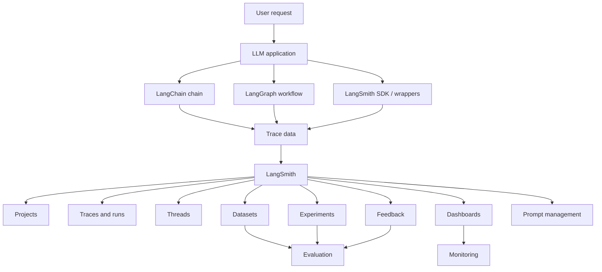
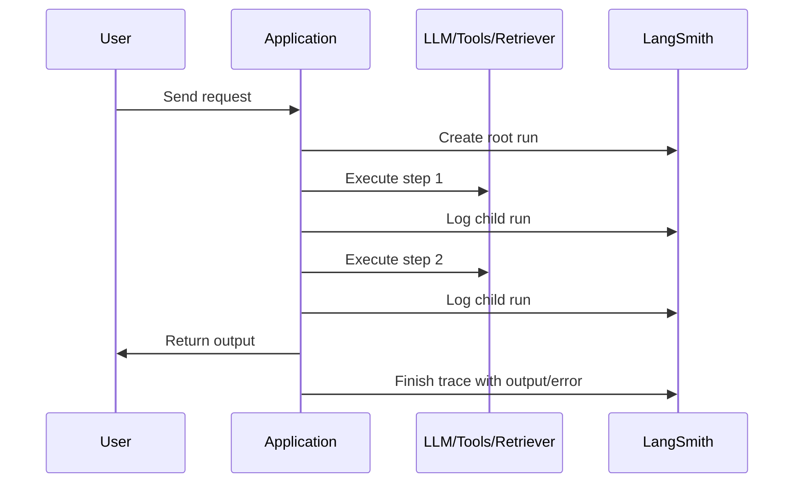
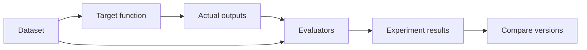
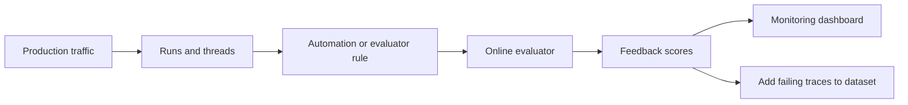
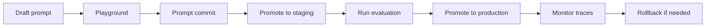
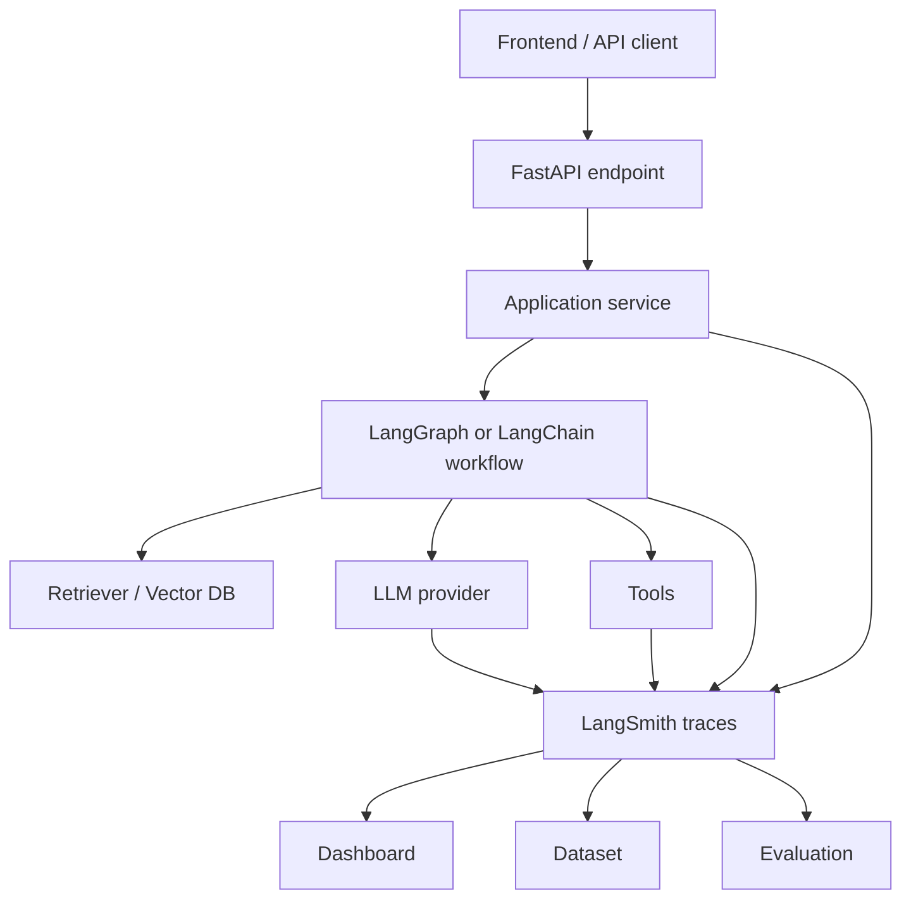

# LangSmith: Cơ sở lý thuyết, observability và evaluation cho ứng dụng LLM

## 1. Mục tiêu tài liệu

Tài liệu này trình bày LangSmith theo hướng lý thuyết kết hợp thực hành, giúp người học nắm được:

- LangSmith là gì và vì sao observability quan trọng với ứng dụng LLM, RAG và agent.
- Cách LangSmith tổ chức dữ liệu bằng project, trace, run, thread, tag, metadata và feedback.
- Cách tracing giúp quan sát toàn bộ request, từ input ban đầu, bước gọi model, retrieval, tool call cho đến output cuối cùng.
- Sự khác nhau giữa tracing tự động qua integration và manual instrumentation bằng SDK.
- Cách dùng LangSmith để debug lỗi, theo dõi latency, token usage, cost, error rate và feedback score.
- Cách xây dựng dataset, example, evaluator và experiment để đánh giá chất lượng ứng dụng LLM.
- Sự khác nhau giữa offline evaluation và online evaluation.
- Cách quản lý prompt, prompt version, commit tag, staging, production, Playground và Prompt Hub.
- Cách đưa LangSmith vào quy trình phát triển LangChain, LangGraph, RAG và backend API.
- Các lỗi thiết kế thường gặp khi trace, evaluate và monitor hệ thống AI.

Tài liệu này chỉ tập trung vào kiến thức LangSmith dựa trên tài liệu chính thức của LangChain/LangSmith. Một số API, giao diện UI hoặc biến cấu hình có thể thay đổi theo phiên bản SDK và nền tảng LangSmith, vì vậy khi triển khai thực tế nên đối chiếu thêm với tài liệu chính thức đúng thời điểm sử dụng.

## 2. Tổng quan về LangSmith

LangSmith là nền tảng của LangChain dùng để quan sát, debug, đánh giá và cải thiện ứng dụng LLM. Nếu LangChain giúp xây chain, tool, agent và RAG, LangGraph giúp mô hình hóa workflow có state, thì LangSmith giúp trả lời các câu hỏi vận hành quan trọng:

- Request này đã đi qua những bước nào?
- Model nhận prompt chính xác là gì?
- Retriever trả về document nào?
- Tool nào được gọi, input/output của tool là gì?
- Bước nào chậm nhất?
- Lỗi xảy ra ở đâu trong pipeline?
- Model trả lời đúng hay sai so với tiêu chí đánh giá?
- Version prompt hoặc model nào tốt hơn?
- Chất lượng production có giảm theo thời gian không?

Ứng dụng LLM không giống backend truyền thống. Một request có thể bao gồm nhiều bước không quyết định hoàn toàn trước:

- Format prompt.
- Gọi LLM.
- Parse output.
- Gọi retriever.
- Gọi tool.
- Routing trong agent hoặc graph.
- Human feedback.
- Retry hoặc fallback.

Nếu chỉ log text thông thường, rất khó biết toàn bộ cây xử lý. LangSmith ghi lại quá trình này dưới dạng trace và run, sau đó hiển thị trong UI để debug, filter, compare, export, monitor và evaluate.

LangSmith thường được dùng cho:

- Debug chain, agent và RAG.
- Theo dõi request trong development, staging và production.
- Lưu trace lỗi hoặc trace có feedback xấu để tạo dataset.
- Chạy evaluation trước khi deploy prompt/model mới.
- Chạy online evaluator trên traffic thật.
- Tạo dashboard theo dõi latency, error rate, token usage, cost, tool usage và feedback.
- Quản lý prompt version và promote prompt qua staging/production.

### 2.1. Đặc điểm nổi bật

| Đặc điểm | Ý nghĩa |
| --- | --- |
| Tracing | Ghi lại toàn bộ cây xử lý của một request LLM. |
| Run tree | Mỗi bước như LLM call, tool call, retriever call hoặc parser được biểu diễn thành run. |
| Project | Nhóm trace theo ứng dụng, service hoặc môi trường. |
| Thread | Liên kết nhiều trace thuộc cùng một cuộc hội thoại nhiều lượt. |
| Metadata và tag | Gắn thông tin ngữ cảnh để filter, group và phân tích trace. |
| Feedback | Ghi điểm hoặc nhãn đánh giá cho run. |
| Dataset | Lưu tập example dùng cho evaluation. |
| Experiment | Kết quả chạy một version ứng dụng trên dataset. |
| Evaluator | Logic chấm điểm output bằng human, code, LLM-as-judge hoặc pairwise comparison. |
| Dashboard | Theo dõi metric cấp production như latency, error rate, token usage và cost. |
| Prompt management | Tạo, version, tag, promote và rollback prompt. |
| Integration | Tích hợp với LangChain, LangGraph, LLM provider, agent framework và developer tool. |

## 3. Cơ sở lý thuyết

### 3.1. Observability cho ứng dụng LLM

Observability là khả năng quan sát hệ thống từ dữ liệu hệ thống phát ra. Với backend truyền thống, dữ liệu này thường gồm log, metric và trace. Với ứng dụng LLM, observability cần thêm các thông tin đặc thù:

- Prompt gửi vào model.
- Message history.
- Response của model.
- Token usage.
- Cost.
- Retrieval result.
- Tool input và tool output.
- Intermediate step của agent.
- Feedback từ người dùng hoặc evaluator.
- Metadata như user id, session id, model, environment, app version.

LangSmith Observability tập trung vào việc ghi lại, xem, phân tích và monitor các bước mà ứng dụng LLM thực hiện. Thay vì chỉ thấy log cuối cùng, người phát triển có thể mở một trace và xem cây xử lý chi tiết.

### 3.2. Project

Project là nơi LangSmith gom các trace của cùng một ứng dụng hoặc service. Có thể hiểu project giống một workspace nhỏ cho trace.

Ví dụ:

- `rag-dev`
- `rag-staging`
- `rag-production`
- `customer-support-agent`
- `document-qa-api`

Khi không cấu hình project, LangSmith có thể ghi trace vào project mặc định. Trong dự án thực tế, nên đặt project rõ ràng để tách development, staging và production.

Ví dụ cấu hình:

```bash
export LANGSMITH_PROJECT="rag-production"
```

Trên PowerShell:

```powershell
$env:LANGSMITH_PROJECT = "rag-production"
```

### 3.3. Trace

Trace là bản ghi của một operation hoàn chỉnh. Một operation thường tương ứng với một request người dùng hoặc một lần chạy workflow.

Ví dụ trong RAG:

```text
User question
-> format query
-> retrieve documents
-> build prompt
-> call LLM
-> parse answer
-> return answer
```

Toàn bộ chuỗi này là một trace. Trace chứa nhiều run con. Nếu quen với khái niệm span trong hệ thống tracing, có thể hình dung trace LangSmith là tập hợp các run có liên hệ cha-con.

Một trace giúp trả lời:

- Input ban đầu là gì?
- Output cuối cùng là gì?
- Có bao nhiêu bước trung gian?
- Bước nào lỗi?
- Bước nào tốn nhiều thời gian?
- Model và tool nào được gọi?
- Metadata nào đi kèm request?

### 3.4. Run

Run là một đơn vị công việc riêng lẻ trong trace. Một run có thể là:

- Một chain.
- Một LLM call.
- Một retriever call.
- Một tool call.
- Một parser.
- Một function được trace thủ công.
- Một node trong workflow.

Ví dụ trace RAG có thể có các run:

```text
rag_answer
├── normalize_question
├── retrieve_documents
├── build_prompt
├── llm_call
└── parse_output
```

Mỗi run thường có:

- `name`
- `run_type`
- `inputs`
- `outputs`
- `error`
- `start_time`
- `end_time`
- `tags`
- `metadata`
- quan hệ parent-child với run khác

### 3.5. Run type

`run_type` giúp LangSmith hiểu một run đại diện cho loại công việc nào. Khi run được phân loại đúng, UI có thể hiển thị và tổng hợp metric tốt hơn.

| Run type | Khi dùng |
| --- | --- |
| `chain` | Một pipeline hoặc workflow gồm nhiều bước. |
| `llm` | Một lần gọi model. |
| `tool` | Một lần gọi tool trong agent hoặc function bên ngoài. |
| `retriever` | Một bước truy xuất document. |
| `parser` | Một bước parse hoặc transform output. |

Không phải mọi ứng dụng đều cần khai báo thủ công `run_type`. Khi dùng integration như LangChain hoặc LangGraph, nhiều run có thể được trace tự động.

### 3.6. Thread

Thread là chuỗi nhiều trace thuộc cùng một cuộc hội thoại. Trong chatbot nhiều lượt, mỗi lượt user có thể tạo một trace riêng, nhưng các trace này cần được liên kết để xem toàn bộ conversation.

LangSmith dùng metadata đặc biệt như `session_id` hoặc `thread_id` để nhóm trace thành thread.

Ví dụ:

```python
config = {
    "metadata": {
        "thread_id": "conversation-123"
    }
}
```

Thread hữu ích khi cần phân tích:

- Chatbot có giữ ngữ cảnh qua nhiều lượt không?
- Agent có lặp lại lỗi trong cùng một session không?
- User feedback thay đổi như thế nào trong một conversation?
- Online evaluator có cần chấm toàn bộ cuộc hội thoại thay vì một lượt đơn lẻ không?

### 3.7. Tags

Tag là chuỗi ngắn gắn vào run để phân loại, filter hoặc group trong UI.

Ví dụ tag:

- `dev`
- `production`
- `rag`
- `agent`
- `checkout-flow`
- `model-a`
- `ab-test-b`

Tag phù hợp cho nhãn có số lượng giá trị không quá lớn và thường được dùng để lọc nhanh. Không nên nhét dữ liệu chi tiết hoặc dữ liệu định danh nhạy cảm vào tag.

### 3.8. Metadata

Metadata là cặp key-value gắn vào run để mô tả ngữ cảnh.

Ví dụ metadata:

```python
metadata = {
    "environment": "production",
    "app_version": "2026.07.08",
    "tenant": "university-demo",
    "model": "primary-chat-model",
    "retriever": "qdrant"
}
```

Metadata hữu ích cho:

- Filter trace theo environment.
- Group dashboard theo version.
- So sánh model hoặc prompt variant.
- Tìm lỗi theo tenant, route hoặc use case.

Một điểm quan trọng trong dashboard là metadata và tag không tự động lan truyền từ parent run sang child run hoặc ngược lại. Nếu muốn group cả trace cấp root và LLM call theo cùng một metadata key, cần đảm bảo metadata đó được gắn ở đúng các run cần phân tích.

### 3.9. Feedback

Feedback là điểm hoặc nhãn đánh giá gắn với một run. Feedback có thể đến từ:

- Người dùng cuối.
- Người review nội bộ.
- Annotation queue.
- Evaluator tự động.
- API hoặc SDK.

Ví dụ feedback:

| Key | Kiểu | Ý nghĩa |
| --- | --- | --- |
| `thumbs_up` | categorical | Người dùng thích hoặc không thích câu trả lời. |
| `correctness` | numeric | Điểm đúng sai do evaluator chấm. |
| `helpfulness` | numeric | Mức độ hữu ích. |
| `safety` | categorical | Output có an toàn không. |

Feedback là cầu nối giữa observability và evaluation. Trace production có feedback xấu có thể được đưa vào dataset để kiểm thử lại sau khi sửa prompt, model hoặc retrieval logic.

### 3.10. Dataset

Dataset là tập các example dùng để evaluate ứng dụng. Một dataset thường đại diện cho một nhóm test case quan trọng.

Ví dụ dataset:

- `rag-basic-qa`
- `support-agent-tool-selection`
- `json-extraction-regression`
- `unsafe-request-safety-check`

Dataset có thể được tạo từ:

- Example viết thủ công.
- Trace production đã được chọn lọc.
- Dữ liệu lịch sử.
- Dữ liệu tổng hợp.

Tài liệu LangSmith khuyến nghị nên bắt đầu bằng một tập example chất lượng cao, thể hiện rõ thế nào là output tốt cho từng phần quan trọng của ứng dụng.

### 3.11. Example

Example là một test case trong dataset. Một example thường có:

- `inputs`: dữ liệu đưa vào ứng dụng.
- `outputs` hoặc reference outputs: output kỳ vọng, dùng cho evaluator.
- `metadata`: thông tin bổ sung để filter hoặc chia nhóm.

Ví dụ:

```json
{
  "inputs": {
    "question": "LangSmith dùng để làm gì?"
  },
  "outputs": {
    "answer": "LangSmith dùng để trace, evaluate và monitor ứng dụng LLM."
  },
  "metadata": {
    "category": "definition",
    "split": "smoke"
  }
}
```

Reference output không được truyền vào ứng dụng khi chạy target function. Nó chỉ dùng cho evaluator để so sánh với output thực tế.

### 3.12. Experiment

Experiment là kết quả khi chạy một target function trên dataset. Một experiment ghi lại:

- Version ứng dụng được test.
- Output cho từng example.
- Trace sinh ra trong lúc chạy.
- Score từ evaluator.
- Metadata của lần chạy.

Nhiều experiment có thể cùng chạy trên một dataset để so sánh:

- Prompt cũ và prompt mới.
- Model A và model B.
- Retriever top-k khác nhau.
- Chain đơn giản và agent workflow.
- Prompt trước và sau khi thêm few-shot example.

Experiment giúp biến việc cải thiện prompt/model thành quy trình có số liệu thay vì chỉ dựa vào cảm giác.

### 3.13. Evaluator

Evaluator là logic chấm điểm output. Evaluator có thể chạy trong offline evaluation hoặc online evaluation.

LangSmith mô tả các nhóm evaluator chính:

| Loại evaluator | Ý nghĩa |
| --- | --- |
| Human | Người review output hoặc trace. |
| Code | Function deterministic, kiểm tra rule rõ ràng. |
| LLM-as-judge | Dùng LLM để chấm output theo rubric. |
| Pairwise | So sánh hai output hoặc hai experiment với nhau. |

Evaluator trả về feedback. Feedback thường có:

- `key`: tên metric.
- `score` hoặc `value`: điểm số hoặc nhãn.
- `comment`: giải thích tùy chọn.

Ví dụ evaluator dạng code:

```python
def non_empty_answer(outputs: dict) -> dict:
    answer = outputs.get("answer", "")
    return {
        "key": "non_empty_answer",
        "score": 1 if answer.strip() else 0,
        "comment": "Answer must not be empty."
    }
```

### 3.14. Offline evaluation và online evaluation

LangSmith chia evaluation thành hai nhóm lớn:

| Tiêu chí | Offline evaluation | Online evaluation |
| --- | --- | --- |
| Thời điểm | Trước khi deploy hoặc trong development | Sau khi deploy, trên traffic thật |
| Dữ liệu | Dataset và example | Run hoặc thread production |
| Reference output | Có thể có | Thường không có |
| Mục tiêu | Benchmark, regression test, unit test, backtesting | Monitor chất lượng, phát hiện bất thường, tạo feedback loop |
| Cách chạy | Batch trên dataset | Tự động trên run/thread được chọn |

Offline evaluation phù hợp khi muốn kiểm tra version mới trước khi đưa vào production. Online evaluation phù hợp khi muốn giám sát chất lượng thật sau khi hệ thống đã chạy.

### 3.15. Reference-free và reference-based evaluator

Evaluator có thể cần hoặc không cần reference output.

Reference-based evaluator cần output kỳ vọng. Nó phù hợp cho:

- Correctness.
- Exact match.
- So sánh với đáp án chuẩn.
- Fact checking dựa trên ground truth.

Reference-free evaluator không cần đáp án chuẩn. Nó phù hợp cho:

- Safety check.
- Format validation.
- Kiểm tra JSON schema.
- Kiểm tra câu trả lời quá ngắn hoặc rỗng.
- Chấm clarity, tone, helpfulness bằng LLM-as-judge.

Online evaluation thường dùng nhiều reference-free evaluator vì traffic thật không có sẵn đáp án chuẩn.

## 4. Kiến trúc LangSmith

### 4.1. Sơ đồ kiến trúc Mermaid



### 4.2. Các thành phần quan trọng

| Thành phần | Vai trò |
| --- | --- |
| Application | Ứng dụng LLM, RAG, chatbot, agent hoặc backend API. |
| Integration | Cơ chế trace tự động với LangChain, LangGraph, LLM provider hoặc agent framework. |
| LangSmith SDK | Công cụ trace thủ công, tạo dataset, chạy evaluation và gửi feedback. |
| Project | Nơi gom trace theo ứng dụng hoặc môi trường. |
| Trace | Bản ghi một operation hoàn chỉnh. |
| Run | Một bước riêng lẻ trong trace. |
| Thread | Chuỗi trace của một conversation nhiều lượt. |
| Dataset | Tập example dùng để evaluate. |
| Evaluator | Logic chấm điểm output. |
| Experiment | Kết quả chạy target trên dataset. |
| Dashboard | Màn hình theo dõi metric. |
| Prompt | Tài nguyên prompt được version, tag và promote. |

### 4.3. LangSmith trong hệ sinh thái LangChain

LangSmith không thay thế LangChain hoặc LangGraph.

| Công cụ | Vai trò chính |
| --- | --- |
| LangChain | Xây ứng dụng LLM bằng model, prompt, tool, retriever, chain và agent. |
| LangGraph | Xây workflow có state, node, edge, checkpoint, interrupt và multi-agent. |
| LangSmith | Trace, debug, evaluate, monitor và quản lý prompt cho ứng dụng LLM. |

Một hệ thống thực tế có thể dùng cả ba:

```text
FastAPI endpoint
-> LangGraph workflow
-> LangChain model/tool/retriever
-> LangSmith tracing và evaluation
```

## 5. Vòng đời xử lý với LangSmith

### 5.1. Luồng tracing cơ bản



Khi tracing hoạt động đúng, LangSmith sẽ thấy một root run đại diện cho request chính và nhiều child run đại diện cho các bước bên trong.

### 5.2. Luồng debug

Quy trình debug thường diễn ra như sau:

1. Mở project trong LangSmith.
2. Filter trace theo thời gian, error, tag hoặc metadata.
3. Mở trace có vấn đề.
4. Xem run tree để tìm bước lỗi hoặc bước chậm.
5. Kiểm tra input/output của LLM, tool, retriever hoặc parser.
6. Sửa prompt, retrieval logic, tool schema hoặc parser.
7. Chạy lại và so sánh trace mới với trace cũ.

LangSmith hữu ích vì lỗi LLM thường không chỉ nằm ở output cuối. Lỗi có thể đến từ:

- Prompt thiếu context.
- Retriever trả về document sai.
- Tool được gọi với argument sai.
- Parser quá chặt.
- Agent chọn nhầm hành động.
- Metadata hoặc session id không đúng.

### 5.3. Luồng offline evaluation



Các bước:

1. Tạo dataset.
2. Thêm example gồm input và reference output.
3. Viết target function đại diện cho ứng dụng cần test.
4. Viết evaluator hoặc chọn evaluator có sẵn.
5. Chạy evaluation.
6. Xem experiment và so sánh score.

Offline evaluation nên được dùng trước khi thay đổi prompt, model, tool hoặc retriever trong production.

### 5.4. Luồng online evaluation



Online evaluation chạy trên run hoặc thread thật. Vì thường không có reference output, evaluator nên tập trung vào:

- Safety.
- Format.
- Policy.
- Output rỗng.
- Tool failure.
- Latency bất thường.
- Quality heuristic.
- Reference-free LLM-as-judge.

Trace production có điểm thấp nên được dùng để mở rộng dataset offline. Đây là feedback loop quan trọng.

### 5.5. Luồng quản lý prompt



LangSmith hỗ trợ quản lý prompt như một tài nguyên có version. Prompt có thể được commit, gắn tag, promote sang staging/production và rollback khi cần.

## 6. Các khái niệm cốt lõi

### 6.1. Tracing tự động

Tracing tự động là cách LangSmith thu thập trace thông qua integration. Khi dùng framework được hỗ trợ, ứng dụng có thể gửi trace mà không cần tự tạo từng run.

LangSmith có integration với nhiều nhóm công cụ:

- LLM provider.
- Agent framework.
- Voice AI framework.
- Developer tool.
- LangChain.
- LangGraph.

Với LangChain hoặc LangGraph, tracing thường bắt đầu bằng environment variable:

```bash
export LANGSMITH_TRACING=true
export LANGSMITH_API_KEY="<your-langsmith-api-key>"
export LANGSMITH_PROJECT="my-project"
```

### 6.2. Manual instrumentation

Manual instrumentation dùng khi:

- Ứng dụng không dùng framework có integration.
- Muốn trace function tự viết.
- Muốn kiểm soát run name, run type, input, output hoặc project.
- Muốn trace một block code cụ thể.

LangSmith SDK hỗ trợ ba cách chính:

| Cách | Khi dùng |
| --- | --- |
| `@traceable` / `traceable` | Cách khuyến nghị cho đa số function. |
| `trace` context manager | Python, khi cần trace một block code. |
| `RunTree` API | Khi cần kiểm soát thấp, tạo run tree thủ công. |

`RunTree` linh hoạt nhưng dễ sai hơn vì phải tự quản lý cấu trúc run cha-con.

### 6.3. `@traceable`

`@traceable` biến một function thành một run trong LangSmith. Nếu một function được trace gọi function trace khác, LangSmith có thể biểu diễn quan hệ nested run.

Ví dụ:

```python
from langsmith import traceable


@traceable(run_type="retriever", name="Retrieve Documents")
def retrieve_documents(question: str) -> list[dict]:
    return [
        {
            "page_content": "LangSmith records traces and runs.",
            "metadata": {"source": "internal-note"}
        }
    ]


@traceable(run_type="chain", name="RAG Answer")
def answer_question(question: str) -> dict:
    documents = retrieve_documents(question)
    answer = "LangSmith giúp trace, evaluate và monitor ứng dụng LLM."
    return {
        "answer": answer,
        "sources": [doc["metadata"]["source"] for doc in documents]
    }
```

Ví dụ này không gọi model thật, nhưng thể hiện cấu trúc trace:

```text
RAG Answer
└── Retrieve Documents
```

### 6.4. `trace` context manager

`trace` context manager phù hợp khi muốn trace một block code thay vì decorate function.

Ví dụ:

```python
import langsmith as ls


def run_pipeline(question: str) -> str:
    return f"Answer for: {question}"


with ls.trace(
    name="Manual Pipeline",
    run_type="chain",
    project_name="langsmith-demo",
    inputs={"question": "LangSmith là gì?"}
) as run:
    output = run_pipeline("LangSmith là gì?")
    run.end(outputs={"answer": output})
```

Cách này hữu ích khi code không dễ decorate hoặc khi cần đặt input/output thủ công.

### 6.5. `RunTree`

`RunTree` cho phép tạo run tree thủ công. Cách này nên dùng khi cần kiểm soát chi tiết và hiểu rõ lifecycle của run.

Về mặt ý tưởng:

```text
Create root run
-> post root run
-> create child run
-> post child run
-> execute work
-> end child run
-> patch child run
-> end root run
-> patch root run
```

Nếu chỉ cần trace function thông thường, nên ưu tiên `@traceable` vì SDK xử lý context propagation tự động.

### 6.6. Project và environment

Nên tách project theo môi trường hoặc ứng dụng để tránh trộn trace.

Ví dụ:

| Môi trường | Project |
| --- | --- |
| Local development | `rag-local` |
| Staging | `rag-staging` |
| Production | `rag-production` |
| Experiment | `rag-experiments` |

Khi trace production và experiment chung một project, dashboard có thể bị nhiễu vì traffic thật và traffic test trộn lẫn.

### 6.7. Session ID và thread ID

Để theo dõi hội thoại nhiều lượt, cần gắn metadata `session_id` hoặc `thread_id`.

Ví dụ:

```python
from langsmith import traceable


@traceable
def chat_turn(message: str) -> str:
    return "Response"


chat_turn(
    "Xin chào",
    langsmith_extra={
        "metadata": {
            "thread_id": "user-42-session-abc"
        }
    }
)
```

Nếu không có thread id ổn định, mỗi lượt chat có thể bị xem như trace rời rạc, gây khó phân tích conversation-level behavior.

### 6.8. Cost tracking

LangSmith dashboard có thể hiển thị token usage và cost nếu trace có đủ thông tin. Cost tracking đặc biệt hữu ích trong production vì chi phí LLM thường tăng theo:

- Số request.
- Số token input.
- Số token output.
- Số lần retry.
- Agent loop quá dài.
- Retrieval context quá lớn.
- Online evaluator dùng LLM-as-judge.

Khi thiết kế observability, nên gắn metadata như `model`, `prompt_version`, `app_version` để phân tích cost theo version.

### 6.9. Data retention

Theo tài liệu LangSmith Observability concepts, LangSmith SaaS giữ trace data trong một khoảng thời gian retention từ lúc ingestion, sau đó trace bị xóa vĩnh viễn và chỉ giữ một phần metadata phục vụ usage statistics.

Nếu cần giữ dữ liệu lâu hơn thời hạn retention của trace, nên thêm dữ liệu quan trọng vào dataset. Dataset được dùng cho evaluation và có vòng đời khác trace production.

Không nên xem trace production là nơi lưu trữ dữ liệu dài hạn cho bài test quan trọng.

### 6.10. Dataset split và version

Dataset có thể được tổ chức thành split. Split giúp chia example theo mục đích:

- `train`
- `validation`
- `test`
- `smoke`
- `edge-cases`
- `production-failures`

LangSmith cũng hỗ trợ version dataset khi example thay đổi. Khi dùng evaluation trong CI, nên cố định dataset version hoặc tag version quan trọng để kết quả ổn định hơn.

## 7. Cài đặt và cấu hình

### 7.1. Cài SDK

Với Python:

```bash
pip install -U langsmith
```

Nếu dùng evaluation với evaluator từ package khác, có thể cần cài thêm package tương ứng. Ví dụ tài liệu LangSmith có hướng dẫn dùng `openevals` cho một số evaluator mẫu.

```bash
pip install -U langsmith openevals
```

Nếu dùng LangChain hoặc LangGraph, cài thêm package tương ứng theo tài liệu của từng công cụ.

### 7.2. Cấu hình biến môi trường

Các biến môi trường thường dùng:

| Biến | Ý nghĩa |
| --- | --- |
| `LANGSMITH_TRACING` | Bật hoặc tắt tracing cho integration/decorator. |
| `LANGSMITH_API_KEY` | API key của LangSmith. |
| `LANGSMITH_PROJECT` | Project nhận trace. |
| `LANGSMITH_ENDPOINT` | Endpoint API nếu dùng region khác mặc định hoặc self-hosted. |
| `LANGSMITH_WORKSPACE_ID` | Workspace cụ thể nếu API key gắn với nhiều workspace. |

Ví dụ Bash:

```bash
export LANGSMITH_TRACING=true
export LANGSMITH_API_KEY="<your-langsmith-api-key>"
export LANGSMITH_PROJECT="rag-dev"
```

Ví dụ PowerShell:

```powershell
$env:LANGSMITH_TRACING = "true"
$env:LANGSMITH_API_KEY = "<your-langsmith-api-key>"
$env:LANGSMITH_PROJECT = "rag-dev"
```

Không commit API key vào git. Nên dùng `.env`, secret manager, CI/CD secret hoặc biến môi trường của platform deploy.

### 7.3. Endpoint theo region

Nếu tài khoản LangSmith nằm ở region khác region mặc định, cần cấu hình `LANGSMITH_ENDPOINT`.

Ví dụ:

```bash
export LANGSMITH_ENDPOINT="https://eu.api.smith.langchain.com"
```

Nếu endpoint sai, API key có thể không được nhận diện và request gửi trace sẽ lỗi xác thực.

### 7.4. Cấu hình với LangChain

Khi dùng LangChain, tracing có thể được bật bằng biến môi trường. Ví dụ:

```bash
export LANGSMITH_TRACING=true
export LANGSMITH_API_KEY="<your-langsmith-api-key>"
export LANGSMITH_PROJECT="langchain-app"
```

Sau đó chạy chain hoặc agent như bình thường. Các run từ LangChain có thể xuất hiện trong project LangSmith.

### 7.5. Cấu hình với LangGraph

LangGraph cũng có thể gửi trace sang LangSmith. Điều này đặc biệt hữu ích vì graph workflow có nhiều node, edge, state update và đôi khi có vòng lặp.

Ví dụ project:

```bash
export LANGSMITH_PROJECT="langgraph-agent-dev"
```

Khi trace graph, nên đặt tên node rõ ràng để run tree dễ đọc.

## 8. Ví dụ tracing

### 8.1. Trace function đơn giản

```python
from langsmith import traceable


@traceable(name="Normalize Question", run_type="chain")
def normalize_question(question: str) -> str:
    return question.strip().lower()


@traceable(name="Answer", run_type="chain")
def answer(question: str) -> dict:
    normalized = normalize_question(question)
    return {
        "normalized_question": normalized,
        "answer": "LangSmith dùng để quan sát và đánh giá ứng dụng LLM."
    }


if __name__ == "__main__":
    print(answer(" LangSmith dùng để làm gì? "))
```

Khi chạy với tracing bật, LangSmith sẽ thấy trace gồm run `Answer` và child run `Normalize Question`.

### 8.2. Trace RAG tối giản

```python
from langsmith import traceable


@traceable(name="Retrieve Documents", run_type="retriever")
def retrieve(question: str) -> list[dict]:
    return [
        {
            "content": "LangSmith captures traces, runs, feedback, datasets, and experiments.",
            "metadata": {"source": "langsmith-note"}
        }
    ]


@traceable(name="Build Prompt", run_type="chain")
def build_prompt(question: str, documents: list[dict]) -> str:
    context = "\n".join(doc["content"] for doc in documents)
    return f"Context:\n{context}\n\nQuestion: {question}"


@traceable(name="RAG Pipeline", run_type="chain")
def rag_pipeline(question: str) -> dict:
    documents = retrieve(question)
    prompt = build_prompt(question, documents)

    # Thay phần này bằng model call thật khi triển khai.
    answer = "LangSmith giúp trace và evaluate pipeline RAG."

    return {
        "prompt": prompt,
        "answer": answer,
        "sources": [doc["metadata"]["source"] for doc in documents]
    }
```

Trace tốt cho RAG cần làm rõ retrieval step. Nếu output cuối sai, cần biết lỗi đến từ retrieval hay từ generation.

### 8.3. Trace tool trong agent

```python
from langsmith import traceable


@traceable(name="Search Course Docs", run_type="tool")
def search_course_docs(query: str) -> str:
    return "Found document about LangSmith observability."


@traceable(name="Support Agent", run_type="chain")
def support_agent(question: str) -> dict:
    context = search_course_docs(question)
    return {
        "tool_context": context,
        "answer": "Bạn nên bật LangSmith tracing để debug agent."
    }
```

Với agent thật, tool call có thể được quyết định bởi model. Trace giúp kiểm tra model có chọn đúng tool không và truyền argument có hợp lệ không.

### 8.4. Gắn tag và metadata

```python
from langsmith import traceable


@traceable(name="Classify Ticket", run_type="chain")
def classify_ticket(text: str) -> dict:
    return {"label": "technical-support"}


result = classify_ticket(
    "Không thấy trace trong LangSmith",
    langsmith_extra={
        "tags": ["support", "classification"],
        "metadata": {
            "environment": "dev",
            "app_version": "0.1.0",
            "prompt_version": "classifier:v1"
        }
    }
)
```

Tag và metadata nên được thiết kế từ đầu. Nếu thiếu metadata, dashboard và filter sẽ kém hữu ích.

### 8.5. Flush trace trước khi process thoát

LangSmith SDK có thể gửi trace ở background để không chặn ứng dụng production. Với script ngắn, process có thể kết thúc trước khi trace được gửi xong.

Khi cần đảm bảo trace được gửi, dùng cơ chế flush của SDK theo hướng dẫn phiên bản SDK đang dùng.

Ý tưởng:

```text
create client
run traced function
flush client before exit
```

Điều này quan trọng với CLI script, batch job hoặc test runner chạy rất nhanh.

## 9. Evaluation trong LangSmith

### 9.1. Ba thành phần của evaluation

Một lần evaluation cơ bản cần ba thành phần:

| Thành phần | Ý nghĩa |
| --- | --- |
| Dataset | Tập input và reference output tùy chọn. |
| Target function | Phần ứng dụng cần test. |
| Evaluator | Hàm hoặc cấu hình chấm điểm output. |

Ví dụ:

```text
Dataset: câu hỏi và đáp án chuẩn
Target: hàm answer_question()
Evaluator: correctness, non-empty, JSON-valid
```

### 9.2. Tạo dataset bằng SDK

Ví dụ tối giản:

```python
from langsmith import Client


client = Client()

dataset = client.create_dataset(
    dataset_name="langsmith-qa-smoke-test",
    description="Dataset nhỏ để kiểm tra ứng dụng hỏi đáp LangSmith."
)

examples = [
    {
        "inputs": {"question": "LangSmith dùng để làm gì?"},
        "outputs": {"answer": "LangSmith dùng để trace, evaluate và monitor ứng dụng LLM."}
    },
    {
        "inputs": {"question": "Trace trong LangSmith gồm gì?"},
        "outputs": {"answer": "Trace gồm nhiều run biểu diễn các bước xử lý của một operation."}
    }
]

client.create_examples(dataset_id=dataset.id, examples=examples)
```

Trong dự án thật, nên tránh tạo trùng dataset khi chạy lại script. Có thể quản lý dataset qua UI hoặc viết script idempotent tùy nhu cầu.

### 9.3. Target function

Target function là phần code muốn đánh giá. Nó nhận input từ dataset và trả output để evaluator chấm.

Ví dụ:

```python
def target(inputs: dict) -> dict:
    question = inputs["question"]

    # Thay bằng chain, graph hoặc agent thật.
    if "trace" in question.lower():
        answer = "Trace gồm các run mô tả từng bước xử lý."
    else:
        answer = "LangSmith dùng để trace, evaluate và monitor ứng dụng LLM."

    return {"answer": answer}
```

Target có thể là:

- Một prompt mới.
- Một chain.
- Một graph.
- Một retriever.
- Một classifier.
- Toàn bộ backend workflow.

### 9.4. Code evaluator

Code evaluator phù hợp cho quy tắc rõ ràng.

Ví dụ kiểm tra output không rỗng:

```python
def non_empty_evaluator(inputs: dict, outputs: dict, reference_outputs: dict | None = None) -> dict:
    answer = outputs.get("answer", "")
    return {
        "key": "non_empty",
        "score": 1 if answer.strip() else 0,
        "comment": "Answer should not be empty."
    }
```

Ví dụ kiểm tra JSON có field bắt buộc:

```python
def required_field_evaluator(outputs: dict) -> dict:
    has_answer = "answer" in outputs and isinstance(outputs["answer"], str)
    return {
        "key": "has_answer_field",
        "score": 1 if has_answer else 0
    }
```

Code evaluator nên được ưu tiên khi tiêu chí có thể kiểm tra deterministic, ví dụ:

- Output không rỗng.
- JSON parse được.
- Có field bắt buộc.
- Label nằm trong danh sách cho phép.
- Tool argument đúng schema.

### 9.5. LLM-as-judge evaluator

LLM-as-judge dùng model để chấm output. Cách này phù hợp khi tiêu chí khó mã hóa bằng rule, ví dụ:

- Câu trả lời có hữu ích không?
- Giọng văn có đúng brand không?
- Câu trả lời có bám context không?
- Summary có đủ ý chính không?

Khi dùng LLM-as-judge, cần chú ý:

- Rubric phải rõ.
- Prompt evaluator cần được test.
- Nên audit score bằng human review.
- Nên dùng few-shot nếu tiêu chí khó.
- Nên kiểm soát chi phí vì evaluator cũng gọi model.

Không nên xem LLM-as-judge là tuyệt đối đúng. Nó là một công cụ đo lường có sai số.

### 9.6. Chạy evaluation

Ví dụ khung code:

```python
from langsmith import Client


client = Client()


def target(inputs: dict) -> dict:
    return {"answer": "LangSmith giúp evaluate ứng dụng LLM."}


def non_empty_evaluator(inputs: dict, outputs: dict, reference_outputs: dict | None = None) -> dict:
    return {
        "key": "non_empty",
        "score": 1 if outputs.get("answer", "").strip() else 0
    }


results = client.evaluate(
    target,
    data="langsmith-qa-smoke-test",
    evaluators=[non_empty_evaluator],
    experiment_prefix="langsmith-docs-eval",
    max_concurrency=2
)

print(results)
```

Sau khi chạy, LangSmith tạo experiment để xem từng example, output, trace và score.

### 9.7. So sánh experiment

So sánh experiment là thao tác quan trọng khi thay đổi hệ thống.

Ví dụ các cặp so sánh:

| Experiment A | Experiment B | Mục tiêu |
| --- | --- | --- |
| Prompt v1 | Prompt v2 | Prompt mới có tốt hơn không? |
| Model A | Model B | Model nào chính xác hơn hoặc rẻ hơn? |
| Retriever top-3 | Retriever top-8 | Thêm context có cải thiện answer không? |
| Chain | Agent | Agent có đáng chi phí và độ phức tạp không? |

Score không nên được đọc tách khỏi trace. Khi score thấp, cần mở trace để xem nguyên nhân.

### 9.8. Online evaluator

Online evaluator chạy trên run hoặc thread production. Nó phù hợp với các tiêu chí không cần reference output:

- Output không rỗng.
- Output đúng format.
- Không chứa nội dung bị cấm.
- Agent không gọi tool nguy hiểm.
- Latency không vượt ngưỡng.
- Response có vẻ helpful theo LLM-as-judge.

Nên dùng filter và sampling rate để kiểm soát chi phí, nhất là khi online evaluator gọi LLM.

### 9.9. Feedback loop

Một feedback loop tốt:

1. Production tạo trace.
2. User hoặc evaluator ghi feedback.
3. Trace lỗi được review.
4. Trace quan trọng được thêm vào dataset.
5. Sửa prompt/model/retrieval/tool.
6. Chạy offline evaluation trên dataset mới.
7. Nếu score tốt, deploy.
8. Online evaluation tiếp tục monitor.

LangSmith mạnh nhất khi được dùng xuyên suốt vòng đời này, không chỉ bật tracing rồi bỏ đó.

## 10. Prompt engineering trong LangSmith

### 10.1. Prompt là tài nguyên có version

LangSmith hỗ trợ tạo, quản lý và tối ưu prompt. Prompt có thể được tạo qua UI hoặc SDK, sau đó được version bằng commit.

Điều này giải quyết một vấn đề phổ biến:

```text
Prompt nằm rải rác trong code
-> Không biết production đang dùng version nào
-> Sửa prompt không có lịch sử rõ ràng
-> Rollback khó
```

Khi prompt được quản lý trong LangSmith:

- Có commit history.
- Có thể so sánh version.
- Có thể promote sang staging hoặc production.
- Có thể rollback.
- Có thể dùng Playground để test.
- Có thể chạy evaluation trên prompt variant.

### 10.2. Playground

Playground là nơi thử prompt, model configuration và input. Nó hữu ích cho:

- Thử prompt mới.
- So sánh model.
- Test prompt với dataset.
- Chuẩn bị evaluation.
- Tạo output schema hoặc tool trong quy trình prompt engineering.

Playground không thay thế evaluation. Một prompt nhìn tốt trên vài ví dụ thủ công vẫn cần được chạy qua dataset.

### 10.3. Prompt commit

Mỗi lần lưu thay đổi prompt có thể tạo commit. Commit giúp biết:

- Prompt thay đổi lúc nào.
- Ai thay đổi.
- Nội dung trước/sau.
- Commit nào đang dùng ở staging hoặc production.

Prompt commit tạo nền tảng cho workflow giống release management.

### 10.4. Staging và production

LangSmith dùng environment như staging và production để chỉ version prompt đang được dùng ở từng môi trường.

Quy trình đề xuất:

```text
Edit prompt
-> Commit
-> Promote to staging
-> Run evaluation
-> Promote to production
-> Monitor
-> Rollback nếu score xấu
```

Không nên sửa prompt production trực tiếp mà không có evaluation hoặc trace monitoring.

### 10.5. Commit tag

Commit tag là nhãn trỏ tới một commit prompt cụ thể. Khi code pull prompt bằng tag, có thể đổi version prompt bằng cách di chuyển tag thay vì sửa code.

Ví dụ ý tưởng:

```python
prompt = client.pull_prompt("support-agent:production")
```

Tag `production` có thể được cập nhật trong LangSmith khi promote commit mới.

### 10.6. Prompt template format

LangSmith hỗ trợ prompt template với placeholder động. Hai format chính:

| Format | Syntax | Khi dùng |
| --- | --- | --- |
| f-string | `{variable}` | Prompt đơn giản, biến phẳng. |
| mustache | `{{variable}}` | Dữ liệu lồng nhau, loop, conditional, evaluator hoặc few-shot phức tạp. |

Ví dụ f-string:

```text
Trả lời câu hỏi sau bằng tiếng Việt:

{question}
```

Ví dụ mustache:

```text
Người dùng: {{user.name}}

{{#documents}}
- {{title}}: {{content}}
{{/documents}}
```

Với prompt đơn giản, f-string dễ đọc hơn. Với evaluator hoặc thread context phức tạp, mustache phù hợp hơn.

### 10.7. Prompt owner và permission

LangSmith hỗ trợ kiểm soát ai có quyền tag, promote hoặc xóa prompt. Điều này quan trọng khi prompt production ảnh hưởng trực tiếp đến hành vi hệ thống.

Trong team, nên phân quyền rõ:

- Ai được tạo prompt?
- Ai được promote staging?
- Ai được promote production?
- Ai được rollback?
- Ai được xóa prompt?

### 10.8. Prompt Hub

Prompt Hub là nơi duyệt và dùng prompt cộng đồng. Theo tài liệu LangSmith, prompt công khai là nội dung do người dùng tạo và không được đảm bảo review hoặc endorse bởi LangChain.

Vì vậy:

- Có thể dùng Prompt Hub để tham khảo.
- Không nên copy prompt công khai vào production mà không review.
- Không nên đưa secret hoặc dữ liệu nội bộ vào prompt public.

## 11. Monitoring và dashboard

### 11.1. Dashboard dùng để làm gì

Dashboard cho phép xem metric cấp cao từ trace data. Nó giúp phát hiện xu hướng và sức khỏe ứng dụng.

Các câu hỏi dashboard giúp trả lời:

- Lượng trace tăng hay giảm?
- Error rate có tăng không?
- Latency trung bình là bao nhiêu?
- LLM call nào chậm nhất?
- Tool nào lỗi nhiều nhất?
- Token usage tăng do prompt hay do output?
- Feedback score có giảm sau release mới không?

### 11.2. Prebuilt dashboard

LangSmith tạo prebuilt dashboard cho tracing project. Các nhóm metric thường gồm:

| Nhóm | Theo dõi |
| --- | --- |
| Traces | Trace count, latency, error rate. |
| LLM calls | LLM call count và latency. |
| Cost & tokens | Token usage và cost. |
| Tools | Tool run count, error rate và latency. |
| Run types | Thống kê theo loại run hoặc run cấp cao. |
| Feedback scores | Trung bình hoặc phân bố feedback. |

Prebuilt dashboard phù hợp để bắt đầu nhanh mà chưa cần tự thiết kế chart.

### 11.3. Custom dashboard

Custom dashboard cho phép tạo chart theo nhu cầu riêng:

- Chọn tracing project.
- Filter run.
- Chọn metric.
- Group theo tag, metadata, run name hoặc run type.
- Chọn chart type.
- Lưu hoặc clone chart.

Ví dụ chart hữu ích:

| Chart | Mục tiêu |
| --- | --- |
| Latency theo `app_version` | Kiểm tra release mới có chậm hơn không. |
| Error rate theo `tool_name` | Tìm tool hay lỗi. |
| Cost theo `model` | So sánh chi phí model. |
| Feedback score theo `prompt_version` | Xem prompt mới có cải thiện không. |
| Run count theo `route` | Biết route nào dùng nhiều nhất. |

### 11.4. Group by metadata

Group by giúp chia metric theo thuộc tính quan trọng. Ví dụ:

```text
Metric: latency
Group by: metadata.app_version
```

Kết quả giúp xem version nào chậm hơn.

Như đã nói ở phần metadata, nếu muốn group đúng, cần gắn metadata ở đúng run. Parent run và child run không tự động kế thừa metadata của nhau.

### 11.5. Alert và automation

LangSmith hỗ trợ theo dõi và tự động hóa trên trace. Với production, automation thường dùng để:

- Chạy online evaluator trên một phần traffic.
- Gửi webhook khi có rule match.
- Phát hiện lỗi lặp lại.
- Đưa run vào luồng review.

Nên thiết kế automation theo tiêu chí cụ thể. Ví dụ:

- Error rate tăng.
- Feedback `thumbs_down` xuất hiện.
- Output rỗng.
- Latency vượt ngưỡng.
- Tool gọi thất bại.

## 12. LangSmith trong backend

### 12.1. Kiến trúc FastAPI + LangSmith



LangSmith thường nằm ngang qua nhiều layer. Nó không phải business logic chính, nhưng giúp quan sát business logic đó.

### 12.2. Service layer

Ví dụ service:

```python
from langsmith import traceable


@traceable(name="Answer API Request", run_type="chain")
def answer_service(question: str, user_id: str) -> dict:
    # Gọi LangChain chain hoặc LangGraph app tại đây.
    answer = "LangSmith giúp debug request LLM trong backend."
    return {
        "answer": answer,
        "user_id": user_id
    }
```

Endpoint FastAPI có thể gọi service này. Metadata như route, app version hoặc thread id nên được gắn khi gọi service.

### 12.3. Không trace secret

Trace có thể chứa input, output, prompt và metadata. Vì vậy cần cẩn thận với:

- API key.
- Access token.
- Password.
- PII.
- Dữ liệu nội bộ nhạy cảm.
- Document confidential.

Trước khi bật tracing production, cần xác định dữ liệu nào được phép gửi sang LangSmith và dữ liệu nào cần redaction hoặc không trace.

### 12.4. User feedback trong backend

Một API có thể trả về answer kèm `run_id` hoặc một identifier liên kết với run. Sau đó frontend gửi feedback:

```text
POST /feedback
{
  "run_id": "...",
  "key": "thumbs_up",
  "score": 1
}
```

Feedback này giúp:

- Phân tích quality theo user.
- Tìm trace có vấn đề.
- Tạo dataset từ trace bị chấm thấp.
- Theo dõi dashboard feedback score.

Khi cần attach feedback ngay sau một run, tài liệu LangSmith có hướng dẫn dùng custom run ID.

## 13. LangSmith trong RAG

### 13.1. Vì sao RAG cần tracing

RAG có nhiều nguồn lỗi:

- Query rewrite sai.
- Retriever không tìm đúng document.
- Top-k quá ít hoặc quá nhiều.
- Context bị cắt mất thông tin quan trọng.
- Prompt không yêu cầu model bám context.
- Model hallucinate dù context đúng.
- Citation sai.

Nếu chỉ nhìn answer cuối, khó biết lỗi nằm ở đâu. Trace giúp xem:

- Query gửi vào retriever.
- Document được trả về.
- Score hoặc metadata của document.
- Prompt cuối cùng.
- Output của model.
- Parser hoặc citation builder.

### 13.2. Metadata cho RAG

Metadata hữu ích:

| Metadata | Ý nghĩa |
| --- | --- |
| `retriever` | Tên retriever hoặc vector store. |
| `embedding_model` | Embedding model đang dùng. |
| `top_k` | Số document lấy về. |
| `chunk_size` | Kích thước chunk. |
| `prompt_version` | Version prompt RAG. |
| `corpus_version` | Version dữ liệu tài liệu. |

Nhờ metadata, có thể so sánh score theo cấu hình RAG.

### 13.3. Evaluation cho RAG

RAG có thể evaluate nhiều tầng:

| Thành phần | Câu hỏi đánh giá |
| --- | --- |
| Retrieval | Document lấy về có liên quan không? |
| Generation | Answer có đúng và đủ không? |
| Grounding | Answer có bám context không? |
| Citation | Source có đúng không? |
| Safety | Có trả lời khi thiếu thông tin không? |

Không nên chỉ chấm answer cuối. Nếu retrieval sai nhưng model vẫn đoán đúng, hệ thống vẫn không ổn định.

## 14. LangSmith trong agent và LangGraph

### 14.1. Vì sao agent cần tracing

Agent có hành vi linh hoạt hơn chain cố định. Một request có thể:

- Gọi tool nhiều lần.
- Chọn tool khác nhau.
- Tự sửa lỗi.
- Lặp lại bước.
- Dừng sớm hoặc chạy quá nhiều bước.

Trace giúp kiểm tra trajectory của agent:

```text
User task
-> model decides tool
-> tool call
-> model observes result
-> model decides next step
-> final answer
```

Nếu agent trả lời sai, cần biết nó chọn sai tool, truyền sai argument, hiểu sai observation hay dừng sai thời điểm.

### 14.2. LangGraph node trace

Trong LangGraph, node nên được đặt tên rõ. Khi trace hiển thị, tên node rõ giúp debug:

- `classify_intent`
- `retrieve_context`
- `call_model`
- `validate_output`
- `human_review`
- `finalize_answer`

Nếu tất cả node đều có tên chung chung, trace khó đọc và dashboard khó phân tích.

### 14.3. Evaluation cho agent

Agent có thể được evaluate theo nhiều hướng:

- Output cuối có đúng không?
- Agent có chọn đúng tool không?
- Tool argument có đúng schema không?
- Số bước có vượt ngưỡng không?
- Agent có gọi tool không cần thiết không?
- Agent có tuân thủ policy không?

Pairwise evaluation cũng hữu ích khi so sánh hai phiên bản agent mà khó định nghĩa điểm tuyệt đối.

## 15. Thiết kế LangSmith tốt

### 15.1. Đặt project rõ ràng

Tên project nên cho biết ứng dụng và môi trường:

```text
document-qa-dev
document-qa-staging
document-qa-production
support-agent-production
```

Không nên dùng một project chung cho mọi thứ vì dashboard và filter sẽ mất ý nghĩa.

### 15.2. Thiết kế metadata trước

Nên thống nhất metadata quan trọng:

- `environment`
- `app_version`
- `prompt_version`
- `model`
- `route`
- `tenant`
- `thread_id`
- `dataset_version`
- `experiment_name`

Nếu mỗi service đặt key khác nhau, dashboard khó group và so sánh.

### 15.3. Tách trace production và experiment

Evaluation có thể tạo nhiều trace. Nếu trộn vào production project, metric production bị nhiễu.

Nên dùng project riêng cho:

- Development trace.
- Production trace.
- Evaluation run.
- Load test.

### 15.4. Không trace quá ít

Nếu chỉ trace root request mà không trace child step, trace không giúp debug nhiều.

Với RAG nên trace:

- Query processing.
- Retrieval.
- Prompt building.
- LLM call.
- Output parsing.

Với agent nên trace:

- Model decision.
- Tool call.
- Tool output.
- Final answer.

### 15.5. Không trace quá nhiều dữ liệu nhạy cảm

Trace quá chi tiết có thể làm lộ dữ liệu không nên lưu. Cần cân bằng giữa debug và privacy.

Nên cân nhắc:

- Redact input nhạy cảm.
- Không gửi secret.
- Không đưa token vào metadata.
- Không log raw document nếu tài liệu có quyền truy cập chặt.
- Thiết kế retention và dataset cẩn thận.

### 15.6. Bắt đầu evaluation nhỏ

Không cần tạo dataset lớn ngay từ đầu. Theo hướng dẫn LangSmith, nên bắt đầu từ các example được curated thủ công để định nghĩa thế nào là output tốt.

Một khởi đầu thực tế:

1. Tạo 10-20 example chất lượng cao.
2. Viết 1-2 code evaluator đơn giản.
3. Thêm LLM-as-judge cho tiêu chí khó.
4. Chạy experiment trước mỗi thay đổi prompt quan trọng.
5. Dần thêm trace production lỗi vào dataset.

## 16. Các lỗi thiết kế thường gặp

### 16.1. Bật tracing nhưng không đặt project

Trace bị ghi vào project mặc định hoặc trộn với trace khác. Khi cần debug production, không biết trace nằm ở đâu.

### 16.2. Không gắn metadata version

Không có `app_version`, `prompt_version` hoặc `model`, nên không biết release nào gây lỗi hoặc tăng cost.

### 16.3. Chỉ nhìn output cuối

Với RAG và agent, output cuối không đủ. Cần xem retrieval result, prompt, tool call và intermediate step.

### 16.4. Không dùng thread id cho chatbot

Mỗi lượt chat thành một trace riêng, không phân tích được conversation nhiều lượt.

### 16.5. Đưa secret vào trace

Prompt, input, output và metadata có thể được ghi lại. Không được đưa API key, token hoặc password vào trace.

### 16.6. Tin LLM-as-judge tuyệt đối

LLM-as-judge có thể sai. Cần rubric rõ, audit bằng human và kết hợp code evaluator khi có rule deterministic.

### 16.7. Dataset chỉ toàn case dễ

Evaluation score cao nhưng production vẫn lỗi vì dataset không có edge case, negative case hoặc trace lỗi thực tế.

### 16.8. Trộn traffic evaluation với production dashboard

Metric production bị lệch do trace từ experiment hoặc test. Nên tách project hoặc filter rõ.

### 16.9. Không đưa trace lỗi vào dataset

Production phát hiện lỗi nhưng không biến lỗi thành regression test. Lỗi tương tự dễ quay lại.

### 16.10. Prompt production không có version

Không biết prompt nào đang chạy, không rollback được và khó so sánh experiment.

### 16.11. Metadata không nhất quán giữa parent và child run

Dashboard group không đúng vì metadata chỉ gắn ở root run nhưng chart lại phân tích LLM run hoặc tool run.

### 16.12. Online evaluator quá tốn chi phí

Chạy LLM-as-judge trên toàn bộ traffic mà không sampling hoặc filter có thể làm tăng cost đáng kể.

## 17. Bài tập thực hành

### Bài 1: Bật tracing cho function Python

Tạo file Python có hai function:

- `normalize_question`
- `answer_question`

Dùng `@traceable` để trace cả hai function. Cấu hình:

```bash
export LANGSMITH_TRACING=true
export LANGSMITH_API_KEY="<your-langsmith-api-key>"
export LANGSMITH_PROJECT="langsmith-practice"
```

Chạy script và mở LangSmith UI để xem run tree.

### Bài 2: Trace RAG tối giản

Tạo RAG giả lập gồm:

- `retrieve_documents`
- `build_prompt`
- `generate_answer`

Yêu cầu:

- `retrieve_documents` có `run_type="retriever"`.
- Root pipeline có `run_type="chain"`.
- Gắn metadata `top_k`, `prompt_version`, `environment`.

Kiểm tra trace trong LangSmith.

### Bài 3: Tạo dataset

Tạo dataset `langsmith-basic-qa` gồm 5 example:

- 2 câu hỏi định nghĩa.
- 2 câu hỏi về tracing.
- 1 câu hỏi về evaluation.

Mỗi example có input `question` và reference output `answer`.

### Bài 4: Viết code evaluator

Viết evaluator kiểm tra:

- Output có field `answer`.
- `answer` không rỗng.
- `answer` dài hơn 20 ký tự.

Chạy evaluation trên dataset ở Bài 3.

### Bài 5: So sánh hai prompt

Tạo hai target function:

- `target_short_prompt`
- `target_detailed_prompt`

Chạy hai experiment trên cùng dataset. So sánh score và trace.

### Bài 6: Thiết kế metadata chuẩn

Thiết kế metadata schema cho ứng dụng RAG trong repo này:

- `environment`
- `app_version`
- `prompt_version`
- `retriever`
- `vector_store`
- `embedding_model`
- `top_k`
- `thread_id`

Giải thích metadata nào nên gắn ở root run và metadata nào nên gắn ở child run.

### Bài 7: Production feedback loop

Thiết kế flow:

1. User thumbs down một answer.
2. Backend ghi feedback vào LangSmith.
3. Trace được review.
4. Trace được thêm vào dataset.
5. Chạy offline evaluation sau khi sửa prompt.

Vẽ flow bằng Mermaid.

## 18. Lộ trình học đề xuất

1. Hiểu project, trace, run và run tree.
2. Bật tracing bằng environment variables.
3. Trace function bằng `@traceable`.
4. Trace RAG hoặc agent nhỏ.
5. Gắn tag và metadata có chủ đích.
6. Xem trace trong UI để debug prompt, retrieval và tool call.
7. Tạo dataset từ example thủ công.
8. Viết code evaluator đơn giản.
9. Chạy offline evaluation và xem experiment.
10. So sánh nhiều experiment.
11. Thêm feedback từ user hoặc human review.
12. Tạo dashboard theo latency, error rate, token usage và feedback score.
13. Quản lý prompt bằng commit, tag, staging và production.
14. Thiết kế online evaluator cho production.
15. Đưa trace lỗi production vào dataset để tạo regression test.

## 19. Kết luận

LangSmith là công cụ quan trọng để phát triển và vận hành ứng dụng LLM nghiêm túc. Nó giúp biến hệ thống AI từ một hộp đen khó debug thành một pipeline có trace, metric, feedback và evaluation rõ ràng.

Về mặt observability, LangSmith tổ chức dữ liệu quanh project, trace, run, thread, metadata, tag và feedback. Nhờ đó người phát triển có thể xem từng bước xử lý của request, phát hiện lỗi ở prompt, retrieval, tool call, model output hoặc parser.

Về mặt evaluation, LangSmith cung cấp dataset, example, evaluator và experiment để đo chất lượng trước khi deploy. Offline evaluation giúp kiểm tra version mới trên dữ liệu curated. Online evaluation giúp monitor production traffic và tạo feedback loop từ lỗi thực tế.

Về mặt prompt engineering, LangSmith giúp quản lý prompt như tài nguyên có version, có staging/production, có commit tag, có Playground và có khả năng rollback. Điều này đặc biệt quan trọng khi prompt ảnh hưởng trực tiếp đến hành vi production.

Khi dùng LangSmith, không nên chỉ bật tracing cho có. Cần thiết kế project, metadata, dataset, evaluator và dashboard ngay từ đầu. Chất lượng hệ thống AI không chỉ phụ thuộc vào model, mà còn phụ thuộc vào khả năng quan sát, đo lường và cải thiện liên tục.

## 20. Tài liệu tham khảo

- LangSmith Observability: https://docs.langchain.com/langsmith/observability
- Observability concepts: https://docs.langchain.com/langsmith/observability-concepts
- Tracing quickstart: https://docs.langchain.com/langsmith/observability-quickstart
- Custom instrumentation: https://docs.langchain.com/langsmith/annotate-code
- Trace LangChain applications: https://docs.langchain.com/langsmith/trace-with-langchain
- Trace LangGraph applications: https://docs.langchain.com/langsmith/trace-with-langgraph
- Integrations: https://docs.langchain.com/langsmith/integrations
- LangSmith Evaluation: https://docs.langchain.com/langsmith/evaluation
- Evaluation concepts: https://docs.langchain.com/langsmith/evaluation-concepts
- Evaluation quickstart: https://docs.langchain.com/langsmith/evaluation-quickstart
- Monitor projects with dashboards: https://docs.langchain.com/langsmith/dashboards
- Prompt engineering: https://docs.langchain.com/langsmith/prompt-engineering
- Manage prompts: https://docs.langchain.com/langsmith/manage-prompts
- Prompt template format guide: https://docs.langchain.com/langsmith/prompt-template-format
