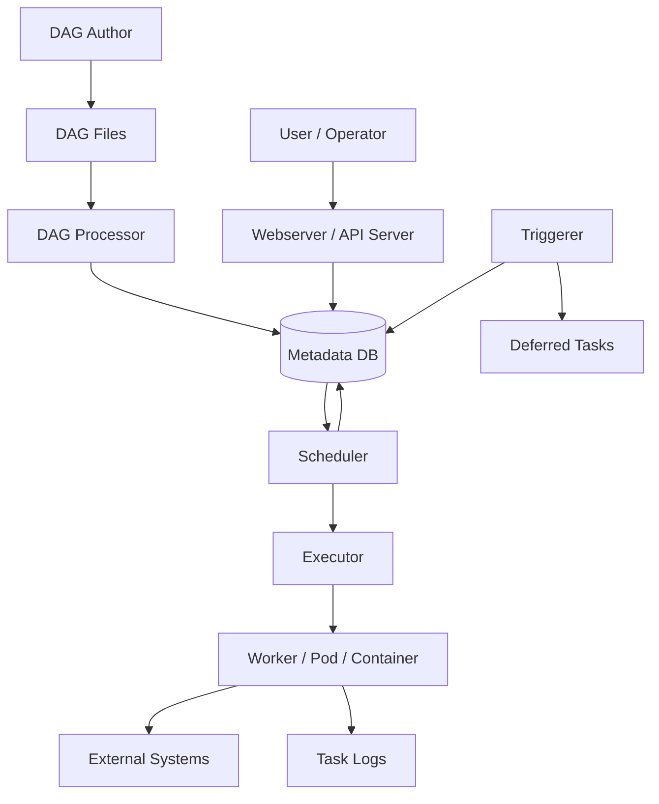
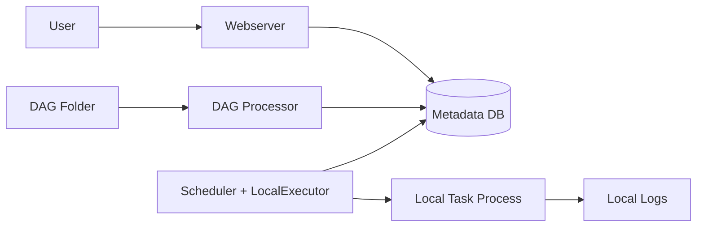
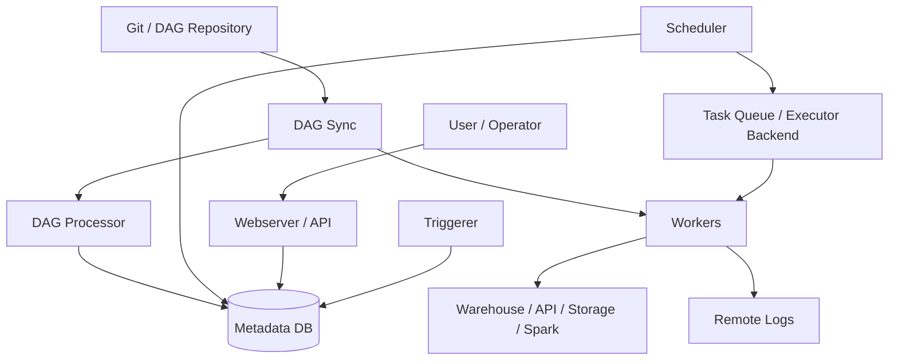
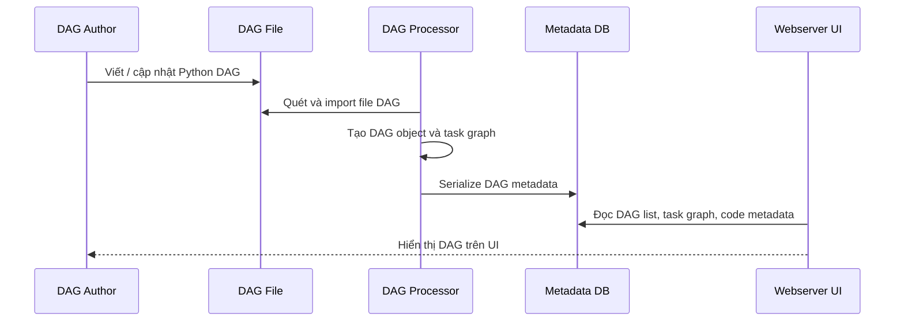
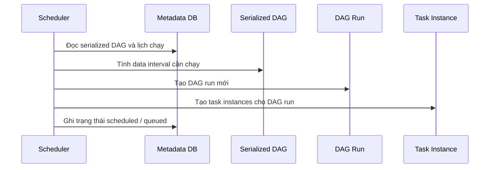
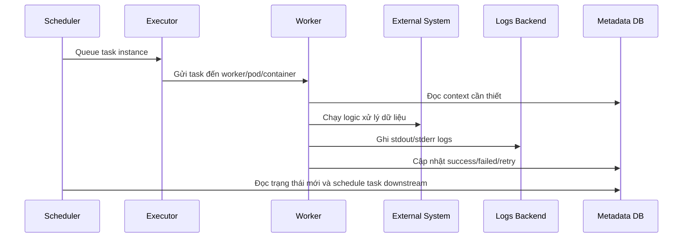
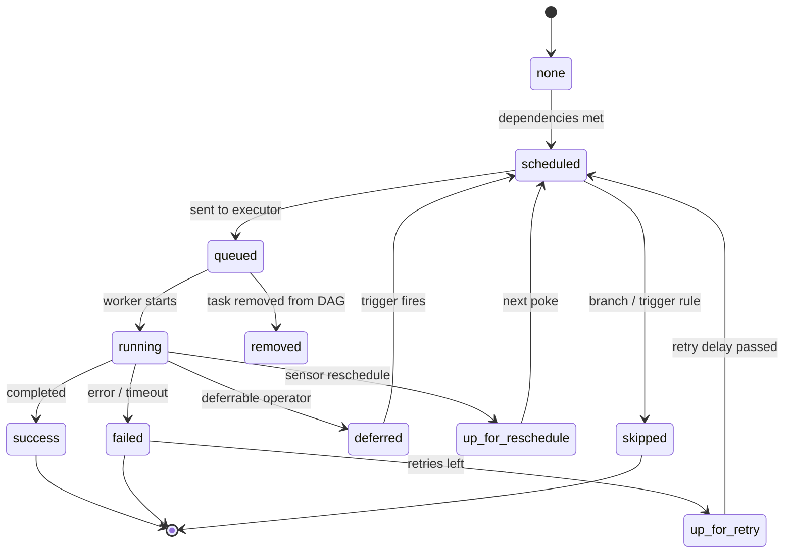
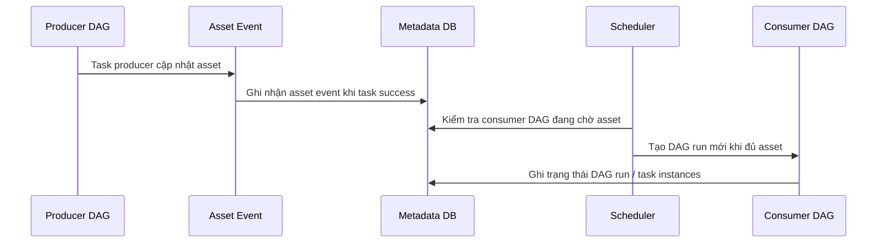

# Apache Airflow: Cơ sở lý thuyết, kiến trúc và thực hành

## 1. Mục tiêu tài liệu

Tài liệu này trình bày Apache Airflow theo hướng lý thuyết kết hợp thực hành, giúp người học nắm được:

- Airflow là gì và vì sao công cụ này thường được dùng để điều phối workflow dữ liệu, ETL/ELT, batch processing, MLOps và các pipeline sản xuất.
- Các khái niệm cốt lõi như DAG, task, operator, sensor, TaskFlow, DAG run, task instance, data interval, logical date, XCom, Variable, Param, Connection, Hook, Pool và Executor.
- Kiến trúc tổng quan của Airflow: scheduler, DAG processor, webserver/API server, metadata database, worker, triggerer và thư mục chứa DAG.
- Cách Airflow lập lịch, tạo DAG run, chạy task theo dependency và lưu trạng thái vào metadata database.
- Cách thiết kế workflow idempotent, có retry an toàn, tách dữ liệu lớn ra khỏi XCom và quản lý cấu hình đúng cách.
- Khi nào nên dùng Airflow, khi nào không nên dùng Airflow.
- Các lỗi thiết kế phổ biến khi mới học Airflow và cách tránh.

Tài liệu này tập trung vào Apache Airflow 3.x. Theo tài liệu chính thức tại thời điểm viết, nhánh `stable` đang là Airflow 3.2.2. Một số dự án vẫn dùng Airflow 2.x, nên khi làm việc với code cũ cần đối chiếu đúng phiên bản, đặc biệt là đường import. Airflow 3 khuyến nghị dùng public interface trong `airflow.sdk`; Airflow 2.x thường thấy các import kiểu `from airflow import DAG` hoặc `from airflow.decorators import task`.

## 2. Tổng quan về Apache Airflow

Apache Airflow là nền tảng mã nguồn mở để **phát triển, lập lịch, điều phối và giám sát workflow dạng batch**. Workflow trong Airflow được mô tả bằng Python code, sau đó Airflow đọc code này, tạo đồ thị phụ thuộc giữa các task, lập lịch các lần chạy và điều phối việc thực thi trên worker.

Có thể hiểu Airflow giải quyết bài toán:

```text
Theo lịch hoặc sự kiện -> chạy nhiều bước xử lý -> theo đúng thứ tự -> retry nếu lỗi -> quan sát log/trạng thái -> can thiệp khi cần
```

Ví dụ một pipeline dữ liệu:

```text
Lấy file từ S3 -> validate schema -> nạp vào warehouse -> chạy dbt model -> tạo báo cáo -> gửi Slack
```

Nếu không có công cụ orchestration, nhóm phát triển dễ gặp các vấn đề:

- Cron job nằm rải rác trên nhiều server, khó biết job nào đang chạy.
- Lỗi ở bước giữa pipeline nhưng không có retry, log và trạng thái rõ ràng.
- Không biết bước nào phụ thuộc bước nào.
- Khó backfill dữ liệu lịch sử.
- Khó chia sẻ cấu hình, connection, secret và giới hạn tài nguyên.
- Khó quan sát pipeline theo từng lần chạy.
- Khó kiểm soát song song, retry, timeout và alert.

Airflow giải quyết các vấn đề này bằng cách biến workflow thành code Python có version control, chạy trên một hệ thống có UI, metadata database, scheduler, worker và cơ chế retry/monitoring.

Airflow thường được dùng cho:

- ETL/ELT pipeline.
- Batch data processing.
- Data warehouse orchestration.
- Điều phối dbt.
- ML training pipeline và batch inference.
- RAG/LLM batch evaluation.
- File transfer và data ingestion theo lịch.
- Workflow liên quan đến nhiều hệ thống như S3, GCS, PostgreSQL, Snowflake, BigQuery, Spark, Kubernetes, Docker, Slack, email.
- Backfill dữ liệu lịch sử.

Airflow không phải là:

- Streaming engine thời gian thực như Kafka Streams, Flink, Spark Structured Streaming.
- Message queue như RabbitMQ, Kafka, SQS.
- Công cụ transform SQL thay thế dbt.
- Công cụ CI/CD thay thế GitHub Actions, GitLab CI hay Jenkins.
- Hệ thống chạy request/response low-latency.
- Nơi lưu trữ dữ liệu lớn giữa các task.

### 2.1. Đặc điểm nổi bật

| Đặc điểm | Ý nghĩa |
| --- | --- |
| Workflow as code | Workflow được viết bằng Python, có thể version control, review và test. |
| Directed graph | Các task được sắp xếp theo dependency rõ ràng. |
| Scheduler mạnh | Hỗ trợ cron, preset schedule, timetable, manual trigger, backfill và asset-aware scheduling. |
| UI quan sát | Xem DAG, Grid, Graph, log, trạng thái task, retry, trigger thủ công. |
| Retry và timeout | Mỗi task có thể cấu hình retry, retry delay, execution timeout. |
| Provider ecosystem | Có nhiều operator, sensor và hook cho database, cloud, container, messaging, BI, ML. |
| Pluggable executor | Có thể chạy local, qua Celery, Kubernetes, ECS hoặc executor tùy biến. |
| Metadata database | Lưu trạng thái DAG, task, run, variable, connection, XCom và cấu hình vận hành. |
| XCom | Truyền metadata nhỏ giữa các task trong một DAG run. |
| Connection và Hook | Quản lý thông tin kết nối và dùng API cấp cao để nói chuyện với hệ thống ngoài. |
| Pool và concurrency | Giới hạn số task chạy đồng thời để bảo vệ tài nguyên. |
| Templating | Dùng Jinja để chèn ngày, param, variable, XCom vào command/query. |
| Backfill | Chạy lại workflow cho các khoảng dữ liệu trong quá khứ. |
| Extensible | Có thể viết custom operator, custom hook, custom timetable, plugin và provider. |

## 3. Cơ sở lý thuyết

Airflow là một công cụ **workflow orchestration**. Điểm quan trọng nhất khi học Airflow là phân biệt rõ giữa:

- **Orchestration**: điều phối thứ tự chạy, lịch chạy, dependency, retry, log và trạng thái.
- **Execution**: thực sự xử lý dữ liệu, ví dụ chạy SQL, Spark job, Python script, dbt, container hoặc API call.

Airflow giỏi phần orchestration. Phần execution thường do operator, worker hoặc hệ thống bên ngoài thực hiện.

### 3.1. Workflow orchestration

Workflow orchestration là việc điều phối nhiều bước xử lý thành một quy trình có thứ tự. Một workflow thường có:

- Các bước xử lý riêng biệt.
- Quan hệ phụ thuộc giữa các bước.
- Điều kiện để bước sau được chạy.
- Cơ chế retry khi lỗi tạm thời.
- Log và trạng thái để debug.
- Lịch chạy hoặc sự kiện kích hoạt.

Trong Airflow, workflow được biểu diễn bằng DAG. Mỗi node trong DAG là một task, mỗi cạnh là dependency.

```text
extract -> validate -> transform -> load -> notify
```

### 3.2. Batch workflow và data interval

Airflow phù hợp nhất với batch workflow: workflow có điểm bắt đầu, điểm kết thúc và xử lý dữ liệu theo từng khoảng thời gian hoặc từng lô dữ liệu.

Ví dụ một DAG chạy hằng ngày thường xử lý một data interval:

```text
2026-07-01 00:00:00 -> 2026-07-02 00:00:00
```

Điều này khác với streaming system, nơi dữ liệu được xử lý liên tục theo từng event với latency thấp.

### 3.3. Idempotency

Idempotency nghĩa là một task có thể chạy lại nhiều lần mà không làm sai dữ liệu. Đây là nền tảng quan trọng của Airflow vì task có thể được retry, clear hoặc backfill.

Ví dụ tốt:

- Ghi dữ liệu theo partition ngày.
- Dùng UPSERT/MERGE thay vì INSERT lặp.
- Xóa rồi ghi lại partition cụ thể.
- Ghi ra temporary path rồi đổi tên khi thành công.

Ví dụ xấu:

- Mỗi lần retry lại append duplicate vào table.
- Dùng `datetime.now()` để quyết định partition output.
- Gửi thông báo production nhiều lần mà không kiểm soát.

### 3.4. Nên dùng Airflow khi

Airflow phù hợp khi workflow có đặc điểm:

- Có điểm bắt đầu và kết thúc rõ ràng.
- Chạy theo lịch hoặc theo sự kiện dữ liệu.
- Gồm nhiều bước có dependency.
- Cần retry, alert, log, monitoring và UI.
- Cần backfill dữ liệu lịch sử.
- Cần kết nối nhiều hệ thống ngoài.
- Cần workflow được quản lý bằng code.

Ví dụ:

- Hằng ngày lấy dữ liệu từ API, lưu raw data, transform, nạp vào warehouse và gửi báo cáo.
- Hằng giờ kiểm tra file mới trong object storage, validate và load vào database.
- Hằng tuần train model, lưu artifact vào MLflow, chạy evaluation và publish kết quả.
- Chạy dbt models sau khi ingestion thành công.

### 3.5. Không nên dùng Airflow khi

Airflow không phù hợp nếu:

- Công việc cần streaming liên tục với latency rất thấp.
- Task cần phản hồi ngay cho request của user.
- Workflow chỉ là một script đơn giản, không có dependency hay monitoring phức tạp.
- Bạn cần một message broker/event bus đúng nghĩa.
- Dữ liệu lớn cần được truyền trực tiếp giữa các task qua bộ nhớ.
- Task là service chạy mãi không kết thúc.

Airflow có thể trigger workflow qua API, CLI hoặc asset event, nhưng bản chất vẫn là batch workflow orchestrator. Với luồng dữ liệu streaming, Airflow thường đóng vai trò điều phối các job batch xung quanh hệ sinh thái streaming, không thay thế streaming engine.

## 4. Kiến trúc Airflow

Một Airflow deployment gồm các thành phần chính:

```text
DAG files -> DAG Processor -> Metadata DB
                         -> Scheduler -> Executor -> Worker/Pod/Container
                         -> Webserver/API -> User
                         -> Triggerer -> Deferred tasks
```

### 4.1. Sơ đồ kiến trúc Mermaid



Sơ đồ trên cho thấy Airflow không chỉ là một thư viện Python. Nó là một hệ thống gồm nhiều thành phần phối hợp với nhau. DAG author viết file Python. DAG processor parse file và ghi metadata. Scheduler quyết định khi nào task được chạy. Executor gửi task đến worker. Webserver/API server giúp người dùng quan sát và điều khiển hệ thống.

### 4.2. Các thành phần quan trọng

| Thành phần | Vai trò |
| --- | --- |
| DAG file | File Python định nghĩa workflow, task và dependency. |
| DAG processor | Parse DAG file và serialize thông tin DAG vào metadata database. |
| Scheduler | Tạo DAG run, kiểm tra dependency và đưa task vào queue. |
| Executor | Cơ chế scheduler dùng để chạy task instance. |
| Worker | Nơi task thực sự chạy. Có thể là process local, Celery worker, Kubernetes pod hoặc ECS task. |
| Metadata database | Lưu trạng thái DAG, DAG run, task instance, Variable, Connection, XCom, Pool. |
| Webserver/API server | UI và API để quan sát, trigger, clear, retry và quản trị Airflow. |
| Triggerer | Chạy deferrable tasks/sensors mà không chiếm worker slot lâu dài. |
| Provider | Gói tích hợp operator, sensor, hook và connection type cho hệ thống ngoài. |
| Logs backend | Nơi lưu log task, có thể là local filesystem, S3, GCS, Elasticsearch, v.v. |

### 4.3. Kiến trúc local đơn giản



Kiến trúc local phù hợp để học, demo hoặc chạy workload nhỏ. Scheduler, webserver, DAG processor và task process thường nằm trên cùng một máy. Điểm mạnh là đơn giản. Điểm yếu là khó scale và dễ tranh tài nguyên với scheduler.

### 4.4. Kiến trúc distributed



Kiến trúc distributed phù hợp production hơn. Scheduler không nhất thiết trực tiếp chạy task. Worker có thể scale độc lập. Log có thể lưu remote. DAG files cần được đồng bộ giữa các thành phần cần đọc/chạy DAG.

### 4.5. DAG files

DAG files là các file Python chứa định nghĩa workflow. Airflow sẽ quét thư mục DAG, import file Python, tìm các object DAG và serialize metadata cần thiết vào database.

Nguyên tắc quan trọng:

- DAG file nên import nhanh.
- Không nên gọi API, query database lớn, đọc file lớn ở top-level code.
- Logic nặng nên đặt trong task, không đặt trong lúc parse DAG.
- Các dependency Python cần có sẵn trên mọi thành phần cần đọc/chạy DAG.

### 4.6. Metadata database

Metadata database lưu:

- Danh sách DAG và DAG version.
- DAG run.
- Task instance và trạng thái.
- Log metadata.
- Variable, Connection, Pool, XCom, Param runtime.
- Thông tin scheduling và backfill.

Trong production nên dùng PostgreSQL hoặc MySQL. SQLite chỉ phù hợp học tập/local nhẹ.

### 4.7. Scheduler

Scheduler là trái tim của Airflow. Nó:

- Đọc metadata DAG đã parse.
- Xác định khi nào cần tạo DAG run.
- Kiểm tra dependency của task.
- Chuyển task sang trạng thái scheduled/queued.
- Gửi task cho executor.
- Quản lý retry, timeout, catchup, backfill và concurrency.

Scheduler không nên bị gắn logic xử lý dữ liệu nặng. Công việc nặng nên chạy trên worker hoặc hệ thống ngoài như Spark, Kubernetes, dbt, warehouse.

### 4.8. DAG processor

DAG processor parse các file DAG và serialize kết quả vào metadata database. Trong Airflow 3, việc tách DAG processor ra riêng là một phần quan trọng của kiến trúc hiện đại, giúp giảm rủi ro scheduler phải trực tiếp chạy code của DAG author.

Nếu DAG file có top-level code chậm, DAG processor sẽ chậm, UI/scheduler có thể thấy DAG bị trễ, và việc deploy DAG mới sẽ kém ổn định.

### 4.9. Webserver/API server

Webserver cung cấp UI để:

- Xem danh sách DAG.
- Bật/tắt DAG.
- Trigger DAG thủ công.
- Xem Grid/Graph.
- Xem log task.
- Clear/retry task.
- Quản lý Variable, Connection, Pool.
- Theo dõi asset, backfill và trạng thái hệ thống.

Trong Airflow 3, public REST API là cách ổn định hơn để tích hợp tự động so với việc truy cập trực tiếp metadata database.

### 4.10. Executor

Executor là cơ chế mà scheduler dùng để thực thi task instance. Executor có API chung và có thể thay đổi theo nhu cầu deployment.

Các nhóm executor phổ biến:

- **LocalExecutor**: task chạy trên cùng máy/process với scheduler. Đơn giản, phù hợp local hoặc production nhỏ.
- **CeleryExecutor**: scheduler đưa task vào queue, Celery worker lấy task ra chạy. Phù hợp distributed worker.
- **KubernetesExecutor**: mỗi task có thể chạy trong pod riêng. Phù hợp workload cần isolation và scale theo Kubernetes.
- **EcsExecutor/BatchExecutor/EdgeExecutor**: dùng cho các môi trường hạ tầng đặc thù.

Chọn executor là quyết định về vận hành:

- LocalExecutor để bắt đầu nhanh.
- CeleryExecutor khi cần pool worker dài hạn.
- KubernetesExecutor khi cần mỗi task có container/pod riêng.

### 4.11. Worker

Worker là nơi thực sự chạy task. Tùy executor, worker có thể là:

- Process local.
- Celery worker.
- Kubernetes pod.
- ECS task.
- Batch job.

Vì task có thể chạy trên máy khác nhau, không nên giả định hai task chia sẻ local filesystem. Nếu cần truyền file, hãy dùng object storage, database hoặc artifact store.

### 4.12. Triggerer

Triggerer phục vụ deferrable operators/sensors. Khi task cần đợi sự kiện trong thời gian dài, nó có thể defer sang triggerer để không giữ worker slot. Đây là cách tốt hơn so với sensor chạy lâu mà chỉ liên tục polling.

### 4.13. Plugins và providers

Airflow có thể mở rộng bằng:

- Provider package: operator, sensor, hook, connection type cho một hệ thống ngoài.
- Plugin: mở rộng UI, listener, macro, view, hook đặc thù.
- Custom operator/hook: logic riêng của dự án.

Trong thực tế, nên ưu tiên provider có sẵn. Chỉ viết custom operator/hook khi logic lặp lại nhiều lần hoặc cần chuẩn hóa interface nội bộ.

## 5. Vòng đời xử lý với Airflow

### 5.1. Luồng parse và serialize DAG



Điểm cần chú ý là Airflow phải import DAG file thường xuyên. Nếu top-level code trong DAG file chậm, DAG processor sẽ chậm và DAG có thể xuất hiện trễ trên UI.

### 5.2. Luồng scheduler tạo DAG run



Scheduler không chạy toàn bộ code xử lý dữ liệu. Nó quyết định run nào cần tạo, task nào đủ điều kiện chạy và task nào phải đợi upstream, pool hoặc concurrency.

### 5.3. Luồng thực thi task



Worker có thể nằm trên máy khác scheduler. Vì vậy task không nên phụ thuộc vào local file của task trước đó, trừ khi local file đó nằm trên shared volume được thiết kế rõ ràng.

### 5.4. Vòng đời task instance



Một task lý tưởng đi theo đường `none -> scheduled -> queued -> running -> success`. Các trạng thái retry, deferred, skipped và upstream_failed xuất hiện khi workflow có điều kiện phức tạp hơn.

### 5.5. Luồng asset-aware scheduling



Asset-aware scheduling giúp mô hình hóa dependency dữ liệu giữa các DAG. Thay vì chỉ nói "DAG B chạy sau DAG A", ta có thể nói "DAG B chạy khi bảng/file X được cập nhật thành công".

## 6. Các khái niệm cốt lõi

### 6.1. DAG

DAG là mô hình workflow trong Airflow. DAG gồm:

- `dag_id`: tên duy nhất của workflow.
- `schedule`: lịch chạy, có thể là cron, preset, timetable, `None`, hoặc asset.
- `start_date`: mốc logical date bắt đầu tạo data interval.
- `catchup`: có tạo các run lịch sử chưa chạy hay không.
- `default_args`: tham số mặc định cho task.
- `tasks`: các bước xử lý.
- `dependencies`: quan hệ trước/sau giữa task.
- `tags`, `owner`, `description`, `params`, `callbacks`.

DAG không phải nơi xử lý dữ liệu. DAG mô tả **cần chạy cái gì, khi nào chạy, theo thứ tự nào và nếu lỗi thì xử lý ra sao**.

Ví dụ DAG tối giản theo Airflow 3:

```python
from datetime import datetime

from airflow.sdk import DAG, task
from airflow.providers.standard.operators.bash import BashOperator

with DAG(
    dag_id="daily_demo",
    start_date=datetime(2026, 1, 1),
    schedule="@daily",
    catchup=False,
    tags=["example"],
) as dag:
    start = BashOperator(
        task_id="start",
        bash_command="echo start {{ ds }}",
    )

    @task
    def transform():
        print("Transform data")

    start >> transform()
```

### 6.2. Task

Task là đơn vị công việc nhỏ nhất trong DAG. Một task nên làm một việc rõ ràng, có input/output xác định và có thể retry an toàn.

Task có thể là:

- Operator instance.
- Sensor instance.
- Hàm Python dùng `@task` trong TaskFlow API.
- TaskGroup gồm nhiều task để UI dễ đọc hơn.

Task không mặc định truyền dữ liệu cho nhau. Nếu cần truyền metadata nhỏ, dùng XCom. Nếu cần truyền dữ liệu lớn, ghi ra storage ngoài.

### 6.3. Operator

Operator là template cho một loại task đã được định nghĩa sẵn. Khi bạn tạo instance của operator trong DAG, bạn tạo một task.

Operator phổ biến:

- `BashOperator`: chạy shell command.
- `PythonOperator`: gọi Python callable, nhưng với Airflow hiện đại nên ưu tiên `@task`.
- `SQLExecuteQueryOperator`: chạy SQL.
- `DockerOperator`: chạy command trong container.
- `KubernetesPodOperator`: chạy task trong Kubernetes pod.
- `EmailOperator`, `SlackAPIOperator`, `HttpOperator`.

Tư duy dùng:

- Dùng operator có sẵn nếu chỉ cần cấu hình tham số.
- Dùng `@task` nếu logic Python ngắn và gắn với DAG.
- Viết custom operator nếu logic lặp lại, cần đóng gói thành interface tái sử dụng.

### 6.4. Sensor

Sensor là operator đặc biệt dùng để **chờ** điều kiện nào đó xảy ra:

- File xuất hiện.
- Một task trong DAG khác thành công.
- Thời điểm nào đó đến.
- API trả về trạng thái sẵn sàng.
- Dữ liệu mới xuất hiện trong storage.

Sensor có các tham số quan trọng:

- `poke_interval`: khoảng thời gian giữa các lần kiểm tra.
- `timeout`: giới hạn thời gian chờ.
- `mode="poke"`: giữ worker slot trong lúc đợi.
- `mode="reschedule"`: thả worker slot giữa các lần kiểm tra.
- Deferrable mode: dùng triggerer để tiết kiệm worker slot.

Nguyên tắc:

- Nếu chờ trong vài giây, `poke` có thể chấp nhận.
- Nếu chờ lâu theo phút/giờ, dùng `reschedule` hoặc deferrable sensor.
- Không nên tạo hàng trăm sensor `poke` chạy lâu vì sẽ chiếm hết worker.

### 6.5. TaskFlow API

TaskFlow API cho phép định nghĩa task bằng hàm Python và decorator `@task`.

```python
from airflow.sdk import DAG, task

with DAG(dag_id="taskflow_demo", schedule=None):

    @task
    def extract() -> list[int]:
        return [1, 2, 3]

    @task
    def transform(values: list[int]) -> list[int]:
        return [x * 10 for x in values]

    @task
    def load(values: list[int]) -> None:
        print(values)

    load(transform(extract()))
```

Khi gọi `extract()` trong DAG file, hàm không chạy ngay. Airflow tạo task object và XComArg đại diện cho output của task. TaskFlow tự động khai báo dependency dựa trên input/output.

TaskFlow phù hợp cho:

- Logic Python ngắn.
- Pipeline cần truyền metadata nhỏ.
- Code cần đọc như hàm Python.

TaskFlow không phù hợp để truyền DataFrame lớn qua return value. Nếu dữ liệu lớn, ghi ra file/object storage/database và chỉ return path, partition, table name hoặc metadata nhỏ.

### 6.6. Task Instance

Task là định nghĩa. Task instance là **một lần chạy cụ thể của task trong một DAG run**.

Ví dụ DAG `daily_sales` có task `load_orders`, chạy mỗi ngày. Ngày 2026-07-01 sẽ có một task instance `load_orders` cho data interval đó. Ngày 2026-07-02 sẽ có task instance khác.

Trạng thái task instance phổ biến:

- `none`: chưa đủ điều kiện để queue.
- `scheduled`: scheduler đã xác định có thể chạy.
- `queued`: đã gửi cho executor, đang đợi worker.
- `running`: đang chạy.
- `success`: thành công.
- `failed`: thất bại.
- `skipped`: bị skip do branching/latest-only.
- `upstream_failed`: upstream fail nên task không chạy.
- `up_for_retry`: fail nhưng còn retry.
- `up_for_reschedule`: sensor đang reschedule.
- `deferred`: task đã defer sang triggerer.
- `removed`: task không còn trong DAG file của run đó.

### 6.7. DAG Run

DAG run là một lần chạy cụ thể của DAG. Mỗi DAG run có:

- `dag_id`.
- `run_id`.
- logical date.
- data interval.
- state.
- params runtime.
- tập hợp task instance.

DAG run thành công khi tất cả leaf task cần thiết thành công hoặc được skip theo trigger rule. Nếu task leaf có trigger rule quá rộng như `all_done`, cần cẩn thận vì DAG run có thể bị đánh dấu success dù một task ở giữa đã fail.

### 6.8. Data Interval và Logical Date

Data interval là khoảng thời gian dữ liệu mà DAG run xử lý.

Ví dụ DAG `@daily`:

```text
data_interval_start = 2026-07-01 00:00:00
data_interval_end   = 2026-07-02 00:00:00
```

DAG run cho ngày 2026-07-01 thường chỉ được tạo sau khi khoảng này kết thúc, tức sau 2026-07-02 00:00:00.

Logical date là mốc đại diện cho data interval, thường là `data_interval_start`. Trong Airflow cũ, logical date hay được gọi là `execution_date`, nhưng tên này dễ gây hiểu nhầm vì nó không phải thời điểm task bắt đầu chạy.

Nguyên tắc:

- Dùng `data_interval_start`/`data_interval_end` để đọc/ghi partition.
- Không dùng `datetime.now()` để quyết định partition dữ liệu trong task quan trọng.
- Mỗi task nên xử lý đúng khoảng dữ liệu của DAG run.

### 6.9. Schedule

`schedule` quy định khi nào DAG tạo run:

```python
with DAG(
    dag_id="schedule_examples",
    schedule="@daily",
    start_date=datetime(2026, 1, 1),
):
    ...
```

Giá trị schedule phổ biến:

| Giá trị | Ý nghĩa |
| --- | --- |
| `None` | Không chạy theo lịch, chỉ trigger thủ công/API/asset tùy cấu hình. |
| `"@once"` | Chạy một lần. |
| `"@hourly"` | Mỗi giờ. |
| `"@daily"` | Mỗi ngày. |
| `"@weekly"` | Mỗi tuần. |
| Cron `"0 2 * * *"` | Mỗi ngày lúc 02:00. |
| Timetable | Lịch tùy biến nâng cao. |
| List asset | Chạy khi asset được update. |

### 6.10. Catchup

Catchup quy định Airflow có tạo các DAG run lịch sử cho các data interval đã qua nhưng chưa chạy hay không.

```python
with DAG(
    dag_id="no_catchup",
    start_date=datetime(2026, 1, 1),
    schedule="@daily",
    catchup=False,
):
    ...
```

- `catchup=False`: khi bật DAG, scheduler chỉ tạo run mới nhất.
- `catchup=True`: scheduler tạo run cho tất cả interval đã qua từ `start_date` đến hiện tại.

Chỉ bật catchup khi task thật sự xử lý dữ liệu theo interval và idempotent. Nếu task đọc "dữ liệu mới nhất" thay vì partition theo interval, catchup rất dễ tạo kết quả sai.

### 6.11. Backfill

Backfill là chạy lại DAG cho một khoảng thời gian lịch sử. Nó dùng khi:

- Cần nạp lại dữ liệu bị lỗi.
- Thay đổi logic transform và cần tính lại partition cũ.
- Thêm pipeline mới cho dữ liệu đã tồn tại.

Backfill khác với retry:

- Retry là chạy lại task trong cùng DAG run do lỗi.
- Backfill là tạo/chạy lại các DAG run cho data interval lịch sử.

Khi backfill cần quan tâm:

- Task có idempotent không.
- Output có ghi đè/UPSERT an toàn không.
- Pool/concurrency có làm quá tải database/warehouse không.
- Các external API có rate limit không.

## 7. Dependency và control flow

### 7.1. Dependency cơ bản

Airflow dùng `>>` và `<<` để nối task:

```python
extract >> transform >> load
```

Hoặc:

```python
extract >> [validate_schema, validate_quality] >> load
```

Ý nghĩa:

- `transform` chỉ chạy sau khi `extract` thành công.
- `load` chỉ chạy sau khi cả `validate_schema` và `validate_quality` thỏa trigger rule.

Mặc định trigger rule là `all_success`: tất cả upstream phải thành công.

### 7.2. Trigger Rules

Trigger rule quy định task được chạy khi upstream có trạng thái nào.

Một số rule thường gặp:

| Trigger rule | Ý nghĩa |
| --- | --- |
| `all_success` | Tất cả upstream thành công. Mặc định. |
| `all_failed` | Tất cả upstream fail hoặc upstream_failed. |
| `all_done` | Tất cả upstream đã kết thúc, bất kể success/failed/skipped. |
| `one_success` | Ít nhất một upstream thành công. |
| `one_failed` | Ít nhất một upstream fail. |
| `none_failed` | Không có upstream fail, skipped vẫn chấp nhận. |
| `none_skipped` | Không có upstream skipped. |
| `always` | Luôn chạy khi có thể. |

Cần dùng trigger rule cẩn thận, đặc biệt với task cuối DAG. Nếu task cuối luôn success, DAG run có thể được đánh dấu success dù task giữa pipeline đã fail.

### 7.3. Branching

Branching cho phép chọn nhánh nào sẽ chạy dựa trên điều kiện.

Ví dụ logic:

```text
check_data_size
  -> if small: run_python_transform
  -> if large: run_spark_transform
```

Các nhánh không được chọn sẽ bị `skipped`. Khi join lại sau branching, thường cần trigger rule như `none_failed_min_one_success` hoặc rule phù hợp để tránh join task bị skip ngoài ý muốn.

### 7.4. LatestOnly

LatestOnlyOperator dùng để chỉ chạy task downstream cho DAG run mới nhất. Nó phù hợp với các bước không cần backfill, ví dụ gửi notification hay refresh dashboard realtime.

Không nên dùng LatestOnly cho bước tạo output dữ liệu cần đầy đủ theo lịch sử.

### 7.5. TaskGroup

TaskGroup gom nhiều task thành một nhóm trong UI, giúp Graph View dễ đọc hơn.

TaskGroup không tạo process riêng, không thay đổi execution engine. Nó chỉ là cấu trúc tổ chức task.

Dùng TaskGroup khi:

- DAG có nhiều task lặp lại theo domain.
- Cần gom các bước extract/validate/load của cùng một nguồn.
- Muốn UI gọn hơn.

## 8. XCom, Variable, Param, Connection và Hook

### 8.1. XCom

XCom viết tắt của cross-communication. XCom cho phép task trong cùng DAG run truyền metadata nhỏ cho nhau.

Ví dụ:

```python
from airflow.sdk import task

@task
def extract() -> str:
    return "s3://bucket/raw/orders/2026-07-01/data.parquet"

@task
def load(path: str) -> None:
    print(f"Load from {path}")

load(extract())
```

Trong ví dụ này, path là metadata nhỏ và có thể qua XCom.

Không nên đưa vào XCom:

- DataFrame lớn.
- File binary.
- Hàng nghìn dòng JSON.
- Model artifact.
- Dữ liệu cần tồn tại lâu dài.

Thay vào đó:

- Ghi dữ liệu lớn vào S3/GCS/MinIO/HDFS/database.
- XCom chỉ lưu path, table name, partition, row count, checksum.

### 8.2. Variable

Variable là key/value store runtime toàn cục của Airflow.

Dùng Variable cho:

- Cấu hình runtime thay đổi theo môi trường.
- Feature flag nhỏ.
- Giá trị không nên hard-code nhưng cũng không phải secret.

Ví dụ:

```python
from airflow.sdk import Variable

bucket = Variable.get("raw_bucket")
config = Variable.get("pipeline_config", deserialize_json=True)
```

Không nên dùng Variable cho:

- Giá trị có thể version control trong DAG file.
- Dữ liệu truyền giữa task.
- Secret nhạy cảm nếu chưa cấu hình secrets backend/fernet đúng cách.
- Cấu hình quá lớn.

### 8.3. Param

Param là tham số runtime cho DAG run. Param có default trong code và có thể được override khi trigger DAG thủ công/API.

Dùng Param khi:

- Muốn trigger DAG cho một `source`, `date`, `country`, `model_version`.
- Muốn UI trigger hiện form có validate.
- Muốn một DAG có default nhưng vẫn cho override có kiểm soát.

Ví dụ:

```python
from airflow.sdk import DAG, Param, get_current_context, task

with DAG(
    dag_id="param_demo",
    schedule=None,
    params={
        "country": Param("VN", type="string"),
        "limit": Param(100, type="integer", minimum=1),
    },
):

    @task
    def print_params():
        context = get_current_context()
        print(context["params"]["country"])
        print(context["params"]["limit"])

    print_params()
```

### 8.4. Connection

Connection lưu thông tin kết nối đến hệ thống ngoài:

- Host.
- Port.
- Login/password.
- Schema/database.
- Extra JSON.
- Conn type.

Connection có thể được quản lý qua UI, CLI, environment variable hoặc secrets backend.

Dùng Connection thay vì hard-code credential trong DAG file.

### 8.5. Hook

Hook là interface Python cấp cao để nối với hệ thống ngoài. Operator thường dùng Hook bên trong.

Ví dụ:

- `PostgresHook` để nối PostgreSQL.
- `S3Hook` để thao tác S3.
- `HttpHook` để gọi API.

Dùng Hook khi custom task/operator cần nối trực tiếp với hệ thống ngoài mà vẫn muốn tái sử dụng Connection của Airflow.

## 9. Asset-aware scheduling

Ngoài lịch theo thời gian, Airflow có thể lên lịch DAG dựa trên **asset**. Asset đại diện cho một đối tượng dữ liệu, ví dụ:

- `s3://bucket/raw/orders.csv`
- `postgres://warehouse/public/orders`
- `snowflake://db/schema/table`

Một DAG producer cập nhật asset:

```python
from airflow.sdk import Asset, DAG
from airflow.providers.standard.operators.bash import BashOperator

orders_asset = Asset("s3://data-lake/raw/orders.csv")

with DAG(dag_id="producer", schedule="@daily"):
    BashOperator(
        task_id="write_orders",
        bash_command="echo write orders",
        outlets=[orders_asset],
    )
```

Một DAG consumer chạy khi asset được update:

```python
from airflow.sdk import Asset, DAG
from airflow.providers.standard.operators.bash import BashOperator

orders_asset = Asset("s3://data-lake/raw/orders.csv")

with DAG(dag_id="consumer", schedule=[orders_asset]):
    BashOperator(
        task_id="consume_orders",
        bash_command="echo consume orders",
    )
```

Nguyên tắc:

- Asset update chỉ được ghi nhận khi task producer thành công.
- Nếu consumer cần nhiều asset, Airflow đợi tất cả asset cần thiết được update trước khi tạo run.
- Asset giúp mô hình hóa data dependency giữa các DAG tốt hơn so với chỉ dùng ExternalTaskSensor.

## 10. Dynamic Task Mapping

Dynamic Task Mapping cho phép tạo số lượng task instance tại runtime dựa trên output của task upstream.

Ví dụ:

```python
from airflow.sdk import DAG, task

with DAG(dag_id="mapping_demo", schedule=None):

    @task
    def list_files() -> list[str]:
        return ["a.csv", "b.csv", "c.csv"]

    @task
    def process_file(path: str) -> int:
        print(f"Process {path}")
        return 1

    @task
    def summarize(counts: list[int]) -> None:
        print(sum(counts))

    counts = process_file.expand(path=list_files())
    summarize(counts)
```

Khác với for-loop parse time:

- For-loop trong DAG file tạo task khi Airflow parse file.
- Dynamic mapping tạo task instance khi DAG run chạy và có output upstream.

Dùng dynamic mapping khi:

- Số file/source/partition chỉ biết tại runtime.
- Muốn map-reduce trong Airflow.
- Muốn tránh tạo DAG quá lớn với hàng nghìn task cố định.

Cần đặt giới hạn:

- Số mapped task quá lớn có thể làm nặng scheduler, metadata DB và UI.
- Nên gom batch hoặc đẩy xử lý lớn sang Spark/warehouse nếu scale quá cao.

## 11. Templating và context

Airflow hỗ trợ Jinja templating trong các field được operator khai báo là template field.

Ví dụ:

```python
BashOperator(
    task_id="print_date",
    bash_command="echo Processing date {{ ds }}",
)
```

Biến template phổ biến:

| Biến | Ý nghĩa |
| --- | --- |
| `{{ ds }}` | Logical date dạng `YYYY-MM-DD`. |
| `{{ ts }}` | Timestamp ISO. |
| `{{ data_interval_start }}` | Bắt đầu data interval. |
| `{{ data_interval_end }}` | Kết thúc data interval. |
| `{{ dag.dag_id }}` | ID của DAG. |
| `{{ task.task_id }}` | ID của task. |
| `{{ params.name }}` | Param runtime. |
| `{{ var.value.key }}` | Variable raw string. |
| `{{ var.json.key }}` | Variable JSON. |
| `{{ conn.conn_id.host }}` | Thuộc tính connection. |
| `{{ ti.xcom_pull(...) }}` | Lấy XCom. |

Nguyên tắc:

- Dùng templating cho command, SQL, path, partition.
- Không nhúng logic phức tạp vào Jinja nếu Python rõ ràng hơn.
- Cần biết field nào của operator có template; không phải mọi tham số đều render Jinja.

## 12. Pool, concurrency và priority

Airflow có nhiều lớp giới hạn song song:

- Parallelism toàn cục của environment.
- Số DAG run đồng thời của một DAG.
- Số task đồng thời của một DAG.
- Pool slots.
- Queue/worker capacity.
- Executor-specific limit.

### 12.1. Pool

Pool giới hạn số task được chạy đồng thời trên một tài nguyên logic.

Ví dụ:

- `warehouse_pool`: tối đa 8 query nặng vào warehouse.
- `api_rate_limited_pool`: tối đa 2 task gọi external API.
- `gpu_pool`: tối đa 1 task dùng GPU.

```python
BashOperator(
    task_id="heavy_warehouse_query",
    bash_command="python run_query.py",
    pool="warehouse_pool",
    pool_slots=2,
)
```

Nếu pool hết slot, task sẽ ở trạng thái queued cho đến khi có slot trống.

### 12.2. Priority weight

Khi nhiều task cùng đợi tài nguyên, Airflow có thể dùng priority weight để ưu tiên task quan trọng hơn. Tuy nhiên priority không thay thế thiết kế đúng pool/concurrency.

### 12.3. Giới hạn DAG run

Nếu DAG xử lý dữ liệu nặng, cần giới hạn số DAG run đồng thời:

```python
with DAG(
    dag_id="safe_backfill",
    schedule="@daily",
    max_active_runs=1,
):
    ...
```

`max_active_runs=1` giúp tránh hai run cùng ghi vào cùng tài nguyên nếu pipeline chưa idempotent hoặc database không chịu được tải.

## 13. Retry, timeout và idempotency

### 13.1. Retry

Mỗi task có thể cấu hình retry:

```python
from datetime import timedelta

BashOperator(
    task_id="call_api",
    bash_command="python call_api.py",
    retries=3,
    retry_delay=timedelta(minutes=5),
)
```

Retry hữu ích với lỗi tạm thời:

- Network timeout.
- API 5xx.
- Warehouse busy.
- File chưa sẵn sàng.

Retry không giải quyết lỗi logic:

- SQL sai.
- Schema sai.
- Credential sai.
- Code bug.

### 13.2. Timeout

Timeout ngăn task treo vô hạn:

```python
BashOperator(
    task_id="long_job",
    bash_command="python job.py",
    execution_timeout=timedelta(hours=2),
)
```

Nên đặt timeout cho task gọi API, sensor, query lớn và job ngoài.

### 13.3. Idempotency

Task idempotent là task có thể chạy lại nhiều lần mà không làm hỏng dữ liệu hoặc tạo duplicate.

Thiết kế idempotent:

- Ghi output theo partition: `date=2026-07-01`.
- Dùng UPSERT/MERGE thay vì INSERT vô điều kiện.
- Ghi vào temp path/table rồi rename/swap khi thành công.
- Xóa/replace partition trước khi ghi lại nếu phù hợp.
- Dùng data interval thay vì `now()` cho partition.
- Lưu checkpoint ngoài Airflow nếu job dài.

Không idempotent:

- Mỗi retry lại append duplicate vào table.
- Mỗi retry gửi email/slack production lặp lại nhiều lần.
- Dùng current timestamp để đặt partition output.
- Vừa ghi được nửa file đã success/fail không rõ.

## 14. Quản lý cấu hình và secret

### 14.1. Cấu hình nên nằm ở đâu

| Loại giá trị | Nơi nên lưu |
| --- | --- |
| Logic pipeline | DAG code, version control. |
| Default tham số | `default_args`, constants trong code, `params`. |
| Runtime override | `Param`. |
| Giá trị global runtime | `Variable`. |
| Credential/endpoint | `Connection` hoặc secrets backend. |
| Secret production | External secrets backend như Vault, AWS Secrets Manager, GCP Secret Manager, Azure Key Vault. |
| Dữ liệu trung gian lớn | Object storage/database/artifact store. |

### 14.2. Secrets backend

Airflow có thể đọc connection, variable và cấu hình nhạy cảm từ external secrets backend. Khi bật secrets backend, cần nhớ:

- UI chỉ hiện các connection/variable trong metadata DB, không nhất thiết hiện giá trị từ external backend.
- Nếu trùng key giữa backend, environment variable và metastore, Airflow sẽ đọc theo thứ tự ưu tiên cấu hình.
- Ghi qua UI/CLI thường ghi vào metastore, không ghi ngược vào external backend.

Nguyên tắc:

- Không commit password/token vào DAG file.
- Không in secret ra log.
- Dùng connection id thay vì credential trực tiếp trong code.
- Phân quyền UI/API theo vai trò.

## 15. Logging, monitoring và alert

Airflow cung cấp:

- Task logs.
- UI Grid/Graph.
- Trạng thái DAG run/task instance.
- Metrics cho hệ thống monitoring.
- Health check.
- Callback khi success/failure/retry.
- Tích hợp alert qua email, Slack, Sentry hoặc notifier.

Cần quan sát:

- Scheduler heartbeat.
- DAG processor parse time.
- Số task queued/running.
- Worker capacity.
- Metadata DB latency.
- Task duration.
- Failure rate.
- Retry rate.
- Sensor/deferred task count.
- Queue backlog.

Cần đặt alert cho:

- DAG fail.
- Task critical fail.
- SLA/deadline bị vượt.
- Scheduler/worker không heartbeat.
- Metadata DB lỗi.
- Queue backlog tăng bất thường.

## 16. Testing DAG

Airflow workflow cũng cần test như code bình thường.

### 16.1. DAG loader test

Mục tiêu: đảm bảo Airflow import DAG file không lỗi.

Ý nghĩa:

- Bắt lỗi syntax/import.
- Bắt lỗi top-level code cần resource không có.
- Bắt lỗi DAG id trùng.

### 16.2. Unit test logic

Logic Python nên tách thành hàm/module riêng để test độc lập với Airflow.

Không nên để tất cả logic trong operator callback khó test. Ví dụ:

```text
dags/
  daily_orders.py
src/
  pipelines/orders/transform.py
tests/
  test_transform.py
```

DAG chỉ nên wire workflow; logic xử lý nằm trong module có test.

### 16.3. Test task local

Airflow hỗ trợ chạy/test DAG và task local tùy version. Mục tiêu là kiểm tra template, params, connection mock và hành vi task trước khi deploy.

### 16.4. Staging environment

Production Airflow nên có staging:

- Test DAG mới.
- Test provider/dependency mới.
- Test migration metadata DB.
- Test backfill nhỏ trước khi backfill lớn.

## 17. Thực hành viết DAG tốt

### 17.1. Nguyên tắc thiết kế

- Mỗi task làm một việc rõ ràng.
- Task phải retry an toàn.
- Dùng data interval để xử lý partition.
- Không đưa dữ liệu lớn qua XCom.
- Không đặt top-level code nặng trong DAG file.
- Dùng Connection/Hook thay vì hard-code credential.
- Đặt timeout cho task có nguy cơ treo.
- Dùng Pool để bảo vệ external system.
- Dùng `catchup=False` nếu pipeline không xử lý dữ liệu lịch sử theo interval.
- Dùng `max_active_runs` để tránh quá tải khi backfill.
- Tách business logic ra module riêng để test.
- Đặt tag, owner, docstring để vận hành dễ hơn.

### 17.2. Top-level code cần tránh

Không nên:

```python
# Chạy mỗi lần DAG processor parse file
rows = requests.get("https://api.example.com/sources").json()

with DAG(...):
    for row in rows:
        ...
```

Nên:

- Dùng config local nhẹ, file generated, hoặc Variable nếu thật sự cần.
- Dùng dynamic task mapping nếu danh sách chỉ biết tại runtime.
- Dùng generated DAG code trước khi deploy nếu cần dynamic DAG generation.

### 17.3. Đặt tên

Tên tốt giúp UI dễ đọc:

```text
extract_orders
validate_orders_schema
load_orders_raw
transform_orders_daily
publish_orders_metrics
notify_success
```

Tên kém:

```text
task1
run
python_task
do_stuff
```

### 17.4. Dependency rõ ràng

Nên viết dependency gần cuối DAG và dễ đọc:

```python
extract >> validate >> load_raw >> transform >> publish
```

Với nhiều nhánh:

```python
extract >> [validate_schema, validate_quality]
[validate_schema, validate_quality] >> load
```

### 17.5. Xử lý output

Với output dữ liệu:

- Ghi partition theo data interval.
- Ghi atomic nếu có thể.
- Có checksum/row count nếu quan trọng.
- Lưu path/table vào XCom nếu downstream cần.
- Không chỉ in ra log rồi coi như output.

## 18. Các lệnh Airflow cơ bản

Các lệnh có thể khác nhau nhẹ theo phiên bản và cách deploy. Với Airflow 3.x, nên ưu tiên kiểm tra tài liệu đúng version đang dùng. Các lệnh dưới đây giúp học và debug các tình huống phổ biến.

### 18.1. Kiểm tra môi trường

```bash
airflow version
airflow info
airflow config list
airflow config get-value core executor
```

Các lệnh này giúp biết phiên bản Airflow, executor đang dùng, thư mục DAG, cấu hình database và các giá trị cấu hình quan trọng.

### 18.2. Quản lý DAG

```bash
airflow dags list
airflow dags list-import-errors
airflow dags show orders_daily_etl
airflow dags trigger orders_daily_etl
airflow dags pause orders_daily_etl
airflow dags unpause orders_daily_etl
```

Khi DAG không xuất hiện trên UI, lệnh cần kiểm tra đầu tiên thường là `airflow dags list-import-errors`.

### 18.3. Test DAG và task

```bash
airflow dags test orders_daily_etl 2026-07-01
airflow tasks list orders_daily_etl
airflow tasks test orders_daily_etl extract_orders 2026-07-01
```

`airflow dags test` hữu ích để chạy thử một DAG run local. `airflow tasks test` hữu ích để kiểm tra một task riêng lẻ, đặc biệt khi debug template, params hoặc connection.

### 18.4. Xem trạng thái và log

```bash
airflow dags state orders_daily_etl 2026-07-01
airflow tasks state orders_daily_etl extract_orders 2026-07-01
airflow tasks logs orders_daily_etl extract_orders 2026-07-01
```

Trong thực tế, UI thường thuận tiện hơn để xem Grid/Graph/log. CLI hữu ích khi debug qua terminal, CI hoặc server không mở UI.

### 18.5. Quản lý Connection, Variable và Pool

```bash
airflow connections list
airflow connections get postgres_default
airflow variables list
airflow variables get raw_bucket
airflow pools list
airflow pools set warehouse_pool 8 "Limit heavy warehouse queries"
```

Không nên đưa password/token trực tiếp vào DAG file. Nên dùng Connection, environment variable hoặc secrets backend.

### 18.6. Chạy local bằng Docker Compose

Khi học Airflow, Docker Compose thường là cách nhanh nhất để có đủ scheduler, webserver, database và worker. Tuy nhiên file Compose quickstart của Airflow chủ yếu phục vụ học tập, không phải cấu hình production hoàn chỉnh.

Luồng học cơ bản:

```text
Tải docker-compose.yaml -> khởi tạo database -> chạy Airflow -> mở UI -> thêm DAG -> quan sát Grid/Graph/log
```

## 19. Ví dụ DAG ETL đầy đủ hơn

Ví dụ sau minh họa các khái niệm: schedule, params, data interval, TaskFlow, BashOperator, Pool và dependency.

```python
from __future__ import annotations

from datetime import datetime, timedelta

from airflow.sdk import DAG, Param, get_current_context, task
from airflow.providers.standard.operators.bash import BashOperator

default_args = {
    "owner": "data-team",
    "retries": 2,
    "retry_delay": timedelta(minutes=5),
}

with DAG(
    dag_id="orders_daily_etl",
    description="Extract, validate and load daily orders",
    start_date=datetime(2026, 1, 1),
    schedule="@daily",
    catchup=False,
    max_active_runs=1,
    default_args=default_args,
    params={
        "source": Param("orders_api", type="string"),
    },
    tags=["etl", "orders"],
) as dag:

    @task
    def build_partition_path() -> str:
        context = get_current_context()
        start = context["data_interval_start"].strftime("%Y-%m-%d")
        source = context["params"]["source"]
        return f"s3://data-lake/raw/{source}/date={start}/orders.json"

    extract = BashOperator(
        task_id="extract_orders",
        bash_command=(
            "python scripts/extract_orders.py "
            "--date {{ ds }} "
            "--source {{ params.source }}"
        ),
        pool="external_api_pool",
        execution_timeout=timedelta(minutes=30),
    )

    @task
    def validate(path: str) -> dict[str, int | str]:
        # Trong thực tế nên đọc file từ storage và validate schema/row count.
        return {
            "path": path,
            "row_count": 1000,
        }

    load = BashOperator(
        task_id="load_orders_to_warehouse",
        bash_command=(
            "python scripts/load_orders.py "
            "--input '{{ ti.xcom_pull(task_ids=\"validate\")['path'] }}' "
            "--partition {{ ds }}"
        ),
        pool="warehouse_pool",
        execution_timeout=timedelta(hours=1),
    )

    path = build_partition_path()
    validation_result = validate(path)

    extract >> path >> validation_result >> load
```

Ghi chú:

- Ví dụ dùng XCom để truyền path và metadata nhỏ.
- Dữ liệu thật nằm ở S3/data lake, không nằm trong XCom.
- Pool bảo vệ external API và warehouse.
- `max_active_runs=1` giảm rủi ro hai run cùng ghi một khu vực.
- `{{ ds }}` đại diện logical date theo data interval.

## 20. Các lỗi phổ biến khi mới học Airflow

### 20.1. Hiểu nhầm Airflow là nơi xử lý dữ liệu

Airflow điều phối công việc, không phải engine tính toán dữ liệu lớn. Nếu cần transform lớn:

- Dùng SQL warehouse.
- Dùng Spark.
- Dùng dbt.
- Dùng container/job riêng.

Airflow task chỉ nên gọi job và quản lý trạng thái.

### 20.2. Truyền DataFrame qua XCom

Sai:

```python
@task
def extract():
    return pandas.read_csv("huge.csv")
```

Đúng hơn:

```python
@task
def extract():
    path = "s3://bucket/staging/orders/date=2026-07-01/data.parquet"
    # write dataframe to path
    return path
```

### 20.3. Dùng `datetime.now()` cho partition

Sai:

```python
partition = datetime.now().strftime("%Y-%m-%d")
```

Đúng:

```python
context = get_current_context()
partition = context["data_interval_start"].strftime("%Y-%m-%d")
```

### 20.4. Top-level code gọi API/database

Sai:

```python
sources = requests.get("https://api.example.com/sources").json()
```

Đoạn này chạy khi Airflow parse DAG, không phải khi task run.

Đúng hơn:

- Gọi API trong task.
- Dùng dynamic task mapping.
- Dùng file config đã generate sẵn.

### 20.5. Không đặt timeout

Task gọi API/query có thể treo vô hạn nếu không đặt timeout. Nên cấu hình timeout ở cả client code và Airflow task.

### 20.6. Lịch và `start_date` không như mong đợi

Với `@daily`, DAG run cho ngày 2026-07-01 thường chạy sau khi ngày đó kết thúc. `start_date` là mốc logical date/data interval, không phải lúc task đầu tiên chạy ngay lập tức.

### 20.7. Bật catchup khi task không idempotent

Nếu `catchup=True` và `start_date` quá xa, Airflow có thể tạo nhiều run lịch sử. Nếu task gọi API hoặc ghi database không an toàn, hệ thống ngoài có thể bị quá tải hoặc dữ liệu bị duplicate.

### 20.8. Quá nhiều task nhỏ

Airflow có overhead scheduler/metadata cho mỗi task. Không nên biến từng dòng dữ liệu thành một task. Nếu cần xử lý hàng triệu record, hãy batch lại hoặc dùng engine phù hợp.

### 20.9. Cài dependency trực tiếp lên mọi nơi không đồng nhất

Worker, scheduler, DAG processor và webserver có thể cần dependency khác nhau. Nên đóng gói image/dependency rõ ràng, đặc biệt khi deploy Docker/Kubernetes.

### 20.10. Dùng Variable thay cho code/config versioned

Variable tiện lợi nhưng dễ mất lịch sử thay đổi. Giá trị nào là logic pipeline nên nằm trong Git, không nên chỉ nằm trong UI.

## 21. Airflow với các công nghệ khác

### 21.1. Airflow và Docker

Docker giúp đóng gói Airflow và task dependency nhất quán. Airflow có quickstart Docker Compose để học tập, nhưng cấu hình đó không nên dùng trực tiếp cho production nếu chưa hardening security, secret, logging, scaling và backup.

Use case:

- Chạy Airflow local bằng Docker Compose.
- Đóng gói custom Airflow image với providers và dependency.
- Dùng DockerOperator để chạy task trong container riêng.

### 21.2. Airflow và Kubernetes

Kubernetes phù hợp khi:

- Mỗi task cần image/dependency riêng.
- Cần scale worker linh hoạt.
- Cần isolation tốt hơn.
- Đã có Kubernetes cluster và observability.

Cách tích hợp:

- Deploy Airflow bằng Helm chart.
- Dùng KubernetesExecutor.
- Dùng KubernetesPodOperator cho task đặc thù.

### 21.3. Airflow và dbt

Airflow điều phối dbt:

- Chạy ingestion trước.
- Chạy `dbt run`.
- Chạy `dbt test`.
- Publish docs/report.
- Gửi alert.

dbt là công cụ transform SQL; Airflow là công cụ orchestration. Hai công cụ bổ sung nhau.

### 21.4. Airflow và MLflow

Airflow điều phối ML pipeline:

```text
prepare data -> train model -> evaluate -> log MLflow run -> register model -> batch inference
```

MLflow quản lý experiment/model/artifact. Airflow quản lý lịch, dependency, retry và monitoring.

### 21.5. Airflow và FastAPI

FastAPI phù hợp request/response realtime. Airflow phù hợp job nền. Một pattern phổ biến:

- FastAPI nhận request trigger job.
- FastAPI gọi Airflow REST API để trigger DAG.
- Airflow chạy batch workflow.
- FastAPI đọc status/result từ database/object storage.

Không nên để Airflow task làm API endpoint realtime.

## 22. Checklist thiết kế DAG production

Trước khi deploy DAG mới, nên kiểm tra:

- DAG import nhanh và không có top-level side effect.
- `dag_id`, `task_id`, tag và owner rõ ràng.
- `start_date`, `schedule`, `catchup` đúng mong đợi.
- Task có retry và timeout phù hợp.
- Task idempotent khi retry/backfill.
- Output ghi theo partition/data interval.
- XCom chỉ chứa metadata nhỏ.
- Connection/secret không hard-code.
- Pool/concurrency bảo vệ hệ thống ngoài.
- Log đủ thông tin để debug nhưng không lộ secret.
- Có alert cho task/DAG quan trọng.
- Có test import DAG và test logic chính.
- Dependency Python/provider đã có trong môi trường chạy.
- Backfill đã được thử với khoảng nhỏ nếu cần.

## 23. Tóm tắt khái niệm nhanh

| Khái niệm | Giải thích ngắn |
| --- | --- |
| Airflow | Nền tảng orchestration batch workflow. |
| DAG | Định nghĩa workflow và dependency. |
| Task | Đơn vị công việc trong DAG. |
| Operator | Template task có sẵn. |
| Sensor | Operator dùng để chờ điều kiện/sự kiện. |
| TaskFlow | API viết task bằng `@task`. |
| DAG Run | Một lần chạy cụ thể của DAG. |
| Task Instance | Một lần chạy cụ thể của task trong DAG run. |
| Logical Date | Mốc đại diện cho data interval. |
| Data Interval | Khoảng dữ liệu mà DAG run xử lý. |
| XCom | Cơ chế truyền metadata nhỏ giữa task. |
| Variable | Key/value runtime global. |
| Param | Tham số runtime của DAG run. |
| Connection | Thông tin kết nối đến hệ thống ngoài. |
| Hook | Interface Python cấp cao dùng Connection. |
| Pool | Giới hạn song song trên tài nguyên logic. |
| Executor | Cơ chế scheduler dùng để chạy task. |
| Worker | Nơi task thực sự chạy. |
| Triggerer | Thành phần chạy deferred task/sensor. |
| Catchup | Tạo/chạy các DAG run lịch sử chưa chạy. |
| Backfill | Chạy lại DAG cho khoảng lịch sử. |
| Asset | Đối tượng dữ liệu có thể kích hoạt DAG khác. |

## 24. Bài tập thực hành

### Bài 1: Đọc một DAG đơn giản

Thực hiện:

- Tạo DAG có 3 task: `extract`, `transform`, `load`.
- Nối dependency theo thứ tự `extract >> transform >> load`.
- Chạy DAG thủ công trên UI hoặc CLI.
- Xem Grid View, Graph View và log từng task.

### Bài 2: Dùng TaskFlow API

Viết DAG dùng `@task`:

- Task 1 trả về danh sách số `[1, 2, 3]`.
- Task 2 nhân từng số với 10.
- Task 3 in tổng kết quả.

Mục tiêu là hiểu XComArg và cách TaskFlow tự tạo dependency.

### Bài 3: Làm việc với data interval

Viết task in ra:

- `{{ ds }}`.
- `data_interval_start`.
- `data_interval_end`.

Sau đó chạy DAG với một logical date cụ thể và kiểm tra vì sao ngày xử lý không nhất thiết là thời điểm task thật sự bắt đầu.

### Bài 4: Dùng Param và Variable

Tạo DAG có Param `country` và Variable `raw_bucket`.

Yêu cầu:

- Khi trigger thủ công, đổi được `country`.
- Task build output path dạng `s3://bucket/country=VN/date=...`.
- Không hard-code bucket trong logic task.

### Bài 5: Thiết kế retry và timeout

Tạo một task giả lập lỗi tạm thời:

- Cấu hình `retries=2`.
- Cấu hình `retry_delay`.
- Cấu hình `execution_timeout`.
- Quan sát trạng thái `up_for_retry`, `failed`, `success` trên UI.

### Bài 6: Dynamic Task Mapping

Viết DAG:

- Task `list_files` trả về danh sách file.
- Task `process_file.expand(...)` xử lý từng file.
- Task cuối tổng hợp kết quả.

Mục tiêu là hiểu sự khác nhau giữa for-loop parse time và dynamic mapping runtime.

### Bài 7: Thiết kế DAG production nhỏ

Thiết kế một DAG nạp dữ liệu hằng ngày:

- Có `schedule="@daily"`.
- Có `catchup=False` hoặc giải thích vì sao bật `catchup=True`.
- Có `max_active_runs`.
- Có pool cho external API hoặc warehouse.
- Có retry, timeout, log và output partition rõ ràng.

## 25. Lộ trình học đề nghị

1. Hiểu DAG, task, dependency, schedule.
2. Viết DAG đơn giản với `BashOperator` và `@task`.
3. Hiểu data interval, logical date, catchup và backfill.
4. Dùng XCom đúng cách và tránh truyền dữ liệu lớn.
5. Dùng Variable, Param, Connection và Hook.
6. Học sensor, deferrable operator và asset-aware scheduling.
7. Học Pool, concurrency, retry, timeout.
8. Viết test cho DAG và logic task.
9. Chạy Airflow local bằng Docker Compose để quan sát UI/log.
10. Tìm hiểu executor và deployment production.

## 26. Kết luận

Apache Airflow là công cụ nền tảng để điều phối workflow batch. Điểm quan trọng không chỉ là biết viết một DAG, mà là hiểu DAG được parse như thế nào, scheduler tạo DAG run ra sao, task instance đi qua những trạng thái nào, executor/worker thực thi task ở đâu và metadata database lưu trạng thái gì.

Khi dùng Airflow đúng cách, pipeline dễ quan sát hơn, retry/backfill rõ ràng hơn và workflow có thể được review như code. Tuy nhiên Airflow không tự động làm pipeline đúng. Người thiết kế vẫn phải chú ý idempotency, data interval, XCom, connection, secret, pool, timeout, dependency và cách triển khai production.

## 27. Nguồn tham khảo chính thức

- Apache Airflow stable documentation: <https://airflow.apache.org/docs/apache-airflow/stable/>
- What is Airflow: <https://airflow.apache.org/docs/apache-airflow/stable/index.html>
- Architecture Overview: <https://airflow.apache.org/docs/apache-airflow/stable/core-concepts/overview.html>
- DAGs: <https://airflow.apache.org/docs/apache-airflow/stable/core-concepts/dags.html>
- DAG Runs: <https://airflow.apache.org/docs/apache-airflow/stable/core-concepts/dag-run.html>
- Tasks: <https://airflow.apache.org/docs/apache-airflow/stable/core-concepts/tasks.html>
- Operators: <https://airflow.apache.org/docs/apache-airflow/stable/core-concepts/operators.html>
- Sensors: <https://airflow.apache.org/docs/apache-airflow/stable/core-concepts/sensors.html>
- TaskFlow: <https://airflow.apache.org/docs/apache-airflow/stable/core-concepts/taskflow.html>
- XComs: <https://airflow.apache.org/docs/apache-airflow/stable/core-concepts/xcoms.html>
- Variables: <https://airflow.apache.org/docs/apache-airflow/stable/core-concepts/variables.html>
- Params: <https://airflow.apache.org/docs/apache-airflow/stable/core-concepts/params.html>
- Executors: <https://airflow.apache.org/docs/apache-airflow/stable/core-concepts/executor/index.html>
- Asset-aware scheduling: <https://airflow.apache.org/docs/apache-airflow/stable/authoring-and-scheduling/asset-scheduling.html>
- Dynamic Task Mapping: <https://airflow.apache.org/docs/apache-airflow/stable/authoring-and-scheduling/dynamic-task-mapping.html>
- Connections & Hooks: <https://airflow.apache.org/docs/apache-airflow/stable/authoring-and-scheduling/connections.html>
- Pools: <https://airflow.apache.org/docs/apache-airflow/stable/administration-and-deployment/pools.html>
- Best Practices: <https://airflow.apache.org/docs/apache-airflow/stable/best-practices.html>
- Public Interface for Airflow 3.0+: <https://airflow.apache.org/docs/apache-airflow/stable/public-airflow-interface.html>
