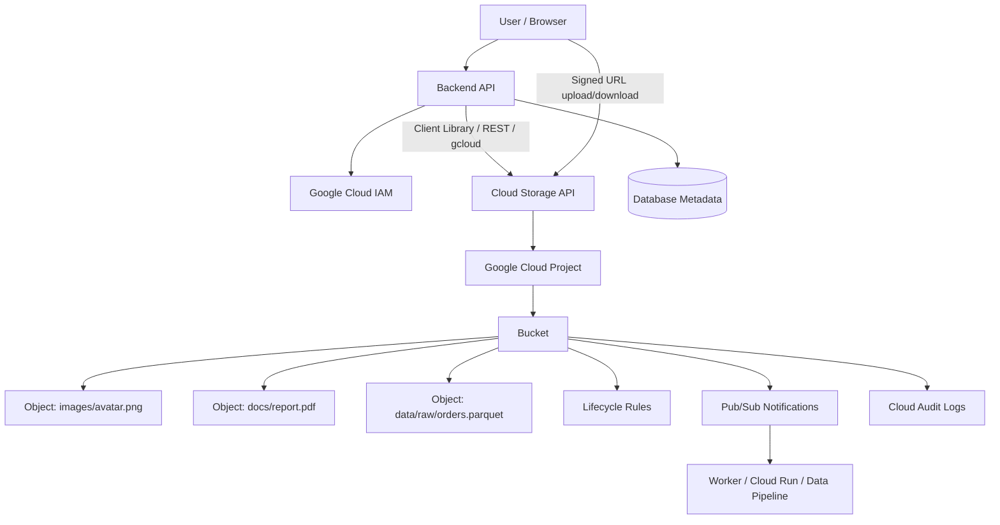
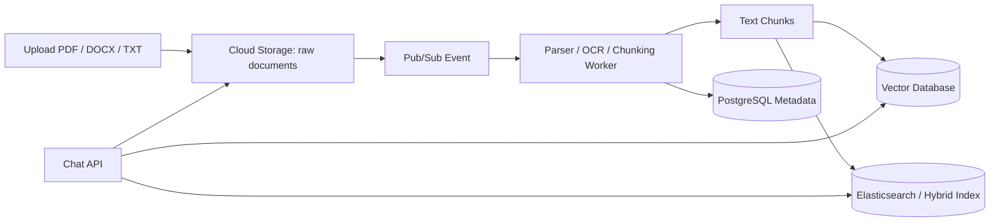
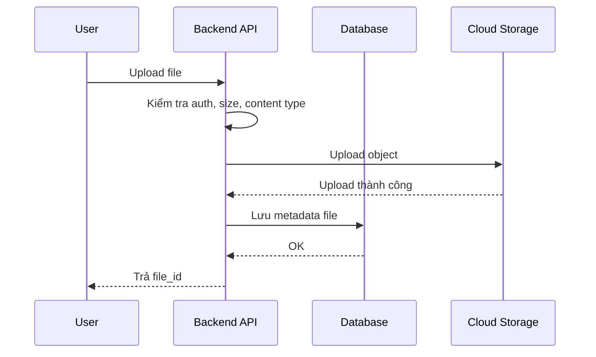
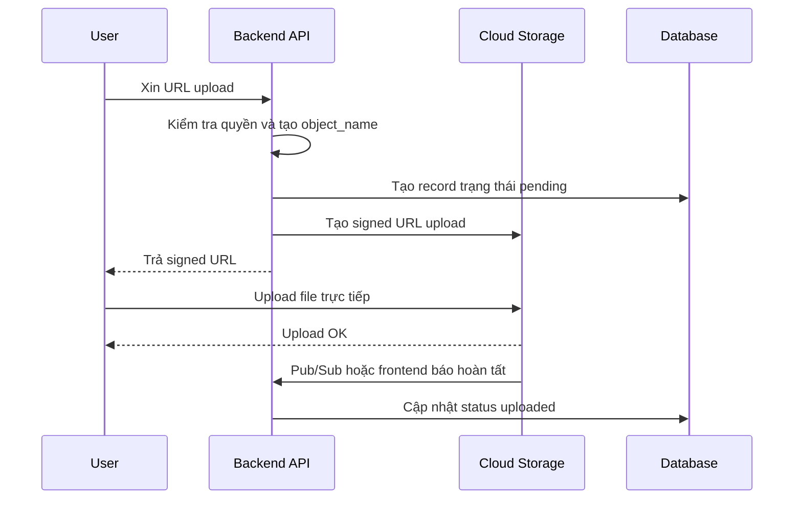
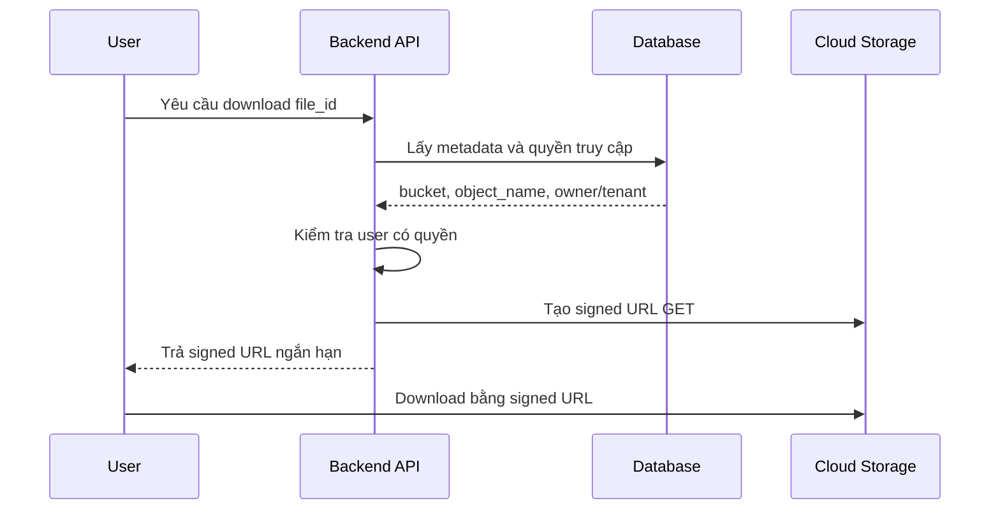
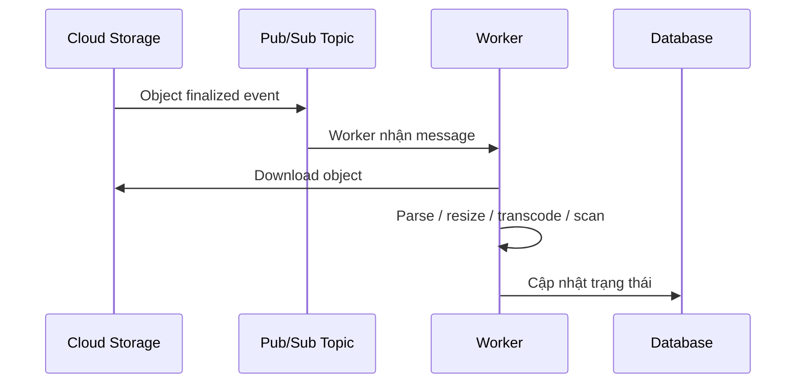

# Google Cloud Storage: Cơ sở lý thuyết, kiến trúc và thực hành

## 1. Mục tiêu tài liệu

Tài liệu này trình bày Google Cloud Storage theo hướng lý thuyết kết hợp thực hành, giúp người học nắm được:

- Google Cloud Storage là gì và khác gì với filesystem, database, Google Drive, MinIO hoặc Amazon S3.
- Cách tổ chức dữ liệu bằng project, bucket, object, object key, metadata, storage class và location.
- Cách Cloud Storage xử lý upload, download, phân quyền, signed URL, lifecycle, versioning và soft delete.
- Cách xác thực bằng Google Cloud CLI, Application Default Credentials, service account và IAM role.
- Cách dùng Cloud Storage bằng Google Cloud Console, `gcloud storage` và Python SDK.
- Cách tích hợp Cloud Storage vào backend FastAPI hoặc hệ thống AI/RAG.
- Các lỗi thiết kế thường gặp khi lưu file, public bucket, dùng sai quyền, đặt object key kém hoặc bỏ qua chi phí.

Tên chính thức trong tài liệu Google Cloud là **Cloud Storage**. Trong nhiều dự án, người học vẫn gọi là **Google Cloud Storage** hoặc viết tắt là **GCS**. Tài liệu này dùng các tên đó thay thế cho nhau, nhưng khi tìm tài liệu chính thức nên tìm theo tên **Cloud Storage**.

## 2. Tổng quan về Google Cloud Storage

Google Cloud Storage là dịch vụ object storage được quản lý bởi Google Cloud. Thay vì lưu file vào ổ đĩa cục bộ của server, ứng dụng lưu dữ liệu thành các object trong bucket. Mỗi object có dữ liệu file, tên object, metadata và các thuộc tính quản lý như storage class, generation, content type, cache control hoặc encryption.

Cloud Storage thường được dùng cho:

- Lưu ảnh, video, PDF, file upload từ người dùng.
- Lưu dataset, model checkpoint, log, artifact machine learning.
- Lưu file tĩnh cho website hoặc ứng dụng mobile.
- Lưu tài liệu gốc cho hệ thống RAG trước khi tách chunk và index vào vector database.
- Lưu backup, export database, report hoặc file batch processing.
- Làm storage backend cho các dịch vụ Google Cloud khác như Vertex AI, BigQuery, Dataflow, GKE hoặc Cloud Run.

Điểm quan trọng: Cloud Storage không phải database quan hệ, không phải file system POSIX đầy đủ, và không nên được dùng để lưu dữ liệu transaction nhỏ thay cho PostgreSQL/MySQL. Nó mạnh nhất khi lưu object lớn, độc lập, truy cập qua API, cần độ bền cao và khả năng mở rộng lớn.

### 2.1. Đặc điểm nổi bật

| Đặc điểm | Ý nghĩa |
| --- | --- |
| Managed object storage | Google vận hành hạ tầng lưu trữ, replication, durability và availability. |
| Bucket và object | Dữ liệu được lưu trong bucket, mỗi file là một object có tên duy nhất trong bucket. |
| Global namespace cho bucket | Tên bucket phải duy nhất trên toàn bộ Cloud Storage. |
| IAM tích hợp | Phân quyền bằng Google Cloud IAM, service account và policy. |
| Storage class | Chọn lớp lưu trữ theo tần suất truy cập và chi phí: Standard, Nearline, Coldline, Archive, Rapid. |
| Location | Chọn region, dual-region, multi-region hoặc zone tùy yêu cầu latency, availability và chi phí. |
| Strong consistency | Nhiều thao tác object và listing có tính nhất quán mạnh sau khi request thành công. |
| Lifecycle | Tự động đổi storage class hoặc xóa object theo tuổi, version, prefix hoặc điều kiện khác. |
| Signed URL | Cấp quyền tạm thời để upload/download mà không cần public bucket. |
| Pub/Sub notification | Phát event khi object được tạo, xóa, archive hoặc cập nhật metadata. |

## 3. Cơ sở lý thuyết

### 3.1. Object storage

Object storage là mô hình lưu trữ dữ liệu dưới dạng object độc lập. Mỗi object thường gồm:

- **Data**: nội dung thật, ví dụ ảnh, video, PDF, JSON, CSV, parquet hoặc model file.
- **Key/name**: tên logic của object trong bucket, ví dụ `users/42/avatar.png`.
- **Metadata**: thông tin mô tả object như `Content-Type`, `Cache-Control`, size, checksum, custom metadata.

Khác với filesystem truyền thống, object storage không thật sự có thư mục vật lý theo kiểu cây thư mục. Chuỗi `/` trong object key chỉ là một phần của tên object, giúp giao diện hiển thị giống folder. Ví dụ:

```text
invoices/2026/06/invoice-001.pdf
```

Object key trên nhìn giống file trong folder, nhưng bản chất vẫn là một object có tên đầy đủ là chuỗi trên.

### 3.2. Bucket

Bucket là container cấp cao chứa object. Mọi object trong Cloud Storage đều phải nằm trong một bucket.

Một bucket có các thuộc tính quan trọng:

| Thuộc tính | Ý nghĩa |
| --- | --- |
| Name | Tên bucket, phải duy nhất toàn cầu và không đổi sau khi tạo. |
| Location | Nơi dữ liệu được lưu, ví dụ `asia-southeast1`, `us-central1`, dual-region hoặc multi-region. |
| Default storage class | Storage class mặc định cho object mới nếu upload không chỉ định class khác. |
| IAM policy | Chính sách quyền truy cập bucket và object bên trong. |
| Uniform bucket-level access | Chế độ khuyến nghị để quản lý quyền bằng IAM thay vì ACL object riêng lẻ. |
| Lifecycle rules | Quy tắc tự động chuyển class hoặc xóa object. |
| Versioning | Có lưu các phiên bản cũ của object hay không. |
| Soft delete | Cơ chế giữ object/bucket đã xóa trong một khoảng thời gian để có thể khôi phục. |

Không thể lồng bucket trong bucket. Nếu cần phân nhóm dữ liệu, hãy dùng object prefix như:

```text
raw/
processed/
users/{user_id}/uploads/
tenants/{tenant_id}/documents/
```

### 3.3. Object

Object là đơn vị dữ liệu chính trong Cloud Storage. Một object có thể là file ảnh, video, tài liệu, file CSV, file nén hoặc bất kỳ định dạng nhị phân nào.

Object có hai nhóm thông tin:

| Nhóm | Ví dụ |
| --- | --- |
| Object data | Nội dung file: bytes của ảnh, PDF, parquet, model checkpoint. |
| Object metadata | `name`, `generation`, `metageneration`, `content_type`, `size`, `md5_hash`, custom metadata. |

Cloud Storage xem object data là dữ liệu opaque, nghĩa là dịch vụ không cần hiểu bên trong file có cấu trúc gì. Nếu muốn query dữ liệu bên trong file, cần dùng dịch vụ khác như BigQuery, Dataflow, Spark, application code hoặc index phụ.

### 3.4. Object key và prefix

Object key là tên object trong bucket. Object key nên được thiết kế có chủ đích vì nó ảnh hưởng đến:

- Cách người vận hành tìm kiếm và debug file.
- Cách application phân quyền theo tenant/user.
- Cách lifecycle rule chọn object theo prefix.
- Cách batch job liệt kê file.
- Cách tránh ghi đè nhầm dữ liệu.

Ví dụ object key tốt:

```text
tenants/acme/users/u_123/uploads/2026/06/30/8f3a-report.pdf
datasets/sales/raw/2026/06/30/orders-0001.parquet
rag/documents/doc_456/original/source.pdf
rag/documents/doc_456/chunks/chunk_0001.json
```

Nên tránh:

```text
file.pdf
upload.pdf
data.csv
test.png
```

vì các tên này dễ trùng, khó audit, khó phân quyền và khó dọn dẹp.

### 3.5. Metadata

Metadata giúp mô tả object và điều khiển hành vi khi object được tải xuống hoặc cache.

Một số metadata phổ biến:

| Metadata | Ý nghĩa |
| --- | --- |
| `Content-Type` | Kiểu nội dung, ví dụ `image/png`, `application/pdf`, `text/csv`. |
| `Cache-Control` | Cách browser/CDN cache object. |
| `Content-Disposition` | Gợi ý browser hiển thị inline hay tải về. |
| `Content-Encoding` | Encoding của nội dung, ví dụ `gzip`. |
| Custom metadata | Key-value do ứng dụng tự đặt, ví dụ `uploaded_by`, `document_id`. |

Không nên nhồi toàn bộ metadata nghiệp vụ quan trọng vào Cloud Storage. Với hệ thống backend, thường nên lưu metadata nghiệp vụ trong database chính:

```text
PostgreSQL: file_id, owner_id, bucket, object_name, status, size, checksum, created_at
Cloud Storage: object bytes, content type, cache control, vài metadata kỹ thuật
```

### 3.6. Generation và metageneration

Cloud Storage có khái niệm `generation` và `metageneration`:

| Khái niệm | Ý nghĩa |
| --- | --- |
| `generation` | Phiên bản dữ liệu của object. Khi object bị ghi đè, generation thay đổi. |
| `metageneration` | Phiên bản metadata. Khi metadata thay đổi, metageneration tăng. |

Hai giá trị này rất hữu ích để tránh race condition. Ví dụ khi upload object mới, có thể dùng precondition `if_generation_match=0` để yêu cầu chỉ tạo object nếu object chưa tồn tại. Nếu object đã tồn tại, request thất bại thay vì ghi đè im lặng.

### 3.7. Storage class

Storage class là thuộc tính ảnh hưởng đến availability, chi phí lưu trữ, chi phí truy xuất và thời gian lưu tối thiểu. Các class chính:

| Storage class | Khi dùng |
| --- | --- |
| `STANDARD` | Dữ liệu truy cập thường xuyên, website, app upload, dữ liệu đang xử lý. |
| `NEARLINE` | Dữ liệu ít truy cập, khoảng mỗi tháng một lần hoặc ít hơn. |
| `COLDLINE` | Dữ liệu rất ít truy cập, backup hoặc archive theo quý. |
| `ARCHIVE` | Dữ liệu lưu lâu dài, hiếm khi đọc, yêu cầu chi phí lưu trữ thấp. |
| `RAPID` | Workload hiệu năng cao, thường dùng với zonal bucket cho AI/ML hoặc analytics cường độ lớn. |

Không nên chọn `ARCHIVE` chỉ vì thấy rẻ. Với dữ liệu cần đọc thường xuyên, phí truy xuất và thời gian lưu tối thiểu có thể làm tổng chi phí cao hơn `STANDARD`.

### 3.8. Location

Location quy định nơi bucket và dữ liệu được lưu.

| Loại location | Ý nghĩa | Khi dùng |
| --- | --- | --- |
| Region | Một vùng cụ thể, ví dụ `asia-southeast1`. | Muốn gần compute, giảm latency và phí network. |
| Dual-region | Hai region được cấu hình thành một cặp. | Cần availability cao hơn nhưng vẫn kiểm soát vị trí. |
| Multi-region | Một khu vực lớn như `US`, `EU`, `ASIA`. | Dữ liệu phục vụ người dùng phân tán rộng. |
| Zone | Một zone cụ thể, dùng cho Rapid Bucket. | Workload I/O cao, cần colocate với compute. |

Nguyên tắc thực tế: nếu backend chạy ở `asia-southeast1`, bucket chứa file upload nóng cũng nên ở `asia-southeast1` hoặc một location hợp lý gần compute để giảm latency và chi phí egress.

### 3.9. IAM, ACL và uniform bucket-level access

Cloud Storage có hai cơ chế phân quyền lịch sử:

- **IAM**: phân quyền theo principal, role và resource. Đây là cách nên dùng.
- **ACL**: phân quyền kiểu cũ ở mức bucket/object, chủ yếu phục vụ tương thích với S3 và một số hệ thống cũ.

Google khuyến nghị dùng **uniform bucket-level access** cho bucket mới. Khi bật chế độ này, quyền truy cập được quản lý bằng IAM, giúp giảm rủi ro một object bị ACL public ngoài ý muốn.

Một số role hay gặp:

| Role | Ý nghĩa |
| --- | --- |
| `roles/storage.objectViewer` | Đọc object. |
| `roles/storage.objectUser` | Tạo, đọc, cập nhật, xóa object theo phạm vi role. |
| `roles/storage.objectAdmin` | Quản trị object trong bucket. |
| `roles/storage.admin` | Quản trị bucket và object, quyền rất rộng. |

Trong production, nên cấp quyền nhỏ nhất cần thiết. Ví dụ service upload avatar chỉ cần quyền ghi vào bucket/prefix phù hợp, không cần `roles/storage.admin` toàn project.

### 3.10. Authentication và ADC

Authentication trả lời câu hỏi: "Ứng dụng này là ai?" Authorization/IAM trả lời câu hỏi: "Ứng dụng đó được phép làm gì?"

Trong Cloud Storage, các cách xác thực phổ biến:

| Cách | Khi dùng |
| --- | --- |
| Google Cloud CLI user login | Học tập, thao tác thủ công, local development. |
| Application Default Credentials | Cách chuẩn cho client libraries trong local và production. |
| Service account | Backend, Cloud Run, GKE, VM, CI/CD. |
| Service account impersonation | Developer thao tác thay mặt service account mà không tải key file. |
| Service account key file | Chỉ dùng khi thật sự cần, phải bảo vệ như secret. |

Với Python SDK, `storage.Client()` mặc định tìm credentials qua ADC. Local có thể chạy:

```bash
gcloud auth application-default login
```

Trong Cloud Run, GKE hoặc Compute Engine, nên gắn service account vào runtime và cấp IAM role cho service account đó.

### 3.11. Signed URL

Signed URL là URL có chữ ký, cho phép người có URL thực hiện một hành động cụ thể trong thời gian giới hạn. Đây là cách phổ biến để:

- Cho user tải file private mà không public bucket.
- Cho frontend upload trực tiếp lên Cloud Storage mà không đi qua backend.
- Chia sẻ file tạm thời cho đối tác hoặc hệ thống khác.

Ví dụ luồng download bằng signed URL:

1. User đăng nhập vào app.
2. Backend kiểm tra user có quyền xem file.
3. Backend tạo signed URL hết hạn sau 5-15 phút.
4. Frontend dùng URL đó để tải file từ Cloud Storage.

Không nên lưu signed URL lâu dài trong database vì URL tự hết hạn. Nên lưu `bucket` và `object_name`, rồi tạo URL mới khi cần.

### 3.12. Lifecycle, versioning và soft delete

Cloud Storage hỗ trợ nhiều cơ chế quản lý vòng đời dữ liệu:

| Cơ chế | Ý nghĩa |
| --- | --- |
| Lifecycle Management | Tự động đổi storage class hoặc xóa object theo rule. |
| Object Versioning | Giữ version cũ khi object bị ghi đè hoặc xóa. |
| Soft delete | Giữ lại object/bucket đã xóa trong khoảng thời gian khôi phục. |
| Retention policy | Ngăn xóa/sửa dữ liệu trước thời hạn lưu giữ. |
| Object hold | Giữ một object khỏi bị xóa cho đến khi hold được gỡ. |

Lifecycle rất hữu ích cho dữ liệu tạm, log, backup và file xử lý trung gian. Ví dụ:

- Xóa file tạm trong `tmp/` sau 7 ngày.
- Chuyển file backup cũ hơn 30 ngày sang `NEARLINE`.
- Chuyển archive cũ hơn 180 ngày sang `ARCHIVE`.
- Xóa noncurrent versions cũ để tránh chi phí tăng âm thầm.

## 4. Kiến trúc Google Cloud Storage

### 4.1. Sơ đồ kiến trúc Mermaid



Kiến trúc trên cho thấy Cloud Storage thường không đứng một mình. Backend kiểm soát nghiệp vụ và quyền truy cập, database lưu metadata nghiệp vụ, Cloud Storage lưu bytes của file, IAM kiểm soát quyền, Pub/Sub kích hoạt xử lý bất đồng bộ và audit logs phục vụ giám sát.

### 4.2. Các thành phần quan trọng

| Thành phần | Vai trò |
| --- | --- |
| Organization | Cấp quản trị cao nhất trong Google Cloud, đại diện công ty/tổ chức. |
| Project | Không gian chứa tài nguyên, billing, API, IAM và quota. |
| Bucket | Container chứa object. |
| Object | File hoặc blob dữ liệu được lưu trong bucket. |
| Prefix | Phần đầu của object key, dùng để nhóm object logic. |
| IAM policy | Chính sách cho phép principal làm gì trên resource. |
| Service account | Danh tính máy dùng cho backend/job/CI/CD. |
| Storage class | Lớp lưu trữ theo tần suất truy cập và chi phí. |
| Location | Nơi bucket lưu dữ liệu. |
| Lifecycle rule | Quy tắc tự động quản lý object theo thời gian/điều kiện. |
| Signed URL | URL có chữ ký để cấp quyền tạm thời. |
| Pub/Sub notification | Event khi object thay đổi. |
| Cloud Audit Logs | Log ai đã làm gì với bucket/object. |

### 4.3. Cloud Storage trong kiến trúc backend

Trong backend, nên tách rõ hai loại dữ liệu:

| Loại dữ liệu | Nên lưu ở đâu |
| --- | --- |
| Nội dung file lớn | Cloud Storage |
| Metadata nghiệp vụ | PostgreSQL, MySQL, MongoDB hoặc database chính |
| Quyền truy cập theo user/tenant | Database và IAM/service layer |
| Trạng thái xử lý | Database hoặc message queue |
| Search text/vector | Elasticsearch, Qdrant, Milvus hoặc hệ index phù hợp |

Ví dụ bảng metadata:

```sql
CREATE TABLE uploaded_files (
    id UUID PRIMARY KEY,
    tenant_id TEXT NOT NULL,
    owner_id TEXT NOT NULL,
    bucket_name TEXT NOT NULL,
    object_name TEXT NOT NULL,
    original_filename TEXT NOT NULL,
    content_type TEXT,
    size_bytes BIGINT,
    checksum TEXT,
    status TEXT NOT NULL,
    created_at TIMESTAMP NOT NULL DEFAULT now()
);
```

Cloud Storage không biết `tenant_id` hay `owner_id` có ý nghĩa nghiệp vụ gì. Backend cần kiểm tra quyền trước khi tạo signed URL hoặc trả metadata file.

### 4.4. Cloud Storage trong hệ thống AI và RAG

Trong hệ thống AI/RAG, Cloud Storage thường giữ vai trò lưu dữ liệu gốc:



Một thiết kế phổ biến:

- Cloud Storage lưu file gốc: `rag/documents/{document_id}/original.pdf`.
- Worker tải file, parse text, chia chunk.
- Vector database lưu embedding và metadata truy xuất.
- PostgreSQL lưu quyền truy cập, trạng thái xử lý, tên file, owner, tenant.
- Khi cần trích dẫn hoặc download bản gốc, backend tạo signed URL từ object trong Cloud Storage.

## 5. Vòng đời xử lý dữ liệu

### 5.1. Luồng upload qua backend



Cách này đơn giản và dễ kiểm soát, nhưng file lớn sẽ đi qua backend, làm tăng tải CPU/network và timeout nếu không thiết kế tốt.

### 5.2. Luồng upload trực tiếp bằng signed URL



Cách này phù hợp với file lớn hoặc frontend/mobile app, vì backend không phải truyền toàn bộ bytes. Đổi lại, cần kiểm soát content type, kích thước, tên object và trạng thái upload cẩn thận hơn.

### 5.3. Luồng download private file



Không cần public bucket để user download file. Backend vẫn là nơi quyết định ai có quyền lấy signed URL.

### 5.4. Luồng xử lý bất đồng bộ bằng Pub/Sub



Luồng này phù hợp cho:

- Resize ảnh sau upload.
- Scan virus.
- Parse PDF cho RAG.
- Chuyển CSV/parquet vào data warehouse.
- Tạo thumbnail hoặc preview.

## 6. Các khái niệm cốt lõi

### 6.1. Project

Project là đơn vị quản lý tài nguyên, billing, IAM và API. Trước khi dùng Cloud Storage cần:

1. Có Google Cloud project.
2. Bật Cloud Storage API nếu cần.
3. Có billing phù hợp.
4. Có IAM role để tạo bucket hoặc thao tác object.

Nên tách project theo môi trường:

```text
myapp-dev
myapp-staging
myapp-prod
```

Tránh dùng chung một bucket production cho thử nghiệm cá nhân.

### 6.2. Bucket name

Tên bucket phải duy nhất toàn cầu, không chỉ duy nhất trong project. Vì vậy, tên như `uploads` hoặc `images` gần như chắc chắn đã bị người khác dùng.

Gợi ý đặt tên:

```text
<company>-<app>-<env>-<purpose>
acme-rag-dev-documents
acme-rag-prod-uploads
student-demo-20260630-files
```

Không nên đưa thông tin nhạy cảm vào tên bucket vì tên bucket có thể bị lộ qua URL, log hoặc thông báo lỗi.

### 6.3. Object name

Object name nên:

- Không phụ thuộc hoàn toàn vào filename người dùng nhập.
- Có prefix rõ ràng theo domain, tenant, ngày hoặc loại dữ liệu.
- Có ID ngẫu nhiên hoặc UUID để tránh trùng.
- Giữ extension nếu cần giúp debug hoặc suy đoán content type.

Ví dụ:

```python
from uuid import uuid4
from pathlib import Path


def build_object_name(tenant_id: str, user_id: str, filename: str) -> str:
    ext = Path(filename).suffix.lower()
    return f"tenants/{tenant_id}/users/{user_id}/uploads/{uuid4()}{ext}"
```

### 6.4. URI `gs://`

Cloud Storage thường dùng URI dạng:

```text
gs://bucket-name/path/to/object.pdf
```

Ví dụ:

```text
gs://acme-rag-prod-documents/rag/documents/doc_123/original.pdf
```

URI này khác với HTTPS URL. `gs://` thường dùng trong Google Cloud CLI, SDK, BigQuery, Dataflow và các dịch vụ Google Cloud. HTTPS URL dùng cho browser hoặc API HTTP.

### 6.5. Content type

Content type rất quan trọng khi object được tải qua browser.

Ví dụ:

| File | Content type |
| --- | --- |
| PNG | `image/png` |
| JPEG | `image/jpeg` |
| PDF | `application/pdf` |
| JSON | `application/json` |
| CSV | `text/csv` |
| Parquet | `application/octet-stream` hoặc type phù hợp theo hệ thống |

Nếu upload PDF nhưng content type bị đặt là `application/octet-stream`, browser có thể tải file về thay vì hiển thị inline.

### 6.6. Public access

Không nên public bucket nếu không thật sự cần. Với file riêng tư, hãy dùng:

- IAM cho service account/backend.
- Signed URL cho user cuối.
- Backend kiểm tra quyền trước khi tạo URL.
- Public access prevention cho bucket nhạy cảm.

Public bucket chỉ phù hợp cho dữ liệu công khai như asset website, dataset public hoặc file không chứa thông tin nhạy cảm.

### 6.7. CORS

CORS cần khi browser frontend gọi trực tiếp Cloud Storage, ví dụ upload file bằng signed URL từ React/Vue/Next.js.

Ví dụ CORS đơn giản:

```json
[
  {
    "origin": ["https://app.example.com"],
    "method": ["GET", "PUT", "POST"],
    "responseHeader": ["Content-Type", "x-goog-resumable"],
    "maxAgeSeconds": 3600
  }
]
```

Cập nhật CORS:

```bash
gcloud storage buckets update gs://BUCKET_NAME --cors-file=cors.json
```

Không nên dùng `"origin": ["*"]` cho hệ thống có dữ liệu nhạy cảm nếu không hiểu rõ tác động.

## 7. Thiết lập môi trường

### 7.1. Cài Google Cloud CLI

Google Cloud CLI cung cấp lệnh `gcloud` và `gcloud storage`.

Sau khi cài, đăng nhập:

```bash
gcloud init
```

Chọn project mặc định:

```bash
gcloud config set project PROJECT_ID
```

Kiểm tra project:

```bash
gcloud config get-value project
```

### 7.2. Xác thực ADC cho local development

Nếu dùng Python/Node.js/Java client library local, tạo Application Default Credentials:

```bash
gcloud auth application-default login
```

Kiểm tra account đang đăng nhập:

```bash
gcloud auth list
```

Kiểm tra ADC quota project nếu cần:

```bash
gcloud auth application-default set-quota-project PROJECT_ID
```

### 7.3. Cài Python SDK

```bash
pip install --upgrade google-cloud-storage
```

Trong code Python:

```python
from google.cloud import storage

client = storage.Client()
```

Nếu chạy trong Google Cloud runtime như Cloud Run, Compute Engine hoặc GKE, SDK sẽ dùng credentials của service account gắn với runtime.

## 8. Dùng Google Cloud Console

Console phù hợp để học, debug nhanh và kiểm tra trạng thái.

Các thao tác thường dùng:

1. Vào Google Cloud Console.
2. Chọn project.
3. Mở Cloud Storage > Buckets.
4. Tạo bucket mới.
5. Chọn location và storage class.
6. Bật uniform bucket-level access nếu bucket mới.
7. Upload file thử.
8. Xem object metadata.
9. Kiểm tra tab Permissions.
10. Xem lifecycle/versioning nếu cần.

Console tiện nhưng không nên là cách duy nhất trong production. Hạ tầng production nên được mô tả bằng Terraform, script hoặc quy trình IaC để tái lập được.

## 9. Dùng `gcloud storage`

### 9.1. Tạo bucket

```bash
gcloud storage buckets create gs://BUCKET_NAME \
  --location=asia-southeast1 \
  --default-storage-class=STANDARD \
  --uniform-bucket-level-access
```

Ví dụ:

```bash
gcloud storage buckets create gs://student-demo-20260630-files \
  --location=asia-southeast1 \
  --default-storage-class=STANDARD \
  --uniform-bucket-level-access
```

### 9.2. Liệt kê bucket

```bash
gcloud storage buckets list
```

Xem thông tin bucket:

```bash
gcloud storage buckets describe gs://BUCKET_NAME
```

### 9.3. Upload object

```bash
gcloud storage cp ./local-file.pdf gs://BUCKET_NAME/docs/local-file.pdf
```

Upload cả thư mục:

```bash
gcloud storage cp ./data gs://BUCKET_NAME/data --recursive
```

### 9.4. Liệt kê object

```bash
gcloud storage ls gs://BUCKET_NAME
```

Liệt kê theo prefix:

```bash
gcloud storage ls gs://BUCKET_NAME/docs/
```

Liệt kê đệ quy:

```bash
gcloud storage ls --recursive gs://BUCKET_NAME
```

### 9.5. Download object

```bash
gcloud storage cp gs://BUCKET_NAME/docs/local-file.pdf ./downloaded-file.pdf
```

Download thư mục:

```bash
gcloud storage cp gs://BUCKET_NAME/data ./data-download --recursive
```

### 9.6. Xóa object và bucket

Xóa một object:

```bash
gcloud storage rm gs://BUCKET_NAME/docs/local-file.pdf
```

Xóa nhiều object theo prefix:

```bash
gcloud storage rm --recursive gs://BUCKET_NAME/tmp/
```

Xóa bucket rỗng:

```bash
gcloud storage buckets delete gs://BUCKET_NAME
```

Cẩn thận với lệnh xóa đệ quy. Trong production, nên dùng lifecycle rule hoặc quy trình review trước khi xóa hàng loạt.

### 9.7. Cấp quyền IAM cho service account

Ví dụ cấp quyền upload/download object trong bucket:

```bash
gcloud storage buckets add-iam-policy-binding gs://BUCKET_NAME \
  --member="serviceAccount:my-service@PROJECT_ID.iam.gserviceaccount.com" \
  --role="roles/storage.objectUser"
```

Cấp quyền chỉ đọc:

```bash
gcloud storage buckets add-iam-policy-binding gs://BUCKET_NAME \
  --member="serviceAccount:my-service@PROJECT_ID.iam.gserviceaccount.com" \
  --role="roles/storage.objectViewer"
```

## 10. Dùng Google Cloud Storage với Python

### 10.1. Kết nối bằng client

```python
from google.cloud import storage


client = storage.Client()
```

SDK sẽ tự tìm credentials qua ADC hoặc runtime service account.

### 10.2. Tạo bucket

```python
from google.cloud import storage


def create_bucket(bucket_name: str, location: str = "asia-southeast1") -> None:
    client = storage.Client()

    bucket = storage.Bucket(client, name=bucket_name)
    bucket.storage_class = "STANDARD"
    bucket.iam_configuration.uniform_bucket_level_access_enabled = True

    client.create_bucket(bucket, location=location)
    print(f"Created bucket: {bucket_name}")
```

Trong production, tạo bucket bằng Terraform hoặc hạ tầng quản lý tập trung thường tốt hơn tạo bucket trực tiếp trong application code.

### 10.3. Upload file

```python
from google.cloud import storage


def upload_file(
    bucket_name: str,
    source_file_path: str,
    destination_object_name: str,
    content_type: str | None = None,
) -> None:
    client = storage.Client()
    bucket = client.bucket(bucket_name)
    blob = bucket.blob(destination_object_name)

    blob.upload_from_filename(
        source_file_path,
        content_type=content_type,
        if_generation_match=0,
    )

    print(f"Uploaded {source_file_path} to gs://{bucket_name}/{destination_object_name}")
```

`if_generation_match=0` giúp tránh ghi đè object đã tồn tại.

### 10.4. Upload bytes hoặc string

```python
from google.cloud import storage


def upload_text(bucket_name: str, object_name: str, text: str) -> None:
    client = storage.Client()
    blob = client.bucket(bucket_name).blob(object_name)

    blob.upload_from_string(
        text,
        content_type="text/plain; charset=utf-8",
        if_generation_match=0,
    )
```

Ví dụ upload JSON:

```python
import json
from google.cloud import storage


def upload_json(bucket_name: str, object_name: str, data: dict) -> None:
    client = storage.Client()
    blob = client.bucket(bucket_name).blob(object_name)

    blob.upload_from_string(
        json.dumps(data, ensure_ascii=False),
        content_type="application/json",
        if_generation_match=0,
    )
```

### 10.5. Download file

```python
from google.cloud import storage


def download_file(bucket_name: str, object_name: str, destination_file_path: str) -> None:
    client = storage.Client()
    blob = client.bucket(bucket_name).blob(object_name)

    blob.download_to_filename(destination_file_path)
    print(f"Downloaded gs://{bucket_name}/{object_name} to {destination_file_path}")
```

### 10.6. Download vào memory

```python
from google.cloud import storage


def download_text(bucket_name: str, object_name: str) -> str:
    client = storage.Client()
    blob = client.bucket(bucket_name).blob(object_name)

    return blob.download_as_text(encoding="utf-8")
```

Với file lớn, không nên download toàn bộ vào memory. Hãy stream hoặc download ra file tạm.

### 10.7. Liệt kê object

```python
from google.cloud import storage


def list_objects(bucket_name: str, prefix: str = "") -> list[str]:
    client = storage.Client()
    blobs = client.list_blobs(bucket_name, prefix=prefix)

    return [blob.name for blob in blobs]
```

Ví dụ:

```python
objects = list_objects("my-bucket", prefix="tenants/acme/")
for name in objects:
    print(name)
```

### 10.8. Xóa object

```python
from google.cloud import storage


def delete_object(bucket_name: str, object_name: str) -> None:
    client = storage.Client()
    blob = client.bucket(bucket_name).blob(object_name)

    blob.delete()
```

Nếu bucket bật versioning hoặc soft delete, hành vi xóa có thể khác với "mất vĩnh viễn ngay lập tức". Cần kiểm tra cấu hình bucket.

### 10.9. Tạo signed URL download

```python
from datetime import timedelta
from google.cloud import storage


def create_download_signed_url(bucket_name: str, object_name: str) -> str:
    client = storage.Client()
    blob = client.bucket(bucket_name).blob(object_name)

    return blob.generate_signed_url(
        version="v4",
        expiration=timedelta(minutes=15),
        method="GET",
    )
```

Lưu ý: tạo signed URL thường cần credentials có khả năng ký, phổ biến nhất là service account. Nếu chạy local bằng user ADC và gặp lỗi ký URL, hãy dùng service account impersonation hoặc service account phù hợp.

### 10.10. Tạo signed URL upload

```python
from datetime import timedelta
from google.cloud import storage


def create_upload_signed_url(
    bucket_name: str,
    object_name: str,
    content_type: str,
) -> str:
    client = storage.Client()
    blob = client.bucket(bucket_name).blob(object_name)

    return blob.generate_signed_url(
        version="v4",
        expiration=timedelta(minutes=15),
        method="PUT",
        content_type=content_type,
    )
```

Frontend upload:

```bash
curl -X PUT "SIGNED_URL" \
  -H "Content-Type: application/pdf" \
  --upload-file ./report.pdf
```

Khi dùng signed URL upload, backend nên tạo object name trước, lưu metadata trạng thái `pending`, rồi cập nhật thành `uploaded` sau khi xác nhận upload thành công.

## 11. Tích hợp với FastAPI

### 11.1. Cấu hình biến môi trường

Ví dụ `.env`:

```env
GCS_BUCKET_NAME=acme-rag-dev-documents
GCS_UPLOAD_PREFIX=uploads
```

Trong production, không nên lưu service account key trong repo. Nên dùng runtime service account của Cloud Run/GKE/VM hoặc secret manager nếu bắt buộc phải dùng key.

### 11.2. Service upload file

```python
from pathlib import Path
from uuid import uuid4

from fastapi import UploadFile
from google.cloud import storage


class GCSFileService:
    def __init__(self, bucket_name: str, upload_prefix: str = "uploads") -> None:
        self.client = storage.Client()
        self.bucket = self.client.bucket(bucket_name)
        self.upload_prefix = upload_prefix.strip("/")

    def build_object_name(self, user_id: str, filename: str) -> str:
        ext = Path(filename).suffix.lower()
        return f"{self.upload_prefix}/users/{user_id}/{uuid4()}{ext}"

    def upload_user_file(self, user_id: str, file: UploadFile) -> str:
        object_name = self.build_object_name(user_id, file.filename or "file")
        blob = self.bucket.blob(object_name)

        blob.upload_from_file(
            file.file,
            content_type=file.content_type,
            if_generation_match=0,
        )

        return object_name
```

### 11.3. Endpoint upload cơ bản

```python
import os

from fastapi import FastAPI, File, UploadFile


app = FastAPI()
file_service = GCSFileService(
    bucket_name=os.environ["GCS_BUCKET_NAME"],
    upload_prefix=os.getenv("GCS_UPLOAD_PREFIX", "uploads"),
)


@app.post("/files")
def upload_file(file: UploadFile = File(...)):
    user_id = "demo-user"
    object_name = file_service.upload_user_file(user_id, file)

    return {
        "bucket": os.environ["GCS_BUCKET_NAME"],
        "object_name": object_name,
    }
```

Trong hệ thống thật, cần thêm:

- Authentication để biết `user_id`.
- Kiểm tra file size.
- Kiểm tra content type và extension.
- Lưu metadata vào database.
- Scan file nếu nhận upload từ người dùng.
- Xử lý lỗi khi upload thành công nhưng ghi database thất bại.

### 11.4. Endpoint tạo signed URL download

```python
from datetime import timedelta

from fastapi import HTTPException


@app.get("/files/{file_id}/download-url")
def get_download_url(file_id: str):
    # Trong thực tế: lấy metadata từ database theo file_id.
    record = {
        "bucket": os.environ["GCS_BUCKET_NAME"],
        "object_name": f"uploads/users/demo-user/{file_id}.pdf",
        "owner_id": "demo-user",
    }

    current_user_id = "demo-user"
    if record["owner_id"] != current_user_id:
        raise HTTPException(status_code=403, detail="Forbidden")

    blob = storage.Client().bucket(record["bucket"]).blob(record["object_name"])
    url = blob.generate_signed_url(
        version="v4",
        expiration=timedelta(minutes=10),
        method="GET",
    )

    return {"url": url}
```

Đừng trả signed URL nếu chưa kiểm tra quyền nghiệp vụ.

## 12. Lifecycle Management

### 12.1. Ví dụ xóa file tạm sau 7 ngày

Tạo file `lifecycle.json`:

```json
{
  "rule": [
    {
      "action": {
        "type": "Delete"
      },
      "condition": {
        "age": 7,
        "matchesPrefix": ["tmp/"]
      }
    }
  ]
}
```

Áp dụng:

```bash
gcloud storage buckets update gs://BUCKET_NAME --lifecycle-file=lifecycle.json
```

### 12.2. Ví dụ chuyển backup cũ sang Coldline

```json
{
  "rule": [
    {
      "action": {
        "type": "SetStorageClass",
        "storageClass": "COLDLINE"
      },
      "condition": {
        "age": 90,
        "matchesPrefix": ["backups/"]
      }
    }
  ]
}
```

### 12.3. Nguyên tắc khi dùng lifecycle

- Test rule trên bucket development trước.
- Dùng `matchesPrefix` hoặc `matchesSuffix` để giới hạn phạm vi.
- Cẩn thận với rule `Delete`.
- Theo dõi chi phí và số lượng noncurrent versions.
- Ghi lại mục đích của từng rule trong tài liệu vận hành.

Lifecycle có thể mất thời gian để cấu hình mới có hiệu lực, vì vậy không nên kỳ vọng mọi object được xóa/chuyển class ngay lập tức ở thời điểm đổi rule.

## 13. Versioning, soft delete và retention

### 13.1. Object Versioning

Bật versioning:

```bash
gcloud storage buckets update gs://BUCKET_NAME --versioning
```

Tắt versioning:

```bash
gcloud storage buckets update gs://BUCKET_NAME --no-versioning
```

Versioning giúp khôi phục khi object bị ghi đè hoặc xóa nhầm, nhưng có thể làm chi phí tăng vì các version cũ vẫn được lưu. Nên kết hợp lifecycle để xóa version cũ sau một khoảng thời gian hợp lý.

### 13.2. Soft delete

Soft delete giúp giữ lại object hoặc bucket đã xóa trong một khoảng thời gian để khôi phục. Đây là lớp bảo vệ hữu ích trước lỗi vận hành.

Tuy nhiên, soft delete không thay thế backup strategy. Với dữ liệu quan trọng, vẫn cần:

- Quyền xóa chặt chẽ.
- Audit log.
- Lifecycle rõ ràng.
- Replication hoặc backup theo yêu cầu nghiệp vụ.
- Kiểm thử quy trình restore.

### 13.3. Retention policy và object hold

Retention policy và object hold dùng khi cần đảm bảo dữ liệu không bị xóa/sửa trước thời hạn, ví dụ audit log, dữ liệu pháp lý, báo cáo tài chính hoặc dữ liệu cần tuân thủ quy định.

Cẩn thận: retention policy có thể làm bạn không xóa được dữ liệu dù muốn. Trước khi bật trên production, cần hiểu rõ yêu cầu compliance và quy trình vận hành.

## 14. Pub/Sub notification và xử lý event

Cloud Storage có thể gửi thông báo sang Pub/Sub khi object thay đổi. Các event thường gặp:

| Event | Ý nghĩa |
| --- | --- |
| Object finalized | Object mới được tạo hoặc upload hoàn tất. |
| Object deleted | Object bị xóa. |
| Object archived | Live version trở thành noncurrent version khi bật versioning. |
| Object metadata updated | Metadata object thay đổi. |

Ví dụ use case:

- Upload ảnh xong thì tạo thumbnail.
- Upload PDF xong thì parse text.
- Upload CSV xong thì chạy pipeline import.
- Xóa object thì cập nhật trạng thái trong database.

Thiết kế event cần chú ý:

- Event có thể đến trễ.
- Worker nên idempotent, xử lý lại message không làm hỏng dữ liệu.
- Không tin object name từ event là đủ để phân quyền nghiệp vụ.
- Nên lưu trạng thái xử lý trong database.

## 15. Bảo mật

### 15.1. Nguyên tắc quyền tối thiểu

Không cấp `roles/storage.admin` cho service account chỉ để upload file. Hãy cấp role hẹp hơn như:

- `roles/storage.objectViewer` nếu chỉ đọc.
- `roles/storage.objectUser` nếu cần upload/download/update/delete object.
- `roles/storage.objectAdmin` nếu service thật sự quản trị object.

Với hệ thống multi-tenant, IAM ở bucket level chưa đủ để phân quyền từng user. Backend vẫn cần kiểm tra `tenant_id`, `owner_id`, role nghiệp vụ và trạng thái file.

### 15.2. Tránh service account key file khi có thể

Service account key file là secret mạnh. Nếu bị lộ, người khác có thể gọi API với quyền của service account.

Ưu tiên:

- Cloud Run/GKE/Compute Engine runtime service account.
- Workload Identity Federation cho CI/CD ngoài Google Cloud.
- Service account impersonation cho developer.
- Secret Manager nếu bắt buộc phải dùng key.

Không commit file `.json` service account vào Git.

### 15.3. Không public nhầm dữ liệu

Các lỗi public nhầm phổ biến:

- Bật ACL public cho một object chứa dữ liệu nhạy cảm.
- Dùng fine-grained access khi không cần.
- Dùng bucket chung cho cả public asset và private upload.
- Dùng signed URL quá dài hạn.
- Log signed URL ra nơi nhiều người xem được.

Thiết kế an toàn hơn:

```text
bucket public assets: acme-prod-public-assets
bucket private uploads: acme-prod-private-uploads
bucket internal datasets: acme-prod-internal-datasets
```

Tách bucket theo mức nhạy cảm giúp giảm rủi ro cấu hình sai lan rộng.

### 15.4. Kiểm soát upload từ người dùng

Khi nhận file upload từ user, cần kiểm tra:

- Kích thước tối đa.
- Content type.
- Extension.
- Số lượng file.
- Virus/malware nếu hệ thống yêu cầu.
- Tên file gốc không được dùng trực tiếp làm object key duy nhất.
- Quyền user với tenant/project.

Không tin hoàn toàn `Content-Type` do client gửi. Nếu file quan trọng, hãy kiểm tra thêm bằng server-side validation.

## 16. Chi phí và tối ưu

Chi phí Cloud Storage thường đến từ:

- Dung lượng lưu trữ theo storage class và location.
- Operation/read/write/list request.
- Network egress.
- Retrieval fee với một số storage class.
- Early deletion fee nếu xóa object trước thời gian lưu tối thiểu.
- Phiên bản cũ nếu bật versioning.

Nguyên tắc tối ưu:

- Chọn location gần compute.
- Dùng lifecycle cho file tạm, backup và archive.
- Không bật versioning nếu không có kế hoạch dọn version cũ.
- Tránh list toàn bucket quá thường xuyên.
- Dùng prefix rõ ràng để batch job chỉ quét phạm vi cần thiết.
- Đặt `Cache-Control` phù hợp cho public asset.
- Theo dõi billing và storage metrics.

## 17. So sánh với công nghệ khác

### 17.1. Cloud Storage và filesystem

| Tiêu chí | Cloud Storage | Filesystem local |
| --- | --- | --- |
| Mô hình | Object storage qua API | File/folder trên ổ đĩa |
| Scale | Rất lớn, managed | Phụ thuộc server/disk |
| Truy cập | HTTP/API/SDK | POSIX/local path |
| Phù hợp | File upload, dataset, backup, asset | File tạm, config local, cache nhỏ |
| Không phù hợp | Transaction nhỏ, rename folder kiểu POSIX | Lưu trữ phân tán bền vững |

Không nên giả định Cloud Storage hoạt động giống ổ đĩa local. Nếu cần mount như filesystem, có thể dùng Cloud Storage FUSE, nhưng vẫn cần hiểu khác biệt về hiệu năng và semantics.

### 17.2. Cloud Storage và database

| Tiêu chí | Cloud Storage | Database |
| --- | --- | --- |
| Dữ liệu chính | Object/file/blob | Record, bảng, document |
| Query | Theo bucket/object/prefix/metadata hạn chế | Query linh hoạt, index, transaction |
| Transaction | Không phải trọng tâm | Trọng tâm của database |
| File lớn | Rất phù hợp | Thường không nên lưu trực tiếp |
| Metadata nghiệp vụ | Không nên là nơi chính | Rất phù hợp |

Thiết kế tốt thường dùng cả hai: Cloud Storage lưu file, database lưu metadata và quan hệ nghiệp vụ.

### 17.3. Cloud Storage và Google Drive

| Tiêu chí | Cloud Storage | Google Drive |
| --- | --- | --- |
| Đối tượng | Ứng dụng, backend, data pipeline | Người dùng cuối, cộng tác tài liệu |
| API/infra | Cloud-native, IAM, service account | Workspace/user-centric |
| Bucket/object | Có | Không theo mô hình bucket/object |
| Dùng cho app upload | Phù hợp | Không phải lựa chọn hạ tầng chính |

Google Drive tốt cho người dùng quản lý file thủ công. Cloud Storage tốt cho ứng dụng và hệ thống backend.

### 17.4. Cloud Storage và MinIO

| Tiêu chí | Cloud Storage | MinIO |
| --- | --- | --- |
| Vận hành | Managed bởi Google Cloud | Tự vận hành hoặc dùng dịch vụ riêng |
| API | Google Cloud JSON/XML API, client libraries | S3-compatible API |
| Hạ tầng | Google Cloud | On-prem, VM, Kubernetes, local |
| Phù hợp | Production cloud, tích hợp GCP | Local dev, self-hosted object storage, S3-compatible workload |
| IAM | Google Cloud IAM | Policy/access key của MinIO |

Nếu dự án cần local object storage để học hoặc test, MinIO rất tiện. Nếu triển khai trên Google Cloud và muốn managed storage, Cloud Storage là lựa chọn tự nhiên.

### 17.5. Cloud Storage và Amazon S3

| Tiêu chí | Cloud Storage | Amazon S3 |
| --- | --- | --- |
| Nhà cung cấp | Google Cloud | AWS |
| Khái niệm | Bucket, object, IAM, storage class | Bucket, object, IAM, storage class |
| SDK | Google Cloud client libraries | AWS SDK |
| Tích hợp tốt nhất | GCP services | AWS services |
| S3-compatible | Có XML API và HMAC cho một số use case tương thích | Native S3 |

Hai dịch vụ cùng thuộc nhóm object storage. Chọn dịch vụ nào thường phụ thuộc cloud provider chính, hệ sinh thái đang dùng, yêu cầu tích hợp và chi phí.

## 18. Thiết kế dữ liệu trong Cloud Storage

### 18.1. Chọn bucket

Có hai hướng phổ biến:

| Cách chia | Khi phù hợp |
| --- | --- |
| Theo môi trường | `myapp-dev-uploads`, `myapp-prod-uploads` |
| Theo mức nhạy cảm | `public-assets`, `private-uploads`, `internal-datasets` |
| Theo domain dữ liệu | `documents`, `avatars`, `backups`, `ml-artifacts` |
| Theo team/project lớn | Khi IAM, billing hoặc lifecycle khác nhau rõ rệt |

Không nên tạo bucket cho từng user nếu không có lý do mạnh. Bucket là resource quản trị cấp cao; object prefix thường đủ để chia theo user/tenant.

### 18.2. Thiết kế object key

Mẫu tốt cho app upload:

```text
tenants/{tenant_id}/users/{user_id}/uploads/{yyyy}/{mm}/{dd}/{uuid}.{ext}
```

Mẫu tốt cho RAG:

```text
rag/tenants/{tenant_id}/documents/{document_id}/original/{filename}
rag/tenants/{tenant_id}/documents/{document_id}/parsed/text.json
rag/tenants/{tenant_id}/documents/{document_id}/chunks/chunk_000001.json
```

Mẫu tốt cho data lake:

```text
datasets/{dataset_name}/raw/dt=2026-06-30/part-0001.parquet
datasets/{dataset_name}/processed/dt=2026-06-30/part-0001.parquet
```

### 18.3. Lưu metadata ở đâu

Nên lưu metadata nghiệp vụ trong database:

| Metadata | Nơi lưu khuyến nghị |
| --- | --- |
| `bucket_name`, `object_name` | Database |
| `owner_id`, `tenant_id`, quyền truy cập | Database |
| `original_filename` | Database |
| `content_type`, `size`, `checksum` | Database và/hoặc object metadata |
| `processing_status` | Database |
| `document_title`, `tags`, `category` | Database/search index |
| `Cache-Control`, `Content-Disposition` | Object metadata |

Cloud Storage metadata không thay thế database cho truy vấn nghiệp vụ.

### 18.4. Idempotency và chống ghi đè

Khi upload từ backend hoặc worker, nên dùng:

- UUID trong object key.
- `if_generation_match=0` khi muốn tạo mới.
- Generation precondition khi update metadata hoặc ghi đè có kiểm soát.
- Database transaction/outbox nếu cần đồng bộ giữa database và object.

Ví dụ lỗi cần tránh:

```text
User A upload report.pdf -> gs://bucket/uploads/report.pdf
User B upload report.pdf -> ghi đè file của User A
```

Thiết kế tốt:

```text
uploads/users/user_a/7b2f...-report.pdf
uploads/users/user_b/3a91...-report.pdf
```

## 19. Tối ưu vận hành

### 19.1. Quan sát và audit

Nên bật hoặc theo dõi:

- Cloud Audit Logs cho thao tác quản trị và truy cập dữ liệu quan trọng.
- Cloud Monitoring metrics cho dung lượng, request count, error count.
- Billing alert cho project.
- Log trong backend khi tạo signed URL hoặc upload/delete object.

Audit log trả lời các câu hỏi:

- Ai tạo bucket?
- Ai đổi IAM policy?
- Service account nào đọc/xóa object?
- Khi nào lifecycle hoặc hệ thống xóa dữ liệu?

### 19.2. Retry và lỗi tạm thời

Cloud API có thể gặp lỗi tạm thời như timeout, rate limit hoặc 5xx. Client libraries thường có retry mặc định cho một số thao tác, nhưng application vẫn cần:

- Timeout hợp lý.
- Retry có backoff cho job nền.
- Idempotency để retry không tạo trùng dữ liệu.
- Logging đủ thông tin: bucket, object name, request id nếu có.

### 19.3. File lớn

Với file lớn:

- Cân nhắc resumable upload.
- Tránh route backend phải giữ toàn bộ file trong memory.
- Dùng signed URL upload trực tiếp nếu frontend/mobile upload file lớn.
- Dùng worker bất đồng bộ cho xử lý sau upload.
- Đặt giới hạn size và timeout rõ ràng.

### 19.4. Không list toàn bộ bucket liên tục

Listing object có chi phí và có thể chậm nếu bucket rất lớn. Nên:

- Dùng prefix cụ thể.
- Lưu metadata trong database để query.
- Dùng Pub/Sub hoặc inventory/report cho pipeline lớn.
- Phân vùng object key theo ngày hoặc domain.

## 20. Các lỗi thiết kế thường gặp

### 20.1. Lưu file upload trong Git hoặc database

Git không dành cho file upload runtime. Database cũng không nên chứa file lớn nếu không có lý do đặc biệt. Nên lưu file trong Cloud Storage và lưu metadata trong database.

### 20.2. Dùng filename gốc làm object key

Filename người dùng có thể trùng, chứa ký tự khó xử lý hoặc tiết lộ thông tin. Hãy tạo object key bằng UUID và lưu filename gốc trong database.

### 20.3. Public bucket private data

Public bucket cho dữ liệu người dùng là lỗi nghiêm trọng. Với dữ liệu private, dùng IAM và signed URL.

### 20.4. Cấp quyền quá rộng

Không cấp `roles/storage.admin` cho service chỉ cần upload object. Quyền quá rộng làm tăng thiệt hại nếu token hoặc service bị lộ.

### 20.5. Commit service account key

File key JSON trong repo là rủi ro lớn. Nếu lỡ commit, cần revoke/rotate key ngay, xóa khỏi lịch sử Git nếu cần và kiểm tra audit log.

### 20.6. Không bật lifecycle cho file tạm

File tạm, output trung gian, failed upload và noncurrent version có thể tích lũy âm thầm. Nên có lifecycle rule rõ ràng.

### 20.7. Không lưu metadata trong database

Nếu chỉ lưu object trong bucket mà không có database metadata, backend sẽ khó biết file thuộc user nào, trạng thái xử lý ra sao, quyền truy cập thế nào.

### 20.8. Signed URL hết hạn quá dài

Signed URL càng dài hạn, rủi ro khi URL bị lộ càng lớn. Với file private, thường nên dùng thời hạn ngắn như vài phút đến vài chục phút tùy use case.

### 20.9. Không kiểm tra content type và size

Nếu cho user upload tự do, hệ thống dễ bị lạm dụng để lưu file quá lớn hoặc file không mong muốn. Cần validate trước và sau upload.

### 20.10. Nhầm Cloud Storage với filesystem POSIX

Cloud Storage là object storage. Các thao tác như append nhỏ liên tục, lock file kiểu POSIX, rename folder hàng loạt hoặc transaction nhiều file không phải điểm mạnh của nó.

## 21. Bài tập thực hành

### Bài 1: Tạo bucket

Tạo bucket theo mẫu:

```text
<your-name>-gcs-demo-<yyyymmdd>
```

Yêu cầu:

- Location: `asia-southeast1`.
- Storage class: `STANDARD`.
- Bật uniform bucket-level access.
- Upload thử một file bằng Console.

### Bài 2: Dùng `gcloud storage`

Thực hiện:

1. Upload file `hello.txt` vào `gs://BUCKET_NAME/demo/hello.txt`.
2. Liệt kê object trong prefix `demo/`.
3. Download object về máy.
4. Xóa object.

### Bài 3: Upload bằng Python

Viết script Python:

- Nhận `bucket_name`, `source_file`, `object_name`.
- Upload file lên Cloud Storage.
- Đặt content type đúng.
- Dùng `if_generation_match=0`.

### Bài 4: Tạo signed URL

Viết script:

- Tạo signed URL download cho một object.
- Thời hạn 10 phút.
- Mở URL trong browser để kiểm tra.

### Bài 5: Thiết kế metadata

Thiết kế bảng `uploaded_files` cho app có:

- User upload PDF.
- Mỗi file thuộc một tenant.
- File cần trạng thái `pending`, `uploaded`, `processing`, `ready`, `failed`.
- Backend cần tạo signed URL download sau khi file sẵn sàng.

### Bài 6: Lifecycle

Tạo lifecycle rule:

- Xóa object trong `tmp/` sau 7 ngày.
- Chuyển object trong `backups/` sang `NEARLINE` sau 30 ngày.
- Giải thích rủi ro nếu áp dụng nhầm rule cho production.

### Bài 7: RAG pipeline

Thiết kế object key cho hệ thống RAG:

- File gốc.
- Text đã parse.
- Chunk JSON.
- Metadata theo tenant.

Giải thích phần nào lưu trong Cloud Storage, phần nào lưu trong PostgreSQL, phần nào lưu trong vector database.

## 22. Lộ trình học đề xuất

1. Hiểu object storage, bucket, object, prefix và metadata.
2. Tạo bucket và upload/download bằng Console.
3. Dùng `gcloud storage cp`, `ls`, `rm`, `buckets describe`.
4. Học IAM role cơ bản: viewer, object user, object admin, storage admin.
5. Xác thực bằng ADC và service account.
6. Upload/download bằng Python SDK.
7. Tạo signed URL cho upload/download private file.
8. Thiết kế object key và bảng metadata.
9. Thêm lifecycle rule cho file tạm và backup.
10. Tìm hiểu versioning, soft delete, retention và audit logs.
11. Kết hợp Pub/Sub notification với worker xử lý file.
12. Tối ưu chi phí bằng storage class, location và lifecycle.

## 23. Kết luận

Google Cloud Storage là nền tảng object storage quan trọng trong hệ sinh thái Google Cloud. Khi dùng đúng vai trò, nó giúp ứng dụng lưu file lớn, dữ liệu upload, dataset, backup và artifact một cách bền vững, mở rộng tốt và dễ tích hợp với các dịch vụ cloud khác.

Điểm cần nhớ là Cloud Storage không thay thế database và không giống hoàn toàn filesystem. Thiết kế tốt thường gồm Cloud Storage để lưu bytes, database để lưu metadata nghiệp vụ, backend để kiểm tra quyền, IAM để giới hạn quyền service, signed URL để cấp truy cập tạm thời, và lifecycle để kiểm soát chi phí/dọn dữ liệu.

Nếu mới học, hãy bắt đầu từ bucket, object, `gcloud storage cp`, Python SDK và signed URL. Khi đi vào production, tập trung thêm vào IAM tối thiểu, lifecycle, audit log, object key naming và chiến lược xử lý lỗi.

## 24. Tài liệu tham khảo

- Cloud Storage overview: https://cloud.google.com/storage/docs/introduction
- About buckets: https://cloud.google.com/storage/docs/buckets
- About objects: https://cloud.google.com/storage/docs/objects
- Create a bucket: https://cloud.google.com/storage/docs/creating-buckets
- Upload objects: https://cloud.google.com/storage/docs/uploading-objects
- Download objects: https://cloud.google.com/storage/docs/downloading-objects
- Storage classes: https://cloud.google.com/storage/docs/storage-classes
- Access control overview: https://cloud.google.com/storage/docs/access-control
- Authenticate to Cloud Storage: https://cloud.google.com/storage/docs/authentication
- Cloud Storage client libraries: https://cloud.google.com/storage/docs/reference/libraries
- Signed URLs: https://cloud.google.com/storage/docs/access-control/signed-urls
- Object Lifecycle Management: https://cloud.google.com/storage/docs/lifecycle
- Cloud Storage consistency: https://cloud.google.com/storage/docs/consistency
- Pub/Sub notifications for Cloud Storage: https://cloud.google.com/storage/docs/pubsub-notifications
- Cloud Audit Logs with Cloud Storage: https://cloud.google.com/storage/docs/audit-logs
