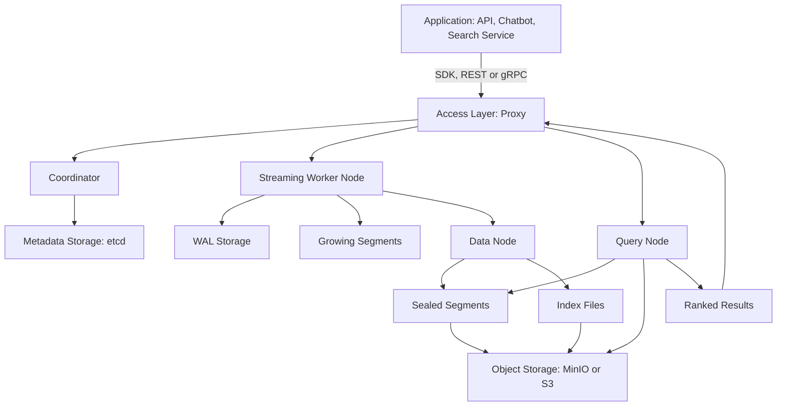
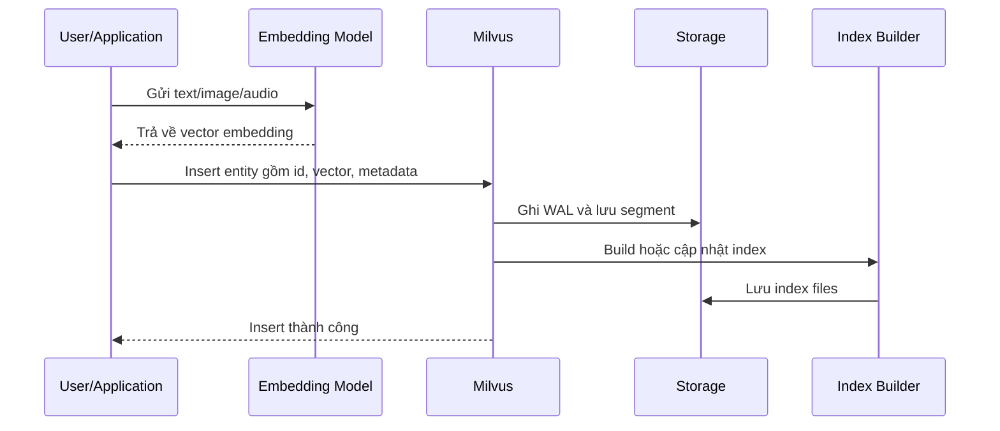
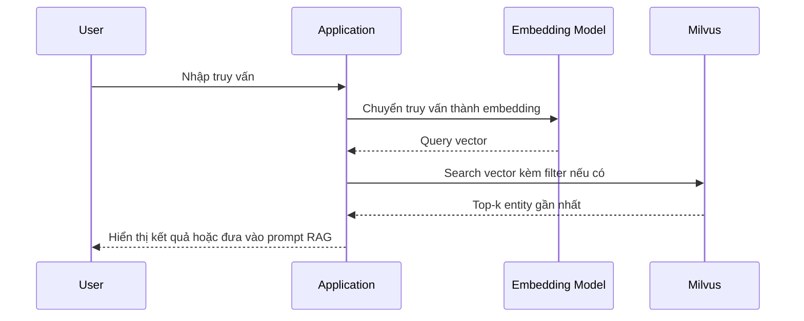
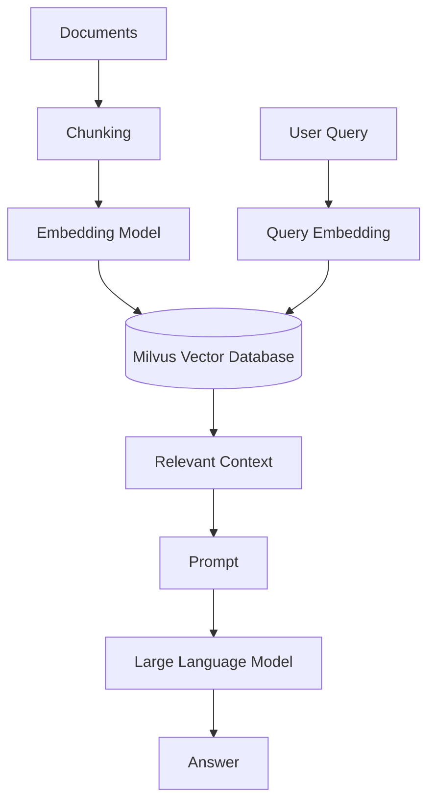

# Milvus Vector Database: Cơ sở lý thuyết, kiến trúc và thực hành

## 1. Mục tiêu tài liệu

Tài liệu này trình bày Milvus theo hướng lý thuyết kết hợp thực hành, giúp người học nắm được:

- Milvus là gì và vì sao vector database quan trọng trong các hệ thống AI hiện đại.
- Cách dữ liệu phi cấu trúc được biểu diễn thành vector embedding.
- Các khái niệm cốt lõi của Milvus như collection, entity, vector field, scalar field, schema, index, partition và metric.
- Cách Milvus thực hiện tìm kiếm tương đồng vector ở quy mô lớn.
- Cách dùng Milvus trong các bài toán semantic search, recommendation và Retrieval-Augmented Generation.
- Cách triển khai Milvus cơ bản bằng Milvus Lite, Docker và Python client.

## 2. Tổng quan về Milvus

Milvus là một **vector database** mã nguồn mở, được thiết kế để lưu trữ, đánh chỉ mục và tìm kiếm dữ liệu vector có số chiều lớn. Milvus thường được dùng trong các hệ thống AI cần tìm kiếm theo ý nghĩa, ví dụ tìm tài liệu gần nghĩa với câu hỏi, tìm sản phẩm tương tự, truy xuất tri thức cho chatbot hoặc xây dựng bộ nhớ cho AI agent.

Trong các ứng dụng AI hiện đại, dữ liệu như văn bản, hình ảnh, âm thanh hoặc sản phẩm thường được chuyển thành vector embedding bằng mô hình machine learning. Các vector này giữ thông tin ngữ nghĩa của dữ liệu gốc. Milvus lưu trữ các vector đó cùng metadata và hỗ trợ tìm kiếm các vector gần nhau nhất bằng nhiều loại index khác nhau.

Milvus thường được dùng cho:

- Semantic search cho tài liệu, bài viết, sản phẩm hoặc câu hỏi.
- Retrieval-Augmented Generation trong chatbot và ứng dụng LLM.
- Recommendation system dựa trên độ tương đồng giữa người dùng, sản phẩm hoặc nội dung.
- Image search, audio search hoặc multimodal search.
- Lưu trữ memory cho AI agent.
- Truy xuất vector ở quy mô lớn với kiến trúc standalone hoặc distributed.

### 2.1. Đặc điểm nổi bật

| Đặc điểm                  | Ý nghĩa                                                                                      |
| ------------------------- | -------------------------------------------------------------------------------------------- |
| Vector search             | Tìm kiếm dữ liệu dựa trên độ tương đồng giữa các vector embedding.                           |
| Scalar filtering          | Kết hợp tìm kiếm vector với điều kiện lọc metadata như `category`, `owner_id`, `created_at`. |
| Schema rõ ràng            | Collection có schema gồm primary key, vector field và scalar field.                          |
| Nhiều loại index          | Hỗ trợ AUTOINDEX, FLAT, IVF, HNSW, DiskANN, sparse index và một số GPU index tùy môi trường. |
| Milvus Lite               | Cho phép chạy Milvus cục bộ trong một file để học và thử nghiệm nhanh bằng Python.           |
| Standalone và distributed | Có thể chạy đơn giản bằng Docker hoặc mở rộng thành cluster cho production.                  |
| REST/gRPC và SDK          | Hỗ trợ tích hợp qua API và client cho nhiều ngôn ngữ, phổ biến nhất là PyMilvus.             |
| Multi-tenancy             | Có thể cô lập dữ liệu theo database, collection, partition hoặc partition key.               |

## 3. Cơ sở lý thuyết

### 3.1. Vector embedding

Vector embedding là cách biểu diễn dữ liệu thành một dãy số thực. Mỗi vector thường có nhiều chiều, ví dụ 384, 768, 1024 hoặc 1536 chiều tùy mô hình embedding.

Ví dụ một câu văn:

```text
"Milvus là vector database dùng cho semantic search"
```

có thể được mô hình embedding chuyển thành vector:

```text
[0.12, -0.34, 0.08, ..., 0.91]
```

Vector này không lưu trực tiếp từng từ, mà biểu diễn ý nghĩa tổng quát của câu. Hai câu có ý nghĩa gần nhau thường có vector gần nhau trong không gian vector.

### 3.2. Vector database

Vector database là hệ quản trị cơ sở dữ liệu chuyên lưu trữ và tìm kiếm vector embedding. Khác với cơ sở dữ liệu quan hệ truyền thống, vector database không tập trung vào phép so khớp chính xác như `WHERE name = 'Laptop'`, mà tập trung vào độ tương đồng.

Ví dụ, khi người dùng tìm:

```text
"máy tính xách tay cho sinh viên"
```

hệ thống semantic search có thể trả về các sản phẩm có mô tả:

```text
"laptop mỏng nhẹ, pin lâu, phù hợp học tập"
```

dù hai câu không có toàn bộ từ khóa giống nhau.

### 3.3. Similarity search

Similarity search là quá trình tìm các vector gần nhất với vector truy vấn. Trong Milvus, khi người dùng gửi một vector query, hệ thống sẽ so sánh vector đó với các vector đã lưu và trả về các entity có độ tương đồng cao nhất.

Quy trình cơ bản:

1. Dữ liệu gốc được chuyển thành embedding.
2. Embedding được lưu vào Milvus cùng các trường metadata.
3. Truy vấn của người dùng cũng được chuyển thành embedding.
4. Milvus tìm các vector gần nhất với embedding truy vấn.
5. Ứng dụng lấy nội dung gốc hoặc metadata tương ứng để trả về kết quả.

### 3.4. Distance metric

Distance metric là công thức dùng để đo khoảng cách hoặc độ tương đồng giữa hai vector. Milvus hỗ trợ nhiều metric phổ biến, tùy loại vector và loại index.

| Metric    | Ý nghĩa                                                             | Trường hợp sử dụng                                                                 |
| --------- | ------------------------------------------------------------------- | ---------------------------------------------------------------------------------- |
| `COSINE`  | Đo góc giữa hai vector, tập trung vào hướng vector.                 | Semantic search với text embedding.                                                |
| `IP`      | Inner Product, tính tích vô hướng giữa hai vector.                  | Một số mô hình embedding được huấn luyện cho dot product hoặc vector đã normalize. |
| `L2`      | Euclidean distance, đo khoảng cách hình học giữa hai điểm.          | Dữ liệu vector cần khoảng cách không gian trực tiếp.                               |
| `HAMMING` | Đếm số vị trí bit khác nhau giữa hai vector nhị phân.               | Binary vector.                                                                     |
| `JACCARD` | Đo độ tương đồng giữa hai tập hợp hoặc binary representation.       | Binary vector hoặc dữ liệu dạng tập hợp.                                           |
| `BM25`    | Metric cho sparse vector trong bài toán full-text/sparse retrieval. | Hybrid search hoặc sparse search.                                                  |

Với văn bản, `COSINE` thường được dùng vì nó tập trung vào hướng biểu diễn ngữ nghĩa thay vì độ lớn tuyệt đối của vector. Nếu dùng `IP`, cần kiểm tra mô hình embedding có yêu cầu normalize vector hay không.

### 3.5. Approximate Nearest Neighbor

Khi số lượng vector nhỏ, có thể so sánh query vector với toàn bộ vector trong database. Tuy nhiên, khi có hàng triệu hoặc hàng tỷ vector, cách này rất chậm. Vì vậy, vector database thường dùng kỹ thuật **Approximate Nearest Neighbor**.

ANN không luôn đảm bảo tìm đúng tuyệt đối kết quả gần nhất, nhưng giúp tìm kết quả gần đúng với tốc độ cao. Trong thực tế, độ chính xác của ANN thường đủ tốt cho semantic search, recommendation và RAG.

### 3.6. Index trong Milvus

Milvus hỗ trợ nhiều loại index để cân bằng giữa tốc độ, độ chính xác, RAM, dung lượng lưu trữ và khả năng mở rộng.

| Index                   | Ý nghĩa                                                                 | Khi nên dùng                                                |
| ----------------------- | ----------------------------------------------------------------------- | ----------------------------------------------------------- |
| `AUTOINDEX`             | Milvus tự chọn cấu hình index phù hợp.                                  | Lựa chọn mặc định tốt cho phần lớn dự án mới.               |
| `FLAT`                  | Brute-force, quét trực tiếp để có kết quả chính xác.                    | Dataset nhỏ hoặc cần kiểm thử recall.                       |
| `IVF_FLAT`              | Chia không gian vector thành các cụm rồi tìm trong một số cụm gần nhất. | Dataset lớn, muốn giảm RAM và chấp nhận tinh chỉnh tham số. |
| `IVF_PQ`                | IVF kết hợp product quantization để giảm bộ nhớ.                        | Dataset rất lớn, cần tiết kiệm bộ nhớ hơn.                  |
| `HNSW`                  | Index dạng graph cho ANN có recall cao.                                 | Dataset vừa hoặc lớn nằm trong RAM, cần độ chính xác cao.   |
| `DiskANN`               | Index tối ưu cho dữ liệu lớn hơn RAM, tận dụng lưu trữ trên đĩa.        | Dataset rất lớn, cần giảm áp lực RAM.                       |
| `SPARSE_INVERTED_INDEX` | Index cho sparse vector.                                                | Hybrid search, sparse retrieval hoặc full-text retrieval.   |

Trong thực hành học tập, có thể bắt đầu với `AUTOINDEX` hoặc cấu hình đơn giản của `HNSW`. Khi dữ liệu lớn hơn, cần benchmark trên dữ liệu thật để chọn index phù hợp.

## 4. Kiến trúc Milvus

### 4.1. Sơ đồ kiến trúc Mermaid



Kiến trúc trên cho thấy Milvus không chỉ lưu vector, mà còn tách riêng các thành phần xử lý request, metadata, write-ahead log, object storage, index và query. Ở chế độ standalone, nhiều thành phần có thể chạy trong một tiến trình/container. Ở chế độ distributed, các thành phần này có thể được tách ra để mở rộng độc lập.

Các lớp chính:

- **Access layer**: nhận request từ client, validate request, định tuyến và tổng hợp kết quả.
- **Coordinator**: quản lý metadata, topology, segment, collection, partition và các tác vụ điều phối.
- **Worker nodes**: xử lý insert, query, compaction và index building.
- **Storage layer**: lưu metadata, write-ahead log, segment và index file.

## 5. Vòng đời xử lý dữ liệu và truy vấn

### 5.1. Luồng ingest dữ liệu



Diễn giải:

1. Ứng dụng nhận dữ liệu gốc như tài liệu, mô tả sản phẩm hoặc hình ảnh.
2. Dữ liệu được chuyển thành embedding bằng mô hình phù hợp.
3. Ứng dụng tạo entity gồm primary key, vector field và scalar field.
4. Entity được gửi vào Milvus thông qua SDK hoặc API.
5. Milvus ghi dữ liệu vào WAL/segment để đảm bảo độ bền.
6. Khi phù hợp, Milvus xây dựng index để tăng tốc tìm kiếm.

### 5.2. Luồng tìm kiếm vector



Trong các hệ thống RAG, kết quả từ Milvus thường được đưa vào prompt để mô hình ngôn ngữ tạo câu trả lời dựa trên dữ liệu liên quan.

## 6. Các khái niệm cốt lõi

### 6.1. Collection

Collection là đơn vị lưu trữ chính trong Milvus, tương tự như bảng trong cơ sở dữ liệu quan hệ. Mỗi collection chứa nhiều entity và có schema xác định các field.

Một collection thường có:

- Primary key field, ví dụ `id`.
- Vector field, ví dụ `vector`.
- Scalar field để lưu metadata, ví dụ `text`, `source`, `category`, `owner_id`.
- Cấu hình dimension và metric cho vector field.
- Index cho vector field và có thể có index cho scalar field.

### 6.2. Entity

Entity là một bản ghi trong Milvus. Mỗi entity thường gồm:

- Một primary key.
- Một hoặc nhiều vector field.
- Các scalar field dùng để lưu metadata hoặc filter.

Ví dụ một entity:

```json
{
  "id": 1,
  "vector": [0.12, -0.34, 0.08, 0.91],
  "text": "Giới thiệu Milvus",
  "source": "docs/milvus.md",
  "category": "vector-database"
}
```

### 6.3. Vector field

Vector field là field lưu embedding. Khi tạo collection, cần xác định số chiều vector. Nếu collection được tạo với vector dimension là `768`, mọi vector được thêm vào field đó cũng phải có 768 chiều. Nếu số chiều không khớp, Milvus sẽ báo lỗi.

Vector field có thể là dense vector, binary vector hoặc sparse vector tùy bài toán và phiên bản Milvus đang dùng.

### 6.4. Scalar field

Scalar field là các field không phải vector, dùng để lưu metadata hoặc phục vụ filter. Ví dụ:

```json
{
  "text": "Milvus hỗ trợ semantic search",
  "source": "lecture_notes.pdf",
  "page": 12,
  "category": "database",
  "owner_id": "user_123",
  "created_at": "2026-05-26"
}
```

Scalar field rất quan trọng vì kết quả vector search thường chỉ cho biết dữ liệu nào gần về mặt ngữ nghĩa. Ứng dụng vẫn cần metadata để:

- Hiển thị nội dung cho người dùng.
- Truy ngược về tài liệu gốc.
- Lọc theo quyền truy cập.
- Lọc theo thời gian, danh mục hoặc tenant.

### 6.5. Schema

Schema mô tả cấu trúc dữ liệu của collection. Với Milvus, schema giúp hệ thống biết field nào là primary key, field nào là vector, field nào là scalar và kiểu dữ liệu của từng field.

Schema rõ ràng giúp:

- Kiểm soát dữ liệu đầu vào.
- Tối ưu index.
- Tăng hiệu quả filter.
- Giảm lỗi khi dữ liệu tăng trưởng.

Với demo đơn giản, MilvusClient cho phép tạo collection chỉ bằng tên collection và dimension. Với hệ thống nghiêm túc hơn, nên định nghĩa schema rõ ràng.

### 6.6. Scalar filtering

Scalar filtering là việc kết hợp vector search với điều kiện lọc metadata.

Ví dụ:

```text
Tìm các tài liệu gần nghĩa với câu hỏi, nhưng chỉ trong category = "database"
```

Trong Milvus, filter có thể viết bằng biểu thức:

```python
filter="category == 'database'"
```

Scalar filtering giúp hệ thống:

- Tránh trả về dữ liệu sai quyền.
- Giới hạn tìm kiếm theo domain.
- Giảm nhiễu trong kết quả.
- Hỗ trợ multi-tenant application.

### 6.7. Distance và score

Kết quả tìm kiếm trong Milvus thường có `distance` hoặc score liên quan đến metric đang dùng. Cách diễn giải phụ thuộc vào metric:

- Với `COSINE` hoặc `IP`, giá trị cao hơn thường thể hiện độ tương đồng cao hơn.
- Với `L2`, khoảng cách nhỏ hơn thường thể hiện hai vector gần nhau hơn.

Khi xây dựng ứng dụng, không nên chỉ nhìn score tuyệt đối. Nên đánh giá trên dữ liệu thật, vì phân phối score phụ thuộc vào embedding model, metric và cách chunking.

### 6.8. Top-k search

Top-k search là truy vấn trả về `k` kết quả gần nhất với query vector.

Ví dụ:

```text
Trả về 5 đoạn tài liệu liên quan nhất đến câu hỏi của người dùng
```

Trong RAG, `k` quá nhỏ có thể thiếu ngữ cảnh, còn `k` quá lớn có thể đưa nhiều thông tin nhiễu vào prompt. Vì vậy cần thử nghiệm để chọn `k` phù hợp.

### 6.9. Partition

Partition là cách chia dữ liệu trong một collection thành các phần nhỏ hơn. Partition có thể dùng để tách dữ liệu theo tenant, category, thời gian hoặc domain.

Ví dụ:

- Partition theo ngôn ngữ: `vi`, `en`, `ja`.
- Partition theo tenant: `tenant_a`, `tenant_b`.
- Partition theo loại dữ liệu: `product`, `document`, `ticket`.

Không nên lạm dụng partition nếu chỉ cần lọc đơn giản, vì scalar filtering có thể đủ tốt và dễ quản lý hơn.

## 7. Ví dụ sử dụng Milvus bằng Python

Ví dụ sau minh họa cách tạo collection, thêm dữ liệu và tìm kiếm vector bằng PyMilvus. Vector trong ví dụ là dữ liệu giả để dễ học, trong thực tế cần dùng embedding model để tạo vector.

### 7.1. Chạy Milvus bằng Milvus Lite

Milvus Lite phù hợp cho học tập, notebook, demo nhỏ hoặc thử nghiệm nhanh trên máy cá nhân.

```bash
pip install -U pymilvus
```

Khi dùng Milvus Lite, dữ liệu có thể được lưu vào một file local:

```python
from pymilvus import MilvusClient

client = MilvusClient("milvus_demo.db")
```

### 7.2. Chạy Milvus standalone bằng Docker Compose

Với môi trường gần production hơn, có thể chạy Milvus standalone bằng Docker Compose. Milvus standalone thường chạy cùng các thành phần như etcd và MinIO.

```bash
wget https://github.com/milvus-io/milvus/releases/download/v2.4.23/milvus-standalone-docker-compose.yml -O docker-compose.yml
docker compose up -d
```

Sau khi Milvus chạy, ứng dụng có thể kết nối tới server:

```python
from pymilvus import MilvusClient

client = MilvusClient(uri="http://localhost:19530", token="root:Milvus")
```

### 7.3. Tạo collection và thêm entity

```python
from pymilvus import MilvusClient

client = MilvusClient("milvus_demo.db")

collection_name = "documents"

if client.has_collection(collection_name=collection_name):
    client.drop_collection(collection_name=collection_name)

client.create_collection(
    collection_name=collection_name,
    dimension=4,
    metric_type="COSINE",
)

data = [
    {
        "id": 1,
        "vector": [0.10, 0.20, 0.30, 0.40],
        "text": "Milvus là vector database mã nguồn mở.",
        "category": "database",
    },
    {
        "id": 2,
        "vector": [0.12, 0.18, 0.33, 0.39],
        "text": "Vector database hỗ trợ tìm kiếm ngữ nghĩa.",
        "category": "database",
    },
    {
        "id": 3,
        "vector": [0.80, 0.10, 0.05, 0.02],
        "text": "FastAPI là framework xây dựng API bằng Python.",
        "category": "backend",
    },
]

insert_result = client.insert(
    collection_name=collection_name,
    data=data,
)

print(insert_result)
```

Trong ví dụ này:

- `id` là primary key mặc định.
- `vector` là vector field mặc định.
- `text` và `category` là scalar field dùng để hiển thị hoặc filter.
- `dimension=4` chỉ dùng cho demo; embedding thực tế thường có nhiều chiều hơn.

### 7.4. Tìm kiếm vector

```python
query_vector = [[0.11, 0.19, 0.31, 0.41]]

results = client.search(
    collection_name=collection_name,
    data=query_vector,
    limit=2,
    output_fields=["text", "category"],
)

for hits in results:
    for hit in hits:
        print(hit)
```

Kết quả thường gồm:

- Primary key của entity.
- Distance hoặc score.
- Các field được yêu cầu trong `output_fields`.

### 7.5. Tìm kiếm kèm filter

```python
results = client.search(
    collection_name=collection_name,
    data=query_vector,
    filter="category == 'database'",
    limit=2,
    output_fields=["text", "category"],
)

for hits in results:
    for hit in hits:
        print(hit)
```

Filter giúp giới hạn kết quả theo metadata. Trong hệ thống thực tế, filter thường được dùng cho `tenant_id`, `owner_id`, `document_id`, `category`, `language` hoặc `created_at`.

### 7.6. Query theo metadata

Ngoài vector search, Milvus cũng hỗ trợ query theo điều kiện metadata.

```python
rows = client.query(
    collection_name=collection_name,
    filter="category == 'database'",
    output_fields=["id", "text", "category"],
)

for row in rows:
    print(row)
```

Query phù hợp khi cần lấy bản ghi theo điều kiện rõ ràng, còn search phù hợp khi cần tìm theo độ tương đồng vector.

## 8. Milvus trong hệ thống RAG

### 8.1. Sơ đồ RAG với Milvus



Trong RAG, Milvus đóng vai trò là bộ nhớ truy xuất tri thức. Thay vì yêu cầu LLM tự nhớ mọi thông tin, ứng dụng sẽ tìm các đoạn tài liệu liên quan trong Milvus và đưa chúng vào prompt.

### 8.2. Quy trình RAG cơ bản

1. Thu thập tài liệu.
2. Chia tài liệu thành các chunk nhỏ.
3. Tạo embedding cho từng chunk.
4. Lưu embedding, nội dung chunk và metadata vào Milvus.
5. Khi người dùng hỏi, tạo embedding cho câu hỏi.
6. Tìm các chunk liên quan nhất trong Milvus.
7. Đưa các chunk vào prompt.
8. LLM tạo câu trả lời dựa trên context.

### 8.3. Vì sao cần chunking

Tài liệu dài thường không nên được embedding thành một vector duy nhất, vì vector đó có thể làm mất chi tiết. Chunking giúp:

- Giữ thông tin cụ thể hơn.
- Tăng khả năng tìm đúng đoạn liên quan.
- Kiểm soát độ dài context đưa vào LLM.
- Giảm nhiễu khi tài liệu chứa nhiều chủ đề.

Kích thước chunk thường phụ thuộc vào loại tài liệu và mô hình embedding. Với văn bản, có thể bắt đầu từ 300 đến 800 token mỗi chunk, sau đó điều chỉnh dựa trên chất lượng truy xuất.

## 9. So sánh Milvus với cơ sở dữ liệu truyền thống

| Tiêu chí           | Database truyền thống          | Milvus vector database                      |
| ------------------ | ------------------------------ | ------------------------------------------- |
| Kiểu dữ liệu chính | Bảng, dòng, cột, document      | Vector embedding và scalar field            |
| Truy vấn chính     | Exact match, range query, join | Similarity search, nearest neighbor         |
| Phù hợp với        | Dữ liệu có cấu trúc            | Dữ liệu phi cấu trúc và ngữ nghĩa           |
| Ví dụ truy vấn     | `WHERE id = 10`                | Tìm tài liệu gần nghĩa nhất                 |
| Index              | B-tree, hash, full-text index  | AUTOINDEX, HNSW, IVF, DiskANN, sparse index |
| Kết quả            | Bản ghi khớp điều kiện         | Danh sách kết quả có distance/score         |
| Metadata           | Là dữ liệu chính               | Dùng để lọc, hiển thị và phân quyền         |

Milvus không thay thế hoàn toàn database truyền thống. Trong nhiều hệ thống, Milvus được dùng cùng PostgreSQL, MySQL, MongoDB hoặc object storage. Database truyền thống lưu dữ liệu nghiệp vụ chính, còn Milvus lưu vector để tìm kiếm ngữ nghĩa.

## 10. Thiết kế dữ liệu trong Milvus

### 10.1. Chọn collection

Nên tách collection khi:

- Dữ liệu dùng vector dimension khác nhau.
- Dữ liệu dùng metric khác nhau.
- Dữ liệu thuộc domain khác nhau và ít khi tìm kiếm chung.
- Cần cấu hình index hoặc chính sách lưu trữ khác nhau.
- Có yêu cầu phân quyền hoặc vòng đời dữ liệu khác nhau.

Không nên tạo quá nhiều collection nhỏ nếu dữ liệu có cùng schema và cùng cách truy vấn, vì scalar filtering hoặc partition có thể xử lý nhiều trường hợp phân loại.

### 10.2. Thiết kế scalar field

Scalar field nên chứa đủ thông tin để lọc và hiển thị kết quả, ví dụ:

| Trường scalar | Vai trò                                        |
| ------------- | ---------------------------------------------- |
| `text`        | Nội dung chunk hoặc mô tả cần đưa vào kết quả. |
| `source`      | Nguồn tài liệu hoặc đường dẫn file.            |
| `document_id` | Liên kết về tài liệu gốc.                      |
| `category`    | Phân loại dữ liệu.                             |
| `language`    | Ngôn ngữ của nội dung.                         |
| `created_at`  | Thời gian tạo hoặc cập nhật.                   |
| `owner_id`    | Phục vụ phân quyền dữ liệu.                    |
| `tenant_id`   | Phục vụ multi-tenancy.                         |

Không nên đưa dữ liệu quá lớn vào scalar field nếu dữ liệu đó phù hợp hơn để lưu ở database khác hoặc object storage. Khi đó Milvus chỉ nên lưu khóa tham chiếu và phần text cần thiết cho retrieval.

### 10.3. Chọn distance metric

Việc chọn metric nên dựa trên mô hình embedding:

- Nếu tài liệu mô hình khuyến nghị cosine, nên dùng `COSINE`.
- Nếu mô hình được huấn luyện cho dot product, nên dùng `IP`.
- Nếu vector biểu diễn tọa độ hoặc đặc trưng hình học, có thể cân nhắc `L2`.
- Nếu dùng binary vector, cân nhắc `HAMMING` hoặc `JACCARD`.

Điều quan trọng là collection phải dùng metric phù hợp với embedding model, vì metric ảnh hưởng trực tiếp đến chất lượng kết quả tìm kiếm.

### 10.4. Chọn index

Có thể bắt đầu đơn giản:

- Dùng `AUTOINDEX` cho dự án mới hoặc khi chưa có benchmark.
- Dùng `FLAT` khi dataset nhỏ và cần kết quả gần như exact.
- Dùng `HNSW` khi cần recall cao và dữ liệu vừa với RAM.
- Dùng `IVF_FLAT` hoặc `IVF_PQ` khi cần tiết kiệm tài nguyên hơn.
- Dùng `DiskANN` khi dataset lớn hơn bộ nhớ khả dụng.

Không có index tốt nhất cho mọi trường hợp. Cần đo latency, recall, RAM, throughput và chi phí lưu trữ trên dữ liệu thật.

## 11. Ưu điểm và hạn chế

### 11.1. Ưu điểm

- Tìm kiếm theo ngữ nghĩa tốt hơn tìm kiếm từ khóa trong nhiều bài toán AI.
- Hỗ trợ kết hợp vector search với scalar filtering.
- Có schema rõ ràng, phù hợp với hệ thống cần kiểm soát dữ liệu.
- Hỗ trợ nhiều loại index cho nhiều quy mô dữ liệu khác nhau.
- Có Milvus Lite để học nhanh và Docker/Kubernetes cho production.
- Phù hợp với RAG, chatbot, recommendation và semantic search.
- Kiến trúc có thể mở rộng từ standalone tới distributed cluster.

### 11.2. Hạn chế

- Chất lượng tìm kiếm phụ thuộc mạnh vào embedding model.
- Cần chọn đúng vector dimension, metric, index và chiến lược chunking.
- ANN có thể đánh đổi một phần độ chính xác để lấy tốc độ.
- Vector database không thay thế hoàn toàn database nghiệp vụ truyền thống.
- Cần quản lý collection load/index khi triển khai server hoặc production.
- Kiến trúc distributed có nhiều thành phần hơn, đòi hỏi vận hành cẩn thận.
- Dữ liệu vector lớn có thể tiêu tốn nhiều RAM và dung lượng lưu trữ.

## 12. Các lỗi thiết kế thường gặp

### 12.1. Dùng sai embedding model

Nếu embedding model không phù hợp với ngôn ngữ hoặc domain dữ liệu, kết quả tìm kiếm sẽ kém dù Milvus hoạt động đúng. Ví dụ, dữ liệu tiếng Việt nên dùng mô hình embedding có khả năng xử lý tiếng Việt tốt.

### 12.2. Vector dimension không khớp

Nếu collection được tạo với dimension `768` nhưng ứng dụng insert vector `1536` chiều, Milvus sẽ báo lỗi. Đây là lỗi thường gặp khi đổi embedding model nhưng không tạo lại collection hoặc migrate dữ liệu.

### 12.3. Chunk quá dài hoặc quá ngắn

Chunk quá dài có thể làm mất chi tiết, còn chunk quá ngắn có thể thiếu ngữ cảnh. Cần thử nghiệm kích thước chunk và overlap để đạt chất lượng truy xuất tốt.

### 12.4. Không dùng filter phân quyền

Trong ứng dụng nhiều người dùng, nếu không lọc theo `owner_id`, `tenant_id` hoặc quyền truy cập, hệ thống có thể trả về dữ liệu không thuộc quyền của người dùng.

### 12.5. Lưu metadata thiếu thông tin

Nếu entity chỉ lưu vector mà không lưu `text`, `source` hoặc `document_id`, ứng dụng sẽ khó hiển thị kết quả hoặc truy ngược về dữ liệu gốc.

### 12.6. Chọn index theo cảm tính

Index ảnh hưởng đến latency, recall, RAM và chi phí lưu trữ. Không nên chọn index chỉ vì phổ biến. Nên benchmark với dữ liệu và truy vấn thật của hệ thống.

### 12.7. Không đánh giá chất lượng retrieval

Một hệ thống vector search cần được đánh giá bằng dữ liệu thật. Nên kiểm tra các truy vấn mẫu, top-k, score threshold, filter và tỷ lệ kết quả đúng để cải thiện embedding, chunking, metric và index.

## 13. Kết luận

Milvus là vector database mạnh mẽ cho các hệ thống cần tìm kiếm theo ngữ nghĩa ở nhiều quy mô khác nhau. Thay vì chỉ tìm kiếm dữ liệu theo từ khóa chính xác, Milvus cho phép lưu vector embedding và truy xuất các dữ liệu có ý nghĩa gần với truy vấn.

Về mặt kỹ thuật, Milvus kết hợp collection, entity, schema, vector field, scalar field, partition, index và kiến trúc lưu trữ/query riêng biệt để tạo thành một hệ thống tìm kiếm vector hiệu quả. Trong các ứng dụng AI như RAG, chatbot, semantic search và recommendation, Milvus thường đóng vai trò là lớp truy xuất tri thức hoặc bộ nhớ ngữ nghĩa.

Khi thiết kế hệ thống với Milvus, cần quan tâm đến embedding model, kích thước vector, distance metric, index, chunking, scalar field và chiến lược phân quyền. Đây là các yếu tố quyết định chất lượng tìm kiếm nhiều hơn bản thân việc lưu vector.

## 14. Tài liệu tham khảo

- Milvus Documentation: https://milvus.io/docs/
- Milvus Overview: https://milvus.io/docs/overview.md
- Milvus Quickstart: https://milvus.io/docs/quickstart.md
- Milvus Architecture Overview: https://milvus.io/docs/architecture_overview.md
- Milvus Similarity Metrics: https://milvus.io/docs/metric.md
- Milvus Index Selection: https://milvus.io/docs/index_selection.md
- PyMilvus Documentation: https://milvus.io/api-reference/pymilvus/
- Milvus GitHub Repository: https://github.com/milvus-io/milvus
