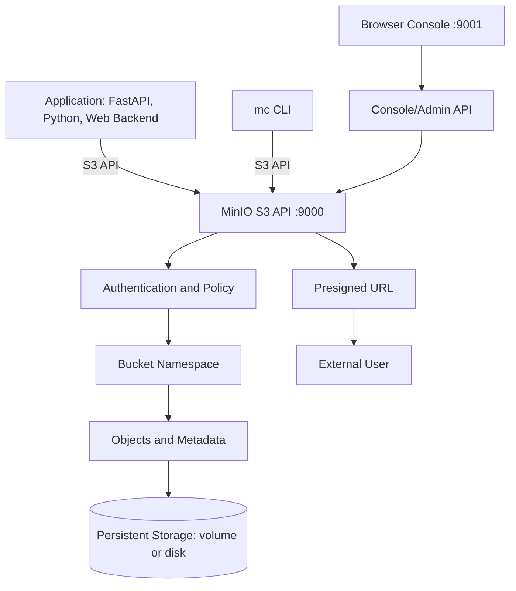
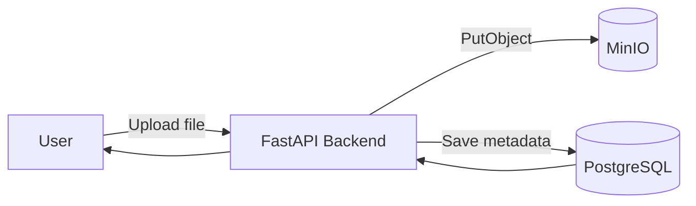
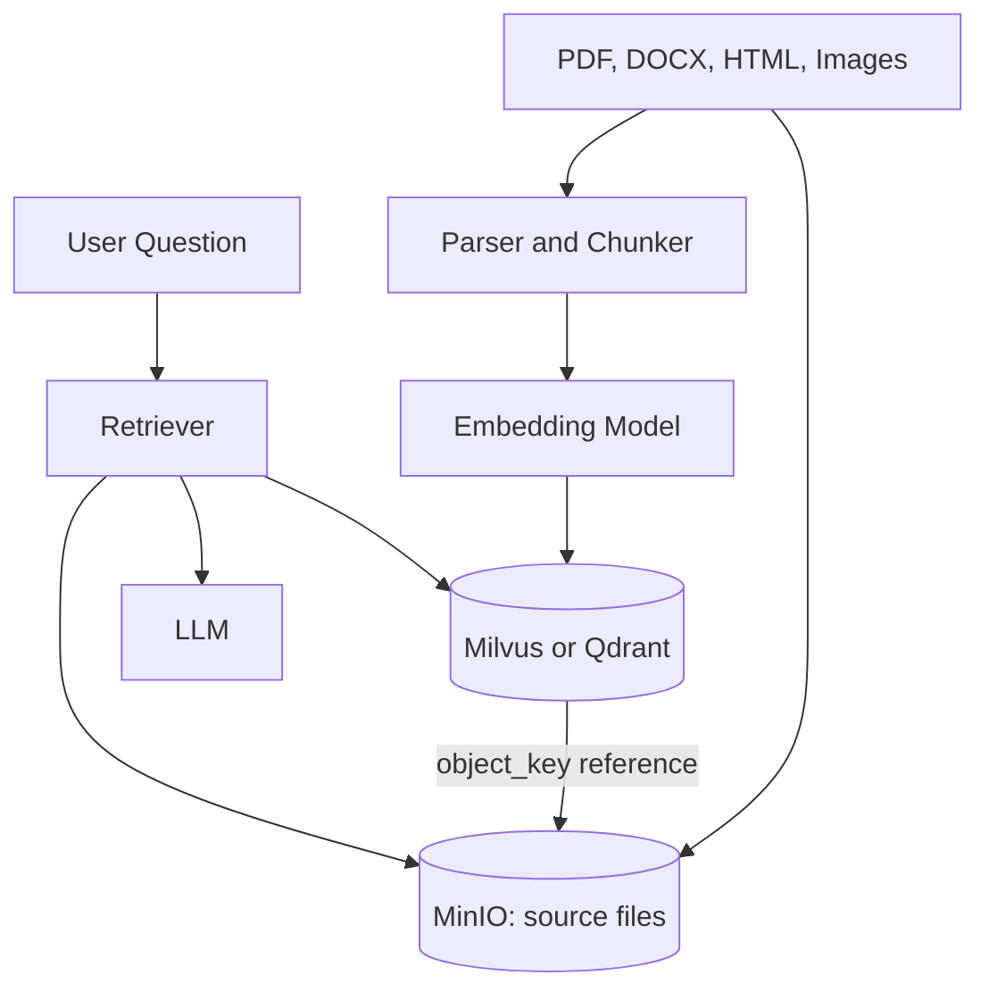
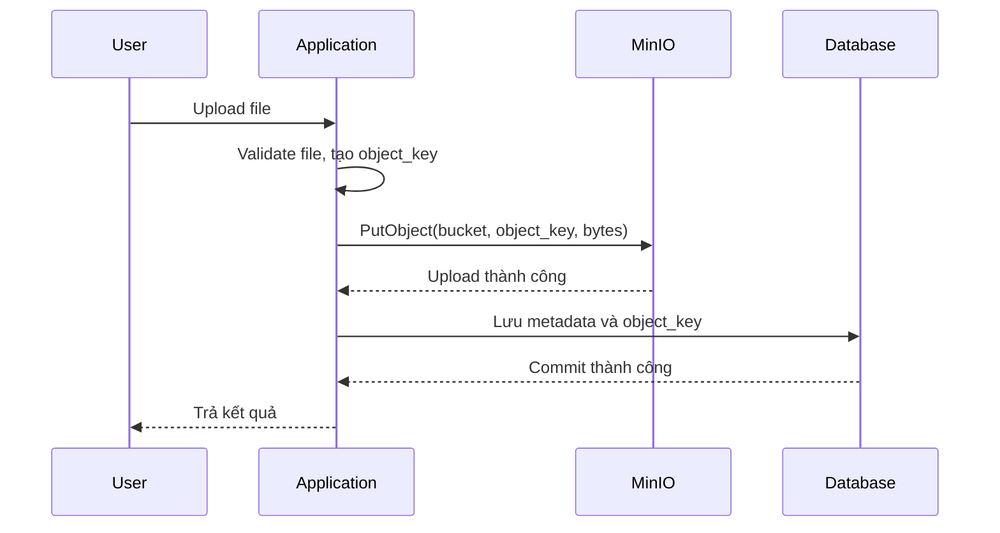
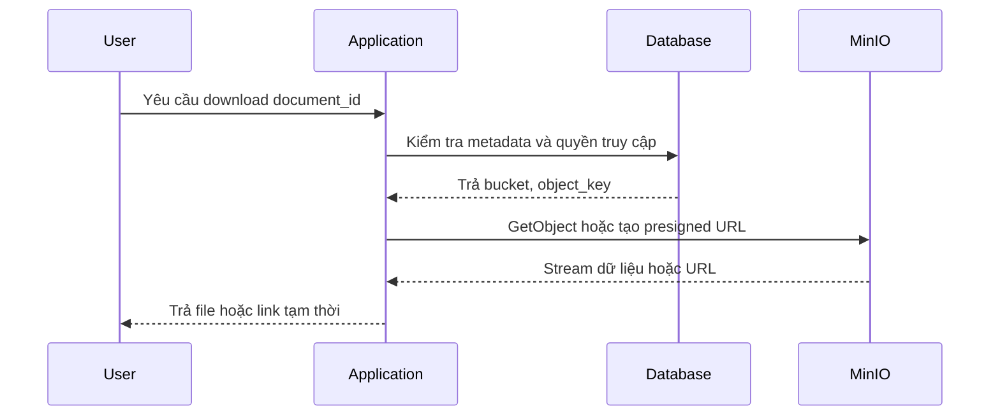
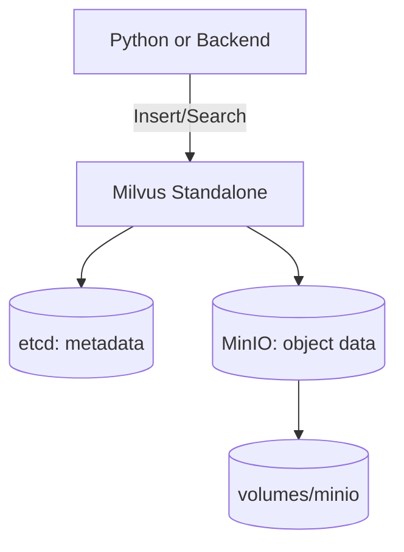

# MinIO Object Storage: Cơ sở lý thuyết, kiến trúc và thực hành

## 1. Mục tiêu tài liệu

Tài liệu này trình bày MinIO theo hướng lý thuyết kết hợp thực hành, giúp người học nắm được:

- MinIO là gì và vì sao object storage quan trọng trong hệ thống backend, data platform và AI hiện đại.
- Sự khác nhau giữa object storage, filesystem truyền thống và database.
- Các khái niệm cốt lõi như bucket, object, object key, metadata, tag, endpoint, access key, secret key và policy.
- Cách MinIO cung cấp API tương thích S3 để ứng dụng có thể upload, download, liệt kê và quản lý object.
- Cách chạy MinIO local bằng Docker và Docker Compose.
- Cách dùng MinIO Console, MinIO Client `mc` và Python SDK.
- Cách MinIO xuất hiện trong hệ sinh thái Milvus, đặc biệt trong setup local của repo này.
- Các lỗi thiết kế thường gặp khi dùng object storage và cách tránh.

Tài liệu này phù hợp để học nền tảng MinIO ở mức phát triển ứng dụng và vận hành local. Một số cấu hình nâng cao có thể thay đổi theo phiên bản MinIO, AIStor hoặc Docker image đang dùng, vì vậy khi triển khai production nên đối chiếu thêm với tài liệu chính thức.

## 2. Tổng quan về MinIO

MinIO là một hệ thống **object storage** hiệu năng cao, tương thích với Amazon S3 API. Thay vì lưu dữ liệu theo bảng như database hoặc theo thư mục/file như filesystem truyền thống, MinIO lưu dữ liệu thành các object trong bucket.

Object storage phù hợp với dữ liệu dạng file hoặc blob:

- Ảnh, video, audio.
- PDF, tài liệu Word, Excel.
- File dataset, file backup, file log.
- File embedding source trong hệ thống RAG.
- Segment data hoặc index file của hệ thống dữ liệu lớn.
- Artifact của pipeline machine learning.
- File người dùng upload trong web application.

Trong kiến trúc backend hiện đại, MinIO thường đóng vai trò lớp lưu trữ file bền vững. Database chỉ lưu metadata và đường dẫn tham chiếu, còn dữ liệu lớn được đặt trong object storage.

Ví dụ trong hệ thống quản lý tài liệu:

```text
PostgreSQL:
  document_id
  title
  owner_id
  object_key
  created_at

MinIO:
  bucket: documents
  object: users/42/contracts/contract-a.pdf
```

Cách thiết kế này giúp database gọn hơn, trong khi file lớn được quản lý bởi hệ thống chuyên lưu object.

MinIO thường được dùng cho:

- Lưu file upload của ứng dụng web và mobile.
- Lưu dữ liệu gốc cho pipeline xử lý ảnh, video, audio hoặc NLP.
- Lưu tài liệu nguồn trong hệ thống RAG.
- Lưu backup database hoặc export dữ liệu.
- Là object storage nội bộ cho hệ thống như Milvus.
- Mô phỏng S3 local khi phát triển ứng dụng trước khi deploy lên cloud.

### 2.1. Đặc điểm nổi bật

| Đặc điểm | Ý nghĩa |
| --- | --- |
| S3-compatible API | Ứng dụng có thể dùng SDK S3 hoặc MinIO SDK để thao tác object. |
| Self-hosted | Có thể chạy local, trong Docker, trên server riêng hoặc Kubernetes. |
| Console UI | Có giao diện web để tạo bucket, upload, download và quản lý access. |
| `mc` CLI | Có công cụ dòng lệnh để quản lý bucket, object, policy và admin task. |
| Phù hợp file lớn | Lưu ảnh, video, PDF, dataset, model artifact hoặc backup tốt hơn database. |
| Metadata và tag | Object có thể kèm metadata, tag để mô tả hoặc phục vụ lifecycle. |
| Presigned URL | Có thể tạo URL tạm thời để upload/download mà không lộ secret key. |
| Versioning và lifecycle | Hỗ trợ lưu nhiều phiên bản object và tự động dọn dữ liệu theo rule. |
| Tích hợp tốt với hệ sinh thái dữ liệu | Được dùng bởi Milvus, Spark, lakehouse, backup tool và nhiều SDK S3. |

## 3. Cơ sở lý thuyết

### 3.1. Object storage

Object storage lưu dữ liệu dưới dạng các object độc lập. Mỗi object thường gồm:

- Dữ liệu nhị phân hoặc text của file.
- Tên object, còn gọi là object key.
- Metadata hệ thống như kích thước, thời gian cập nhật, ETag.
- Metadata người dùng tự khai báo.
- Tag hoặc thuộc tính bổ sung.

Khác với filesystem, object storage không thật sự có thư mục lồng nhau theo nghĩa truyền thống. Các "thư mục" thường chỉ là prefix trong object key.

Ví dụ:

```text
documents/2026/report.pdf
documents/2026/slides.pdf
images/products/laptop-01.png
```

Ở đây `documents/2026/` và `images/products/` là prefix. Object storage nhìn chúng như chuỗi key có dấu `/`.

### 3.2. Bucket

Bucket là vùng chứa object ở cấp cao nhất. Có thể hiểu bucket gần giống một thư mục gốc hoặc một namespace.

Ví dụ:

| Bucket | Dữ liệu |
| --- | --- |
| `documents` | File PDF, Word, tài liệu người dùng upload. |
| `images` | Ảnh sản phẩm, ảnh đại diện, ảnh minh họa. |
| `videos` | Video người dùng upload hoặc video pipeline xử lý. |
| `backups` | File backup database hoặc file export. |
| `milvus-bucket` | Dữ liệu nội bộ của Milvus. |

Bucket nên được đặt tên rõ ràng theo domain dữ liệu. Không nên tạo bucket quá nhỏ lẻ cho từng file hoặc từng request.

### 3.3. Object key

Object key là tên định danh object trong bucket. Trong ứng dụng, object key rất quan trọng vì nó là đường dẫn logic để truy xuất file.

Ví dụ:

```text
users/42/avatar.png
courses/database/slides/week-01.pdf
rag/sources/postgresql/chapter-03.pdf
exports/orders/2026-06-09.csv
```

Một object được xác định bởi cặp:

```text
bucket + object_key
```

Ví dụ:

```text
bucket: documents
object_key: courses/database/slides/week-01.pdf
```

Khi thiết kế object key, nên ưu tiên:

- Dễ đọc và dễ debug.
- Có cấu trúc prefix theo tenant, user, loại dữ liệu hoặc thời gian.
- Tránh chứa thông tin nhạy cảm không cần thiết.
- Tránh phụ thuộc vào tên file gốc nếu tên file có thể trùng.

### 3.4. Metadata và tag

Metadata là thông tin mô tả object. Ví dụ:

| Metadata | Ý nghĩa |
| --- | --- |
| `Content-Type` | Kiểu file như `application/pdf`, `image/png`, `video/mp4`. |
| `Content-Length` | Kích thước object. |
| `ETag` | Dấu định danh nội dung hoặc phiên bản upload. |
| `x-amz-meta-source` | Metadata tùy chỉnh, ví dụ nguồn dữ liệu. |
| `x-amz-meta-owner-id` | Metadata tùy chỉnh, ví dụ người sở hữu. |

Tag cũng là key-value nhưng thường dùng cho lifecycle, phân loại hoặc quản trị:

```text
project=rag-demo
env=dev
type=source-document
```

Trong nhiều ứng dụng, metadata quan trọng vẫn nên lưu ở database để dễ query. Metadata trong MinIO phù hợp cho thông tin đi kèm object, không thay thế hoàn toàn database.

### 3.5. S3-compatible API

MinIO tương thích với S3 API, nghĩa là nhiều thao tác quen thuộc có thể dùng chung khái niệm với Amazon S3:

| Thao tác | Ý nghĩa |
| --- | --- |
| `CreateBucket` | Tạo bucket. |
| `PutObject` | Upload object. |
| `GetObject` | Download object. |
| `ListObjects` | Liệt kê object theo bucket hoặc prefix. |
| `RemoveObject` | Xóa object. |
| `PresignedGetObject` | Tạo link download tạm thời. |
| `PresignedPutObject` | Tạo link upload tạm thời. |

Nhờ tương thích S3, ứng dụng có thể:

- Chạy local với MinIO.
- Sau này chuyển sang S3 hoặc object storage tương thích S3 khác dễ hơn.
- Dùng nhiều SDK sẵn có trong Python, JavaScript, Java, Go hoặc .NET.

### 3.6. API port và Console port

Khi chạy MinIO local, thường có hai port:

| Port | Vai trò |
| --- | --- |
| `9000` | S3 API endpoint, dùng cho SDK, `mc`, backend. |
| `9001` | Web Console, dùng để mở giao diện quản trị trên trình duyệt. |

Ví dụ:

```text
S3 API endpoint: http://localhost:9000
Console UI:      http://localhost:9001
```

Lỗi phổ biến là dùng nhầm port `9001` cho SDK. SDK phải kết nối vào API port `9000`, không phải Console port.

### 3.7. Access key và secret key

MinIO dùng cặp credential để xác thực:

```text
access key: tên định danh
secret key: mật khẩu bí mật
```

Trong môi trường học tập local, nhiều ví dụ dùng:

```text
minioadmin:minioadmin
```

Tuy nhiên không nên dùng credential mặc định trong production. Khi tự chạy MinIO mới, nên dùng biến môi trường:

```text
MINIO_ROOT_USER
MINIO_ROOT_PASSWORD
```

với giá trị dài, khó đoán và không commit vào Git.

### 3.8. Versioning và lifecycle

Versioning cho phép bucket lưu nhiều phiên bản của cùng một object key. Điều này hữu ích khi:

- Người dùng upload nhầm file và cần khôi phục phiên bản cũ.
- Pipeline ghi đè dữ liệu nhưng vẫn muốn giữ lịch sử.
- Cần bảo vệ dữ liệu khỏi xóa nhầm.

Lifecycle rule giúp tự động quản lý vòng đời object, ví dụ:

- Xóa object tạm sau 7 ngày.
- Xóa old version sau 30 ngày.
- Dọn multipart upload chưa hoàn tất.
- Chuyển dữ liệu sang tầng lưu trữ khác trong hệ thống lớn.

Với môi trường học tập, versioning và lifecycle chưa bắt buộc. Với production, chúng là phần quan trọng để kiểm soát chi phí và rủi ro mất dữ liệu.

## 4. Kiến trúc MinIO

### 4.1. Sơ đồ kiến trúc Mermaid



Kiến trúc trên cho thấy MinIO đứng giữa ứng dụng và lớp lưu trữ vật lý. Ứng dụng không cần biết file nằm cụ thể ở block nào trên disk. Ứng dụng chỉ cần biết endpoint, bucket và object key.

### 4.2. Các thành phần quan trọng

| Thành phần | Vai trò |
| --- | --- |
| MinIO Server | Process chính cung cấp S3-compatible API và Console. |
| S3 API | Cổng để backend, SDK hoặc `mc` thao tác object. |
| Console | Giao diện web để quản lý bucket, object, user, policy và cấu hình. |
| Bucket | Namespace chứa object. |
| Object | Dữ liệu được lưu, ví dụ PDF, ảnh, video hoặc file backup. |
| Object key | Tên logic của object trong bucket. |
| Metadata | Thông tin mô tả object. |
| Policy | Quyền truy cập vào bucket/object. |
| Volume/disk | Nơi dữ liệu thật sự được lưu trên máy host hoặc server. |

### 4.3. MinIO trong kiến trúc backend

Một kiến trúc upload file thường gặp:



Khi người dùng upload file:

1. Backend nhận file.
2. Backend tạo object key.
3. Backend upload file vào MinIO.
4. Backend lưu metadata vào PostgreSQL.
5. Khi cần hiển thị hoặc download, backend lấy metadata từ database và tạo URL hoặc stream file từ MinIO.

### 4.4. MinIO trong hệ thống AI và RAG

Trong hệ thống RAG, MinIO thường lưu tài liệu gốc, còn vector database lưu embedding và metadata truy vấn:



Thiết kế này giúp tách:

- File gốc: lưu trong MinIO.
- Metadata nghiệp vụ: lưu trong database.
- Vector embedding: lưu trong Milvus hoặc Qdrant.
- Nội dung truy xuất: lấy lại bằng `object_key` hoặc `document_id`.

## 5. Vòng đời xử lý dữ liệu

### 5.1. Luồng upload object



Điểm cần chú ý:

- Nên validate file trước khi upload.
- Nên giới hạn kích thước file.
- Nên đặt `Content-Type` đúng.
- Nên xử lý rollback logic nếu upload thành công nhưng ghi database thất bại.

### 5.2. Luồng download object



Không nên để client tự truy cập bucket private bằng credential root. Cách phổ biến hơn là backend kiểm tra quyền, sau đó:

- Stream file qua backend.
- Hoặc tạo presigned URL có thời hạn ngắn.

### 5.3. Luồng xóa object

Khi xóa dữ liệu, cần cân nhắc thứ tự:

1. Kiểm tra quyền xóa.
2. Xóa metadata trong database hoặc đánh dấu `deleted`.
3. Xóa object trong MinIO.
4. Ghi log/audit nếu dữ liệu quan trọng.

Nếu bucket bật versioning, thao tác xóa có thể tạo delete marker thay vì xóa vật lý ngay. Điều này giúp khôi phục nhưng cũng làm tăng dung lượng nếu không có lifecycle rule.

## 6. Các khái niệm cốt lõi

### 6.1. Bucket

Bucket là đơn vị tổ chức dữ liệu lớn nhất. Một bucket có thể chứa nhiều object và prefix.

Ví dụ tạo bucket theo domain:

```text
documents
images
videos
backups
rag-sources
```

Không nên tạo bucket cho từng user nếu không có lý do vận hành rõ ràng. Với ứng dụng nhiều user, thường dùng một bucket và prefix theo user:

```text
documents/users/1/file-a.pdf
documents/users/2/file-b.pdf
```

### 6.2. Object

Object là đơn vị dữ liệu được lưu trong MinIO. Object có thể là:

- File nhỏ vài KB.
- Ảnh vài MB.
- Video vài GB.
- Dataset hoặc backup lớn hơn.

Ứng dụng thao tác object qua API thay vì đọc ghi trực tiếp vào filesystem của MinIO.

### 6.3. Prefix

Prefix là phần đầu của object key, thường dùng để mô phỏng thư mục.

Ví dụ:

```text
courses/database/week-01/lecture.pdf
courses/database/week-02/lecture.pdf
```

Prefix `courses/database/` giúp liệt kê toàn bộ tài liệu của môn database.

### 6.4. Endpoint

Endpoint là địa chỉ API mà SDK hoặc CLI dùng để kết nối.

Với MinIO local:

```text
localhost:9000
```

Với Docker Compose nội bộ, service khác trong cùng network có thể dùng tên service:

```text
minio:9000
```

Đây là lý do trong Milvus Docker Compose, Milvus dùng:

```text
MINIO_ADDRESS: minio:9000
```

chứ không dùng `localhost:9000`. Bên trong container, `localhost` là chính container đó, không phải máy host.

### 6.5. Credential

Credential gồm access key và secret key. Trong code Python local:

```python
access_key = "minioadmin"
secret_key = "minioadmin"
```

Trong production:

- Không hard-code credential trong source code.
- Không commit `.env` chứa secret.
- Dùng biến môi trường, secret manager hoặc Docker/Kubernetes secrets.
- Tạo user/policy riêng cho từng ứng dụng thay vì dùng root credential.

### 6.6. Policy

Policy quyết định ai được làm gì với bucket/object. Ví dụ:

| Policy | Ý nghĩa |
| --- | --- |
| Read-only | Chỉ đọc object. |
| Write-only | Chỉ upload, không đọc. |
| Read-write | Đọc và ghi object. |
| Admin | Quản trị bucket, user, policy. |

Trong ứng dụng thật, backend không nên dùng root account. Nên tạo access key riêng với quyền tối thiểu cần thiết.

### 6.7. Presigned URL

Presigned URL là URL tạm thời có chữ ký. Người nhận URL có thể upload hoặc download object trong thời hạn nhất định mà không cần biết secret key.

Ví dụ use case:

- Người dùng tải file PDF trong 10 phút.
- Frontend upload trực tiếp ảnh lên MinIO mà không đi qua backend.
- Chia sẻ file tạm thời cho một service khác.

Presigned URL nên có thời hạn ngắn và chỉ cấp sau khi backend đã kiểm tra quyền.

## 7. Chạy MinIO bằng Docker

### 7.1. Chạy nhanh bằng `docker run`

Ví dụ chạy MinIO local:

```bash
docker run -d \
  --name minio-demo \
  -p 9000:9000 \
  -p 9001:9001 \
  -e MINIO_ROOT_USER=minioadmin \
  -e MINIO_ROOT_PASSWORD=minioadmin \
  -v minio-data:/data \
  minio/minio:RELEASE.2024-12-18T13-15-44Z \
  server /data --console-address ":9001"
```

Kiểm tra container:

```bash
docker ps
docker logs minio-demo
```

Mở Console:

```text
http://localhost:9001
```

Đăng nhập local:

```text
Username: minioadmin
Password: minioadmin
```

Lưu ý: credential mặc định chỉ nên dùng cho học tập local.

### 7.2. Chạy bằng Docker Compose

Ví dụ file `docker-compose.yml` tối giản:

```yaml
services:
  minio:
    image: minio/minio:RELEASE.2024-12-18T13-15-44Z
    container_name: minio-demo
    environment:
      MINIO_ROOT_USER: minioadmin
      MINIO_ROOT_PASSWORD: minioadmin
    ports:
      - "9000:9000"
      - "9001:9001"
    volumes:
      - minio_data:/data
    command: server /data --console-address ":9001"
    healthcheck:
      test: ["CMD", "curl", "-f", "http://localhost:9000/minio/health/live"]
      interval: 30s
      timeout: 20s
      retries: 3

volumes:
  minio_data:
```

Chạy:

```bash
docker compose up -d
docker compose ps
```

Dừng:

```bash
docker compose down
```

Nếu muốn xóa luôn dữ liệu volume:

```bash
docker compose down -v
```

Lệnh `down -v` sẽ xóa dữ liệu MinIO trong volume, nên chỉ dùng khi chắc chắn không cần dữ liệu.

### 7.3. MinIO trong Milvus demo của repo này

Trong repo này, MinIO xuất hiện trong:

```text
vector database/milvus-demo/docker-compose.yml
```

Service MinIO:

```yaml
minio:
  container_name: milvus-minio
  image: minio/minio:RELEASE.2024-12-18T13-15-44Z
  environment:
    MINIO_ACCESS_KEY: minioadmin
    MINIO_SECRET_KEY: minioadmin
  ports:
    - "9001:9001"
    - "9000:9000"
  volumes:
    - ${DOCKER_VOLUME_DIRECTORY:-.}/volumes/minio:/minio_data
  command: minio server /minio_data --console-address ":9001"
  healthcheck:
    test: ["CMD", "curl", "-f", "http://localhost:9000/minio/health/live"]
    interval: 30s
    timeout: 20s
    retries: 3
```

Trong cùng file, Milvus kết nối đến MinIO bằng:

```yaml
environment:
  MINIO_ADDRESS: minio:9000
```

Ý nghĩa:

- `9000` là port S3 API cho Milvus và SDK.
- `9001` là port Console để mở bằng trình duyệt.
- Dữ liệu MinIO được mount vào `volumes/minio` trong thư mục demo.
- `minio:9000` là địa chỉ nội bộ trong Docker network, không phải địa chỉ từ máy host.

Khi chạy Milvus demo, có thể mở MinIO Console:

```text
http://localhost:9001
```

Credential trong demo:

```text
minioadmin:minioadmin
```

Trong production nên đổi credential và dùng biến `MINIO_ROOT_USER`, `MINIO_ROOT_PASSWORD` hoặc cơ chế secret phù hợp với môi trường triển khai.

### 7.4. Kiểm tra health

MinIO có endpoint health thường dùng trong Docker healthcheck:

```text
http://localhost:9000/minio/health/live
```

Kiểm tra bằng curl:

```bash
curl http://localhost:9000/minio/health/live
```

Nếu MinIO đang chạy tốt, request sẽ trả về HTTP status thành công.

## 8. Dùng MinIO Console

MinIO Console là giao diện web để thao tác nhanh trong môi trường học tập hoặc quản trị.

Mở:

```text
http://localhost:9001
```

Các thao tác thường dùng:

- Tạo bucket.
- Upload object.
- Download object.
- Xóa object.
- Xem metadata.
- Tạo access key.
- Quản lý user và policy.
- Bật versioning hoặc lifecycle rule nếu cần.

Console rất tiện để debug, nhưng trong ứng dụng thật, backend nên thao tác qua SDK hoặc S3 API thay vì phụ thuộc vào thao tác thủ công trên UI.

## 9. Dùng MinIO Client `mc`

`mc` là công cụ dòng lệnh của MinIO. Nó giúp thao tác với MinIO hoặc S3-compatible storage trực tiếp từ terminal.

### 9.1. Cấu hình alias

Sau khi MinIO chạy ở `localhost:9000`, cấu hình alias:

```bash
mc alias set local http://localhost:9000 minioadmin minioadmin
```

Kiểm tra:

```bash
mc admin info local
```

### 9.2. Tạo bucket

```bash
mc mb local/documents
```

Liệt kê bucket:

```bash
mc ls local
```

### 9.3. Upload file

Upload một file:

```bash
mc cp docs/minio.md local/documents/docs/minio.md
```

Upload cả thư mục:

```bash
mc cp --recursive docs/ local/documents/docs/
```

### 9.4. Liệt kê object

```bash
mc ls local/documents
mc ls --recursive local/documents
```

### 9.5. Download object

```bash
mc cp local/documents/docs/minio.md ./minio-copy.md
```

### 9.6. Xóa object và bucket

Xóa một object:

```bash
mc rm local/documents/docs/minio.md
```

Xóa bucket rỗng:

```bash
mc rb local/documents
```

Không nên xóa bucket hoặc prefix khi chưa kiểm tra kỹ, vì object storage thường chứa dữ liệu gốc quan trọng.

## 10. Dùng MinIO với Python

### 10.1. Cài Python SDK

```bash
pip install minio
```

### 10.2. Kết nối MinIO local

```python
from minio import Minio

client = Minio(
    "localhost:9000",
    access_key="minioadmin",
    secret_key="minioadmin",
    secure=False,
)
```

Trong local HTTP, dùng `secure=False`. Nếu endpoint dùng HTTPS, đặt `secure=True`.

### 10.3. Tạo bucket và upload file

```python
from minio import Minio
from minio.error import S3Error


def main():
    client = Minio(
        "localhost:9000",
        access_key="minioadmin",
        secret_key="minioadmin",
        secure=False,
    )

    bucket_name = "documents"
    object_name = "examples/hello.txt"
    file_path = "hello.txt"

    if not client.bucket_exists(bucket_name):
        client.make_bucket(bucket_name)

    client.fput_object(
        bucket_name=bucket_name,
        object_name=object_name,
        file_path=file_path,
        content_type="text/plain",
    )

    print("Uploaded:", object_name)


if __name__ == "__main__":
    try:
        main()
    except S3Error as exc:
        print("MinIO error:", exc)
```

Tạo file mẫu:

```bash
echo "Hello MinIO" > hello.txt
python upload_minio.py
```

### 10.4. Download object

```python
from minio import Minio

client = Minio(
    "localhost:9000",
    access_key="minioadmin",
    secret_key="minioadmin",
    secure=False,
)

client.fget_object(
    bucket_name="documents",
    object_name="examples/hello.txt",
    file_path="hello-downloaded.txt",
)

print("Downloaded")
```

### 10.5. Tạo presigned URL

```python
from datetime import timedelta
from minio import Minio

client = Minio(
    "localhost:9000",
    access_key="minioadmin",
    secret_key="minioadmin",
    secure=False,
)

url = client.presigned_get_object(
    bucket_name="documents",
    object_name="examples/hello.txt",
    expires=timedelta(minutes=10),
)

print(url)
```

Presigned URL phù hợp khi frontend hoặc user cần tải file trực tiếp trong thời gian ngắn.

## 11. MinIO trong ứng dụng FastAPI

### 11.1. Cấu hình bằng biến môi trường

Ví dụ `.env`:

```text
MINIO_ENDPOINT=localhost:9000
MINIO_ACCESS_KEY=minioadmin
MINIO_SECRET_KEY=minioadmin
MINIO_SECURE=false
MINIO_BUCKET=documents
```

Không nên hard-code credential trong source code. Với production, credential nên được cấp qua secret manager, Docker secret hoặc biến môi trường của server.

### 11.2. Service upload file

Ví dụ service đơn giản:

```python
from minio import Minio


class ObjectStorageService:
    def __init__(self, client: Minio, bucket_name: str):
        self.client = client
        self.bucket_name = bucket_name

    def ensure_bucket(self):
        if not self.client.bucket_exists(self.bucket_name):
            self.client.make_bucket(self.bucket_name)

    def upload_file(self, object_name: str, file_path: str, content_type: str):
        self.ensure_bucket()
        return self.client.fput_object(
            bucket_name=self.bucket_name,
            object_name=object_name,
            file_path=file_path,
            content_type=content_type,
        )
```

Trong FastAPI, endpoint nên:

- Validate file type.
- Validate file size.
- Tạo object key riêng.
- Upload vào MinIO.
- Lưu metadata vào database.
- Trả về `document_id`, không nhất thiết trả trực tiếp credential hoặc internal path.

### 11.3. Thiết kế metadata database

Ví dụ bảng `documents`:

```sql
CREATE TABLE documents (
    id UUID PRIMARY KEY,
    owner_id UUID NOT NULL,
    bucket_name TEXT NOT NULL,
    object_key TEXT NOT NULL,
    original_filename TEXT NOT NULL,
    content_type TEXT NOT NULL,
    size_bytes BIGINT NOT NULL,
    created_at TIMESTAMP NOT NULL DEFAULT now()
);
```

Ứng dụng truy vấn database để biết file nằm ở đâu, sau đó dùng MinIO để lấy nội dung file.

## 12. MinIO và Milvus

Milvus dùng object storage để lưu segment data, index file và một số dữ liệu nội bộ khác. Trong setup standalone local, MinIO thường chạy cùng Milvus và etcd.

Sơ đồ:



Trong setup này:

- Ứng dụng không cần thao tác trực tiếp với MinIO để dùng Milvus.
- Milvus tự dùng MinIO làm storage backend.
- Nếu xóa dữ liệu MinIO của Milvus, dữ liệu vector/index có thể hỏng hoặc mất.
- Không nên dùng chung bucket/dữ liệu MinIO nội bộ của Milvus cho file upload của ứng dụng nếu chưa hiểu rõ cấu trúc.

Nên tách:

| Mục đích | Khuyến nghị |
| --- | --- |
| Storage nội bộ của Milvus | Để Milvus quản lý riêng. |
| File upload của ứng dụng | Dùng bucket riêng, credential riêng. |
| Tài liệu nguồn RAG | Dùng bucket riêng như `rag-sources`. |
| Backup | Dùng bucket riêng như `backups`. |

## 13. So sánh MinIO với các hệ lưu trữ khác

### 13.1. MinIO và filesystem

| Tiêu chí | Filesystem | MinIO |
| --- | --- | --- |
| Cách truy cập | Đường dẫn local như `C:\data\a.pdf` hoặc `/data/a.pdf` | HTTP S3 API |
| Phù hợp | Ứng dụng đơn giản, một máy | Dịch vụ nhiều component, container, cloud-native |
| Chia sẻ giữa service | Khó hơn, cần mount chung | Dễ hơn qua API |
| Metadata object | Hạn chế | Có metadata/tag |
| Presigned URL | Không có sẵn | Có |
| Tương thích cloud | Thấp | Cao vì tương thích S3 |

Filesystem vẫn tốt cho file tạm hoặc project nhỏ. MinIO phù hợp hơn khi nhiều service cần truy cập file qua network, hoặc khi muốn mô phỏng S3 local.

### 13.2. MinIO và database

| Tiêu chí | Database | MinIO |
| --- | --- | --- |
| Dữ liệu phù hợp | Dữ liệu có cấu trúc, cần query | File/blob lớn |
| Query phức tạp | Mạnh | Không phải mục tiêu chính |
| Transaction nghiệp vụ | Mạnh | Không thay thế database |
| File lớn | Không tối ưu nếu lưu trực tiếp nhiều blob | Phù hợp hơn |
| Metadata | Rất phù hợp | Có nhưng không thay thế query database |

Thiết kế thường dùng:

```text
Database lưu metadata.
MinIO lưu file.
Vector database lưu embedding.
```

### 13.3. MinIO và Amazon S3

| Tiêu chí | MinIO | Amazon S3 |
| --- | --- | --- |
| Triển khai | Tự host hoặc chạy local | Dịch vụ cloud managed |
| API | Tương thích S3 | S3 gốc |
| Phù hợp local development | Rất tốt | Cần cloud account/network |
| Vận hành production | Tự quản lý | AWS quản lý phần lớn |
| Chi phí | Phụ thuộc hạ tầng tự chạy | Theo giá AWS |

MinIO rất hữu ích khi muốn phát triển local nhưng vẫn giữ kiến trúc gần với S3.

## 14. Thiết kế dữ liệu trong MinIO

### 14.1. Chọn bucket

Nên chọn bucket theo domain hoặc vòng đời dữ liệu:

```text
documents
images
videos
rag-sources
exports
backups
```

Tránh tạo bucket quá nhiều theo từng user/request vì khó quản lý policy và lifecycle.

### 14.2. Thiết kế object key

Object key nên có cấu trúc:

```text
{domain}/{tenant_id}/{entity_id}/{filename}
```

Ví dụ:

```text
documents/tenant-01/users/user-42/report.pdf
images/products/product-100/main.png
rag-sources/course-database/chapter-01.pdf
exports/orders/2026/06/orders-2026-06-09.csv
```

Nếu file có thể trùng tên, nên thêm UUID:

```text
documents/user-42/550e8400-e29b-41d4-a716-446655440000-report.pdf
```

### 14.3. Lưu metadata ở đâu

Metadata nên chia làm hai nhóm:

| Loại metadata | Nơi lưu phù hợp |
| --- | --- |
| Metadata cần query, filter, phân quyền | Database |
| Metadata gắn với file như content type, checksum, source | MinIO object metadata |
| Metadata phục vụ retrieval như document_id, chunk_id | Database hoặc vector database |
| Metadata phục vụ lifecycle | Object tag |

Không nên dựa hoàn toàn vào việc list object trong MinIO để làm chức năng tìm kiếm nghiệp vụ. Database vẫn phù hợp hơn cho query, filter, pagination và phân quyền.

### 14.4. Quyền truy cập

Nguyên tắc cơ bản:

- Bucket mặc định nên private.
- Backend kiểm tra quyền trước khi cấp link.
- Dùng presigned URL thay vì public bucket nếu file không thật sự công khai.
- Tạo credential riêng cho từng service.
- Cấp quyền tối thiểu cần thiết.

Ví dụ:

| Service | Quyền |
| --- | --- |
| API upload | Read-write trên bucket `documents`. |
| Worker OCR | Read trên `documents`, write trên `processed-documents`. |
| Public CDN sync | Read-only trên bucket public asset. |
| Backup job | Write trên `backups`. |

## 15. Tối ưu và vận hành

### 15.1. Không lưu file lớn trong Git hoặc database

File lớn như video, dataset, PDF scan, model artifact nên đưa vào object storage. Git chỉ nên lưu source code, script, cấu hình mẫu và tài liệu nhỏ.

### 15.2. Dùng volume bền vững

Khi chạy Docker, phải mount volume cho dữ liệu:

```yaml
volumes:
  - minio_data:/data
```

Nếu không mount volume, dữ liệu có thể mất khi container bị xóa.

### 15.3. Theo dõi dung lượng

Object storage có thể tăng rất nhanh vì:

- File upload lớn.
- Versioning giữ nhiều phiên bản.
- Multipart upload chưa hoàn tất.
- Backup không có lifecycle.
- Log hoặc export sinh định kỳ.

Nên có quy trình kiểm tra dung lượng và lifecycle rule cho dữ liệu tạm.

### 15.4. Đặt content type đúng

Khi upload, nên đặt `content_type`:

```text
application/pdf
image/png
video/mp4
text/csv
application/json
```

Nếu content type sai, trình duyệt hoặc downstream service có thể xử lý file không đúng.

### 15.5. Tách dữ liệu tạm và dữ liệu lâu dài

Nên tách bucket hoặc prefix:

```text
tmp/
uploads/
processed/
backups/
```

Dữ liệu tạm có thể có lifecycle ngắn hơn. Dữ liệu lâu dài cần backup, policy và retention cẩn thận hơn.

## 16. Các lỗi thiết kế thường gặp

### 16.1. Dùng nhầm port Console thay vì API

SDK và `mc` phải dùng:

```text
localhost:9000
```

Không dùng:

```text
localhost:9001
```

Port `9001` dành cho trình duyệt mở Console.

### 16.2. Dùng `localhost` sai trong Docker Compose

Trong container, `localhost` là container hiện tại. Nếu backend container muốn gọi MinIO container, cần dùng tên service:

```text
minio:9000
```

Từ máy host thì dùng:

```text
localhost:9000
```

### 16.3. Không mount volume

Nếu chạy container mà không mount volume, dữ liệu có thể biến mất khi container bị xóa hoặc tạo lại.

Luôn kiểm tra phần:

```yaml
volumes:
  - minio_data:/data
```

hoặc bind mount:

```yaml
volumes:
  - ./volumes/minio:/data
```

### 16.4. Lưu credential mặc định trong production

Credential `minioadmin:minioadmin` chỉ phù hợp học local. Production phải dùng secret mạnh và user/policy riêng.

### 16.5. Public bucket quá rộng

Nếu đặt bucket public, bất kỳ ai có link phù hợp có thể truy cập dữ liệu. Với dữ liệu người dùng, tài liệu nội bộ hoặc file nhạy cảm, nên để bucket private và cấp presigned URL ngắn hạn.

### 16.6. Lưu metadata nghiệp vụ chỉ trong object key

Không nên chỉ dựa vào object key để biết owner, quyền, trạng thái xử lý hoặc loại tài liệu. Các thông tin này nên nằm trong database để query và kiểm soát quyền rõ ràng.

### 16.7. Xóa dữ liệu MinIO của hệ thống khác

Trong Milvus demo, MinIO lưu dữ liệu nội bộ của Milvus. Nếu xóa `volumes/minio` hoặc bucket/object bên trong khi Milvus đang dùng, collection hoặc index có thể bị hỏng.

### 16.8. Không xử lý lỗi upload và database transaction

Nếu upload lên MinIO thành công nhưng lưu metadata vào database thất bại, hệ thống sẽ có object mồ côi. Nên có cơ chế cleanup hoặc background job dọn object không có metadata.

### 16.9. Không giới hạn file upload

Nếu không giới hạn kích thước và loại file, người dùng có thể upload file quá lớn hoặc file không phù hợp, làm đầy storage nhanh.

## 17. Bài tập thực hành

### Bài 1: Chạy MinIO local

Chạy MinIO bằng Docker, mở Console ở:

```text
http://localhost:9001
```

Tạo bucket tên `documents`.

### Bài 2: Upload bằng Console

Upload một file PDF hoặc TXT vào bucket `documents`. Kiểm tra object key và metadata trong Console.

### Bài 3: Upload bằng `mc`

Cấu hình alias:

```bash
mc alias set local http://localhost:9000 minioadmin minioadmin
```

Upload thư mục `docs`:

```bash
mc cp --recursive docs/ local/documents/docs/
```

Liệt kê:

```bash
mc ls --recursive local/documents
```

### Bài 4: Upload bằng Python

Viết script Python tạo bucket nếu chưa có, sau đó upload file `hello.txt` vào object key:

```text
examples/hello.txt
```

### Bài 5: Thiết kế metadata

Thiết kế bảng `documents` trong PostgreSQL để lưu:

- `id`
- `owner_id`
- `bucket_name`
- `object_key`
- `original_filename`
- `content_type`
- `size_bytes`
- `created_at`

Giải thích vì sao không nên chỉ lưu file trong database.

### Bài 6: Liên hệ với Milvus

Mở file:

```text
vector database/milvus-demo/docker-compose.yml
```

Xác định:

- Service MinIO tên gì.
- Port API là port nào.
- Port Console là port nào.
- Milvus kết nối đến MinIO bằng biến môi trường nào.

## 18. Kết luận

MinIO là object storage phù hợp cho các hệ thống cần lưu file, blob, tài liệu, media, dataset hoặc backup theo cách tương thích S3. Trong kiến trúc backend, MinIO không thay thế database mà bổ sung cho database: database lưu metadata và quan hệ nghiệp vụ, còn MinIO lưu nội dung file lớn.

Về mặt kỹ thuật, MinIO xoay quanh các khái niệm bucket, object, object key, metadata, policy, credential và S3 API. Khi kết hợp với Docker, MinIO rất tiện để học và phát triển local vì có thể chạy nhanh, có Console để quan sát và có SDK/CLI để tích hợp với code.

Trong repo này, MinIO đặc biệt quan trọng trong Milvus demo vì Milvus dùng MinIO làm object storage cho dữ liệu nội bộ. Vì vậy khi vận hành Milvus local, cần hiểu rằng MinIO không chỉ là công cụ upload file, mà còn có thể là một thành phần hạ tầng mà database/vector database phụ thuộc vào.

Khi thiết kế hệ thống với MinIO, cần chú ý đến bucket naming, object key, quyền truy cập, credential, volume bền vững, lifecycle và cách đồng bộ metadata với database. Đây là các yếu tố quyết định hệ thống lưu trữ file có dễ bảo trì, an toàn và mở rộng được hay không.

## 19. Tài liệu tham khảo

- MinIO Documentation: https://docs.min.io/
- MinIO Console: https://docs.min.io/community/minio-object-store/administration/minio-console.html
- MinIO Client Command Reference: https://docs.min.io/aistor/reference/cli/command-quick-reference/
- MinIO `mc cp`: https://docs.min.io/aistor/reference/cli/mc-cp/
- MinIO Python SDK: https://docs.min.io/aistor/developers/sdk/python/
- MinIO Python Client API Reference: https://docs.min.io/aistor/developers/sdk/python/api/
- MinIO Root Access Settings: https://docs.min.io/aistor/reference/aistor-server/settings/root-credentials/
- MinIO Objects and Versioning: https://docs.min.io/community/minio-object-store/administration/object-management.html
- Milvus Documentation: https://milvus.io/docs/
