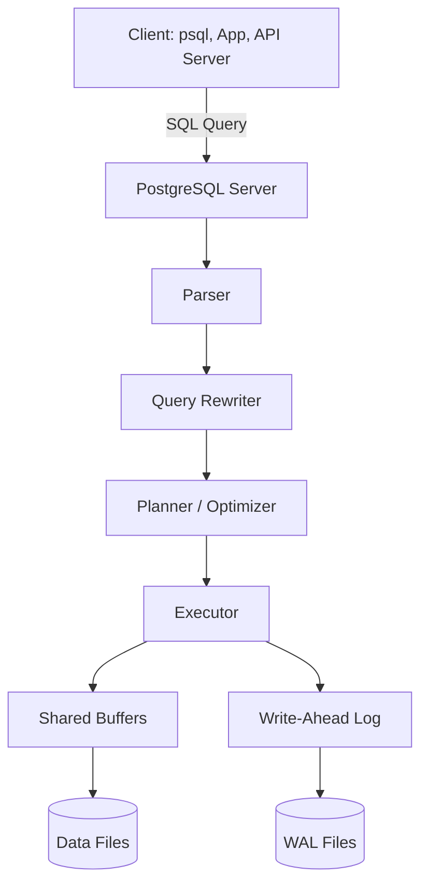
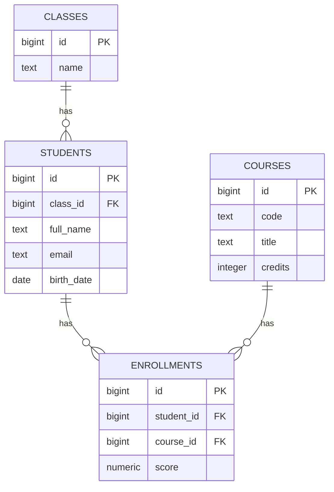

# PostgreSQL: Cơ sở lý thuyết, kiến trúc và thực hành

## 1. Mục tiêu tài liệu

Tài liệu này trình bày PostgreSQL theo hướng lý thuyết kết hợp thực hành, giúp người học nắm được:

- PostgreSQL là gì và vì sao nó được dùng rộng rãi trong hệ thống backend hiện đại.
- Các khái niệm cốt lõi như database, schema, table, row, column, primary key, foreign key, constraint và transaction.
- Cách viết các lệnh SQL cơ bản để tạo bảng, thêm dữ liệu, truy vấn, cập nhật và xóa dữ liệu.
- Cách thiết kế quan hệ giữa các bảng bằng khóa chính và khóa ngoại.
- Cách dùng join, aggregate, index, view và transaction trong bài toán thực tế.
- Cách kết nối PostgreSQL với ứng dụng Python/FastAPI ở mức cơ bản.
- Các lỗi thiết kế thường gặp và cách tránh khi học SQL.

Tài liệu này phù hợp để học nền tảng PostgreSQL. Một số tính năng nâng cao có thể thay đổi theo phiên bản, vì vậy khi làm dự án thực tế nên đối chiếu thêm với tài liệu chính thức của PostgreSQL đúng với phiên bản bạn đang cài.

## 2. Tổng quan về PostgreSQL

PostgreSQL là hệ quản trị cơ sở dữ liệu quan hệ mã nguồn mở. Nó lưu dữ liệu theo mô hình bảng, trong đó mỗi bảng gồm các cột và các dòng. PostgreSQL dùng ngôn ngữ SQL để định nghĩa cấu trúc dữ liệu, truy vấn dữ liệu và quản lý quyền truy cập.

PostgreSQL thường được dùng cho:

- Backend của web application và mobile application.
- Hệ thống quản lý sinh viên, đơn hàng, sản phẩm, người dùng, thanh toán.
- Data warehouse vừa và nhỏ.
- Hệ thống cần transaction mạnh và tính nhất quán dữ liệu cao.
- Ứng dụng GIS với PostGIS.
- Ứng dụng AI/RAG khi kết hợp với extension như `pgvector`.

### 2.1. Đặc điểm nổi bật

| Đặc điểm | Ý nghĩa |
| --- | --- |
| ACID transaction | Đảm bảo dữ liệu nhất quán khi có nhiều thao tác đọc ghi. |
| SQL mạnh | Hỗ trợ truy vấn phức tạp, join, aggregate, subquery, CTE, window function. |
| Constraint đầy đủ | Hỗ trợ `PRIMARY KEY`, `FOREIGN KEY`, `UNIQUE`, `CHECK`, `NOT NULL`. |
| Index linh hoạt | Hỗ trợ B-tree, Hash, GiST, SP-GiST, GIN, BRIN và index trên expression. |
| Extensible | Có thể mở rộng bằng extension như PostGIS, pg_trgm, uuid-ossp, pgvector. |
| JSON/JSONB | Lưu và truy vấn dữ liệu bán cấu trúc như document database. |
| MVCC | Cho phép nhiều transaction đọc ghi đồng thời mà giảm blocking không cần thiết. |

## 3. Cơ sở lý thuyết

### 3.1. Database quan hệ

Database quan hệ lưu dữ liệu thành các bảng có quan hệ với nhau. Ví dụ trong hệ thống bán hàng:

- Bảng `customers` lưu thông tin khách hàng.
- Bảng `products` lưu thông tin sản phẩm.
- Bảng `orders` lưu đơn hàng.
- Bảng `order_items` lưu chi tiết từng sản phẩm trong đơn hàng.

Quan hệ giữa các bảng được thể hiện bằng khóa chính và khóa ngoại. Cách thiết kế này giúp tránh trùng lặp dữ liệu và giữ tính nhất quán.

### 3.2. SQL

SQL là ngôn ngữ dùng để làm việc với cơ sở dữ liệu quan hệ. SQL có thể chia thành các nhóm lệnh chính:

| Nhóm lệnh | Chức năng | Ví dụ |
| --- | --- | --- |
| DDL | Định nghĩa cấu trúc dữ liệu | `CREATE TABLE`, `ALTER TABLE`, `DROP TABLE` |
| DML | Thao tác dữ liệu | `INSERT`, `UPDATE`, `DELETE` |
| DQL | Truy vấn dữ liệu | `SELECT` |
| TCL | Quản lý transaction | `BEGIN`, `COMMIT`, `ROLLBACK` |
| DCL | Quản lý quyền | `GRANT`, `REVOKE` |

### 3.3. ACID

ACID là bộ tính chất quan trọng của transaction:

| Tính chất | Ý nghĩa |
| --- | --- |
| Atomicity | Một transaction thành công toàn bộ hoặc thất bại toàn bộ. |
| Consistency | Dữ liệu sau transaction phải hợp lệ theo constraint và rule. |
| Isolation | Các transaction đồng thời không làm hỏng kết quả của nhau. |
| Durability | Khi transaction đã commit, dữ liệu được lưu bền vững. |

Ví dụ chuyển tiền giữa hai tài khoản cần ACID: nếu trừ tiền tài khoản A thành công nhưng cộng tiền tài khoản B thất bại, transaction phải rollback để không mất tiền.

### 3.4. MVCC

MVCC là viết tắt của Multi-Version Concurrency Control. PostgreSQL dùng MVCC để quản lý nhiều transaction chạy đồng thời.

Ý tưởng cơ bản:

- Khi một transaction cập nhật dữ liệu, PostgreSQL tạo một phiên bản mới của dòng dữ liệu.
- Transaction khác đang đọc có thể tiếp tục nhìn thấy phiên bản cũ phù hợp với thời điểm đọc.
- Điều này giúp việc đọc và ghi ít chặn nhau hơn so với cách khóa dữ liệu đơn giản.

MVCC là lý do PostgreSQL có khả năng xử lý nhiều kết nối và transaction đồng thời tốt.

## 4. Kiến trúc PostgreSQL

### 4.1. Sơ đồ tổng quan



Lượt xử lý truy vấn cơ bản:

1. Client gửi câu lệnh SQL đến PostgreSQL server.
2. Parser kiểm tra cú pháp SQL.
3. Rewriter có thể biến đổi truy vấn theo rule hoặc view.
4. Planner chọn kế hoạch thực thi tối ưu, ví dụ có dùng index hay không.
5. Executor thực thi truy vấn và trả kết quả.
6. Dữ liệu được đọc/ghi qua bộ đệm và file lưu trữ.
7. Thay đổi quan trọng được ghi vào WAL để phục hồi khi lỗi.

### 4.2. Các thành phần quan trọng

| Thành phần | Vai trò |
| --- | --- |
| PostgreSQL Server | Tiến trình chính nhận kết nối và điều phối truy vấn. |
| Database | Đơn vị lưu trữ logic, mỗi server có thể có nhiều database. |
| Schema | Không gian tên bên trong database, thường dùng `public` hoặc schema riêng. |
| Table | Nơi lưu dữ liệu theo cột và dòng. |
| Index | Cấu trúc tăng tốc truy vấn. |
| WAL | Log ghi trước để đảm bảo durability và phục hồi dữ liệu. |
| Shared Buffers | Bộ nhớ đệm dữ liệu thường xuyên truy cập. |

## 5. Cài đặt và kết nối cơ bản

### 5.1. Chạy PostgreSQL bằng Docker

```bash
docker run --name postgres-demo \
  -e POSTGRES_USER=postgres \
  -e POSTGRES_PASSWORD=postgres \
  -e POSTGRES_DB=school_db \
  -p 5432:5432 \
  -d postgres
```

Trong đó:

- `POSTGRES_USER` là user mặc định.
- `POSTGRES_PASSWORD` là mật khẩu.
- `POSTGRES_DB` là database được tạo sẵn.
- `5432` là port mặc định của PostgreSQL.

### 5.2. Kết nối bằng psql

Nếu đã cài `psql`, có thể kết nối:

```bash
psql -h localhost -p 5432 -U postgres -d school_db
```

Một số lệnh `psql` hữu ích:

| Lệnh | Chức năng |
| --- | --- |
| `\l` | Liệt kê database. |
| `\c database_name` | Kết nối sang database khác. |
| `\dt` | Liệt kê table trong schema hiện tại. |
| `\d table_name` | Xem cấu trúc table. |
| `\dn` | Liệt kê schema. |
| `\du` | Liệt kê role/user. |
| `\q` | Thoát psql. |

## 6. Các khái niệm cốt lõi

### 6.1. Database

Database là vùng lưu trữ độc lập trong PostgreSQL server. Mỗi database có schema, table, index, function và quyền riêng.

Tạo database:

```sql
CREATE DATABASE school_db;
```

Xóa database:

```sql
DROP DATABASE school_db;
```

Cẩn thận với `DROP DATABASE` vì lệnh này xóa toàn bộ dữ liệu trong database.

### 6.2. Schema

Schema là không gian tên bên trong database. Nếu database là một ngôi nhà, schema giống như các phòng, còn table là các tủ đồ trong phòng.

Tạo schema:

```sql
CREATE SCHEMA school;
```

Tạo table trong schema:

```sql
CREATE TABLE school.students (
    id BIGINT GENERATED ALWAYS AS IDENTITY PRIMARY KEY,
    full_name TEXT NOT NULL
);
```

### 6.3. Table, row và column

Table là bảng dữ liệu. Column là cột, row là dòng.

Ví dụ bảng `students`:

| id | full_name | email | birth_date |
| --- | --- | --- | --- |
| 1 | Nguyễn Văn A | a@example.com | 2004-01-15 |
| 2 | Trần Thị B | b@example.com | 2003-09-20 |

### 6.4. Data type

Một số kiểu dữ liệu thường gặp:

| Kiểu | Ý nghĩa | Ví dụ |
| --- | --- | --- |
| `INTEGER` | Số nguyên | `10` |
| `BIGINT` | Số nguyên lớn | `9999999999` |
| `NUMERIC(10,2)` | Số thập phân chính xác | `150000.50` |
| `REAL`, `DOUBLE PRECISION` | Số thực | `3.14` |
| `TEXT` | Chuỗi độ dài linh hoạt | `'Hello'` |
| `VARCHAR(100)` | Chuỗi giới hạn độ dài | `'PostgreSQL'` |
| `BOOLEAN` | Đúng/sai | `true`, `false` |
| `DATE` | Ngày | `'2026-05-28'` |
| `TIMESTAMP` | Ngày và giờ | `'2026-05-28 10:30:00'` |
| `TIMESTAMPTZ` | Ngày giờ có timezone | `'2026-05-28 10:30:00+07'` |
| `JSONB` | Dữ liệu JSON tối ưu cho truy vấn | `'{"role": "admin"}'` |
| `UUID` | Định danh duy nhất | `'550e8400-e29b-41d4-a716-446655440000'` |

Khi thiết kế table, nên chọn kiểu dữ liệu sát với ý nghĩa thực tế. Ví dụ tiền tệ nên dùng `NUMERIC`, không nên dùng `FLOAT`.

### 6.5. Primary key

Primary key là khóa chính, dùng để định danh duy nhất mỗi dòng trong table.

```sql
CREATE TABLE students (
    id BIGINT GENERATED ALWAYS AS IDENTITY PRIMARY KEY,
    full_name TEXT NOT NULL
);
```

`GENERATED ALWAYS AS IDENTITY` giúp PostgreSQL tự sinh giá trị tăng dần cho cột `id`.

### 6.6. Foreign key

Foreign key là khóa ngoại, dùng để liên kết một bảng với bảng khác.

```sql
CREATE TABLE classes (
    id BIGINT GENERATED ALWAYS AS IDENTITY PRIMARY KEY,
    name TEXT NOT NULL
);

CREATE TABLE students (
    id BIGINT GENERATED ALWAYS AS IDENTITY PRIMARY KEY,
    class_id BIGINT NOT NULL REFERENCES classes(id),
    full_name TEXT NOT NULL
);
```

Cột `students.class_id` tham chiếu đến `classes.id`, đảm bảo mỗi sinh viên thuộc về một lớp tồn tại.

### 6.7. Constraint

Constraint giúp bảo vệ tính hợp lệ của dữ liệu.

| Constraint | Ý nghĩa |
| --- | --- |
| `PRIMARY KEY` | Định danh duy nhất mỗi dòng. |
| `FOREIGN KEY` | Đảm bảo quan hệ giữa các bảng. |
| `UNIQUE` | Giá trị không trùng lặp. |
| `NOT NULL` | Không cho phép rỗng. |
| `CHECK` | Kiểm tra điều kiện tùy chỉnh. |
| `DEFAULT` | Giá trị mặc định khi insert không truyền vào. |

Ví dụ:

```sql
CREATE TABLE products (
    id BIGINT GENERATED ALWAYS AS IDENTITY PRIMARY KEY,
    name TEXT NOT NULL,
    sku TEXT UNIQUE NOT NULL,
    price NUMERIC(12,2) NOT NULL CHECK (price >= 0),
    is_active BOOLEAN NOT NULL DEFAULT true,
    created_at TIMESTAMPTZ NOT NULL DEFAULT now()
);
```

## 7. SQL cơ bản

### 7.1. Tạo table

```sql
CREATE TABLE students (
    id BIGINT GENERATED ALWAYS AS IDENTITY PRIMARY KEY,
    full_name TEXT NOT NULL,
    email TEXT UNIQUE NOT NULL,
    birth_date DATE,
    gpa NUMERIC(3,2) CHECK (gpa >= 0 AND gpa <= 4),
    created_at TIMESTAMPTZ NOT NULL DEFAULT now()
);
```

### 7.2. Thêm dữ liệu

```sql
INSERT INTO students (full_name, email, birth_date, gpa)
VALUES
    ('Nguyễn Văn A', 'a@example.com', '2004-01-15', 3.50),
    ('Trần Thị B', 'b@example.com', '2003-09-20', 3.80);
```

Lấy dòng vừa insert:

```sql
INSERT INTO students (full_name, email, gpa)
VALUES ('Lê Văn C', 'c@example.com', 3.20)
RETURNING id, full_name, email;
```

### 7.3. Truy vấn dữ liệu

```sql
SELECT id, full_name, email, gpa
FROM students;
```

Lọc dữ liệu:

```sql
SELECT id, full_name, gpa
FROM students
WHERE gpa >= 3.5;
```

Sắp xếp và giới hạn kết quả:

```sql
SELECT id, full_name, gpa
FROM students
ORDER BY gpa DESC, full_name ASC
LIMIT 10 OFFSET 0;
```

### 7.4. Cập nhật dữ liệu

```sql
UPDATE students
SET gpa = 3.90
WHERE email = 'a@example.com'
RETURNING id, full_name, gpa;
```

Luôn nên có `WHERE` khi update một phần dữ liệu. Nếu thiếu `WHERE`, PostgreSQL sẽ cập nhật toàn bộ table.

### 7.5. Xóa dữ liệu

```sql
DELETE FROM students
WHERE email = 'c@example.com'
RETURNING id, full_name;
```

Tương tự `UPDATE`, cần cẩn thận với `DELETE` không có `WHERE`.

## 8. Truy vấn nâng cao hơn

### 8.1. LIKE và ILIKE

`LIKE` tìm chuỗi theo pattern và phân biệt chữ hoa/thường. `ILIKE` không phân biệt chữ hoa/thường.

```sql
SELECT id, full_name
FROM students
WHERE full_name ILIKE '%nguyễn%';
```

### 8.2. IN, BETWEEN, IS NULL

```sql
SELECT *
FROM students
WHERE id IN (1, 2, 3);
```

```sql
SELECT *
FROM students
WHERE gpa BETWEEN 3.0 AND 4.0;
```

```sql
SELECT *
FROM students
WHERE birth_date IS NULL;
```

### 8.3. Aggregate function

Aggregate function tổng hợp nhiều dòng thành một kết quả.

```sql
SELECT
    COUNT(*) AS total_students,
    AVG(gpa) AS average_gpa,
    MAX(gpa) AS max_gpa,
    MIN(gpa) AS min_gpa
FROM students;
```

### 8.4. GROUP BY và HAVING

```sql
SELECT class_id, COUNT(*) AS total_students, AVG(gpa) AS average_gpa
FROM students
GROUP BY class_id
HAVING AVG(gpa) >= 3.0
ORDER BY average_gpa DESC;
```

`WHERE` lọc dòng trước khi group. `HAVING` lọc kết quả sau khi group.

### 8.5. JOIN

JOIN dùng để lấy dữ liệu từ nhiều bảng.

```sql
SELECT
    s.id,
    s.full_name,
    c.name AS class_name
FROM students AS s
JOIN classes AS c ON c.id = s.class_id;
```

Một số loại join:

| Join | Ý nghĩa |
| --- | --- |
| `INNER JOIN` | Chỉ lấy dòng có match ở cả hai bảng. |
| `LEFT JOIN` | Lấy tất cả dòng bảng trái, nếu không match thì bảng phải là `NULL`. |
| `RIGHT JOIN` | Lấy tất cả dòng bảng phải. |
| `FULL JOIN` | Lấy tất cả dòng của cả hai bảng. |
| `CROSS JOIN` | Kết hợp mỗi dòng bảng A với mỗi dòng bảng B. |

### 8.6. Subquery

```sql
SELECT full_name, gpa
FROM students
WHERE gpa > (
    SELECT AVG(gpa)
    FROM students
);
```

Truy vấn trên lấy sinh viên có GPA cao hơn GPA trung bình.

### 8.7. CTE

CTE là Common Table Expression, giúp truy vấn dễ đọc hơn.

```sql
WITH class_stats AS (
    SELECT class_id, AVG(gpa) AS average_gpa
    FROM students
    GROUP BY class_id
)
SELECT c.name, cs.average_gpa
FROM class_stats AS cs
JOIN classes AS c ON c.id = cs.class_id
ORDER BY cs.average_gpa DESC;
```

## 9. Thiết kế database mẫu: Quản lý sinh viên

### 9.1. Sơ đồ ERD



### 9.2. Tạo schema và table

```sql
CREATE SCHEMA IF NOT EXISTS school;

CREATE TABLE school.classes (
    id BIGINT GENERATED ALWAYS AS IDENTITY PRIMARY KEY,
    name TEXT NOT NULL UNIQUE
);

CREATE TABLE school.students (
    id BIGINT GENERATED ALWAYS AS IDENTITY PRIMARY KEY,
    class_id BIGINT NOT NULL REFERENCES school.classes(id),
    full_name TEXT NOT NULL,
    email TEXT NOT NULL UNIQUE,
    birth_date DATE,
    created_at TIMESTAMPTZ NOT NULL DEFAULT now()
);

CREATE TABLE school.courses (
    id BIGINT GENERATED ALWAYS AS IDENTITY PRIMARY KEY,
    code TEXT NOT NULL UNIQUE,
    title TEXT NOT NULL,
    credits INTEGER NOT NULL CHECK (credits > 0)
);

CREATE TABLE school.enrollments (
    id BIGINT GENERATED ALWAYS AS IDENTITY PRIMARY KEY,
    student_id BIGINT NOT NULL REFERENCES school.students(id) ON DELETE CASCADE,
    course_id BIGINT NOT NULL REFERENCES school.courses(id),
    score NUMERIC(4,2) CHECK (score >= 0 AND score <= 10),
    enrolled_at TIMESTAMPTZ NOT NULL DEFAULT now(),
    UNIQUE (student_id, course_id)
);
```

### 9.3. Thêm dữ liệu mẫu

```sql
INSERT INTO school.classes (name)
VALUES ('AI K18'), ('SE K18');

INSERT INTO school.students (class_id, full_name, email, birth_date)
VALUES
    (1, 'Nguyễn Văn A', 'a@example.com', '2004-01-15'),
    (1, 'Trần Thị B', 'b@example.com', '2004-03-10'),
    (2, 'Lê Văn C', 'c@example.com', '2003-11-20');

INSERT INTO school.courses (code, title, credits)
VALUES
    ('DB101', 'Database Fundamentals', 3),
    ('API101', 'Backend API Development', 3),
    ('AI101', 'Introduction to AI', 4);

INSERT INTO school.enrollments (student_id, course_id, score)
VALUES
    (1, 1, 8.5),
    (1, 3, 9.0),
    (2, 1, 7.5),
    (3, 2, 8.0);
```

### 9.4. Truy vấn mẫu

Lấy danh sách sinh viên kèm tên lớp:

```sql
SELECT
    s.id,
    s.full_name,
    s.email,
    c.name AS class_name
FROM school.students AS s
JOIN school.classes AS c ON c.id = s.class_id
ORDER BY s.id;
```

Lấy điểm từng môn của sinh viên:

```sql
SELECT
    s.full_name,
    co.code,
    co.title,
    e.score
FROM school.enrollments AS e
JOIN school.students AS s ON s.id = e.student_id
JOIN school.courses AS co ON co.id = e.course_id
ORDER BY s.full_name, co.code;
```

Tính điểm trung bình mỗi sinh viên:

```sql
SELECT
    s.id,
    s.full_name,
    ROUND(AVG(e.score), 2) AS average_score
FROM school.students AS s
LEFT JOIN school.enrollments AS e ON e.student_id = s.id
GROUP BY s.id, s.full_name
ORDER BY average_score DESC NULLS LAST;
```

## 10. Index và tối ưu truy vấn

### 10.1. Index là gì

Index là cấu trúc dữ liệu giúp PostgreSQL tìm dữ liệu nhanh hơn. Có thể hiểu index giống mục lục sách: thay vì đọc cả cuốn sách, ta dùng mục lục để đến đúng trang cần tìm.

Ví dụ tạo index cho cột email:

```sql
CREATE INDEX idx_students_email
ON school.students (email);
```

Nhưng nếu cột đã có `UNIQUE` hoặc `PRIMARY KEY`, PostgreSQL đã tạo index tương ứng để enforce ràng buộc, nên không cần tạo lại index trùng lặp.

### 10.2. Khi nào nên tạo index

Nên cân nhắc tạo index khi:

- Cột thường xuyên xuất hiện trong `WHERE`.
- Cột thường xuyên dùng để `JOIN`.
- Cột thường xuyên dùng để `ORDER BY`.
- Table có nhiều dòng và truy vấn đang chậm.

Không nên tạo index quá nhiều vì:

- Index tốn dung lượng lưu trữ.
- `INSERT`, `UPDATE`, `DELETE` chậm hơn vì phải cập nhật index.
- Planner có thể không dùng index nếu table nhỏ hoặc điều kiện lọc không hiệu quả.

### 10.3. EXPLAIN

`EXPLAIN` giúp xem PostgreSQL dự kiến thực thi truy vấn như thế nào.

```sql
EXPLAIN
SELECT *
FROM school.students
WHERE email = 'a@example.com';
```

`EXPLAIN ANALYZE` thực thi truy vấn thật và trả về thời gian thực tế:

```sql
EXPLAIN ANALYZE
SELECT *
FROM school.students
WHERE email = 'a@example.com';
```

Chỉ nên dùng `EXPLAIN ANALYZE` với truy vấn an toàn, vì nó sẽ thực thi thật truy vấn. Với `UPDATE` hoặc `DELETE`, cần bọc trong transaction và rollback nếu chỉ muốn thử.

```sql
BEGIN;

EXPLAIN ANALYZE
DELETE FROM school.students
WHERE id = 999;

ROLLBACK;
```

## 11. Transaction

Transaction gồm nhiều câu lệnh SQL được xem như một đơn vị công việc.

```sql
BEGIN;

UPDATE accounts
SET balance = balance - 100
WHERE id = 1;

UPDATE accounts
SET balance = balance + 100
WHERE id = 2;

COMMIT;
```

Nếu có lỗi, rollback:

```sql
BEGIN;

UPDATE accounts
SET balance = balance - 100
WHERE id = 1;

UPDATE accounts
SET balance = balance + 100
WHERE id = 2;

ROLLBACK;
```

### 11.1. Ví dụ bảng tài khoản

```sql
CREATE TABLE accounts (
    id BIGINT GENERATED ALWAYS AS IDENTITY PRIMARY KEY,
    owner_name TEXT NOT NULL,
    balance NUMERIC(12,2) NOT NULL CHECK (balance >= 0)
);

INSERT INTO accounts (owner_name, balance)
VALUES ('Alice', 1000), ('Bob', 500);
```

Chuyển tiền an toàn:

```sql
BEGIN;

UPDATE accounts
SET balance = balance - 200
WHERE owner_name = 'Alice';

UPDATE accounts
SET balance = balance + 200
WHERE owner_name = 'Bob';

COMMIT;
```

Nếu update đầu tiên làm `balance` âm, constraint `CHECK (balance >= 0)` sẽ báo lỗi và transaction cần rollback.

## 12. View và materialized view

### 12.1. View

View là truy vấn được lưu lại như một bảng ảo.

```sql
CREATE VIEW school.student_scores AS
SELECT
    s.id AS student_id,
    s.full_name,
    co.code AS course_code,
    co.title AS course_title,
    e.score
FROM school.enrollments AS e
JOIN school.students AS s ON s.id = e.student_id
JOIN school.courses AS co ON co.id = e.course_id;
```

Dùng view:

```sql
SELECT *
FROM school.student_scores
WHERE score >= 8;
```

View giúp tái sử dụng truy vấn phức tạp và làm code ứng dụng dễ đọc hơn.

### 12.2. Materialized view

Materialized view lưu kết quả truy vấn thành dữ liệu thật. Nó đọc nhanh hơn view thông thường trong một số trường hợp, nhưng cần refresh khi dữ liệu gốc thay đổi.

```sql
CREATE MATERIALIZED VIEW school.student_average_scores AS
SELECT
    s.id AS student_id,
    s.full_name,
    ROUND(AVG(e.score), 2) AS average_score
FROM school.students AS s
LEFT JOIN school.enrollments AS e ON e.student_id = s.id
GROUP BY s.id, s.full_name;
```

Refresh:

```sql
REFRESH MATERIALIZED VIEW school.student_average_scores;
```

## 13. JSONB trong PostgreSQL

PostgreSQL có thể lưu dữ liệu JSON bằng `JSON` hoặc `JSONB`. Thông thường `JSONB` được dùng nhiều hơn vì được lưu ở dạng tối ưu cho truy vấn và index.

```sql
CREATE TABLE events (
    id BIGINT GENERATED ALWAYS AS IDENTITY PRIMARY KEY,
    event_type TEXT NOT NULL,
    payload JSONB NOT NULL,
    created_at TIMESTAMPTZ NOT NULL DEFAULT now()
);
```

Thêm dữ liệu:

```sql
INSERT INTO events (event_type, payload)
VALUES (
    'user_login',
    '{"user_id": 1, "ip": "127.0.0.1", "device": "laptop"}'
);
```

Truy vấn field trong JSONB:

```sql
SELECT payload->>'ip' AS ip_address
FROM events
WHERE payload->>'device' = 'laptop';
```

Tạo index GIN cho JSONB:

```sql
CREATE INDEX idx_events_payload
ON events USING GIN (payload);
```

Không nên biến PostgreSQL thành document database hoàn toàn nếu dữ liệu có quan hệ rõ ràng. Hãy dùng cột quan hệ cho dữ liệu cần join, lọc và ràng buộc thường xuyên; dùng `JSONB` cho metadata linh hoạt.

## 14. User, role và quyền

PostgreSQL dùng role để quản lý user và quyền.

Tạo role có quyền login:

```sql
CREATE ROLE app_user WITH LOGIN PASSWORD 'strong_password';
```

Cấp quyền kết nối database:

```sql
GRANT CONNECT ON DATABASE school_db TO app_user;
```

Cấp quyền trên schema:

```sql
GRANT USAGE ON SCHEMA school TO app_user;
```

Cấp quyền đọc/ghi table:

```sql
GRANT SELECT, INSERT, UPDATE, DELETE
ON ALL TABLES IN SCHEMA school
TO app_user;
```

Trong dự án thực tế, không nên cho ứng dụng dùng superuser `postgres`. Nên tạo user riêng với quyền vừa đủ.

## 15. Backup và restore

### 15.1. Backup bằng pg_dump

Backup một database:

```bash
pg_dump -h localhost -U postgres -d school_db -F c -f school_db.dump
```

Trong đó `-F c` tạo file backup dạng custom format, phù hợp để restore bằng `pg_restore`.

### 15.2. Restore bằng pg_restore

```bash
pg_restore -h localhost -U postgres -d school_db school_db.dump
```

### 15.3. Backup dạng SQL text

```bash
pg_dump -h localhost -U postgres -d school_db > school_db.sql
```

Restore:

```bash
psql -h localhost -U postgres -d school_db < school_db.sql
```

Trong môi trường production, backup cần được lập lịch tự động và thử restore định kỳ. Backup chưa từng được restore thành công thì chưa nên xem là an toàn.

## 16. Kết nối PostgreSQL với Python

### 16.1. Cài thư viện

```bash
pip install psycopg[binary]
```

### 16.2. Ví dụ kết nối và truy vấn

```python
import psycopg


conninfo = "host=localhost port=5432 dbname=school_db user=postgres password=postgres"

with psycopg.connect(conninfo) as conn:
    with conn.cursor() as cur:
        cur.execute(
            """
            SELECT id, full_name, email
            FROM school.students
            ORDER BY id
            """
        )
        rows = cur.fetchall()

for row in rows:
    print(row)
```

### 16.3. Insert an toàn với parameter

Không nối chuỗi SQL bằng input của người dùng, vì dễ bị SQL injection. Hãy dùng parameter:

```python
import psycopg


conninfo = "host=localhost port=5432 dbname=school_db user=postgres password=postgres"

with psycopg.connect(conninfo) as conn:
    with conn.cursor() as cur:
        cur.execute(
            """
            INSERT INTO school.students (class_id, full_name, email)
            VALUES (%s, %s, %s)
            RETURNING id
            """,
            (1, "Phạm Văn D", "d@example.com"),
        )
        student_id = cur.fetchone()[0]

print(student_id)
```

## 17. Kết nối PostgreSQL với FastAPI

Một cấu trúc ứng dụng đơn giản:

```text
app/
  main.py
  database.py
  models.py
  schemas.py
  repositories.py
```

Ví dụ connection pool cơ bản bằng `psycopg_pool`:

```bash
pip install fastapi uvicorn psycopg[binary,pool]
```

```python
from contextlib import asynccontextmanager

from fastapi import FastAPI
from psycopg_pool import ConnectionPool


pool: ConnectionPool | None = None


@asynccontextmanager
async def lifespan(app: FastAPI):
    global pool
    pool = ConnectionPool(
        "host=localhost port=5432 dbname=school_db user=postgres password=postgres",
        open=True,
    )
    yield
    pool.close()


app = FastAPI(lifespan=lifespan)


@app.get("/students")
def list_students():
    assert pool is not None
    with pool.connection() as conn:
        with conn.cursor() as cur:
            cur.execute(
                """
                SELECT id, full_name, email
                FROM school.students
                ORDER BY id
                """
            )
            rows = cur.fetchall()

    return [
        {"id": row[0], "full_name": row[1], "email": row[2]}
        for row in rows
    ]
```

Khi project lớn hơn, nên tách database access vào repository layer và dùng migration tool như Alembic để quản lý thay đổi schema.

## 18. Migration

Migration là cách quản lý thay đổi cấu trúc database theo thời gian. Thay vì sửa database thủ công, ta tạo file migration để:

- Tạo table mới.
- Thêm cột mới.
- Sửa kiểu dữ liệu.
- Tạo index.
- Thêm constraint.
- Rollback khi cần.

Với Python, Alembic là công cụ migration phổ biến khi dùng SQLAlchemy.

Ví dụ ý tưởng migration:

```sql
ALTER TABLE school.students
ADD COLUMN phone TEXT;
```

Khi làm dự án nhóm, không nên sửa schema trực tiếp trên database của mọi người mà không có file migration, vì sẽ khó đồng bộ môi trường.

## 19. Các lỗi thiết kế thường gặp

### 19.1. Dùng một bảng quá lớn về ý nghĩa

Nếu một bảng vừa lưu người dùng, đơn hàng, thanh toán và log, thiết kế đó sẽ khó truy vấn và khó bảo trì. Nên tách bảng theo thực thể rõ ràng.

### 19.2. Không dùng foreign key

Không có foreign key thì ứng dụng có thể tạo dữ liệu mồ côi. Ví dụ `student_id` trong `enrollments` trỏ đến sinh viên không tồn tại.

### 19.3. Lưu danh sách vào một cột text

Không nên lưu `course_ids = '1,2,3'` trong một cột text. Cách đúng là tạo bảng trung gian, ví dụ `enrollments`.

### 19.4. Dùng FLOAT cho tiền

`FLOAT` có sai số làm tròn. Tiền tệ nên dùng `NUMERIC(12,2)` hoặc scale phù hợp.

### 19.5. Tạo index cho mọi cột

Index không miễn phí. Cần tạo index dựa trên truy vấn thực tế và kiểm tra bằng `EXPLAIN`.

### 19.6. Quên backup và migration

Học SQL không chỉ là viết `SELECT`. Trong dự án thực tế, backup, restore và migration là phần bắt buộc để bảo vệ dữ liệu.

## 20. Bài tập thực hành

### Bài 1: Tạo database quản lý thư viện

Thiết kế các bảng:

- `authors`: tác giả.
- `books`: sách.
- `members`: thành viên.
- `loans`: phiếu mượn sách.

Yêu cầu:

- Mỗi sách có một tác giả.
- Mỗi phiếu mượn thuộc về một thành viên và một sách.
- Ngày trả sách có thể `NULL` nếu chưa trả.
- Không cho phép email thành viên bị trùng.

### Bài 2: Viết truy vấn

Viết SQL để:

- Lấy danh sách sách kèm tên tác giả.
- Lấy danh sách thành viên đang mượn sách chưa trả.
- Đếm số sách mỗi tác giả.
- Tìm 5 sách được mượn nhiều nhất.

### Bài 3: Transaction

Viết transaction cho việc mượn sách:

- Kiểm tra sách còn khả dụng.
- Tạo record trong `loans`.
- Giảm số lượng sách còn lại.
- Nếu có lỗi thì rollback.

### Bài 4: Index

Tạo index cho các cột thường được tìm kiếm:

- `books.title`
- `members.email`
- `loans.borrowed_at`

Dùng `EXPLAIN` để so sánh truy vấn trước và sau khi tạo index.

## 21. Lộ trình học đề xuất

1. Học `SELECT`, `WHERE`, `ORDER BY`, `LIMIT`.
2. Học `CREATE TABLE`, data type và constraint.
3. Học `INSERT`, `UPDATE`, `DELETE`.
4. Học primary key, foreign key và thiết kế quan hệ.
5. Học `JOIN`, `GROUP BY`, aggregate function.
6. Học transaction và isolation ở mức cơ bản.
7. Học index và `EXPLAIN`.
8. Học backup, restore và role.
9. Kết nối PostgreSQL với Python/FastAPI.
10. Làm một project nhỏ như quản lý thư viện, bán hàng hoặc quản lý sinh viên.

## 22. Kết luận

PostgreSQL là một hệ quản trị cơ sở dữ liệu quan hệ mạnh, phù hợp cho nhiều loại ứng dụng backend. Để học tốt PostgreSQL, cần nắm vững hai phần: thiết kế dữ liệu và truy vấn dữ liệu. Thiết kế đúng giúp dữ liệu nhất quán, ít trùng lặp và dễ mở rộng. Truy vấn đúng giúp ứng dụng lấy dữ liệu nhanh, rõ ràng và an toàn.

Khi mới học, nên bắt đầu từ bảng nhỏ và bài toán gần với đời sống như sinh viên, lớp học, sách, đơn hàng. Sau khi quen SQL cơ bản, tiếp tục học transaction, index, backup và migration, vì đây là những kiến thức làm PostgreSQL trở thành công cụ đáng tin cậy trong dự án thực tế.

## 23. Tài liệu tham khảo

- PostgreSQL Documentation: https://www.postgresql.org/docs/
- PostgreSQL Current Manual: https://www.postgresql.org/docs/current/index.html
- PostgreSQL SQL Commands: https://www.postgresql.org/docs/current/sql-commands.html
- PostgreSQL Data Types: https://www.postgresql.org/docs/current/datatype.html
- PostgreSQL Indexes: https://www.postgresql.org/docs/current/indexes.html
- PostgreSQL Transactions: https://www.postgresql.org/docs/current/tutorial-transactions.html
- PostgreSQL Backup and Restore: https://www.postgresql.org/docs/current/backup.html
