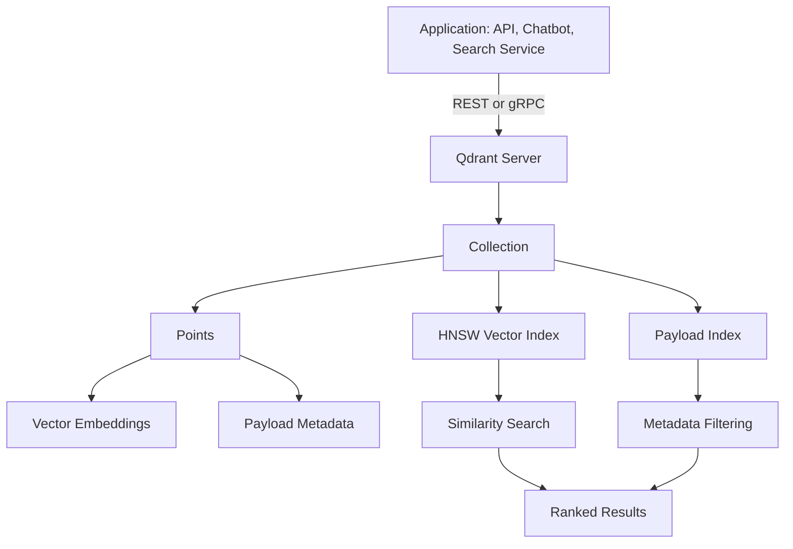
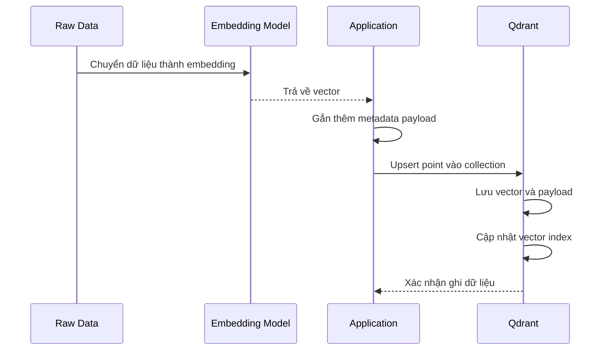
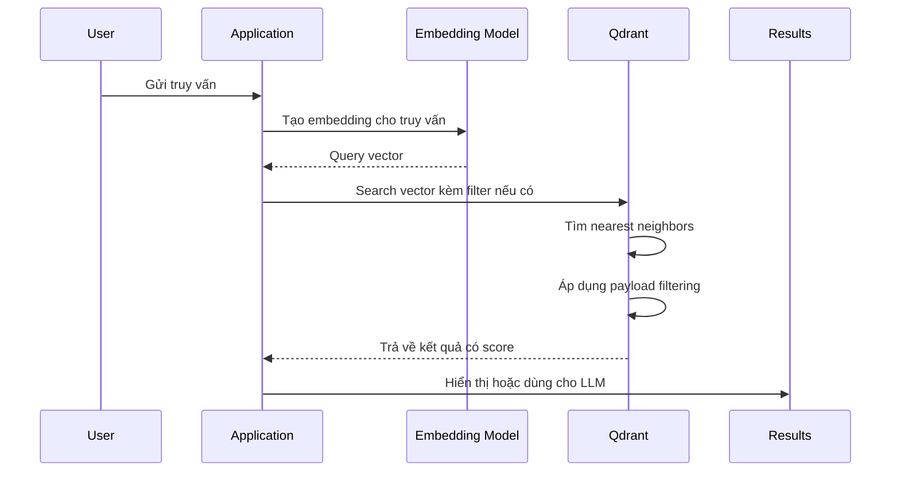
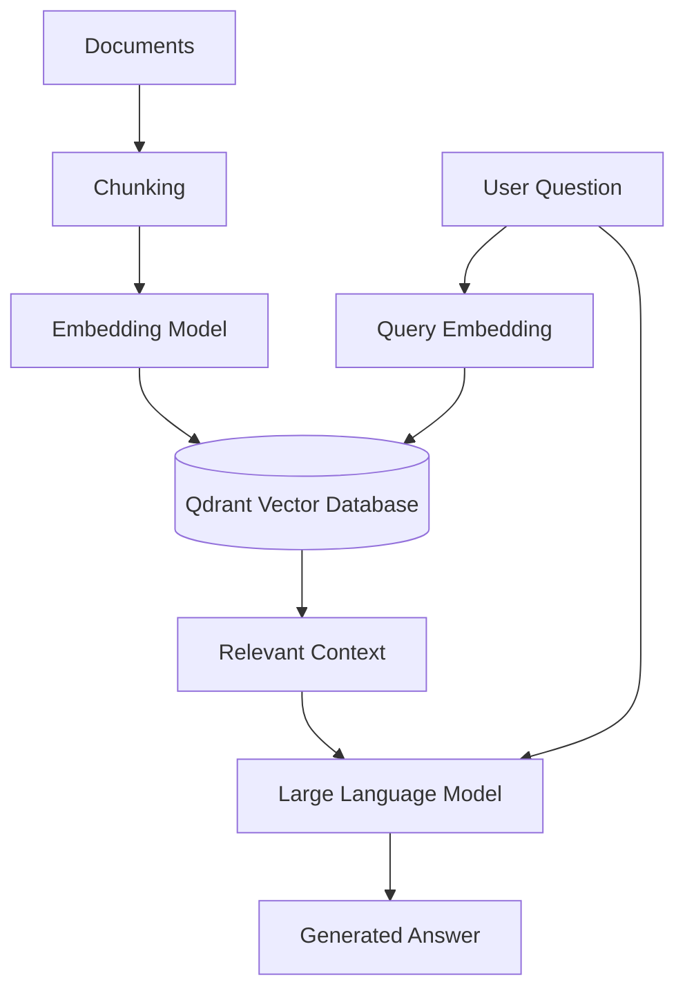

# Qdrant Vector Database: Cơ sở lý thuyết, kiến trúc và thực hành

## 1. Mục tiêu tài liệu

Tài liệu này trình bày Qdrant theo hướng lý thuyết kết hợp thực hành, giúp người học nắm được:

- Qdrant là gì và vì sao vector database quan trọng trong các hệ thống AI hiện đại.
- Cách dữ liệu phi cấu trúc được biểu diễn thành vector embedding.
- Các khái niệm cốt lõi của Qdrant như collection, point, vector, payload, index và distance metric.
- Cách Qdrant thực hiện tìm kiếm tương đồng vector.
- Cách dùng Qdrant trong các bài toán semantic search, recommendation và Retrieval-Augmented Generation.
- Cách triển khai Qdrant cơ bản bằng Docker và Python client.

## 2. Tổng quan về Qdrant

Qdrant là một **vector database** mã nguồn mở, được thiết kế để lưu trữ, đánh chỉ mục và tìm kiếm dữ liệu vector có số chiều lớn. Qdrant thường được dùng trong các hệ thống AI cần tìm kiếm theo ý nghĩa thay vì chỉ tìm kiếm theo từ khóa chính xác.

Trong các ứng dụng AI hiện đại, dữ liệu như văn bản, hình ảnh, âm thanh hoặc sản phẩm thường được chuyển thành vector embedding bằng mô hình machine learning. Các vector này giữ thông tin ngữ nghĩa của dữ liệu gốc. Qdrant lưu trữ các vector đó và hỗ trợ tìm kiếm các vector gần nhau nhất.

Qdrant thường được dùng cho:

- Semantic search cho tài liệu, bài viết, sản phẩm hoặc câu hỏi.
- Retrieval-Augmented Generation trong chatbot và ứng dụng LLM.
- Recommendation system dựa trên độ tương đồng giữa người dùng, sản phẩm hoặc nội dung.
- Image search, audio search hoặc multimodal search.
- Lưu trữ memory cho AI agent.
- Phân cụm và truy xuất dữ liệu phi cấu trúc ở quy mô lớn.

### 2.1. Đặc điểm nổi bật

| Đặc điểm | Ý nghĩa |
| --- | --- |
| Vector search | Tìm kiếm dữ liệu dựa trên độ tương đồng giữa các vector embedding. |
| Payload filtering | Kết hợp tìm kiếm vector với điều kiện lọc metadata. |
| HNSW index | Sử dụng cấu trúc chỉ mục gần đúng để tìm kiếm nhanh trên dữ liệu lớn. |
| REST API và gRPC | Cho phép tích hợp với nhiều ngôn ngữ và hệ thống khác nhau. |
| Collection schema | Quản lý cấu hình vector, metric và index theo từng collection. |
| Persistence | Lưu trữ dữ liệu bền vững trên ổ đĩa. |
| Distributed deployment | Có thể triển khai dạng cluster cho nhu cầu mở rộng. |

## 3. Cơ sở lý thuyết

### 3.1. Vector embedding

Vector embedding là cách biểu diễn dữ liệu thành một dãy số thực. Mỗi vector thường có nhiều chiều, ví dụ 384, 768, 1024 hoặc 1536 chiều tùy mô hình embedding.

Ví dụ một câu văn:

```text
"Qdrant là vector database dùng cho semantic search"
```

có thể được mô hình embedding chuyển thành vector:

```text
[0.12, -0.34, 0.08, ..., 0.91]
```

Vector này không lưu trực tiếp từng từ, mà biểu diễn ý nghĩa tổng quát của câu. Hai câu có ý nghĩa gần nhau thường có vector gần nhau trong không gian vector.

### 3.2. Vector database

Vector database là hệ quản trị cơ sở dữ liệu chuyên lưu trữ và tìm kiếm vector embedding. Khác với cơ sở dữ liệu quan hệ truyền thống, vector database không tập trung vào phép so khớp chính xác như `WHERE name = 'Laptop'`, mà tập trung vào độ tương đồng.

Ví dụ, khi người dùng tìm:

```text
"máy tính xách tay cho sinh viên"
```

hệ thống semantic search có thể trả về các sản phẩm có mô tả:

```text
"laptop mỏng nhẹ, pin lâu, phù hợp học tập"
```

dù hai câu không có toàn bộ từ khóa giống nhau.

### 3.3. Similarity search

Similarity search là quá trình tìm các vector gần nhất với vector truy vấn. Trong Qdrant, khi người dùng gửi một vector query, hệ thống sẽ so sánh vector đó với các vector đã lưu và trả về các điểm dữ liệu có độ tương đồng cao nhất.

Quy trình cơ bản:

1. Dữ liệu gốc được chuyển thành embedding.
2. Embedding được lưu vào Qdrant.
3. Truy vấn của người dùng cũng được chuyển thành embedding.
4. Qdrant tìm các vector gần nhất với embedding truy vấn.
5. Ứng dụng lấy dữ liệu gốc hoặc metadata tương ứng để trả về kết quả.

### 3.4. Distance metric

Distance metric là công thức dùng để đo khoảng cách hoặc độ tương đồng giữa hai vector. Qdrant hỗ trợ nhiều metric phổ biến.

| Metric | Ý nghĩa | Trường hợp sử dụng |
| --- | --- | --- |
| Cosine | Đo góc giữa hai vector, tập trung vào hướng vector. | Semantic search với text embedding. |
| Dot Product | Tính tích vô hướng giữa hai vector. | Một số mô hình embedding được huấn luyện cho dot product. |
| Euclidean | Đo khoảng cách hình học giữa hai điểm. | Dữ liệu vector cần khoảng cách không gian trực tiếp. |
| Manhattan | Tính tổng khoảng cách tuyệt đối theo từng chiều. | Một số bài toán đặc thù cần L1 distance. |

Với văn bản, **Cosine similarity** thường được dùng vì nó tập trung vào hướng biểu diễn ngữ nghĩa thay vì độ lớn tuyệt đối của vector.

### 3.5. Approximate Nearest Neighbor

Khi số lượng vector nhỏ, có thể so sánh query vector với toàn bộ vector trong database. Tuy nhiên, khi có hàng triệu vector, cách này rất chậm. Vì vậy, vector database thường dùng kỹ thuật **Approximate Nearest Neighbor**.

ANN không luôn đảm bảo tìm đúng tuyệt đối kết quả gần nhất, nhưng giúp tìm kết quả gần đúng với tốc độ cao. Trong thực tế, độ chính xác của ANN thường đủ tốt cho semantic search, recommendation và RAG.

### 3.6. HNSW

HNSW là viết tắt của **Hierarchical Navigable Small World**. Đây là thuật toán index phổ biến trong vector search, được Qdrant sử dụng để tăng tốc tìm kiếm nearest neighbor.

Ý tưởng chính của HNSW:

- Biểu diễn vector thành một đồ thị nhiều tầng.
- Mỗi vector là một node trong đồ thị.
- Các node gần nhau được nối bằng cạnh.
- Tìm kiếm bắt đầu từ tầng cao, sau đó đi dần xuống tầng thấp để tìm vùng vector gần nhất.

HNSW giúp Qdrant tìm kiếm nhanh mà không cần quét toàn bộ dữ liệu.

## 4. Kiến trúc Qdrant

### 4.1. Sơ đồ kiến trúc Mermaid



Kiến trúc trên cho thấy Qdrant không chỉ lưu vector, mà còn lưu metadata và xây dựng index để hỗ trợ truy vấn nhanh. Ứng dụng bên ngoài giao tiếp với Qdrant thông qua REST API hoặc gRPC.

## 5. Vòng đời xử lý dữ liệu và truy vấn

### 5.1. Luồng ingest dữ liệu



Quy trình ingest có thể tóm tắt như sau:

1. Thu thập dữ liệu gốc như tài liệu, đoạn văn, hình ảnh hoặc sản phẩm.
2. Dùng mô hình embedding để chuyển dữ liệu thành vector.
3. Gắn thêm payload như tiêu đề, nguồn, ngày tạo, danh mục hoặc quyền truy cập.
4. Gửi vector và payload vào Qdrant.
5. Qdrant lưu point và cập nhật index.

### 5.2. Luồng tìm kiếm vector



Trong các hệ thống RAG, kết quả từ Qdrant thường được đưa vào prompt để mô hình ngôn ngữ tạo câu trả lời dựa trên dữ liệu liên quan.

## 6. Các khái niệm cốt lõi

### 6.1. Collection

Collection là đơn vị lưu trữ chính trong Qdrant, tương tự như bảng trong cơ sở dữ liệu quan hệ. Mỗi collection chứa nhiều point và có cấu hình vector riêng.

Khi tạo collection, cần xác định:

- Số chiều vector.
- Distance metric.
- Cấu hình index nếu cần.
- Cấu hình lưu trữ và replication trong môi trường cluster.

Ví dụ một collection tên `documents` có vector size là `768` và dùng metric `Cosine`.

### 6.2. Point

Point là một bản ghi trong Qdrant. Mỗi point thường gồm:

- `id`: định danh duy nhất của point.
- `vector`: embedding vector.
- `payload`: metadata đi kèm.

Ví dụ dạng JSON:

```json
{
  "id": 1,
  "vector": [0.12, -0.34, 0.08],
  "payload": {
    "title": "Giới thiệu Qdrant",
    "category": "database",
    "source": "lecture-note"
  }
}
```

### 6.3. Vector

Vector là mảng số thực biểu diễn ý nghĩa của dữ liệu. Trong một collection, các vector thường phải có cùng số chiều.

Nếu collection được tạo với vector size là `768`, mọi vector được thêm vào collection đó cũng phải có 768 chiều. Nếu số chiều không khớp, Qdrant sẽ báo lỗi.

### 6.4. Payload

Payload là dữ liệu metadata đi kèm vector. Payload giúp ứng dụng lưu thông tin gốc hoặc thông tin bổ sung để lọc và hiển thị kết quả.

Ví dụ payload cho tài liệu:

```json
{
  "title": "Vector Database",
  "author": "student",
  "tags": ["ai", "database"],
  "created_year": 2026,
  "is_public": true
}
```

Payload thường dùng để:

- Hiển thị kết quả tìm kiếm.
- Lọc theo danh mục, thời gian, quyền truy cập hoặc người sở hữu.
- Lưu đường dẫn đến dữ liệu gốc.
- Lưu nội dung text chunk trong hệ thống RAG.

### 6.5. Payload filtering

Payload filtering cho phép kết hợp semantic search với điều kiện lọc metadata.

Ví dụ:

```text
Tìm các tài liệu gần nghĩa với câu truy vấn,
nhưng chỉ lấy tài liệu có category = "database" và is_public = true.
```

Cách kết hợp này rất quan trọng trong ứng dụng thực tế, vì kết quả không chỉ cần đúng về ngữ nghĩa mà còn phải phù hợp với quyền truy cập, ngữ cảnh và phạm vi dữ liệu.

### 6.6. Score

Score là giá trị thể hiện mức độ phù hợp của kết quả với truy vấn. Ý nghĩa cụ thể của score phụ thuộc vào distance metric.

Trong semantic search, kết quả có score tốt hơn thường được xếp hạng cao hơn. Ứng dụng có thể dùng score để:

- Chọn top-k kết quả.
- Loại bỏ kết quả dưới ngưỡng phù hợp.
- Hiển thị mức độ liên quan.
- Quyết định có nên đưa tài liệu vào prompt của LLM hay không.

### 6.7. Top-k search

Top-k search là truy vấn lấy `k` kết quả gần nhất với vector đầu vào.

Ví dụ:

```text
Lấy 5 đoạn tài liệu gần nghĩa nhất với câu hỏi của người dùng.
```

Trong RAG, `k` thường được chọn từ 3 đến 10 tùy độ dài tài liệu, chất lượng embedding và giới hạn context của mô hình ngôn ngữ.

### 6.8. Named vectors

Qdrant hỗ trợ named vectors, tức là một point có thể có nhiều vector khác nhau, mỗi vector có một tên riêng.

Ví dụ một sản phẩm có thể có:

- Vector từ mô tả văn bản.
- Vector từ hình ảnh sản phẩm.
- Vector từ hành vi người dùng.

Named vectors hữu ích trong các hệ thống multimodal hoặc recommendation phức tạp.

## 7. Ví dụ sử dụng Qdrant bằng Python

Ví dụ sau minh họa cách tạo collection, thêm dữ liệu và tìm kiếm vector bằng Qdrant Python client. Vector trong ví dụ là dữ liệu giả để dễ học, trong thực tế cần dùng embedding model để tạo vector.

### 7.1. Chạy Qdrant bằng Docker

```bash
docker run -p 6333:6333 -p 6334:6334 qdrant/qdrant
```

Trong đó:

- Port `6333` dùng cho REST API.
- Port `6334` dùng cho gRPC.

Sau khi chạy, có thể truy cập dashboard:

```text
http://localhost:6333/dashboard
```

### 7.2. Cài đặt Python client

```bash
pip install qdrant-client
```

### 7.3. Tạo collection và thêm point

```python
from qdrant_client import QdrantClient
from qdrant_client.models import Distance, PointStruct, VectorParams


client = QdrantClient(host="localhost", port=6333)

collection_name = "documents"

client.recreate_collection(
    collection_name=collection_name,
    vectors_config=VectorParams(size=3, distance=Distance.COSINE),
)

points = [
    PointStruct(
        id=1,
        vector=[0.10, 0.20, 0.30],
        payload={
            "title": "Giới thiệu vector database",
            "category": "database",
            "text": "Vector database dùng để lưu và tìm kiếm embedding.",
        },
    ),
    PointStruct(
        id=2,
        vector=[0.90, 0.10, 0.20],
        payload={
            "title": "FastAPI cơ bản",
            "category": "backend",
            "text": "FastAPI là framework để xây dựng API bằng Python.",
        },
    ),
    PointStruct(
        id=3,
        vector=[0.12, 0.22, 0.31],
        payload={
            "title": "Qdrant semantic search",
            "category": "database",
            "text": "Qdrant hỗ trợ tìm kiếm tương đồng trên vector embedding.",
        },
    ),
]

client.upsert(collection_name=collection_name, points=points)
```

### 7.4. Tìm kiếm vector

```python
query_vector = [0.11, 0.21, 0.29]

results = client.search(
    collection_name=collection_name,
    query_vector=query_vector,
    limit=2,
)

for result in results:
    print(result.id, result.score, result.payload["title"])
```

Kết quả trả về gồm:

- `id` của point.
- `score` thể hiện mức độ liên quan.
- `payload` chứa metadata và dữ liệu cần hiển thị.

### 7.5. Tìm kiếm kèm filter

```python
from qdrant_client.models import FieldCondition, Filter, MatchValue


results = client.search(
    collection_name=collection_name,
    query_vector=[0.11, 0.21, 0.29],
    query_filter=Filter(
        must=[
            FieldCondition(
                key="category",
                match=MatchValue(value="database"),
            )
        ]
    ),
    limit=5,
)

for result in results:
    print(result.id, result.score, result.payload["title"])
```

Ví dụ này chỉ trả về các point có `category` là `database`.

## 8. Qdrant trong hệ thống RAG

### 8.1. Sơ đồ RAG với Qdrant



Trong RAG, Qdrant đóng vai trò là bộ nhớ truy xuất tri thức. Thay vì yêu cầu LLM tự nhớ mọi thông tin, ứng dụng sẽ tìm các đoạn tài liệu liên quan trong Qdrant và đưa chúng vào prompt.

### 8.2. Quy trình RAG cơ bản

1. Chia tài liệu thành các đoạn nhỏ gọi là chunk.
2. Tạo embedding cho từng chunk.
3. Lưu embedding và nội dung chunk vào Qdrant.
4. Khi người dùng đặt câu hỏi, tạo embedding cho câu hỏi.
5. Tìm các chunk liên quan nhất trong Qdrant.
6. Đưa chunk vào prompt làm context.
7. LLM tạo câu trả lời dựa trên context.

### 8.3. Vì sao cần chunking

Tài liệu dài thường không nên được embedding thành một vector duy nhất, vì vector đó có thể làm mất chi tiết. Chunking giúp:

- Giữ thông tin cụ thể hơn.
- Tăng khả năng tìm đúng đoạn liên quan.
- Kiểm soát độ dài context đưa vào LLM.
- Giảm nhiễu khi tài liệu chứa nhiều chủ đề.

Kích thước chunk thường phụ thuộc vào loại tài liệu và mô hình embedding. Với văn bản, có thể bắt đầu từ 300 đến 800 token mỗi chunk, sau đó điều chỉnh dựa trên chất lượng truy xuất.

## 9. So sánh Qdrant với cơ sở dữ liệu truyền thống

| Tiêu chí | Database truyền thống | Qdrant vector database |
| --- | --- | --- |
| Kiểu dữ liệu chính | Bảng, dòng, cột, document | Vector embedding và payload |
| Truy vấn chính | Exact match, range query, join | Similarity search, nearest neighbor |
| Phù hợp với | Dữ liệu có cấu trúc | Dữ liệu phi cấu trúc và ngữ nghĩa |
| Ví dụ truy vấn | `WHERE id = 10` | Tìm tài liệu gần nghĩa nhất |
| Index | B-tree, hash, full-text index | HNSW vector index, payload index |
| Kết quả | Bản ghi khớp điều kiện | Danh sách kết quả có score |

Qdrant không thay thế hoàn toàn database truyền thống. Trong nhiều hệ thống, Qdrant được dùng cùng PostgreSQL, MySQL, MongoDB hoặc object storage. Database truyền thống lưu dữ liệu nghiệp vụ chính, còn Qdrant lưu vector để tìm kiếm ngữ nghĩa.

## 10. Thiết kế dữ liệu trong Qdrant

### 10.1. Chọn collection

Nên tách collection khi:

- Dữ liệu dùng vector size khác nhau.
- Dữ liệu dùng distance metric khác nhau.
- Dữ liệu thuộc domain khác nhau và ít khi tìm kiếm chung.
- Cần cấu hình index hoặc chính sách lưu trữ khác nhau.

Không nên tạo quá nhiều collection nhỏ nếu dữ liệu có cùng schema và cùng cách truy vấn, vì payload filtering có thể xử lý nhiều trường hợp phân loại.

### 10.2. Thiết kế payload

Payload nên chứa đủ thông tin để lọc và hiển thị kết quả, ví dụ:

| Trường payload | Vai trò |
| --- | --- |
| `text` | Nội dung chunk hoặc mô tả cần đưa vào kết quả. |
| `source` | Nguồn tài liệu hoặc đường dẫn file. |
| `document_id` | Liên kết về tài liệu gốc. |
| `category` | Phân loại dữ liệu. |
| `created_at` | Thời gian tạo hoặc cập nhật. |
| `owner_id` | Phục vụ phân quyền dữ liệu. |

Không nên đưa dữ liệu quá lớn vào payload nếu dữ liệu đó phù hợp hơn để lưu ở database khác hoặc object storage. Khi đó payload chỉ nên lưu khóa tham chiếu.

### 10.3. Chọn distance metric

Việc chọn metric nên dựa trên mô hình embedding:

- Nếu tài liệu mô hình khuyến nghị Cosine, nên dùng `Cosine`.
- Nếu mô hình được huấn luyện cho dot product, nên dùng `Dot`.
- Nếu vector biểu diễn tọa độ hoặc đặc trưng hình học, có thể cân nhắc `Euclid`.

Điều quan trọng là collection phải dùng metric phù hợp với embedding model, vì metric ảnh hưởng trực tiếp đến chất lượng kết quả tìm kiếm.

## 11. Ưu điểm và hạn chế

### 11.1. Ưu điểm

- Tìm kiếm theo ngữ nghĩa tốt hơn tìm kiếm từ khóa trong nhiều bài toán AI.
- Hỗ trợ kết hợp vector search với metadata filtering.
- Có REST API, gRPC và client cho nhiều ngôn ngữ.
- Dùng HNSW để tìm kiếm nhanh trên tập dữ liệu lớn.
- Phù hợp với RAG, chatbot, recommendation và semantic search.
- Có thể triển khai cục bộ bằng Docker hoặc triển khai trên server/cloud.

### 11.2. Hạn chế

- Chất lượng tìm kiếm phụ thuộc mạnh vào embedding model.
- Cần chọn đúng vector size, distance metric và chiến lược chunking.
- ANN có thể đánh đổi một phần độ chính xác để lấy tốc độ.
- Vector database không thay thế hoàn toàn database nghiệp vụ truyền thống.
- Cần quản lý cập nhật dữ liệu khi tài liệu gốc thay đổi.
- Dữ liệu vector lớn có thể tiêu tốn nhiều RAM và dung lượng lưu trữ.

## 12. Các lỗi thiết kế thường gặp

### 12.1. Dùng sai embedding model

Nếu embedding model không phù hợp với ngôn ngữ hoặc domain dữ liệu, kết quả tìm kiếm sẽ kém dù Qdrant hoạt động đúng. Ví dụ, dữ liệu tiếng Việt nên dùng mô hình embedding có khả năng xử lý tiếng Việt tốt.

### 12.2. Chunk quá dài hoặc quá ngắn

Chunk quá dài có thể làm mất chi tiết, còn chunk quá ngắn có thể thiếu ngữ cảnh. Cần thử nghiệm kích thước chunk và overlap để đạt chất lượng truy xuất tốt.

### 12.3. Không dùng filter phân quyền

Trong ứng dụng nhiều người dùng, nếu không lọc theo `owner_id`, `tenant_id` hoặc quyền truy cập, hệ thống có thể trả về dữ liệu không thuộc quyền của người dùng.

### 12.4. Lưu payload thiếu thông tin

Nếu payload chỉ lưu vector mà không lưu `text`, `source` hoặc `document_id`, ứng dụng sẽ khó hiển thị kết quả hoặc truy ngược về dữ liệu gốc.

### 12.5. Không đánh giá chất lượng retrieval

Một hệ thống vector search cần được đánh giá bằng dữ liệu thật. Nên kiểm tra các truy vấn mẫu, top-k, score threshold và tỷ lệ kết quả đúng để cải thiện embedding, chunking và filter.

## 13. Kết luận

Qdrant là vector database mạnh mẽ cho các hệ thống cần tìm kiếm theo ngữ nghĩa. Thay vì chỉ tìm kiếm dữ liệu theo từ khóa chính xác, Qdrant cho phép lưu vector embedding và truy xuất các dữ liệu có ý nghĩa gần với truy vấn.

Về mặt kỹ thuật, Qdrant kết hợp collection, point, vector, payload, HNSW index và payload filtering để tạo thành một hệ thống tìm kiếm vector hiệu quả. Trong các ứng dụng AI như RAG, chatbot, semantic search và recommendation, Qdrant thường đóng vai trò là lớp truy xuất tri thức hoặc bộ nhớ ngữ nghĩa.

Khi thiết kế hệ thống với Qdrant, cần quan tâm đến embedding model, kích thước vector, distance metric, chunking, payload schema và chiến lược phân quyền. Đây là các yếu tố quyết định chất lượng tìm kiếm nhiều hơn bản thân việc lưu vector.

## 14. Tài liệu tham khảo

- Qdrant Documentation: https://qdrant.tech/documentation/
- Qdrant Concepts: https://qdrant.tech/documentation/concepts/
- Qdrant Python Client: https://python-client.qdrant.tech/
- Qdrant GitHub Repository: https://github.com/qdrant/qdrant
- HNSW Paper: https://arxiv.org/abs/1603.09320
