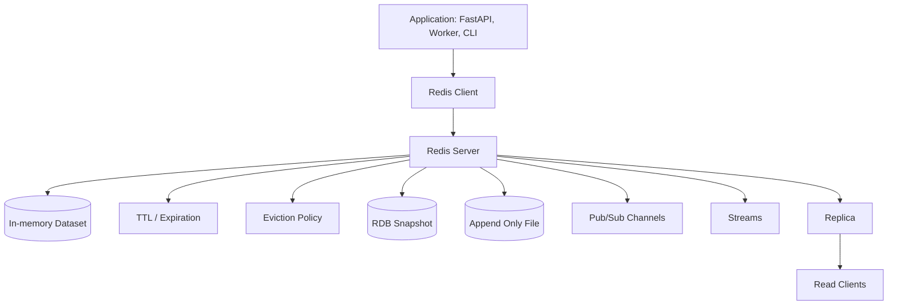
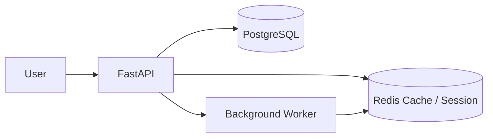
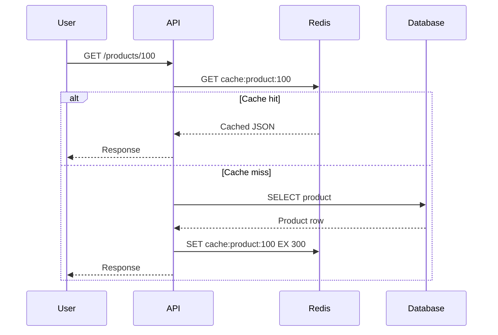
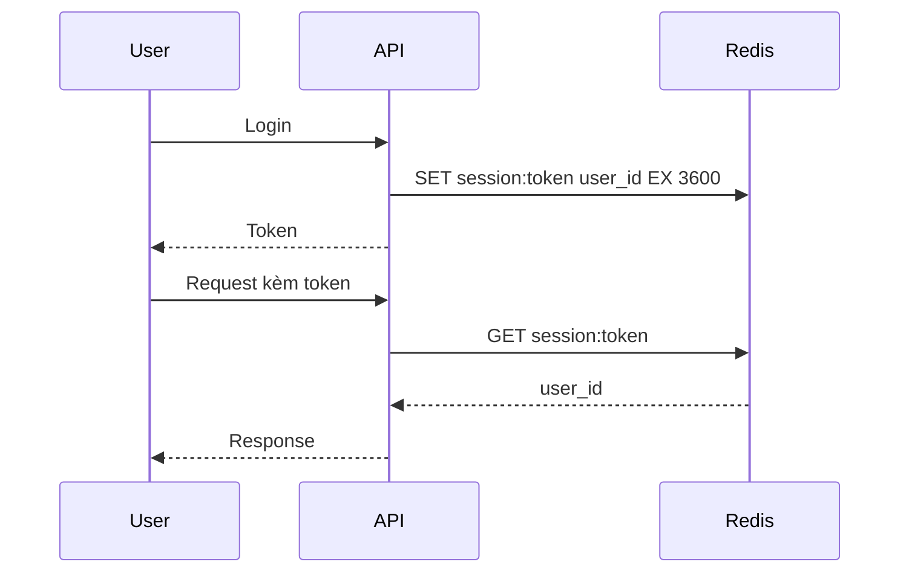
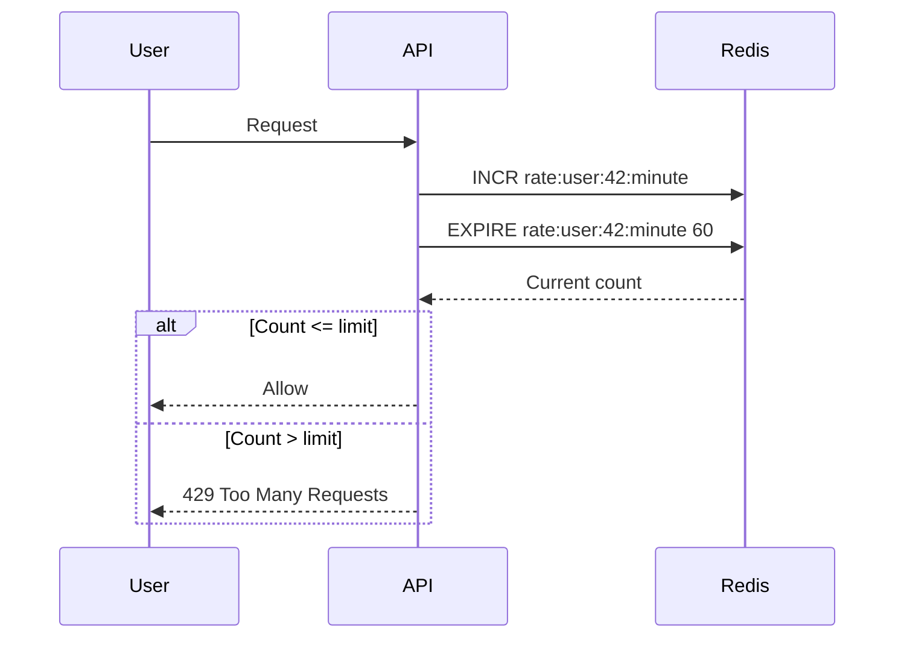

# Redis: Cơ sở lý thuyết, kiến trúc và thực hành

## 1. Mục tiêu tài liệu

Tài liệu này trình bày Redis theo hướng lý thuyết kết hợp thực hành, giúp người học nắm được:

- Redis là gì và vì sao Redis thường được dùng làm cache, session store, message broker, rate limiter và in-memory data store.
- Các khái niệm cốt lõi như key, value, database index, TTL, expiration, eviction policy, persistence, replication và pub/sub.
- Các kiểu dữ liệu chính của Redis như String, Hash, List, Set, Sorted Set, Stream, Bitmap, HyperLogLog và Geospatial index.
- Cách chạy Redis local bằng Docker và Docker Compose.
- Cách thao tác Redis bằng `redis-cli`.
- Cách kết nối Redis với Python và FastAPI bằng `redis-py`.
- Cách thiết kế key, TTL, cache pattern và dữ liệu trong Redis.
- Các lỗi thiết kế thường gặp khi dùng Redis trong hệ thống backend.

Tài liệu này tập trung vào Redis Open Source ở mức nền tảng. Một số tính năng nâng cao như Redis Stack, Redis Search, Redis JSON, Redis Vector, Redis Enterprise, clustering production và deployment managed cloud có thể khác nhau theo phiên bản hoặc sản phẩm, vì vậy khi triển khai thực tế nên đối chiếu với tài liệu chính thức đúng môi trường đang dùng.

## 2. Tổng quan về Redis

Redis là một hệ thống lưu trữ dữ liệu trong bộ nhớ, thường được mô tả là **in-memory data store**. Redis lưu dữ liệu theo mô hình key-value, nhưng value không chỉ là chuỗi đơn giản. Redis hỗ trợ nhiều cấu trúc dữ liệu mạnh như hash, list, set, sorted set và stream.

Redis thường được dùng để giải quyết các nhu cầu cần tốc độ cao:

- Cache kết quả truy vấn database.
- Lưu session người dùng.
- Lưu token tạm thời, OTP, password reset token.
- Rate limiting.
- Queue nhẹ hoặc background job.
- Pub/Sub cho realtime messaging.
- Leaderboard bằng sorted set.
- Counter, metric, feature flag.
- Distributed lock.
- Lưu trạng thái tạm trong workflow.

Redis rất nhanh vì phần lớn dữ liệu được lưu trong RAM. Tuy nhiên điều đó cũng có nghĩa Redis không nên được dùng tùy tiện như nơi lưu mọi dữ liệu lâu dài. Với dữ liệu nghiệp vụ quan trọng, Redis thường được dùng cùng database bền vững như PostgreSQL, MySQL hoặc MongoDB.

Ví dụ kiến trúc phổ biến:

```text
FastAPI Backend
  -> Redis: cache, session, rate limit
  -> PostgreSQL: dữ liệu nghiệp vụ bền vững
  -> MinIO: file lớn
  -> Qdrant/Milvus: vector search
```

### 2.1. Đặc điểm nổi bật

| Đặc điểm | Ý nghĩa |
| --- | --- |
| In-memory | Dữ liệu nằm chủ yếu trong RAM nên truy cập rất nhanh. |
| Key-value | Mỗi dữ liệu được truy cập bằng key. |
| Data structures | Hỗ trợ String, Hash, List, Set, Sorted Set, Stream và nhiều kiểu khác. |
| TTL/expiration | Key có thể tự hết hạn sau một khoảng thời gian. |
| Atomic operations | Nhiều lệnh Redis là atomic, phù hợp counter, lock, rate limit. |
| Persistence | Có thể lưu dữ liệu xuống disk bằng RDB, AOF hoặc kết hợp. |
| Pub/Sub | Hỗ trợ publish/subscribe message realtime. |
| Streams | Cấu trúc log append-only cho event stream và consumer group. |
| Replication | Có thể tạo replica để đọc hoặc phục vụ high availability. |
| Lua scripting | Chạy logic nhỏ trên Redis một cách atomic. |
| Redis Stack | Mở rộng Redis với Search, JSON, Time Series, Bloom, Vector, v.v. |

## 3. Cơ sở lý thuyết

### 3.1. In-memory data store

Redis lưu dữ liệu chủ yếu trong RAM. Điều này giúp Redis phản hồi rất nhanh, thường phù hợp với các thao tác có độ trễ thấp.

Ưu điểm:

- Truy cập nhanh.
- Phù hợp cache.
- Phù hợp dữ liệu tạm.
- Phù hợp counter, rate limit, queue nhẹ.

Nhược điểm:

- RAM đắt hơn disk.
- Dung lượng hữu hạn.
- Nếu cấu hình persistence không đúng, có thể mất dữ liệu khi crash.
- Không phù hợp lưu file lớn hoặc dữ liệu nghiệp vụ quan trọng duy nhất.

### 3.2. Key-value store

Redis lưu dữ liệu theo key:

```text
key -> value
```

Ví dụ:

```text
user:42:name -> "Mario"
session:abc123 -> "{...json...}"
product:100:views -> 152
```

Key nên có cấu trúc rõ ràng:

```text
{domain}:{id}:{field}
```

Ví dụ:

```text
user:42:profile
post:100:likes
rate_limit:user:42:login
cache:product:100
```

Redis không bắt buộc key theo schema, vì vậy nếu đặt key tùy tiện, hệ thống sẽ rất khó quản lý.

### 3.3. TTL và expiration

TTL là thời gian còn lại trước khi key hết hạn.

Ví dụ:

```bash
SET otp:user:42 123456 EX 300
TTL otp:user:42
```

Key `otp:user:42` sẽ tự mất sau 300 giây.

TTL rất quan trọng cho:

- Cache.
- Session.
- OTP.
- Password reset token.
- Rate limit.
- Temporary lock.

Nếu quên TTL cho dữ liệu tạm, Redis có thể đầy RAM theo thời gian.

### 3.4. Eviction

Eviction là quá trình Redis tự xóa key khi vượt giới hạn bộ nhớ.

Redis cho phép cấu hình:

- `maxmemory`: giới hạn RAM Redis được dùng.
- `maxmemory-policy`: chính sách chọn key để xóa.

Một số policy phổ biến:

| Policy | Ý nghĩa |
| --- | --- |
| `noeviction` | Không xóa key, ghi mới có thể lỗi khi đầy RAM. |
| `allkeys-lru` | Xóa key ít được dùng gần đây nhất trong toàn bộ keyspace. |
| `volatile-lru` | Chỉ xóa key có TTL, ưu tiên key ít dùng gần đây. |
| `allkeys-lfu` | Xóa key ít được dùng thường xuyên nhất. |
| `volatile-ttl` | Xóa key có TTL gần hết hạn nhất. |

Nếu dùng Redis làm cache, thường cần cấu hình `maxmemory` và eviction policy rõ ràng. Nếu không, Redis có thể chiếm quá nhiều RAM.

### 3.5. Persistence

Redis là in-memory, nhưng vẫn có cơ chế lưu dữ liệu xuống disk:

| Cơ chế | Ý nghĩa |
| --- | --- |
| RDB | Snapshot dữ liệu tại một thời điểm. |
| AOF | Append-only log ghi lại lệnh thay đổi dữ liệu. |
| RDB + AOF | Kết hợp snapshot và log để cân bằng tốc độ và độ bền. |

RDB phù hợp khi chấp nhận mất một ít dữ liệu gần thời điểm crash. AOF thường bền hơn nhưng có thể tốn disk và cần rewrite.

Nếu Redis chỉ dùng cache, mất dữ liệu Redis có thể chấp nhận được vì cache có thể build lại. Nếu Redis lưu session hoặc queue quan trọng, cần cấu hình persistence và backup cẩn thận hơn.

### 3.6. Atomic operation

Nhiều lệnh Redis là atomic. Ví dụ:

```bash
INCR page:home:views
```

Nếu nhiều request cùng tăng counter, Redis vẫn đảm bảo mỗi lệnh `INCR` được xử lý nguyên tử.

Atomic operation hữu ích cho:

- Counter.
- Rate limiter.
- Distributed lock đơn giản.
- Queue push/pop.
- Leaderboard score update.

### 3.7. Pub/Sub

Pub/Sub cho phép một client publish message vào channel, các client subscribe channel đó sẽ nhận message.

Ví dụ:

```bash
SUBSCRIBE notifications
```

Ở terminal khác:

```bash
PUBLISH notifications "hello"
```

Pub/Sub phù hợp realtime event nhẹ, nhưng message không được lưu lại cho subscriber offline. Nếu cần event bền hơn, nên xem Redis Streams hoặc message broker chuyên dụng.

### 3.8. Streams

Redis Streams là cấu trúc dữ liệu dạng append-only log.

Ví dụ:

```bash
XADD orders * user_id 42 total 120000
XRANGE orders - +
```

Streams hỗ trợ:

- Ghi event theo thứ tự.
- Đọc event theo ID.
- Consumer group.
- Xử lý message có acknowledgment.

Streams phù hợp hơn Pub/Sub khi cần lưu lại event và xử lý bởi nhiều worker.

### 3.9. Transactions và Lua

Redis hỗ trợ transaction bằng:

```bash
MULTI
SET a 1
INCR counter
EXEC
```

Redis cũng hỗ trợ Lua scripting để thực hiện nhiều thao tác một cách atomic.

Lua script hữu ích khi:

- Cần check-and-set atomic.
- Cần rate limit phức tạp.
- Cần lock/unlock an toàn hơn.
- Cần cập nhật nhiều key theo logic nhỏ.

Không nên viết logic nghiệp vụ lớn trong Lua. Redis script nên ngắn, rõ và nhanh.

## 4. Kiến trúc Redis

### 4.1. Sơ đồ kiến trúc Mermaid



Redis Server nhận lệnh từ client qua TCP, thao tác dữ liệu trong RAM và tùy cấu hình sẽ ghi persistence xuống disk.

### 4.2. Các thành phần quan trọng

| Thành phần | Vai trò |
| --- | --- |
| Redis Server | Tiến trình chính xử lý command. |
| Redis Client | Thư viện hoặc CLI kết nối Redis. |
| Keyspace | Tập các key trong một Redis database. |
| Data types | Kiểu dữ liệu của value. |
| TTL manager | Quản lý key hết hạn. |
| Persistence | RDB/AOF lưu dữ liệu xuống disk. |
| Replication | Đồng bộ dữ liệu sang replica. |
| Pub/Sub | Cơ chế publish/subscribe realtime. |
| Streams | Event log và consumer group. |
| Redis CLI | Công cụ dòng lệnh để thao tác Redis. |
| Redis Insight | GUI để quan sát và quản lý Redis. |

### 4.3. Redis trong backend



Một request backend có thể dùng Redis như sau:

1. API nhận request.
2. Kiểm tra Redis xem dữ liệu đã có trong cache chưa.
3. Nếu cache hit, trả nhanh.
4. Nếu cache miss, query PostgreSQL.
5. Lưu kết quả vào Redis với TTL.
6. Trả kết quả cho user.

## 5. Vòng đời xử lý dữ liệu

### 5.1. Luồng cache-aside



Cache-aside là pattern phổ biến nhất. Ứng dụng tự chịu trách nhiệm đọc cache, query database khi miss và ghi cache.

### 5.2. Luồng session



Redis phù hợp lưu session vì:

- Truy cập nhanh.
- TTL tự động hết hạn.
- Dễ xóa session khi logout.

### 5.3. Luồng rate limit đơn giản



Rate limit cần atomic logic. Với trường hợp phức tạp, nên dùng Lua script để `INCR` và `EXPIRE` nhất quán hơn.

## 6. Các kiểu dữ liệu cốt lõi

### 6.1. String

String là kiểu cơ bản nhất. Value có thể là text, số, JSON string hoặc binary.

```bash
SET user:42:name "Mario"
GET user:42:name
```

TTL:

```bash
SET otp:user:42 "123456" EX 300
TTL otp:user:42
```

Counter:

```bash
INCR page:home:views
INCRBY page:home:views 10
```

Use case:

- Cache JSON.
- Counter.
- Token tạm.
- Feature flag đơn giản.

### 6.2. Hash

Hash lưu nhiều field-value dưới một key.

```bash
HSET user:42 name "Mario" age 21 major "Data Science"
HGET user:42 name
HGETALL user:42
```

Use case:

- Object nhỏ.
- User profile.
- Product metadata.
- Session data có nhiều field.

Hash phù hợp khi muốn cập nhật từng field mà không serialize toàn bộ JSON.

### 6.3. List

List là danh sách có thứ tự theo insertion order.

```bash
LPUSH queue:emails "job-1"
LPUSH queue:emails "job-2"
RPOP queue:emails
```

Use case:

- Queue đơn giản.
- Recent items.
- Stack/queue.

Nếu cần queue bền vững và consumer group, nên cân nhắc Redis Streams thay vì List.

### 6.4. Set

Set là tập các phần tử unique, không có thứ tự.

```bash
SADD post:100:likes user:1 user:2 user:3
SISMEMBER post:100:likes user:2
SCARD post:100:likes
```

Use case:

- Lưu user đã like bài viết.
- Unique visitors.
- Tag set.
- Permission set.

Set hỗ trợ phép toán tập hợp:

```bash
SINTER set:a set:b
SUNION set:a set:b
SDIFF set:a set:b
```

### 6.5. Sorted Set

Sorted Set giống Set nhưng mỗi member có score để sắp xếp.

```bash
ZADD leaderboard 100 user:1
ZADD leaderboard 250 user:2
ZREVRANGE leaderboard 0 9 WITHSCORES
```

Use case:

- Leaderboard.
- Ranking.
- Priority queue.
- Time-based index.

Ví dụ lấy top 10:

```bash
ZREVRANGE leaderboard 0 9 WITHSCORES
```

### 6.6. Stream

Stream là append-only log.

```bash
XADD orders * user_id 42 total 120000
XRANGE orders - +
```

Consumer group:

```bash
XGROUP CREATE orders order_workers $ MKSTREAM
XREADGROUP GROUP order_workers worker-1 COUNT 10 STREAMS orders >
```

Use case:

- Event log.
- Worker queue.
- Audit event.
- Stream processing nhẹ.

### 6.7. Bitmap

Bitmap dùng bit để lưu trạng thái true/false rất tiết kiệm.

```bash
SETBIT active:2026-06-09 42 1
GETBIT active:2026-06-09 42
BITCOUNT active:2026-06-09
```

Use case:

- Daily active users.
- Attendance.
- Feature flag dạng bit.

### 6.8. HyperLogLog

HyperLogLog ước lượng số lượng phần tử unique với memory nhỏ.

```bash
PFADD visitors:today user:1 user:2 user:3
PFCOUNT visitors:today
```

Use case:

- Ước lượng unique visitors.
- Đếm unique event ở quy mô lớn.

HyperLogLog là ước lượng, không trả danh sách phần tử.

### 6.9. Geospatial index

Redis hỗ trợ lưu tọa độ địa lý và truy vấn theo khoảng cách.

```bash
GEOADD places 106.6297 10.8231 "HCM"
GEODIST places "HCM" "OtherPlace" km
```

Use case:

- Tìm địa điểm gần người dùng.
- Store locator.
- Tracking vị trí đơn giản.

## 7. Cài đặt và chạy Redis

### 7.1. Chạy Redis bằng Docker

Chạy Redis Open Source:

```bash
docker run -d --name redis -p 6379:6379 redis:7-alpine
```

Kiểm tra container:

```bash
docker ps
```

Kết nối bằng `redis-cli` trong container:

```bash
docker exec -it redis redis-cli
```

Test:

```bash
PING
```

Redis sẽ trả:

```text
PONG
```

### 7.2. Chạy Redis có volume

Nếu muốn dữ liệu Redis tồn tại sau khi container bị xóa:

```bash
docker run -d \
  --name redis \
  -p 6379:6379 \
  -v redis_data:/data \
  redis:7-alpine \
  redis-server --appendonly yes
```

`--appendonly yes` bật AOF persistence.

### 7.3. Docker Compose

```yaml
services:
  redis:
    image: redis:7-alpine
    container_name: redis-demo
    ports:
      - "6379:6379"
    volumes:
      - redis_data:/data
    command: redis-server --appendonly yes
    healthcheck:
      test: ["CMD", "redis-cli", "ping"]
      interval: 10s
      timeout: 5s
      retries: 5

volumes:
  redis_data:
```

Chạy:

```bash
docker compose up -d
docker compose ps
```

Kết nối:

```bash
docker exec -it redis-demo redis-cli
```

### 7.4. Redis Stack và Redis Insight

Redis Stack bổ sung các module như Search, JSON, TimeSeries, Bloom và Vector.

Chạy Redis Stack local:

```bash
docker run -d \
  --name redis-stack \
  -p 6379:6379 \
  -p 8001:8001 \
  redis/redis-stack:latest
```

Redis Insight có thể mở ở:

```text
http://localhost:8001
```

Nếu chỉ học Redis cơ bản, image `redis:7-alpine` là đủ. Nếu cần Search/JSON/Vector hoặc UI, dùng Redis Stack hoặc Redis Insight.

## 8. Thao tác với `redis-cli`

### 8.1. Kết nối

```bash
redis-cli -h 127.0.0.1 -p 6379
```

Trong Docker:

```bash
docker exec -it redis redis-cli
```

### 8.2. Lệnh cơ bản

```bash
PING
SET name "Mario"
GET name
DEL name
EXISTS name
```

### 8.3. TTL

```bash
SET token:abc "user-42" EX 3600
TTL token:abc
EXPIRE token:abc 600
PERSIST token:abc
```

### 8.4. Liệt kê key an toàn

Không nên dùng `KEYS *` trong production vì có thể block Redis nếu keyspace lớn.

Nên dùng:

```bash
SCAN 0 MATCH user:* COUNT 100
```

`SCAN` trả cursor để lặp dần qua keyspace.

### 8.5. Kiểm tra thông tin server

```bash
INFO
INFO memory
INFO stats
DBSIZE
CONFIG GET maxmemory
CONFIG GET maxmemory-policy
```

Các lệnh này hữu ích khi debug memory, eviction, connection và performance.

## 9. Kết nối Redis với Python

### 9.1. Cài thư viện

```bash
pip install redis
```

### 9.2. Kết nối đồng bộ

```python
import redis

r = redis.Redis(
    host="localhost",
    port=6379,
    db=0,
    decode_responses=True,
)

r.set("name", "Mario")
print(r.get("name"))
```

`decode_responses=True` giúp Redis trả string thay vì bytes.

### 9.3. Cache JSON

```python
import json
import redis

r = redis.Redis(host="localhost", port=6379, db=0, decode_responses=True)

product = {
    "id": 100,
    "name": "Laptop",
    "price": 12990000,
}

r.set("cache:product:100", json.dumps(product), ex=300)

cached = r.get("cache:product:100")
if cached is not None:
    product = json.loads(cached)
```

Lưu ý: Redis String không hiểu JSON nếu chỉ dùng Redis Open Source cơ bản. Ứng dụng tự serialize/deserialize. Nếu dùng Redis Stack, có thể dùng Redis JSON.

### 9.4. Hash trong Python

```python
r.hset(
    "user:42",
    mapping={
        "name": "Mario",
        "major": "Data Science",
        "age": "21",
    },
)

print(r.hgetall("user:42"))
```

### 9.5. Async Redis với FastAPI

`redis-py` có API async qua `redis.asyncio`.

```python
import redis.asyncio as redis

redis_client = redis.Redis(
    host="localhost",
    port=6379,
    db=0,
    decode_responses=True,
)
```

Gọi async:

```python
value = await redis_client.get("key")
await redis_client.set("key", "value", ex=60)
```

## 10. Redis trong FastAPI

### 10.1. Cấu hình

Ví dụ `.env`:

```text
REDIS_URL=redis://localhost:6379/0
```

Trong Docker Compose, nếu service Redis tên `redis`, backend container nên dùng:

```text
REDIS_URL=redis://redis:6379/0
```

Không dùng `localhost` từ container backend để gọi container Redis, vì `localhost` là chính container backend.

### 10.2. FastAPI lifespan

```python
from contextlib import asynccontextmanager

import redis.asyncio as redis
from fastapi import FastAPI


@asynccontextmanager
async def lifespan(app: FastAPI):
    app.state.redis = redis.from_url(
        "redis://localhost:6379/0",
        decode_responses=True,
    )
    yield
    await app.state.redis.aclose()


app = FastAPI(lifespan=lifespan)
```

### 10.3. Endpoint cache đơn giản

```python
import json
from fastapi import FastAPI, Request

app = FastAPI()


@app.get("/products/{product_id}")
async def get_product(product_id: int, request: Request):
    redis_client = request.app.state.redis
    cache_key = f"cache:product:{product_id}"

    cached = await redis_client.get(cache_key)
    if cached is not None:
        return json.loads(cached)

    product = {
        "id": product_id,
        "name": "Laptop",
        "source": "database",
    }

    await redis_client.set(cache_key, json.dumps(product), ex=300)
    return product
```

Trong thực tế, phần `product` nên được lấy từ database.

### 10.4. Rate limit đơn giản

```python
from fastapi import HTTPException, Request


async def check_rate_limit(request: Request, user_id: str):
    redis_client = request.app.state.redis
    key = f"rate_limit:user:{user_id}:minute"

    count = await redis_client.incr(key)
    if count == 1:
        await redis_client.expire(key, 60)

    if count > 60:
        raise HTTPException(status_code=429, detail="Too many requests")
```

Với hệ thống lớn, nên dùng Lua script hoặc thư viện rate limit đã kiểm thử để tránh edge case.

## 11. Cache patterns

### 11.1. Cache-aside

Ứng dụng tự đọc cache và tự ghi cache.

```text
GET cache
if miss:
  query database
  SET cache
return data
```

Ưu điểm:

- Đơn giản.
- Dễ kiểm soát TTL.
- Phổ biến trong backend.

Nhược điểm:

- Cache miss vẫn chậm.
- Cần xử lý invalidation khi dữ liệu thay đổi.

### 11.2. Write-through

Mỗi lần ghi database, ứng dụng cũng ghi cache.

Ưu điểm:

- Cache luôn có dữ liệu mới hơn.

Nhược điểm:

- Ghi chậm hơn.
- Cần xử lý lỗi nếu một trong hai nơi ghi thất bại.

### 11.3. Write-behind

Ứng dụng ghi Redis trước, sau đó worker ghi database sau.

Ưu điểm:

- Request nhanh.

Nhược điểm:

- Phức tạp.
- Có rủi ro mất dữ liệu nếu Redis/worker lỗi.
- Cần queue, retry, idempotency.

### 11.4. Cache invalidation

Khi dữ liệu gốc thay đổi, cache cần được xóa hoặc cập nhật.

Ví dụ:

```python
await redis_client.delete(f"cache:product:{product_id}")
```

Các chiến lược:

- TTL ngắn.
- Xóa cache khi update.
- Versioned key.
- Tag/group invalidation.
- Event-driven invalidation.

Cache invalidation là phần khó nhất khi dùng cache.

### 11.5. Cache stampede

Cache stampede xảy ra khi một key hot hết hạn và nhiều request cùng lúc query database để rebuild cache.

Cách giảm:

- TTL jitter, thêm ngẫu nhiên vào TTL.
- Lock khi rebuild cache.
- Refresh cache trước khi hết hạn.
- Serve stale data trong thời gian ngắn.

## 12. Redis cho use case phổ biến

### 12.1. Session store

```bash
SET session:token123 user:42 EX 3600
GET session:token123
DEL session:token123
```

Session nên có TTL. Khi logout, xóa key.

### 12.2. OTP

```bash
SET otp:user:42 123456 EX 300
```

Không nên lưu OTP quá lâu. Nên giới hạn số lần nhập sai bằng counter riêng.

### 12.3. Distributed lock đơn giản

```bash
SET lock:job:daily worker-1 NX EX 60
```

Ý nghĩa:

- `NX`: chỉ set nếu key chưa tồn tại.
- `EX 60`: lock tự hết hạn sau 60 giây.

Khi unlock, cần đảm bảo chỉ owner lock được xóa lock của mình. Với production, nên dùng implementation đã kiểm thử.

### 12.4. Leaderboard

```bash
ZADD leaderboard 1500 user:42
ZINCRBY leaderboard 50 user:42
ZREVRANGE leaderboard 0 9 WITHSCORES
```

Sorted Set là lựa chọn tự nhiên cho ranking.

### 12.5. Queue nhẹ

```bash
LPUSH queue:emails job-1
RPOP queue:emails
```

Nếu cần reliability tốt hơn:

- Dùng Redis Streams.
- Dùng Celery/RQ.
- Dùng message broker chuyên dụng như RabbitMQ hoặc Kafka tùy bài toán.

### 12.6. Pub/Sub realtime

```bash
SUBSCRIBE chat:room:1
PUBLISH chat:room:1 "hello"
```

Pub/Sub phù hợp message realtime không cần lưu lịch sử. Nếu subscriber offline, message có thể mất.

## 13. Persistence, replication và high availability

### 13.1. RDB

RDB tạo snapshot dữ liệu tại thời điểm nhất định.

Ưu điểm:

- File gọn.
- Phù hợp backup.
- Restore nhanh.

Nhược điểm:

- Có thể mất dữ liệu sau snapshot cuối nếu Redis crash.

### 13.2. AOF

AOF ghi lại các lệnh thay đổi dữ liệu.

Ưu điểm:

- Bền hơn RDB trong nhiều cấu hình.
- Có thể replay lại lệnh để phục hồi.

Nhược điểm:

- File có thể lớn.
- Cần rewrite.
- Có overhead ghi disk.

### 13.3. Replication

Redis có thể có primary và replica:

```text
primary -> replica
```

Use case:

- Đọc từ replica để giảm tải.
- Failover.
- Backup.

Replication không thay thế backup. Nếu dữ liệu bị xóa nhầm ở primary, replica cũng có thể nhận thay đổi đó.

### 13.4. Sentinel và Cluster

Redis Sentinel hỗ trợ monitoring và failover cho mô hình primary-replica.

Redis Cluster hỗ trợ sharding dữ liệu qua nhiều node.

Khi mới học hoặc chạy local, một Redis instance là đủ. Khi production cần high availability hoặc dữ liệu lớn, cần nghiên cứu Sentinel, Cluster hoặc managed Redis.

## 14. Redis Stack

Redis Stack mở rộng Redis với nhiều khả năng:

| Module/tính năng | Ý nghĩa |
| --- | --- |
| Redis JSON | Lưu và thao tác JSON document. |
| Redis Search | Full-text search và secondary index. |
| Redis TimeSeries | Lưu dữ liệu time series. |
| Redis Bloom | Bloom filter và probabilistic data structures. |
| Vector search | Tìm kiếm vector cho AI/RAG. |
| Redis Insight | GUI để quan sát và debug Redis. |

Redis Stack hữu ích khi muốn dùng Redis như document database, search engine nhẹ hoặc vector database. Tuy nhiên nếu chỉ cần cache/session/rate limit, Redis Open Source cơ bản đã đủ.

## 15. So sánh Redis với công cụ khác

### 15.1. Redis và PostgreSQL

| Tiêu chí | Redis | PostgreSQL |
| --- | --- | --- |
| Lưu trữ chính | RAM | Disk + buffer/cache |
| Mô hình | Key-value/data structures | Relational database |
| Query phức tạp | Hạn chế hơn | Rất mạnh với SQL |
| Transaction nghiệp vụ | Không phải trọng tâm | Rất mạnh |
| Cache | Rất phù hợp | Không phải mục tiêu chính |
| Dữ liệu bền vững | Có persistence nhưng cần cấu hình | Mặc định phù hợp dữ liệu bền vững |

Redis không thay thế PostgreSQL trong phần lớn hệ thống nghiệp vụ. Redis thường bổ sung cho PostgreSQL.

### 15.2. Redis và Memcached

| Tiêu chí | Redis | Memcached |
| --- | --- | --- |
| Data types | Nhiều kiểu dữ liệu | Chủ yếu key-value string/blob |
| Persistence | Có | Không phải trọng tâm |
| Pub/Sub, Streams | Có | Không |
| Use case | Cache + data structures + queue nhẹ | Cache đơn giản |
| Độ đơn giản | Nhiều tính năng hơn | Rất đơn giản |

Memcached phù hợp cache đơn giản. Redis linh hoạt hơn khi cần data structures, counter, sorted set, stream hoặc pub/sub.

### 15.3. Redis và message broker

| Tiêu chí | Redis Pub/Sub/List/Streams | RabbitMQ/Kafka |
| --- | --- | --- |
| Queue đơn giản | Phù hợp | Phù hợp |
| Durable messaging phức tạp | Cần thiết kế cẩn thận | Mạnh hơn |
| Consumer group | Streams có hỗ trợ | Kafka/RabbitMQ rất mạnh |
| Ordering/retention lớn | Hạn chế hơn Kafka | Kafka mạnh |
| Routing phức tạp | Hạn chế hơn RabbitMQ | RabbitMQ mạnh |

Redis có thể làm queue nhẹ, nhưng nếu message là lõi hệ thống, nên đánh giá RabbitMQ hoặc Kafka.

## 16. Thiết kế Redis trong ứng dụng

### 16.1. Key naming

Nên đặt key theo pattern:

```text
{domain}:{entity}:{id}:{field}
```

Ví dụ:

```text
user:42:profile
cache:product:100
session:abc123
rate_limit:user:42:login
leaderboard:weekly
```

Quy tắc:

- Dễ đọc.
- Có prefix theo domain.
- Không chứa dữ liệu nhạy cảm nếu không cần.
- Không quá dài.
- Có version nếu schema thay đổi.

### 16.2. TTL strategy

| Dữ liệu | TTL gợi ý |
| --- | --- |
| OTP | Vài phút. |
| Password reset token | 10-30 phút. |
| Session | Theo chính sách đăng nhập. |
| Cache product | Vài phút đến vài giờ. |
| Rate limit counter | Theo window rate limit. |
| Lock | Rất ngắn và có gia hạn nếu cần. |

Không có TTL tốt nhất cho mọi hệ thống. TTL nên dựa trên độ mới của dữ liệu và chi phí cache miss.

### 16.3. Serialize dữ liệu

Redis value cơ bản là bytes/string. Ứng dụng thường serialize:

- JSON.
- MessagePack.
- Pickle.
- Plain text.

JSON dễ debug và tương thích tốt. Không nên dùng Pickle cho dữ liệu từ nguồn không tin cậy.

### 16.4. Chọn data type

| Nhu cầu | Data type nên dùng |
| --- | --- |
| Cache object JSON | String hoặc Redis JSON. |
| Object có nhiều field cập nhật riêng | Hash. |
| Queue đơn giản | List. |
| Unique members | Set. |
| Ranking/score | Sorted Set. |
| Event log/consumer group | Stream. |
| Unique count ước lượng | HyperLogLog. |
| Boolean flags rất nhiều | Bitmap. |

Chọn sai data type làm code phức tạp và tốn memory hơn.

### 16.5. Security

Redis production nên:

- Bật authentication.
- Không expose port 6379 public Internet.
- Dùng firewall/security group.
- Dùng TLS nếu cần.
- Dùng ACL cho user/permission.
- Không chạy Redis với cấu hình mặc định trên server public.
- Không lưu secret nhạy cảm nếu không mã hóa hoặc có chính sách bảo vệ phù hợp.

## 17. Tối ưu và vận hành

### 17.1. Theo dõi memory

Lệnh hữu ích:

```bash
INFO memory
MEMORY USAGE key
DBSIZE
```

Cần theo dõi:

- Used memory.
- Evicted keys.
- Expired keys.
- Fragmentation ratio.
- Big keys.

### 17.2. Tránh big key

Big key là key có value quá lớn hoặc chứa quá nhiều phần tử.

Ví dụ:

- Một List có hàng triệu phần tử.
- Một Hash quá lớn.
- Một String JSON vài chục MB.

Big key có thể làm Redis chậm, block khi delete hoặc gây spike memory.

Cách xử lý:

- Chia nhỏ key.
- Dùng pagination/range.
- Dùng `UNLINK` thay vì `DEL` cho key lớn.
- Lưu file/blob lớn ở MinIO thay vì Redis.

### 17.3. Tránh hot key

Hot key là key bị truy cập quá nhiều, gây bottleneck.

Cách giảm:

- Shard logic ở application.
- Local cache ngắn hạn.
- Replication đọc.
- Randomized TTL.
- Tách dữ liệu thành nhiều key nếu phù hợp.

### 17.4. Pipeline

Pipeline gửi nhiều command trong một round trip.

```python
pipe = r.pipeline()
pipe.set("a", "1")
pipe.set("b", "2")
pipe.get("a")
results = pipe.execute()
```

Pipeline giúp giảm network overhead khi thực hiện nhiều lệnh.

### 17.5. Không dùng `KEYS` trong production

`KEYS *` quét toàn bộ keyspace và có thể block Redis.

Nên dùng:

```bash
SCAN 0 MATCH prefix:* COUNT 100
```

### 17.6. Monitoring

Nên theo dõi:

- Latency.
- Connected clients.
- Memory usage.
- Evicted keys.
- Expired keys.
- Hit/miss ratio.
- Commands per second.
- Persistence status.
- Replication lag.

Redis Insight hoặc hệ thống metrics như Prometheus/Grafana có thể hỗ trợ quan sát tốt hơn.

## 18. Các lỗi thiết kế thường gặp

### 18.1. Dùng Redis làm database chính mà không hiểu persistence

Redis có persistence, nhưng nếu cấu hình không đúng, dữ liệu có thể mất khi crash. Với dữ liệu nghiệp vụ quan trọng, nên dùng database bền vững làm source of truth.

### 18.2. Không đặt TTL cho cache

Cache không TTL có thể làm Redis đầy RAM và giữ dữ liệu cũ quá lâu.

### 18.3. Dùng `KEYS *` trong production

`KEYS` có thể block Redis khi có nhiều key. Dùng `SCAN` thay thế.

### 18.4. Key naming lộn xộn

Không có convention key làm việc debug, xóa cache và monitoring rất khó.

### 18.5. Lưu value quá lớn

Redis không phù hợp lưu file lớn, ảnh, video hoặc JSON rất lớn. Dùng MinIO/object storage cho file lớn.

### 18.6. Không cấu hình maxmemory

Nếu không giới hạn memory, Redis có thể chiếm quá nhiều RAM. Nếu có giới hạn nhưng policy không phù hợp, ứng dụng có thể gặp lỗi ghi hoặc mất key bất ngờ.

### 18.7. Cache invalidation sai

Nếu update database nhưng không xóa/update cache, user có thể thấy dữ liệu cũ.

### 18.8. Dùng Pub/Sub cho message cần lưu

Pub/Sub không lưu message cho subscriber offline. Nếu cần message bền hơn, dùng Streams hoặc message broker.

### 18.9. Quên Redis trong Docker dùng hostname service

Từ container backend, phải dùng:

```text
redis://redis:6379/0
```

Không dùng:

```text
redis://localhost:6379/0
```

trừ khi Redis chạy cùng container hoặc trên host theo cấu hình đặc biệt.

### 18.10. Không bảo vệ Redis public

Redis không nên mở port public không auth. Đây là lỗi bảo mật nghiêm trọng.

## 19. Bài tập thực hành

### Bài 1: Chạy Redis bằng Docker

Chạy:

```bash
docker run -d --name redis -p 6379:6379 redis:7-alpine
```

Kết nối:

```bash
docker exec -it redis redis-cli
```

Gõ:

```bash
PING
```

### Bài 2: String và TTL

Tạo OTP:

```bash
SET otp:user:1 123456 EX 300
TTL otp:user:1
GET otp:user:1
```

### Bài 3: Hash user profile

Tạo hash:

```bash
HSET user:1 name "Mario" major "Data Science" age 21
HGETALL user:1
```

### Bài 4: Leaderboard

Dùng Sorted Set:

```bash
ZADD leaderboard 100 user:1
ZADD leaderboard 200 user:2
ZREVRANGE leaderboard 0 9 WITHSCORES
```

### Bài 5: Cache với Python

Viết script Python:

- Kết nối Redis.
- Kiểm tra key `cache:product:1`.
- Nếu không có, tạo dữ liệu giả và `SET` với TTL 60 giây.
- Nếu có, đọc từ cache.

### Bài 6: FastAPI cache

Tạo endpoint:

```text
GET /products/{product_id}
```

Yêu cầu:

- Cache response vào Redis trong 5 phút.
- Nếu cache hit, trả dữ liệu từ Redis.
- Nếu cache miss, trả dữ liệu giả và ghi Redis.

### Bài 7: Rate limit

Viết dependency FastAPI giới hạn mỗi user tối đa 10 request/phút bằng `INCR` và `EXPIRE`.

### Bài 8: Pub/Sub

Mở hai terminal:

Terminal 1:

```bash
SUBSCRIBE notifications
```

Terminal 2:

```bash
PUBLISH notifications "hello redis"
```

Quan sát message.

## 20. Lộ trình học đề xuất

1. Hiểu Redis là in-memory key-value/data structure store.
2. Học String, Hash, List, Set, Sorted Set.
3. Học TTL, expiration và eviction.
4. Chạy Redis bằng Docker và dùng `redis-cli`.
5. Kết nối Redis bằng Python.
6. Viết cache-aside pattern.
7. Dùng Redis cho session và rate limit.
8. Học persistence RDB/AOF.
9. Học Pub/Sub và Streams.
10. Học key naming, monitoring và memory optimization.
11. Tìm hiểu Redis Stack nếu cần Search/JSON/Vector.
12. Tìm hiểu replication, Sentinel hoặc Cluster cho production.

## 21. Kết luận

Redis là một thành phần hạ tầng rất mạnh cho backend hiện đại. Với dữ liệu nằm trong RAM, Redis phù hợp cho cache, session, counter, rate limit, leaderboard, pub/sub, queue nhẹ và nhiều kiểu dữ liệu tạm thời cần tốc độ cao.

Về mặt kỹ thuật, Redis xoay quanh key-value, TTL, data structures, atomic command, persistence và memory management. Khi dùng đúng, Redis giúp giảm tải database và cải thiện độ trễ đáng kể. Khi dùng sai, Redis có thể gây lỗi dữ liệu cũ, đầy RAM, mất dữ liệu hoặc rủi ro bảo mật.

Trong hệ thống thực tế, Redis thường không đứng một mình. Nó kết hợp với PostgreSQL làm source of truth, FastAPI làm API layer, Docker để chạy local, MinIO để lưu file lớn, Qdrant/Milvus để lưu vector và LangChain/LangGraph để điều phối workflow AI. Thiết kế Redis tốt bắt đầu từ key naming rõ ràng, TTL hợp lý, data type phù hợp, memory limit, monitoring và chiến lược invalidation cẩn thận.

## 22. Tài liệu tham khảo

- Redis Documentation: https://redis.io/docs/latest/
- Redis Open Source Get Started: https://redis.io/docs/latest/get-started/
- Install Redis Open Source: https://redis.io/docs/latest/operate/oss_and_stack/install/
- Run Redis Open Source on Docker: https://redis.io/docs/latest/operate/oss_and_stack/install/install-stack/docker/
- Redis data types: https://redis.io/docs/latest/develop/data-types/
- Redis as an in-memory data structure store: https://redis.io/docs/latest/develop/get-started/data-store/
- Redis persistence: https://redis.io/docs/latest/operate/oss_and_stack/management/persistence/
- Redis key eviction: https://redis.io/docs/latest/develop/reference/eviction/
- Redis Python client guide: https://redis.io/docs/latest/develop/clients/redis-py/
- Redis Stack on Docker: https://redis.io/docs/latest/operate/oss_and_stack/install/archive/install-stack/docker/
- Redis Insight Docker: https://redis.io/docs/latest/operate/redisinsight/install/install-on-docker/
