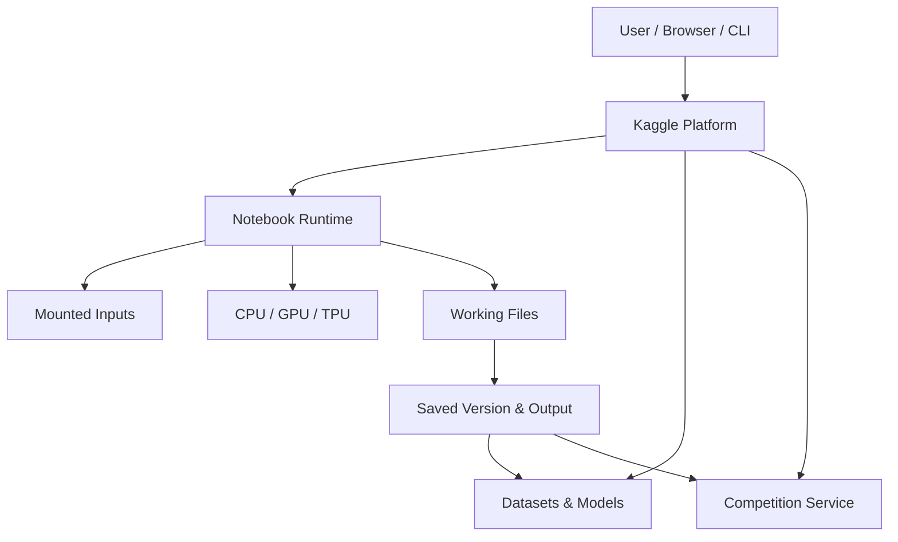
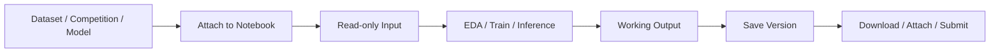
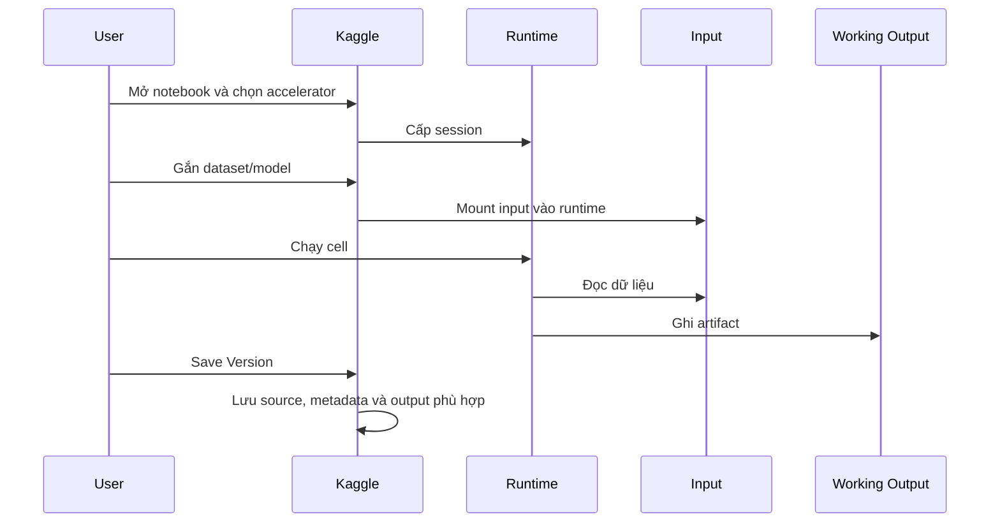
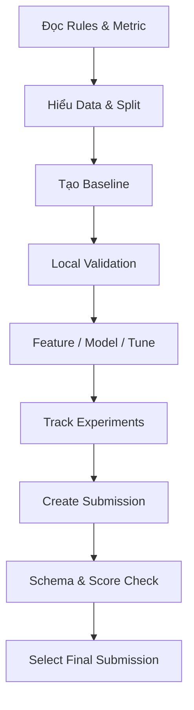
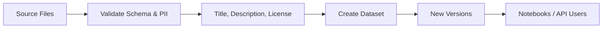
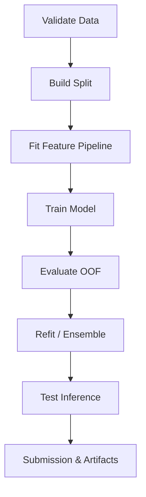

# Kaggle: Cơ sở lý thuyết, kiến trúc và thực hành

## 1. Mục tiêu tài liệu

Tài liệu này trình bày Kaggle theo hướng lý thuyết kết hợp thực hành, giúp người học nắm được:

- Kaggle là gì và vai trò của nền tảng trong học data science, machine learning và AI.
- Sự khác nhau giữa Kaggle Notebook, Dataset, Competition, Model, API/CLI và cộng đồng Kaggle.
- Cách môi trường Notebook trên cloud nhận dữ liệu đầu vào, chạy code, tạo output và lưu phiên bản.
- Cách dùng CPU, GPU hoặc TPU phù hợp với bài toán thay vì bật accelerator theo thói quen.
- Cách tìm, kiểm tra, sử dụng, tạo và version hóa dataset.
- Cách tham gia competition, xây validation, tạo submission và đọc leaderboard đúng cách.
- Cách dùng Kaggle CLI và `kagglehub` để tự động hóa việc tải dữ liệu, notebook output và model.
- Cách tổ chức một workflow ML có thể tái lập, tiết kiệm tài nguyên và tránh data leakage.
- Cách trích xuất frame từ video trực tiếp trên Kaggle — một use case thực tế thường gặp trong computer vision.
- Các lỗi thiết kế thường gặp và cách tránh khi dùng Kaggle cho học tập hoặc dự án.

Tài liệu phù hợp cho người mới đến mức trung cấp. Giao diện, loại accelerator, thời lượng phiên và quota có thể thay đổi theo tài khoản, khu vực hoặc chính sách của Kaggle. Khi triển khai thực tế, cần kiểm tra thông tin đang hiển thị trong Notebook và đối chiếu với [Kaggle Documentation](https://www.kaggle.com/docs).

## 2. Tổng quan về Kaggle

Kaggle là một nền tảng trực tuyến cho machine learning và data science. Nền tảng kết hợp nhiều chức năng vốn thường nằm ở các hệ thống tách biệt:

- Môi trường chạy code trên cloud bằng Notebook hoặc script.
- Kho dataset có khả năng chia sẻ và tạo phiên bản.
- Kho model đã huấn luyện.
- Competition với dữ liệu, metric, leaderboard và quy tắc chấm điểm.
- API, CLI và thư viện Python để tự động hóa workflow.
- Notebook công khai, thảo luận và tài nguyên học tập từ cộng đồng.

Theo tài liệu chính thức, Kaggle Notebooks là môi trường tính toán cloud để khám phá và chạy code ML theo cách có thể tái lập và cộng tác. Kaggle Datasets hỗ trợ công bố/chia sẻ dữ liệu công khai hoặc riêng tư; Kaggle Models là repository model được tích hợp với phần còn lại của nền tảng. Xem [Notebooks](https://www.kaggle.com/docs/notebooks), [Datasets](https://www.kaggle.com/docs/datasets) và [Models](https://www.kaggle.com/docs/models).

Kaggle thường được dùng cho:

- Học Python, Pandas, visualization, machine learning và deep learning.
- Thử nghiệm ý tưởng mà không cần cấu hình môi trường local từ đầu.
- Chạy EDA, feature engineering, training và inference.
- Dùng GPU/TPU cho workload phù hợp trong giới hạn nền tảng.
- Chia sẻ dataset, model và notebook.
- Xây portfolio thông qua notebook và competition.
- Benchmark mô hình trên một dataset và metric chung.
- Tải dữ liệu hoặc notebook output qua CLI/API để tích hợp với workflow local.

### 2.1. Đặc điểm nổi bật

| Đặc điểm | Ý nghĩa |
| --- | --- |
| Cloud Notebook | Chạy Python/R và các workload dữ liệu trên tài nguyên do Kaggle cấp. |
| Dataset integration | Gắn dataset vào notebook thay vì tải qua máy cá nhân rồi upload lại mỗi lần. |
| Accelerator | Có thể chọn CPU, GPU hoặc TPU tùy khả năng sẵn có và quota hiện tại. |
| Versioning | Notebook, dataset và model có thể có nhiều phiên bản. |
| Reproducibility | Một phiên bản notebook có thể gắn code, input và output để người khác kiểm tra lại. |
| Competition | Cung cấp problem, data, metric, rules, submission và leaderboard. |
| Community | Cho phép đọc, fork và học từ notebook/thảo luận công khai. |
| Automation | Kaggle CLI và `kagglehub` hỗ trợ thao tác tài nguyên bằng dòng lệnh hoặc Python. |

### 2.2. Kaggle không phải là gì

Kaggle rất hữu ích cho học tập và thử nghiệm, nhưng không nên mặc định xem là:

- Một VM cloud toàn quyền quản trị như Google Compute Engine hoặc Amazon EC2.
- Một hệ thống lưu trữ bền vững thay cho object storage trong production.
- Một nền tảng MLOps hoàn chỉnh cho serving, monitoring và autoscaling model.
- Một môi trường chạy job không giới hạn thời gian hoặc tài nguyên.
- Một benchmark đảm bảo mô hình sẽ tốt trong dữ liệu production.

Notebook của Kaggle là môi trường được quản lý. Người dùng nhận một runtime có giới hạn thay vì toàn quyền cấu hình hạ tầng.

## 3. Cơ sở lý thuyết

### 3.1. Notebook

Kaggle Notebook là môi trường viết và chạy code tương tác trên cloud. Một notebook thường gồm:

- Cell Markdown để mô tả bài toán, giả thuyết và kết quả.
- Cell code để đọc dữ liệu, huấn luyện, đánh giá và xuất artifact.
- Input là dataset, competition data, model hoặc notebook output được gắn vào.
- Runtime là session tính toán tạm thời.
- Output là file, biểu đồ, log, model checkpoint hoặc submission được sinh ra.
- Version là ảnh chụp có chủ đích của code và kết quả tại một thời điểm.

Notebook phù hợp cho EDA, thí nghiệm và trình bày. Khi project lớn dần, nên tách logic dùng lại thành function, module hoặc package thay vì để toàn bộ pipeline trong các cell phụ thuộc trạng thái ngầm.

### 3.2. Session và version

Hai khái niệm dễ nhầm:

| Khái niệm | Ý nghĩa |
| --- | --- |
| Session | Runtime đang hoạt động: process, RAM, accelerator và filesystem tạm thời. |
| Notebook version | Phiên bản đã lưu của source và, tùy cách lưu/chạy, kết quả thực thi. |

Session có thể dừng do hết thời gian, lỗi hoặc người dùng chủ động kết thúc. File chỉ tồn tại trong trạng thái tạm của session không nên được xem là dữ liệu bền vững. Khi cần giữ artifact, hãy ghi nó vào thư mục output phù hợp và lưu một version hoàn chỉnh.

Tài liệu Notebook chính thức mô tả thao tác **Save Version** để lưu thay đổi và tạo version của notebook: [Kaggle Notebooks documentation](https://www.kaggle.com/docs/notebooks).

### 3.3. Input và working directory

Trong notebook, dữ liệu được gắn vào thường xuất hiện dưới cây thư mục input; vùng working dùng để tạo file đầu ra. Cách tổ chức phổ biến là:

```text
/kaggle/input/<resource-slug>/...   # input được gắn vào
/kaggle/working/...                # file do notebook tạo ra
```

Nguyên tắc thiết kế:

- Xem input là dữ liệu nguồn, không sửa trực tiếp.
- Ghi file trung gian và artifact vào working directory.
- Không giả định mọi đường dẫn slug luôn giống tên hiển thị; hãy liệt kê file thực tế.
- Chỉ lưu output cần thiết vì output quá lớn làm version chậm và khó quản lý.

Ví dụ kiểm tra file:

```python
from pathlib import Path

for path in Path("/kaggle/input").rglob("*"):
    if path.is_file():
        print(path)
```

### 3.4. Dataset

Kaggle Dataset là một tài nguyên dữ liệu có owner, slug, metadata, file, license, visibility và version. Dataset khác với một file rời vì nó còn chứa ngữ cảnh giúp người dùng hiểu và tái sử dụng dữ liệu.

Một dataset tốt nên có:

- Mô tả nguồn gốc và mục đích thu thập.
- Data dictionary hoặc schema.
- License rõ ràng.
- Phạm vi, thời gian và đơn vị đo.
- Các bước làm sạch hoặc biến đổi đã thực hiện.
- Giới hạn, bias và dữ liệu thiếu.
- Version notes khi cập nhật.

Tài liệu Kaggle cho biết dataset có thể được chia sẻ công khai hoặc riêng tư và tích hợp trực tiếp với Notebooks: [Kaggle Datasets documentation](https://www.kaggle.com/docs/datasets).

### 3.5. Competition

Competition đóng gói một bài toán đánh giá gồm:

- Problem statement.
- Training data và test data.
- Evaluation metric.
- Submission format.
- Rules, timeline và eligibility.
- Public/private leaderboard hoặc cơ chế chấm điểm tương ứng.

Competition không chỉ là cuộc đua chọn model. Kết quả phụ thuộc vào cách validation mô phỏng test distribution, kiểm soát leakage, quản lý thí nghiệm và xây ensemble. Kaggle có nhiều loại competition cho các cấp độ khác nhau: [Kaggle Competition Documentation](https://www.kaggle.com/docs/competitions).

### 3.6. Metric

Metric là hàm biến prediction và ground truth thành điểm. Ví dụ thường gặp:

- Accuracy, F1 hoặc log loss cho classification.
- MAE, RMSE hoặc RMSLE cho regression.
- AUC cho ranking nhị phân.
- IoU/Dice cho segmentation.
- MAP/NDCG cho ranking hoặc retrieval.

Trước khi train cần trả lời:

1. Metric thưởng hoặc phạt điều gì?
2. Metric cần probability, class label hay ranking score?
3. Metric có nhạy với class imbalance không?
4. Có cần clip, transform hoặc post-process prediction không?
5. Local validation có tính metric giống hệt evaluator không?

### 3.7. Public và private leaderboard

Ở nhiều competition, public leaderboard chỉ dùng một phần test set để phản hồi trong thời gian thi, còn kết quả cuối dựa trên phần dữ liệu không dùng cho phản hồi công khai. Cơ chế cụ thể phải đọc trong rules/evaluation của từng competition.

Nếu liên tục chọn model theo public score, người thi có thể overfit leaderboard dù không thấy nhãn test. Vì vậy:

- Local cross-validation là tín hiệu chính.
- Public leaderboard là tín hiệu phụ.
- Không đổi pipeline chỉ vì một dao động rất nhỏ trên public score.
- Theo dõi cả mean và variance giữa các fold.

### 3.8. GPU và TPU

GPU phù hợp với phép toán tensor song song như deep learning, image/video và một số thư viện boosting có hỗ trợ GPU. TPU là accelerator chuyên dụng cho tensor workload và thường yêu cầu code/framework phù hợp. Kaggle có tài liệu riêng về [TPU](https://www.kaggle.com/docs/tpu) và [sử dụng GPU hiệu quả](https://www.kaggle.com/docs/efficient-gpu-usage).

Bật accelerator không tự động làm chương trình nhanh hơn. Pipeline có thể vẫn chậm do:

- Decode ảnh/video trên CPU.
- Đọc nhiều file nhỏ.
- Data loader thiếu worker hoặc prefetch.
- Batch quá nhỏ.
- Copy dữ liệu CPU–GPU liên tục.
- Model nhỏ đến mức overhead lớn hơn lợi ích song song.

Không ghi cứng quota hoặc model accelerator vào pipeline. Hãy kiểm tra accelerator và quota đang hiển thị trong giao diện tại thời điểm chạy.

### 3.9. Model và model variation

Kaggle Models là repository cho model đã huấn luyện, được tích hợp với notebook và competition. Một model có thể có framework, variation và version khác nhau. Khi tải model, phải xác định đúng handle và version, tránh dùng “latest” một cách vô thức trong thí nghiệm cần tái lập. Xem [Kaggle Models](https://www.kaggle.com/docs/models).

### 3.10. Fork, copy và provenance

Fork/copy notebook giúp tái sử dụng công việc công khai. Tuy nhiên, một notebook có thể phụ thuộc vào:

- Version dataset cũ.
- Package đã thay đổi.
- File output từ notebook khác.
- Internet hoặc secret không còn khả dụng.
- Random seed và hardware khác.

Vì vậy, “fork được” không đồng nghĩa “reproduce được”. Cần đọc input, version, package và assumptions trước khi dùng kết quả.

## 4. Kiến trúc Kaggle

### 4.1. Sơ đồ kiến trúc khái niệm



Sơ đồ thể hiện ranh giới quan trọng: catalog và competition thuộc lớp dịch vụ của nền tảng; notebook runtime là môi trường tính toán tạm thời; input được gắn vào runtime; output chỉ trở thành artifact dễ tái sử dụng khi được lưu thành version hoặc xuất thành tài nguyên khác.

### 4.2. Các thành phần quan trọng

| Thành phần | Vai trò |
| --- | --- |
| Web UI | Tìm resource, chỉnh notebook, xem experiment và leaderboard. |
| Notebook runtime | Chạy kernel, code và dependency trong session. |
| Kaggle Dataset | Lưu, mô tả, chia sẻ và version hóa dữ liệu. |
| Kaggle Model | Lưu model variation và version. |
| Notebook output | Artifact sinh ra từ một notebook version. |
| Competition service | Nhận submission, tính metric và cập nhật score/rank. |
| Kaggle CLI | Thao tác competition, dataset, kernel/notebook, model và forum từ terminal. |
| `kagglehub` | Thư viện Python để tải/đọc dataset, model và notebook output. |

### 4.3. Runtime image

Notebook chạy trong một software image do Kaggle quản lý. Repository chính thức [`Kaggle/docker-python`](https://github.com/Kaggle/docker-python) chứa Dockerfile cho các Python image CPU và GPU dùng bởi Kaggle Notebooks. Điều này giải thích vì sao:

- Nhiều thư viện đã được cài sẵn.
- Package version có thể thay đổi khi Kaggle cập nhật image.
- `pip install` bổ sung chỉ ảnh hưởng môi trường hiện tại.
- Một notebook cũ có thể chạy khác sau khi base image thay đổi.

Để tăng tính tái lập, hãy in version các package cốt lõi:

```python
import platform
import numpy as np
import pandas as pd

print("Python:", platform.python_version())
print("NumPy:", np.__version__)
print("Pandas:", pd.__version__)
```

### 4.4. Luồng dữ liệu



Tối ưu quan trọng nhất là đưa compute đến gần data: gắn dataset vào notebook rồi xử lý trên Kaggle, thay vì tải dataset lớn xuống local, giải nén và upload lại từng phần.

## 5. Vòng đời xử lý với Kaggle

### 5.1. Luồng chạy notebook tương tác



### 5.2. Luồng competition



### 5.3. Luồng publish dataset



Mỗi update phải có version notes đủ rõ để downstream user biết schema, file hoặc semantics đã đổi.

## 6. Các khái niệm cốt lõi

### 6.1. Owner và slug

Tài nguyên Kaggle thường được định danh bằng handle có owner và slug:

```text
owner/dataset-slug
owner/notebook-slug
owner/model/framework/variation
```

Slug là phần định danh trong URL, không nhất thiết giống hoàn toàn title hiển thị.

### 6.2. Input resource

Input của notebook có thể là:

- Dataset công khai hoặc riêng tư mà người dùng có quyền truy cập.
- Competition data sau khi chấp nhận rules.
- Model resource.
- Output/version của notebook khác.

Gắn đúng input tạo dependency graph rõ ràng hơn việc download ngẫu nhiên trong code.

### 6.3. Output artifact

Artifact nên là sản phẩm có giá trị dùng lại, ví dụ:

- `submission.csv`.
- Model checkpoint tốt nhất.
- Feature table đã làm sạch.
- Embedding hoặc index.
- Metric report.
- Frame/metadata đã trích xuất.

Không nên lưu toàn bộ cache, file tạm hoặc checkpoint kém hơn nếu không cần thiết.

### 6.4. Dataset version

Version mới nên được tạo khi:

- Bổ sung hoặc xóa file.
- Sửa nhãn.
- Thay schema.
- Thay cách tiền xử lý.
- Cập nhật dữ liệu mới.

Notebook cần pin hoặc ghi lại version đầu vào nếu kết quả phải tái lập chính xác.

### 6.5. Notebook version

Notebook version đóng vai trò như một experiment snapshot. Version notes nên nêu:

- Mục tiêu thí nghiệm.
- Thay đổi chính.
- Data/model version.
- Validation score.
- Seed và cấu hình quan trọng.
- Artifact được tạo.

### 6.6. Internet access

Internet trong runtime có thể phụ thuộc vào setting, competition rules hoặc yêu cầu xác minh tài khoản. Với code competition, môi trường chấm có thể có các ràng buộc riêng. Không nên xây pipeline final phụ thuộc vào việc gọi API bên ngoài nếu rules không cho phép.

### 6.7. Secret

API token, cloud credential và private key không được hard-code vào notebook công khai. Dùng cơ chế secret được nền tảng hỗ trợ hoặc biến môi trường; không in secret vào log.

### 6.8. Random seed

Seed giúp giảm một nguồn nondeterminism nhưng không đảm bảo kết quả bit-for-bit trên mọi hardware và library version.

```python
import os
import random
import numpy as np

SEED = 42
os.environ["PYTHONHASHSEED"] = str(SEED)
random.seed(SEED)
np.random.seed(SEED)
```

Với framework deep learning, cần cấu hình thêm seed và deterministic behavior theo tài liệu của framework đang dùng.

### 6.9. Data leakage

Leakage xảy ra khi thông tin không thực sự có ở thời điểm inference lọt vào training hoặc validation. Các dạng thường gặp:

- Fit scaler/encoder trên toàn bộ dữ liệu trước khi split.
- Random split với dữ liệu time series.
- Cùng user/patient xuất hiện ở cả train và validation.
- Feature được tính từ target hoặc tương lai.
- Tune theo public leaderboard quá nhiều.

### 6.10. Submission

Submission phải đúng schema mà competition yêu cầu:

- Đúng tên cột.
- Đúng số dòng.
- Đúng ID và thứ tự nếu evaluator yêu cầu.
- Không có `NaN`/`inf` ngoài quy định.
- Prediction đúng kiểu và range.

Ví dụ kiểm tra:

```python
import numpy as np
import pandas as pd

sample = pd.read_csv("/kaggle/input/competition/sample_submission.csv")
submission = sample.copy()
submission["target"] = predictions

assert len(submission) == len(sample)
assert list(submission.columns) == list(sample.columns)
assert np.isfinite(submission.select_dtypes("number").to_numpy()).all()

submission.to_csv("/kaggle/working/submission.csv", index=False)
```

### 6.11. Experiment tracking

Ít nhất nên lưu bảng:

| Run | Data version | Split | Model | Key params | CV mean | CV std | Public score | Notes |
| --- | --- | --- | --- | --- | ---: | ---: | ---: | --- |
| 001 | v1 | 5-fold | Baseline | default | ... | ... | ... | sanity check |

Không dựa vào tên notebook kiểu `final_v7_really_final` để quản lý thí nghiệm.

## 7. Bắt đầu sử dụng Kaggle

### 7.1. Quy trình ban đầu

1. Tạo và xác minh tài khoản nếu tính năng yêu cầu.
2. Mở trang [Kaggle Code](https://www.kaggle.com/code).
3. Tạo Notebook mới.
4. Gắn dataset hoặc competition data qua phần Input.
5. Chọn accelerator phù hợp.
6. Liệt kê file và đọc một mẫu nhỏ.
7. Xây baseline trước khi tối ưu.
8. Ghi artifact vào `/kaggle/working`.
9. Lưu version có notes.

### 7.2. Kiểm tra môi trường

```python
import os
import platform

print("Python:", platform.python_version())
print("CPU count:", os.cpu_count())

try:
    import torch
    print("PyTorch:", torch.__version__)
    print("CUDA available:", torch.cuda.is_available())
    if torch.cuda.is_available():
        print("GPU:", torch.cuda.get_device_name(0))
except ImportError:
    print("PyTorch is not installed")
```

### 7.3. Khám phá dữ liệu an toàn

```python
from pathlib import Path
import pandas as pd

DATA_DIR = Path("/kaggle/input/my-dataset")
csv_files = list(DATA_DIR.rglob("*.csv"))
print(csv_files)

df = pd.read_csv(csv_files[0], nrows=1_000)
print(df.shape)
display(df.head())
display(df.dtypes)
```

Đọc mẫu nhỏ trước giúp phát hiện separator, encoding, schema và memory risk.

## 8. Kaggle Notebooks trong thực tế

### 8.1. Cấu trúc notebook đề xuất

Một notebook rõ ràng có thể gồm:

1. Problem và metric.
2. Imports và config.
3. Paths và data version.
4. Data validation.
5. EDA tối thiểu có mục đích.
6. Split/validation.
7. Feature pipeline.
8. Training.
9. Evaluation.
10. Inference và artifact export.

### 8.2. Đặt config ở một nơi

```python
from dataclasses import dataclass

@dataclass(frozen=True)
class Config:
    seed: int = 42
    n_splits: int = 5
    batch_size: int = 32
    epochs: int = 10
    num_workers: int = 2

CFG = Config()
```

### 8.3. Không phụ thuộc trạng thái cell ngầm

Notebook dễ lỗi khi cell được chạy sai thứ tự. Trước khi lưu phiên bản quan trọng:

- Restart session/kernel nếu có thể.
- Chạy toàn bộ notebook từ đầu.
- Đảm bảo không cần biến được tạo thủ công trong session cũ.
- Xác nhận output sinh ra từ code hiện tại.

### 8.4. Cài package

```python
!pip install -q package-name==x.y.z
```

Nguyên tắc:

- Chỉ cài package thực sự cần.
- Pin version cho dependency quan trọng.
- Ghi chú nếu package cần internet.
- Sau khi cài package nền tảng, có thể phải restart runtime để tránh module cũ đã import.
- Không giả định phiên cài đặt này tồn tại ở session mới.

### 8.5. Logging thay vì output quá dài

```python
import logging

logging.basicConfig(
    level=logging.INFO,
    format="%(asctime)s | %(levelname)s | %(message)s",
)
logger = logging.getLogger(__name__)
logger.info("Start training")
```

Không in từng sample hoặc từng batch vì notebook khó đọc và frontend có thể chậm.

### 8.6. Checkpoint

Với training dài:

- Lưu best checkpoint theo validation metric.
- Lưu optimizer/scheduler state nếu cần resume.
- Ghi epoch, config, seed và metric cùng checkpoint.
- Kiểm tra checkpoint có thể load trước khi kết thúc session.
- Không chỉ lưu checkpoint cuối cùng.

## 9. Kaggle Datasets

### 9.1. Tìm và đánh giá dataset

Trước khi dùng dataset, kiểm tra:

- Owner và nguồn gốc.
- License và quyền sử dụng.
- Ngày/version cập nhật.
- Data dictionary.
- Completeness và missingness.
- Bias, sampling và phạm vi địa lý/thời gian.
- PII hoặc dữ liệu nhạy cảm.
- Notebook/discussion chỉ ra lỗi đã biết.

Popularity không đồng nghĩa với chất lượng hoặc phù hợp use case.

### 9.2. Tạo dataset bằng CLI

Theo tutorial chính thức của Kaggle CLI, workflow cơ bản là:

```bash
mkdir my-new-dataset
cd my-new-dataset
kaggle datasets init
```

Sau khi chỉnh `dataset-metadata.json` và đưa file dữ liệu vào thư mục:

```bash
kaggle datasets create -p .
```

Tài liệu chi tiết: [Kaggle CLI Tutorials – Create a Dataset](https://github.com/Kaggle/kaggle-cli/blob/main/docs/tutorials.md).

### 9.3. Download dataset bằng CLI

```bash
kaggle datasets list --search "video frames"
kaggle datasets files owner/dataset-slug
kaggle datasets download owner/dataset-slug -p ./data --unzip
```

Kiểm tra cú pháp của phiên bản đang cài:

```bash
kaggle datasets download --help
```

Tài liệu command chính thức: [Kaggle CLI datasets commands](https://github.com/Kaggle/kaggle-cli/blob/main/docs/datasets.md).

### 9.4. Thiết kế dataset tốt

- Dùng format phù hợp với access pattern.
- Tránh hàng triệu file rất nhỏ nếu có thể shard hợp lý.
- Không nén lồng nhiều tầng không cần thiết.
- Có checksum hoặc cách xác minh tính toàn vẹn cho dữ liệu quan trọng.
- Giữ raw data và processed data thành các lớp rõ ràng.
- Không overwrite semantics của cột mà không tạo version mới.
- Ghi license và attribution.

## 10. Kaggle Competitions

### 10.1. Quy trình tham gia

1. Đọc Overview, Data, Evaluation, Timeline và Rules.
2. Chấp nhận rules trước khi truy cập dữ liệu nếu cần.
3. Mở `sample_submission` để hiểu schema.
4. Xây baseline đơn giản chạy end-to-end.
5. Tạo validation mô phỏng test.
6. Ghi log thí nghiệm.
7. Submit ít nhưng có giả thuyết rõ ràng.
8. Chọn final submission dựa trên local evidence và quy tắc competition.

### 10.2. Baseline tốt cần gì

Baseline không cần mạnh nhất, nhưng phải:

- Đọc được toàn bộ dữ liệu cần thiết.
- Không leakage rõ ràng.
- Tính đúng metric.
- Train và inference trong resource budget.
- Sinh submission hợp lệ.
- Có thể chạy lại từ đầu.

### 10.3. Chọn validation split

| Dạng dữ liệu | Split nên cân nhắc |
| --- | --- |
| IID tabular | K-fold hoặc stratified K-fold |
| Time series | Time-based/rolling split |
| Nhiều sample cùng user/patient | Group-based split |
| Spatial data | Geographic/block split |
| Class rất hiếm | Stratification và metric phù hợp |

Split phải mô phỏng cách test set được tạo, không chỉ chọn strategy phổ biến nhất.

### 10.4. Thao tác competition bằng CLI

```bash
# Tìm competition
kaggle competitions list --search titanic

# Liệt kê và tải file
kaggle competitions files titanic
kaggle competitions download titanic -p ./data

# Submit
kaggle competitions submit titanic \
  -f submission.csv \
  -m "baseline v1"

# Xem lịch sử submission
kaggle competitions submissions titanic
```

Các lệnh và option được duy trì tại [Kaggle CLI competitions commands](https://github.com/Kaggle/kaggle-cli/blob/main/docs/competitions.md).

### 10.5. Chống overfit leaderboard

- Định nghĩa validation trước khi xem nhiều public score.
- Không thay seed rồi chọn seed tốt nhất theo public leaderboard.
- Chỉ submit thay đổi có giả thuyết.
- Lưu CV score, public score và thay đổi cùng nhau.
- Ưu tiên cải thiện ổn định qua fold hơn một bước nhảy nhỏ không giải thích được.

## 11. Kaggle CLI và `kagglehub`

### 11.1. Cài Kaggle CLI

Tài liệu hiện tại của CLI yêu cầu kiểm tra điều kiện Python trong bản đang dùng và cài package bằng `pip`:

```bash
pip install kaggle
kaggle --help
```

Kaggle CLI chính thức hỗ trợ competition, dataset, model, kernel/notebook và forum. Xem repository [`Kaggle/kaggle-cli`](https://github.com/Kaggle/kaggle-cli) và [user documentation](https://github.com/Kaggle/kaggle-cli/blob/main/docs/README.md).

### 11.2. Xác thực

Các cách được tài liệu CLI chính thức liệt kê gồm OAuth, environment variable, token file và legacy `kaggle.json`. Ví dụ:

```bash
kaggle auth login
```

Hoặc dùng token từ trang [Kaggle Settings – API](https://www.kaggle.com/settings/api):

```bash
export KAGGLE_API_TOKEN="<token>"
```

Không commit token vào Git, notebook public, dataset hoặc Docker image.

### 11.3. `kagglehub`

`kagglehub` là thư viện Python chính thức để tương tác với dataset, model và notebook output. Trong Kaggle Notebook, resource tải bằng `kagglehub` có thể được attach và dùng shared resource cache; ngoài Kaggle, resource được tải vào local cache. Xem [`Kaggle/kagglehub`](https://github.com/Kaggle/kagglehub).

Cài đặt:

```bash
pip install kagglehub
```

Đăng nhập khi môi trường yêu cầu:

```python
import kagglehub

kagglehub.login()
```

Ví dụ tải model theo tài liệu chính thức:

```python
import kagglehub

path = kagglehub.model_download(
    "google/bert/tensorFlow2/answer-equivalence-bem"
)
print(path)
```

### 11.4. Khi nào dùng Web UI, CLI hoặc `kagglehub`

| Công cụ | Phù hợp khi |
| --- | --- |
| Web UI | Khám phá, đọc mô tả/rules, chỉnh notebook và xem leaderboard. |
| Kaggle CLI | Script shell, CI, tải/upload hàng loạt, push/pull notebook. |
| `kagglehub` | Python pipeline cần tải/đọc resource programmatically. |

## 12. Workflow machine learning thực tế

### 12.1. Pipeline chuẩn



### 12.2. Fit transform đúng phạm vi

Mọi transform học tham số từ dữ liệu phải fit bên trong training fold:

- Imputer.
- Scaler.
- Category encoder.
- Target encoding.
- Feature selection.
- Text vocabulary.

Nếu fit trước khi split, validation score có thể bị lạc quan.

### 12.3. Out-of-fold prediction

OOF prediction cho mỗi sample train được tạo bởi model không train trên sample đó. Nó hữu ích để:

- Ước lượng generalization.
- So sánh model.
- Tối ưu threshold.
- Train stacker/ensemble ít leakage hơn.

### 12.4. Ensemble

Ensemble hiệu quả khi các model có lỗi khác nhau. Không nên blend chỉ vì có nhiều model. Cần kiểm tra:

- Correlation giữa prediction.
- OOF improvement.
- Stability qua fold.
- Inference cost.
- Rule và resource limit.

### 12.5. Artifact manifest

Mỗi run quan trọng nên tạo metadata machine-readable:

```json
{
  "run_id": "exp_012",
  "seed": 42,
  "data_version": "v3",
  "split": "group_kfold_5",
  "model": "lightgbm",
  "cv_mean": 0.0,
  "cv_std": 0.0,
  "artifacts": ["model.txt", "oof.parquet", "submission.csv"]
}
```

## 13. Trích xuất frame từ video trên Kaggle

### 13.1. Khi Kaggle phù hợp

Kaggle phù hợp khi:

- Video đã nằm trong Kaggle Dataset hoặc có thể upload thành dataset hợp lệ.
- Công việc là batch/offline.
- Tổng thời gian và output nằm trong quota/session hiện tại.
- Không cần service chạy liên tục.

Cloud VM hoặc batch service phù hợp hơn khi cần runtime dài, disk lớn, network tùy chỉnh, job scheduling hoặc kiểm soát hạ tầng.

### 13.2. Nguyên tắc tối ưu

Không nên trích mọi frame rồi mới lọc nếu chỉ cần một frame mỗi vài giây. Số frame xấp xỉ:

```text
frames ≈ video_duration_seconds × target_fps
```

Ví dụ video 1 giờ ở 30 FPS có khoảng 108.000 frame. Nếu chỉ cần 1 FPS, số frame giảm còn khoảng 3.600 — giảm mạnh decode output, inode và dung lượng lưu.

### 13.3. Trích frame bằng FFmpeg

FFmpeg thường hiệu quả cho batch decode:

```python
from pathlib import Path
import subprocess

video = Path("/kaggle/input/my-videos/sample.mp4")
output_dir = Path("/kaggle/working/frames/sample")
output_dir.mkdir(parents=True, exist_ok=True)

cmd = [
    "ffmpeg",
    "-hide_banner",
    "-loglevel", "error",
    "-i", str(video),
    "-vf", "fps=1",
    "-q:v", "2",
    str(output_dir / "frame_%06d.jpg"),
]
subprocess.run(cmd, check=True)
```

`fps=1` lấy xấp xỉ một frame mỗi giây. Hãy thay đổi theo mục tiêu downstream, không theo FPS gốc.

### 13.4. Trích frame bằng OpenCV

OpenCV phù hợp khi cần xử lý logic theo frame:

```python
from pathlib import Path
import cv2

video_path = Path("/kaggle/input/my-videos/sample.mp4")
output_dir = Path("/kaggle/working/frames/sample")
output_dir.mkdir(parents=True, exist_ok=True)

cap = cv2.VideoCapture(str(video_path))
source_fps = cap.get(cv2.CAP_PROP_FPS)
sample_every_seconds = 1.0
step = max(1, round(source_fps * sample_every_seconds))

frame_idx = 0
saved = 0
while True:
    ok, frame = cap.read()
    if not ok:
        break
    if frame_idx % step == 0:
        out = output_dir / f"frame_{frame_idx:08d}.jpg"
        cv2.imwrite(str(out), frame, [cv2.IMWRITE_JPEG_QUALITY, 90])
        saved += 1
    frame_idx += 1

cap.release()
print("Saved:", saved)
```

### 13.5. Tránh hàng triệu file nhỏ

Nếu output lớn:

- Chỉ giữ frame cần thiết.
- Resize khi full resolution không cần.
- Chọn JPEG/WebP quality phù hợp.
- Ghi metadata `video_id`, `frame_index`, `timestamp_ms`, `path` vào Parquet/CSV.
- Shard frame thành archive hoặc định dạng phù hợp pipeline downstream.
- Xóa file trung gian không cần trước khi Save Version.

Ví dụ metadata:

```python
import pandas as pd

metadata = pd.DataFrame(records)
metadata.to_parquet(
    "/kaggle/working/frame_metadata.parquet",
    index=False,
)
```

### 13.6. CPU hay GPU cho video

Decode video thông thường có thể vẫn chạy trên CPU; bật GPU không đảm bảo FFmpeg/OpenCV đang dùng hardware decode. GPU tạo lợi ích rõ hơn khi frame được đưa ngay vào model inference/training theo batch. Hãy đo riêng:

- Thời gian decode.
- Thời gian resize/augmentation.
- Thời gian model inference.
- Disk throughput.
- Số frame/giây end-to-end.

## 14. Hiệu năng và quản lý tài nguyên

### 14.1. Đo bottleneck trước khi tối ưu

```python
from time import perf_counter

start = perf_counter()
# workload
elapsed = perf_counter() - start
print(f"Elapsed: {elapsed:.2f}s")
```

Theo dõi CPU, RAM, GPU utilization, GPU memory, disk và thời gian theo stage.

### 14.2. Tối ưu I/O

- Đọc đúng cột cần thiết.
- Dùng dtype hợp lý.
- Ưu tiên Parquet cho bảng lớn khi workflow hỗ trợ.
- Batch file nhỏ hoặc tạo shard.
- Cache feature tốn thời gian nếu còn dùng lại và đủ dung lượng.
- Tránh giải nén lại cùng dữ liệu ở mỗi cell.

### 14.3. Tối ưu memory

```python
df.info(memory_usage="deep")
```

- Dùng `float32` thay `float64` khi độ chính xác cho phép.
- Dùng category cho chuỗi lặp nhiều nếu phù hợp.
- Đọc theo chunk.
- Xóa object lớn không còn dùng.
- Không giữ đồng thời nhiều bản copy dataframe.

### 14.4. Tối ưu GPU

- Kiểm tra model và tensor thực sự ở GPU.
- Tăng batch size đến mức hợp lý, không cố dùng hết VRAM bằng mọi giá.
- Dùng mixed precision khi framework/model hỗ trợ.
- Cải thiện data loader và prefetch.
- Tránh `.cpu()`, `.numpy()` hoặc đồng bộ GPU trong mỗi step nếu không cần.
- Theo dõi hướng dẫn chính thức tại [Efficient GPU Usage Tips](https://www.kaggle.com/docs/efficient-gpu-usage).

### 14.5. Chi phí

Kaggle cung cấp compute trong giới hạn nền tảng thay vì billing theo kiểu VM thông thường. “Không trả tiền trực tiếp” không có nghĩa là tài nguyên vô hạn. Chi phí thực tế vẫn gồm:

- Quota accelerator.
- Thời gian chờ và session bị ngắt.
- Công sức chạy lại do không checkpoint.
- Dung lượng output.
- Khó khăn khi chuyển pipeline sang production.

## 15. Reproducibility và cộng tác

### 15.1. Checklist reproducibility

- Ghi nguồn và version của input.
- Pin dependency quan trọng.
- Lưu seed và split indices.
- Tách config khỏi code.
- Chạy toàn bộ notebook từ session sạch.
- Lưu metric và artifact cùng run metadata.
- Không phụ thuộc vào file tạm không được publish.
- Có README/Markdown giải thích cách chạy.

### 15.2. Tổ chức code

Khi logic vượt quá một notebook:

```text
project/
├── notebook.ipynb
├── src/
│   ├── data.py
│   ├── features.py
│   ├── model.py
│   └── metrics.py
├── configs/
│   └── baseline.yaml
└── README.md
```

Notebook nên điều phối và trình bày; module nên chứa logic dễ test và dùng lại.

### 15.3. Ghi attribution

Khi dùng notebook, dataset hoặc idea của người khác:

- Link nguồn gốc.
- Nêu phần đã thay đổi.
- Tuân thủ license và competition rules.
- Không trình bày bản sao như công việc nguyên bản.

## 16. Bảo mật, quyền riêng tư và license

### 16.1. Không để lộ secret

Không viết:

```python
API_KEY = "real-secret-value"
```

Không upload:

- `kaggle.json`.
- Cloud service-account key.
- SSH private key.
- Database credential.
- File `.env` có secret.

Nếu secret đã xuất hiện trong notebook/version công khai, cần revoke/rotate ngay; xóa cell không làm credential cũ an toàn trở lại.

### 16.2. Kiểm tra dữ liệu nhạy cảm

Trước khi publish dataset:

- Kiểm tra PII và consent.
- Xác minh quyền phân phối.
- Loại credential và metadata nhạy cảm.
- Đánh giá khả năng tái định danh.
- Ghi limitation và intended use.

### 16.3. License

Khả năng tải được dữ liệu không đồng nghĩa được quyền dùng cho mọi mục đích. Cần đọc:

- Dataset license.
- Competition rules.
- Model license.
- License của source code/notebook.
- Điều kiện của dữ liệu gốc nếu dataset là bản tổng hợp.

## 17. So sánh Kaggle với công nghệ liên quan

### 17.1. Kaggle và Google Colab

| Tiêu chí | Kaggle | Google Colab |
| --- | --- | --- |
| Điểm mạnh | Dataset, competition, notebook và model tích hợp | Notebook tổng quát, tích hợp hệ sinh thái Google |
| Dữ liệu | Attach Kaggle resources trực tiếp | Thường dùng Drive, upload hoặc cloud storage |
| Competition | Tích hợp trực tiếp | Không phải chức năng cốt lõi |
| Compute | Runtime và quota do Kaggle quản lý | Runtime và quota theo tier/chính sách Colab |
| Use case | ML competition, dataset exploration, portfolio | Học tập và notebook cloud tổng quát |

### 17.2. Kaggle và local machine

| Tiêu chí | Kaggle | Local |
| --- | --- | --- |
| Setup | Nhiều package có sẵn | Tự quản lý môi trường |
| Hardware | Theo tài nguyên/quota Kaggle | Theo máy sở hữu |
| Data access | Nhanh với Kaggle resources | Phải tải về hoặc mount storage |
| Kiểm soát | Hạn chế hơn | Cao hơn |
| Persistence | Cần save version/artifact | Disk local bền vững theo máy |

### 17.3. Kaggle và cloud VM

| Tiêu chí | Kaggle Notebook | Cloud VM |
| --- | --- | --- |
| Quản trị OS | Bị giới hạn | Có thể có quyền quản trị đầy đủ |
| Billing | Theo quota/policy nền tảng | Thường theo thời gian và tài nguyên sử dụng |
| Runtime dài | Bị giới hạn bởi session | Có thể chạy dài nếu VM còn hoạt động và được trả phí |
| Network/storage | Theo thiết kế Kaggle | Tùy chỉnh VPC, disk, object storage |
| Production | Chủ yếu thử nghiệm/batch | Phù hợp hơn cho workload được vận hành có kiểm soát |

Kaggle tốt để học, benchmark và thử nghiệm. Cloud VM tốt hơn khi cần kiểm soát hệ thống, pipeline dài hoặc tích hợp hạ tầng production.

## 18. Các lỗi thường gặp

### 18.1. File not found

Nguyên nhân thường là đoán sai slug hoặc đường dẫn. Hãy liệt kê file:

```python
from pathlib import Path
print(list(Path("/kaggle/input").iterdir()))
```

### 18.2. Out of memory

Giải pháp:

- Đọc mẫu/chunk.
- Giảm batch size.
- Giảm image resolution hoặc sequence length.
- Dùng dtype nhỏ hơn.
- Tránh giữ prediction/feature trùng lặp.
- Gradient accumulation nếu phù hợp.

### 18.3. GPU không được sử dụng

Kiểm tra:

- Accelerator đã bật chưa.
- Framework thấy CUDA chưa.
- Model và tensor cùng device chưa.
- Workload có thực sự hỗ trợ GPU không.
- Bottleneck có nằm ở I/O/CPU không.

### 18.4. Notebook chạy tương tác được nhưng Save Version lỗi

Nguyên nhân có thể là:

- Cell phụ thuộc trạng thái cũ.
- Package tải từ internet nhưng batch run không truy cập được.
- Đường dẫn file tạm.
- Runtime hết resource.
- Code yêu cầu input thủ công.

Giải pháp là chạy từ session sạch và loại bỏ dependency ngầm.

### 18.5. Submission sai định dạng

So sánh trực tiếp với `sample_submission`: column, row count, ID, dtype, missing value và order.

### 18.6. Local CV tốt nhưng leaderboard kém

Có thể do:

- Split không mô phỏng test.
- Leakage.
- Distribution shift.
- Metric local sai.
- Preprocessing train/test khác nhau.
- Overfit validation.

### 18.7. Bật GPU nhưng chậm hơn CPU

Model quá nhỏ, batch nhỏ hoặc pipeline bị giới hạn bởi decode/I/O. Cần profile thay vì giả định.

### 18.8. Output quá lớn

Chỉ giữ artifact cuối, giảm sample rate/quality, dùng Parquet/shard, và không lưu cache không cần thiết.

### 18.9. Hard-code token

Token có thể bị lộ qua version, fork, log hoặc screenshot. Dùng secret/environment variable và rotate token nếu nghi ngờ.

### 18.10. Dùng notebook công khai mà không kiểm tra license

Notebook chạy được không có nghĩa dataset/model/code được phép tái phân phối hoặc dùng thương mại.

## 19. Bài tập thực hành

### Bài 1: Notebook đầu tiên

- Tạo notebook.
- Gắn một dataset CSV.
- Liệt kê file.
- Đọc 1.000 dòng.
- In schema, missing values và thống kê cơ bản.
- Lưu một version có notes.

### Bài 2: Baseline classification

- Chọn một dataset tabular.
- Tạo train/validation split phù hợp.
- Dùng preprocessing pipeline.
- Train baseline.
- Ghi metric và confusion matrix.

### Bài 3: Competition submission

- Chọn competition dạng Getting Started/Playground phù hợp.
- Đọc rules và metric.
- Tạo baseline end-to-end.
- Validate schema so với `sample_submission`.
- Submit và ghi lại CV/public score.

### Bài 4: Kaggle CLI

- Cài CLI.
- Xác thực an toàn.
- Search dataset.
- Download dataset.
- Liệt kê competition.
- Không đưa token vào Git.

### Bài 5: Publish dataset

- Chuẩn bị một dataset nhỏ.
- Viết mô tả, schema, nguồn và license.
- Chạy `kaggle datasets init`.
- Tạo dataset private trước.
- Tạo version thứ hai với version notes.

### Bài 6: Trích frame video

- Upload/gắn một video hợp lệ.
- Dùng FFmpeg lấy 1 FPS.
- Tạo metadata timestamp/path.
- Đo thời gian và dung lượng output.
- So sánh JPEG quality 90 và 75.

### Bài 7: Profile GPU

- Train cùng model trên CPU và GPU.
- Đo data loading và training riêng.
- Thử hai batch size.
- Giải thích bottleneck dựa trên số đo.

## 20. Lộ trình học đề xuất

1. Nắm Notebook, Dataset, input, working output và version.
2. Thực hành đọc CSV/Parquet, EDA và data validation.
3. Học train/validation split, metric và leakage.
4. Hoàn thành một baseline end-to-end.
5. Tham gia một competition nhập môn.
6. Học feature pipeline và cross-validation.
7. Học GPU data pipeline, checkpoint và mixed precision.
8. Dùng Kaggle CLI và `kagglehub`.
9. Publish một dataset có metadata/license rõ ràng.
10. Tách logic lớn thành module/package.
11. Học experiment tracking và ensemble dựa trên OOF.
12. Chuyển một workflow ổn định sang local/cloud VM khi cần production control.

## 21. Kết luận

Kaggle không chỉ là nơi thi machine learning. Đây là một môi trường tích hợp để tìm dữ liệu, chạy notebook, thử nghiệm model, chia sẻ artifact và đánh giá giải pháp theo metric chung. Giá trị lớn nhất đến từ việc hiểu ranh giới giữa runtime tạm thời và resource có version, giữa public score và khả năng tổng quát hóa, cũng như giữa tiện lợi của notebook và yêu cầu kiểm soát của production.

Một workflow Kaggle tốt cần: input có provenance, validation phù hợp, code chạy lại được, artifact có version, secret được bảo vệ và tài nguyên được đo trước khi tối ưu. Với workload như trích xuất frame video, đưa compute đến gần dataset có thể tiết kiệm thời gian truyền dữ liệu; nhưng phải kiểm soát sample rate, số file, dung lượng output và giới hạn session.

## 22. Tài liệu tham khảo

Nguồn được ưu tiên theo thứ tự: tài liệu chính thức của Kaggle, repository do tổ chức Kaggle duy trì, rồi tài liệu của framework liên quan nếu cần. Các nguồn dưới đây được truy cập ngày **2026-07-13**.

1. [Kaggle Documentation – Getting Started](https://www.kaggle.com/docs)
2. [Kaggle Notebooks Documentation](https://www.kaggle.com/docs/notebooks)
3. [Kaggle Datasets Documentation](https://www.kaggle.com/docs/datasets)
4. [Kaggle Competition Documentation](https://www.kaggle.com/docs/competitions)
5. [Kaggle Models Documentation](https://www.kaggle.com/docs/models)
6. [Kaggle Public API Documentation](https://www.kaggle.com/docs/api)
7. [Kaggle TPU Documentation](https://www.kaggle.com/docs/tpu)
8. [Kaggle Efficient GPU Usage Tips](https://www.kaggle.com/docs/efficient-gpu-usage)
9. [Kaggle Packages Documentation](https://www.kaggle.com/docs/packages)
10. [Kaggle CLI – Official Repository](https://github.com/Kaggle/kaggle-cli)
11. [Kaggle CLI – User Documentation](https://github.com/Kaggle/kaggle-cli/blob/main/docs/README.md)
12. [Kaggle CLI – Competitions Commands](https://github.com/Kaggle/kaggle-cli/blob/main/docs/competitions.md)
13. [Kaggle CLI – Datasets Commands](https://github.com/Kaggle/kaggle-cli/blob/main/docs/datasets.md)
14. [Kaggle CLI – Kernels Commands](https://github.com/Kaggle/kaggle-cli/blob/main/docs/kernels.md)
15. [Kaggle CLI – Tutorials](https://github.com/Kaggle/kaggle-cli/blob/main/docs/tutorials.md)
16. [kagglehub – Official Python Library](https://github.com/Kaggle/kagglehub)
17. [Kaggle Python Docker Image](https://github.com/Kaggle/docker-python)

> Lưu ý: quota, accelerator, image package và chi tiết giao diện là thông tin có thể thay đổi. Hãy xem UI và tài liệu chính thức tại thời điểm chạy thay vì dựa vào số liệu được chép cố định từ bài viết cũ.
