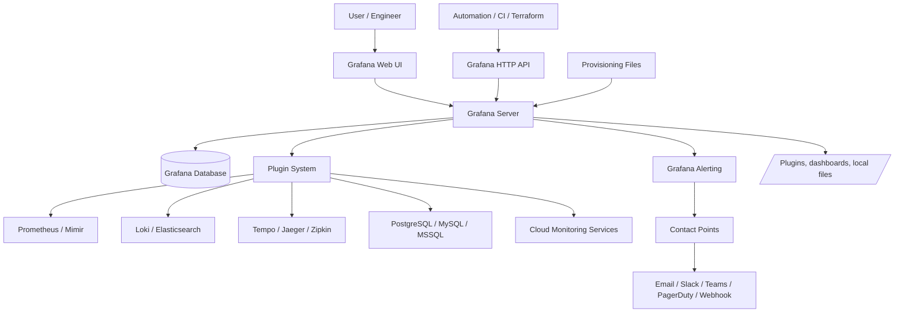
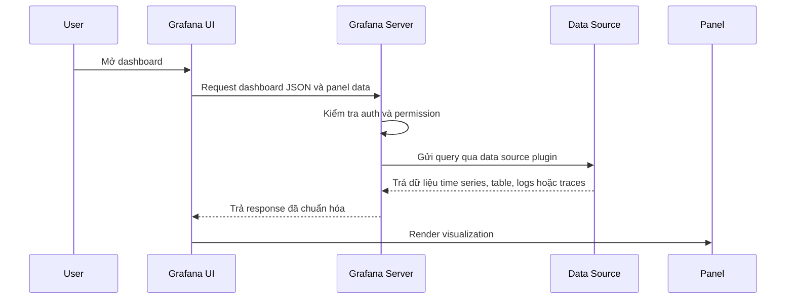
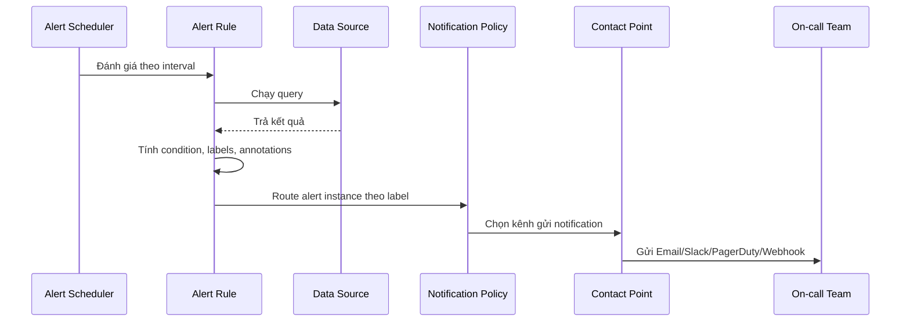
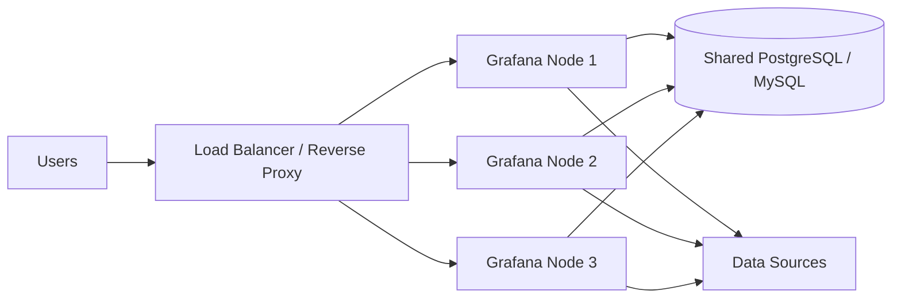
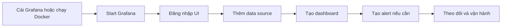
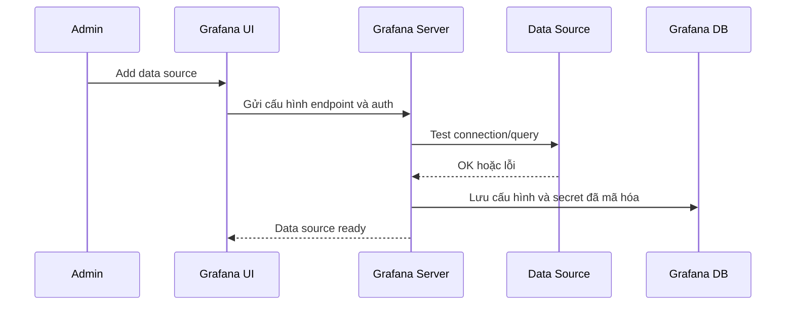
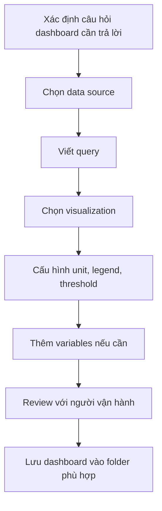
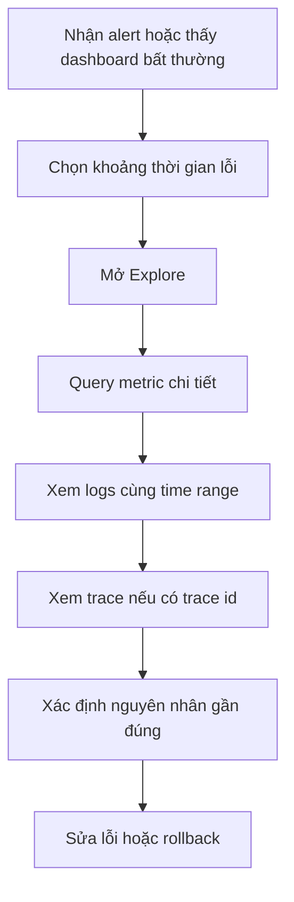
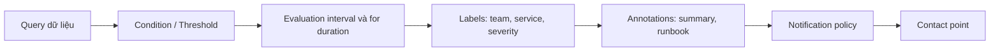
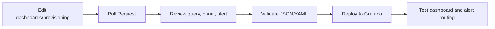

# Grafana: Cơ sở lý thuyết, kiến trúc và thực hành

## 1. Mục tiêu tài liệu

Tài liệu này trình bày Grafana theo hướng lý thuyết kết hợp thực hành, giúp người học nắm được:

- Grafana là gì và vì sao Grafana quan trọng trong observability, monitoring và vận hành hệ thống hiện đại.
- Sự khác nhau giữa metrics, logs, traces, profiles, data source, dashboard, panel, query, transformation và alert.
- Cách Grafana kết nối nhiều nguồn dữ liệu như Prometheus, Loki, Elasticsearch, PostgreSQL, MySQL, CloudWatch, Azure Monitor, Google Cloud Monitoring, Tempo và Jaeger.
- Cách thiết kế dashboard dễ đọc, có biến động theo thời gian, có biến lọc, có panel phù hợp với từng loại dữ liệu.
- Cách dùng Explore để điều tra sự cố mà không cần tạo dashboard trước.
- Cách tạo alert rule, contact point, notification policy và route cảnh báo đến đúng nhóm xử lý.
- Cách chạy Grafana bằng Docker, lưu dữ liệu bền vững, cấu hình bằng biến môi trường và provision bằng file YAML.
- Cách quản lý cấu hình, backup, phân quyền, service account, plugin và API trong môi trường thực tế.
- Các lỗi thiết kế thường gặp khi dùng Grafana và cách tránh.

Tài liệu này phù hợp để học nền tảng Grafana trong nhóm monitoring. Một số giao diện, đường dẫn menu hoặc tính năng nâng cao có thể thay đổi theo phiên bản Grafana OSS, Grafana Enterprise hoặc Grafana Cloud. Khi triển khai thật, nên đối chiếu thêm với tài liệu chính thức đúng phiên bản đang dùng. Các nguồn chính thức được liệt kê ở cuối tài liệu.

## 2. Tổng quan về Grafana

Grafana là nền tảng dùng để **query, visualize, alert và explore** dữ liệu vận hành. Grafana không nhất thiết lưu toàn bộ dữ liệu monitoring bên trong nó. Thay vào đó, Grafana kết nối đến các **data source** bên ngoài, truy vấn dữ liệu từ đó, rồi hiển thị thành dashboard, panel, biểu đồ, bảng, log view, trace view hoặc alert.

Vấn đề Grafana giải quyết rất thực tế:

- Hệ thống có nhiều nguồn dữ liệu rời rạc như Prometheus, Loki, PostgreSQL, Elasticsearch, CloudWatch và Kubernetes metrics.
- Kỹ sư cần nhìn nhanh tình trạng service, database, queue, API, worker và hạ tầng.
- Khi có sự cố, cần điều tra từ metrics sang logs, từ logs sang traces, hoặc từ dashboard sang query chi tiết.
- Cảnh báo phải đến đúng người, đúng kênh, kèm đủ ngữ cảnh để xử lý nhanh.
- Dashboard cần được tái sử dụng giữa nhiều môi trường như development, staging và production.
- Cấu hình monitoring cần quản lý bằng code, không chỉ chỉnh tay trong UI.

Grafana thường được dùng cho:

- Theo dõi hệ thống backend, frontend, database, message queue và cache.
- Trực quan hóa metrics từ Prometheus, Mimir, Graphite, InfluxDB hoặc cloud monitoring.
- Truy vấn logs từ Loki hoặc Elasticsearch.
- Xem traces từ Tempo, Jaeger hoặc Zipkin.
- Theo dõi database thông qua PostgreSQL, MySQL hoặc SQL Server data source.
- Tạo dashboard cho Kubernetes, Docker, API gateway, model serving, ETL pipeline và application business metrics.
- Tạo alert rule và gửi cảnh báo qua Email, Slack, Microsoft Teams, PagerDuty, Opsgenie, Webhook hoặc Alertmanager.
- Tự động hóa cấu hình bằng provisioning file, Terraform, API hoặc GitOps workflow.

Grafana có nhiều phiên bản hoặc cách sử dụng:

| Hình thức | Ý nghĩa |
| --- | --- |
| Grafana OSS | Bản open source có các tính năng cốt lõi về dashboard, data source, Explore và alerting. |
| Grafana Enterprise | Bản thương mại có thêm một số plugin, tính năng phân quyền, hỗ trợ và tính năng doanh nghiệp. |
| Grafana Cloud | Dịch vụ managed của Grafana Labs, giảm công việc tự vận hành Grafana và các backend observability. |
| Self-hosted Grafana | Tự chạy Grafana trên VM, Docker, Kubernetes hoặc server nội bộ. |

### 2.1. Đặc điểm nổi bật

| Đặc điểm | Ý nghĩa |
| --- | --- |
| Kết nối nhiều data source | Grafana truy vấn dữ liệu từ nhiều hệ thống lưu trữ khác nhau. |
| Dashboard linh hoạt | Dashboard gồm nhiều panel, mỗi panel có query và visualization riêng. |
| Explore | Cho phép phân tích dữ liệu tự do mà không cần tạo dashboard trước. |
| Alerting | Tạo cảnh báo từ metrics hoặc logs, route notification theo label và policy. |
| Variables | Biến giúp dashboard dùng lại cho nhiều service, namespace, host hoặc môi trường. |
| Transformations | Biến đổi dữ liệu sau khi query để join, filter, rename, calculate hoặc reshape. |
| Plugins | Mở rộng Grafana bằng data source, panel hoặc app plugin. |
| Provisioning | Quản lý data source, dashboard, plugin và alert bằng file hoặc workflow as-code. |
| API và service account | Tự động hóa quản trị Grafana bằng HTTP API và token có quyền phù hợp. |
| Multi-tenant cơ bản | Có organization, folder, team, role và permission để tách quyền truy cập. |

## 3. Cơ sở lý thuyết

### 3.1. Observability

Monitoring truyền thống thường trả lời câu hỏi:

```text
Hệ thống có đang hoạt động không?
```

Observability rộng hơn. Nó giúp trả lời:

```text
Vì sao hệ thống hoạt động bất thường?
Người dùng nào bị ảnh hưởng?
Service nào gây lỗi?
Lỗi bắt đầu từ lúc nào?
Thay đổi nào liên quan đến lỗi?
```

Grafana nằm ở lớp truy vấn, hiển thị, điều tra và cảnh báo. Nó thường không thay thế hệ thống thu thập dữ liệu. Ví dụ:

- Prometheus scrape metrics.
- Loki lưu logs.
- Tempo lưu traces.
- Pyroscope lưu profiles.
- Grafana kết nối đến các hệ thống đó để hiển thị và alert.

### 3.2. Metrics, logs, traces và profiles

Bốn loại tín hiệu phổ biến trong observability:

| Tín hiệu | Ý nghĩa | Ví dụ |
| --- | --- | --- |
| Metrics | Chuỗi số theo thời gian | CPU usage, request rate, error rate, latency p95 |
| Logs | Dòng sự kiện dạng text hoặc structured | Error log, access log, audit log |
| Traces | Đường đi của một request qua nhiều service | API gateway -> service A -> database |
| Profiles | Dữ liệu tiêu thụ tài nguyên trong runtime | CPU profile, memory allocation, flame graph |

Metrics phù hợp để nhìn xu hướng, cảnh báo và SLO. Logs phù hợp để xem chi tiết sự kiện. Traces phù hợp để tìm bottleneck giữa nhiều service. Profiles phù hợp để tối ưu hiệu năng ở cấp code.

Grafana mạnh khi liên kết các tín hiệu này. Ví dụ từ dashboard latency cao, người dùng có thể mở Explore, xem logs cùng khoảng thời gian, rồi đi tiếp sang trace của request chậm.

### 3.3. Data source

Data source là kết nối từ Grafana đến nơi lưu dữ liệu. Một data source có thể là Prometheus, Loki, PostgreSQL, MySQL, Elasticsearch, CloudWatch, Azure Monitor, Google Cloud Monitoring, Tempo, Jaeger hoặc một plugin khác.

Mỗi data source có:

- Loại data source, ví dụ `prometheus`, `loki`, `postgres`.
- URL hoặc thông tin endpoint.
- Cấu hình xác thực.
- Query editor tương ứng với ngôn ngữ query của backend.
- Quyền truy cập và quyền query.
- Các thiết lập hiệu năng như timeout, min interval, cache hoặc max connection tùy loại.

Ví dụ một panel dùng Prometheus sẽ viết PromQL:

```promql
rate(http_requests_total[5m])
```

Một panel dùng PostgreSQL có thể viết SQL:

```sql
SELECT
  $__timeGroupAlias(created_at, '5m'),
  count(*) AS value
FROM orders
WHERE $__timeFilter(created_at)
GROUP BY 1
ORDER BY 1;
```

Điểm quan trọng là Grafana không biến mọi data source thành cùng một query language. Người dùng vẫn cần hiểu query language của backend đang dùng.

### 3.4. Dashboard

Dashboard là tập hợp một hoặc nhiều panel được sắp xếp để cung cấp cái nhìn nhanh về một chủ đề. Một dashboard tốt thường trả lời một nhóm câu hỏi cụ thể:

- Service có đang healthy không?
- Request rate, error rate và latency hiện thế nào?
- Database có nghẽn connection, lock, slow query hoặc disk I/O không?
- Queue backlog có tăng không?
- Tài nguyên CPU, RAM, disk và network có bất thường không?
- Có deploy hoặc incident nào trùng thời điểm lỗi không?

Dashboard không nên là nơi nhồi mọi chỉ số. Nếu quá nhiều panel không liên quan, người xem khó phân biệt tín hiệu quan trọng với nhiễu.

### 3.5. Panel và visualization

Panel là đơn vị hiển thị cơ bản trong dashboard. Mỗi panel thường có:

- Một hoặc nhiều query.
- Data source.
- Visualization type.
- Unit, legend, threshold và field options.
- Transformation hoặc expression nếu cần.
- Time range riêng nếu muốn override dashboard time range.

Một số visualization phổ biến:

| Visualization | Khi dùng |
| --- | --- |
| Time series | Dữ liệu thay đổi theo thời gian như latency, CPU, request rate. |
| Stat | Một giá trị nổi bật như uptime, current RPS, current error rate. |
| Gauge | Giá trị có ngưỡng rõ như CPU percent, disk usage percent. |
| Table | Danh sách service, endpoint, error, slow query hoặc top N. |
| Heatmap | Phân bố latency, histogram hoặc mật độ theo thời gian. |
| Logs | Hiển thị dòng log theo query. |
| Traces | Xem trace/span khi data source hỗ trợ. |
| Bar chart | So sánh nhóm dữ liệu theo category. |
| State timeline | Trạng thái thay đổi theo thời gian như up/down, deploy, job status. |

Chọn visualization sai có thể làm dashboard khó đọc. Ví dụ error rate theo thời gian nên dùng time series, còn tổng số request hiện tại có thể dùng stat.

### 3.6. Query, expression và transformation

Query lấy dữ liệu từ data source. Expression và transformation xử lý dữ liệu sau khi query.

| Thành phần | Vai trò |
| --- | --- |
| Query | Gửi câu hỏi đến data source. |
| Expression | Tính toán hoặc kết hợp kết quả query trong Grafana, thường dùng trong alerting hoặc panel. |
| Transformation | Biến đổi dữ liệu trả về trước khi hiển thị, ví dụ filter, join, rename, group, calculate. |

Ví dụ một panel có thể:

1. Query A lấy tổng request.
2. Query B lấy tổng lỗi.
3. Expression C tính `B / A`.
4. Visualization hiển thị error rate theo phần trăm.

Không nên lạm dụng transformation để sửa một data model quá xấu. Nếu query backend có thể trả về dữ liệu đúng shape, nên xử lý ở query hoặc ở pipeline sinh dữ liệu.

### 3.7. Time range, interval và resolution

Grafana làm việc nhiều với dữ liệu thời gian. Hai khái niệm quan trọng:

| Khái niệm | Ý nghĩa |
| --- | --- |
| Time range | Khoảng thời gian dashboard hoặc panel đang xem, ví dụ last 15 minutes, last 6 hours. |
| Interval | Bước gom dữ liệu theo thời gian, ví dụ 10s, 1m, 5m. |

Nếu interval quá nhỏ, query có thể nặng và biểu đồ nhiễu. Nếu interval quá lớn, dashboard có thể che mất spike ngắn. Grafana có các biến như `$__interval` và macro theo data source để giúp query tự điều chỉnh theo độ rộng panel và time range.

Ví dụ PromQL:

```promql
sum(rate(http_requests_total[$__rate_interval])) by (service)
```

Ví dụ SQL:

```sql
SELECT
  $__timeGroup(created_at, $__interval) AS time,
  count(*) AS value
FROM events
WHERE $__timeFilter(created_at)
GROUP BY 1
ORDER BY 1;
```

### 3.8. Variables

Variable là placeholder dùng trong query, title, link hoặc panel. Khi người xem chọn giá trị variable, Grafana cập nhật các phần dashboard có dùng variable đó.

Ví dụ dashboard có biến:

- `$env`: `dev`, `staging`, `prod`.
- `$namespace`: namespace Kubernetes.
- `$service`: service name.
- `$instance`: host hoặc pod.

PromQL dùng variable:

```promql
sum(rate(http_requests_total{namespace="$namespace", service="$service"}[5m])) by (status)
```

Variable giúp giảm trùng lặp dashboard. Thay vì tạo 20 dashboard cho 20 service, có thể tạo một dashboard service overview và chọn service qua dropdown.

### 3.9. Alerting

Grafana Alerting cho phép tạo cảnh báo từ dữ liệu. Một alert rule thường có:

- Query lấy dữ liệu cần đánh giá.
- Condition hoặc threshold.
- Evaluation interval, ví dụ mỗi 1 phút.
- Duration, ví dụ phải lỗi liên tục 5 phút mới fire.
- Label và annotation.
- No data và error handling.
- Notification routing.

Ví dụ logic:

```text
Nếu error rate của service checkout > 5% trong 5 phút
thì fire alert severity=critical, team=payment
và gửi đến Slack/PagerDuty của team payment.
```

Alert không chỉ là threshold. Alert tốt cần có ngữ cảnh, owner, mức độ nghiêm trọng, runbook và cách route rõ ràng.

### 3.10. Organization, user, team, role và folder

Grafana có các khái niệm phân quyền:

| Khái niệm | Vai trò |
| --- | --- |
| Organization | Không gian tách biệt người dùng, dashboard và data source. |
| User | Người dùng đăng nhập vào Grafana. |
| Team | Nhóm user có nhu cầu truy cập giống nhau. |
| Role | Vai trò như Viewer, Editor, Admin hoặc Grafana server admin. |
| Folder | Nhóm dashboard và có thể gắn quyền truy cập. |
| Service account | Tài khoản cho automation và API, không phải user người thật. |

Trong môi trường nhỏ, có thể dùng role cơ bản. Trong môi trường lớn, nên tổ chức dashboard theo folder, phân quyền theo team và dùng service account cho automation.

## 4. Kiến trúc Grafana

### 4.1. Sơ đồ kiến trúc Mermaid



Kiến trúc trên cho thấy Grafana Server là trung tâm xử lý UI, API, dashboard, alerting, provisioning và kết nối data source. Data source plugin chịu trách nhiệm giao tiếp với backend dữ liệu. Grafana database lưu cấu hình lâu dài như user, dashboard, data source, alert rule và session metadata tùy cấu hình.

### 4.2. Các thành phần quan trọng

| Thành phần | Vai trò |
| --- | --- |
| Grafana Web UI | Giao diện để tạo dashboard, query, alert và quản trị. |
| Grafana Server | Backend xử lý request, auth, data source query, alerting và API. |
| Grafana Database | Lưu cấu hình, user, dashboard, data source, alert và metadata. |
| Data source plugin | Kết nối Grafana với backend dữ liệu. |
| Panel plugin | Thêm loại visualization mới. |
| App plugin | Đóng gói trang, data source, panel và workflow riêng. |
| Alerting engine | Đánh giá alert rule và tạo notification. |
| Contact point | Kênh gửi cảnh báo như Slack, Email, PagerDuty, Webhook. |
| Notification policy | Cây route alert đến contact point dựa trên label matcher. |
| Provisioning | Cấu hình data source, dashboard, plugin, alert bằng file hoặc as-code. |
| HTTP API | API để tự động hóa quản trị và tích hợp với công cụ khác. |

### 4.3. Luồng query dashboard



Trong luồng này, Grafana Server thường đứng giữa browser và data source. Cách này giúp giữ secret ở server, kiểm soát quyền truy cập và tránh để browser gọi trực tiếp vào backend dữ liệu.

### 4.4. Luồng alerting



Alert rule quyết định khi nào có vấn đề. Notification policy quyết định gửi vấn đề đó đến đâu. Contact point quyết định gửi bằng kênh nào.

### 4.5. Kiến trúc high availability

Với môi trường nhỏ, một instance Grafana dùng SQLite và volume bền vững có thể đủ cho học tập hoặc lab. Với production cần high availability, mô hình thường là:



Điểm quan trọng:

- Không dùng SQLite local cho nhiều Grafana node.
- Dùng PostgreSQL hoặc MySQL làm shared database.
- Đặt Grafana sau load balancer hoặc reverse proxy.
- Cấu hình `root_url`, HTTPS, cookie và domain nhất quán.
- Alerting HA cần cấu hình riêng để tránh gửi trùng notification.
- Backup database và provisioning file phải được quản lý rõ.

## 5. Vòng đời xử lý với Grafana

### 5.1. Luồng cài đặt và chạy local



Local learning thường bắt đầu bằng Docker:

```bash
docker volume create grafana-storage

docker run -d \
  --name grafana \
  -p 3000:3000 \
  -v grafana-storage:/var/lib/grafana \
  grafana/grafana-enterprise
```

Sau đó mở:

```text
http://localhost:3000
```

Với học tập, có thể dùng image `grafana/grafana` nếu muốn OSS-only. Với production, nên pin version cụ thể thay vì dùng tag mặc định.

### 5.2. Luồng thêm data source



Với automation, thay vì thêm data source bằng UI, nên dùng provisioning file hoặc Terraform. Điều này giúp cấu hình lặp lại được giữa local, staging và production.

### 5.3. Luồng tạo dashboard



Dashboard nên bắt đầu từ câu hỏi vận hành, không bắt đầu từ việc "có metric nào thì vẽ metric đó". Ví dụ với API service, các câu hỏi cơ bản là traffic, error, latency và saturation.

### 5.4. Luồng điều tra sự cố bằng Explore



Explore phù hợp khi cần thử query nhanh, kiểm chứng giả thuyết và đào sâu dữ liệu. Dashboard phù hợp để theo dõi lặp lại.

### 5.5. Luồng tạo alert



Alert nên có owner rõ. Nếu alert không có team chịu trách nhiệm, cảnh báo dễ bị bỏ qua.

## 6. Các khái niệm cốt lõi

### 6.1. Data source plugin

Grafana dùng plugin để kết nối dữ liệu. Một số data source core phổ biến:

| Nhóm | Data source |
| --- | --- |
| Metrics/time series | Prometheus, Mimir, Graphite, InfluxDB, CloudWatch, Azure Monitor, Google Cloud Monitoring |
| Logs | Loki, Elasticsearch |
| Traces | Tempo, Jaeger, Zipkin |
| Profiles | Pyroscope, Parca |
| SQL | PostgreSQL, MySQL, Microsoft SQL Server |
| Alerting | Alertmanager |
| Testing | TestData |

Nếu data source không có sẵn, có thể tìm plugin trong plugin catalog hoặc phát triển custom data source plugin.

### 6.2. Query editor

Mỗi data source có query editor riêng. Prometheus có PromQL editor, Loki có LogQL editor, SQL data source có SQL editor. Query editor có thể hỗ trợ autocomplete, metric browser, label selector hoặc builder mode tùy data source.

Điểm cần nhớ:

- Grafana không tự hiểu nghiệp vụ của metric.
- Query sai thì dashboard sai.
- Cần hiểu cardinality, label, index và performance của backend.
- Query trong dashboard chạy nhiều lần theo refresh interval, nên query nặng có thể gây tải lớn.

### 6.3. Dashboard JSON

Dashboard trong Grafana có model JSON. JSON này mô tả:

- UID, title, tags, timezone.
- Panels.
- Queries.
- Variables.
- Links.
- Annotations.
- Time range mặc định.
- Folder hoặc metadata liên quan.

Dashboard JSON có thể export/import hoặc lưu trong repository. Tuy nhiên, JSON do UI sinh ra có thể thay đổi nhiều chi tiết nhỏ. Khi dùng GitOps, nên có quy ước review rõ để tránh diff nhiễu.

### 6.4. Folder

Folder dùng để nhóm dashboard và quản lý quyền. Ví dụ:

- `Platform`
- `Application`
- `Database`
- `ML Serving`
- `Business Metrics`
- `Sandbox`

Nên tránh để mọi dashboard ở root. Folder giúp người dùng tìm dashboard nhanh hơn và giúp phân quyền đơn giản hơn.

### 6.5. UID

Nhiều tài nguyên Grafana có UID, ví dụ dashboard UID hoặc data source UID. UID ổn định giúp:

- Link không bị đổi khi đổi tên dashboard.
- Provision dashboard/data source dễ tham chiếu.
- API automation ít phụ thuộc vào ID tự tăng.
- Dashboard giữa môi trường khác nhau nhất quán hơn.

### 6.6. Annotation

Annotation đánh dấu sự kiện lên biểu đồ theo thời gian. Ví dụ:

- Deploy version mới.
- Incident bắt đầu/kết thúc.
- Migration database.
- Config change.
- Autoscaling event.

Annotation giúp phân biệt "metric tự tăng" với "metric tăng sau một thay đổi cụ thể". Dashboard production nên có annotation cho deploy và incident nếu có thể.

### 6.7. Threshold

Threshold là ngưỡng hiển thị màu hoặc điều kiện cảnh báo. Ví dụ:

- CPU > 80% màu vàng.
- CPU > 95% màu đỏ.
- Error rate > 1% warning.
- Error rate > 5% critical.

Threshold hiển thị trong dashboard không tự động là alert. Alert rule cần cấu hình riêng.

### 6.8. Refresh interval

Refresh interval quyết định dashboard tự query lại sau bao lâu. Giá trị quá thấp có thể làm data source quá tải.

Gợi ý:

| Dashboard | Refresh hợp lý |
| --- | --- |
| Incident dashboard | 5s đến 30s tùy backend chịu tải |
| Service overview | 30s đến 1m |
| Business dashboard | 5m đến 1h |
| Historical analysis | Tắt auto-refresh hoặc dùng refresh dài |

Không nên đặt refresh 5s cho dashboard có hàng chục panel query nặng.

### 6.9. Contact point

Contact point chứa cấu hình gửi notification. Một contact point có thể có một hoặc nhiều integration như Email, Slack, Microsoft Teams, PagerDuty, Telegram, Webhook hoặc Alertmanager.

Ví dụ:

```text
contact point: team-platform-critical
integrations:
  - PagerDuty service platform
  - Slack channel #platform-alerts
```

### 6.10. Notification policy

Notification policy route alert đến contact point dựa trên label matcher. Đây là phần giúp giảm nhiễu và gửi cảnh báo đúng nhóm.

Ví dụ label:

```text
team=platform
severity=critical
service=api-gateway
```

Policy có thể route:

```text
team=platform AND severity=critical -> PagerDuty platform
team=platform AND severity=warning  -> Slack platform
team=data                           -> Slack data
```

## 7. Cài đặt và chạy Grafana cơ bản

### 7.1. Chạy bằng Docker CLI

Tạo volume:

```bash
docker volume create grafana-storage
```

Chạy Grafana:

```bash
docker run -d \
  --name grafana \
  --restart unless-stopped \
  -p 3000:3000 \
  -v grafana-storage:/var/lib/grafana \
  grafana/grafana-enterprise
```

Kiểm tra container:

```bash
docker ps
docker logs grafana
```

Dừng container:

```bash
docker stop grafana
```

Xóa container nhưng giữ volume:

```bash
docker rm grafana
```

Volume `grafana-storage` chứa database SQLite local, plugin data và dữ liệu Grafana trong container. Nếu không mount volume, dữ liệu có thể mất khi xóa container.

### 7.2. Chạy bằng Docker Compose

Ví dụ `compose.yaml`:

```yaml
services:
  grafana:
    image: grafana/grafana-enterprise
    container_name: grafana
    restart: unless-stopped
    ports:
      - "3000:3000"
    environment:
      GF_SERVER_ROOT_URL: http://localhost:3000
      GF_LOG_LEVEL: info
    volumes:
      - grafana-storage:/var/lib/grafana

volumes:
  grafana-storage:
```

Chạy:

```bash
docker compose up -d
```

Xem log:

```bash
docker compose logs -f grafana
```

Dừng:

```bash
docker compose down
```

Nếu muốn xóa cả volume local:

```bash
docker compose down -v
```

Chỉ dùng `down -v` khi chắc chắn không cần dữ liệu Grafana trong volume.

### 7.3. Cấu hình bằng biến môi trường

Grafana có thể đọc cấu hình từ `grafana.ini` hoặc biến môi trường. Với Docker, biến môi trường thường tiện hơn.

Quy ước phổ biến:

```text
GF_<SECTION>_<KEY>
```

Ví dụ:

```yaml
environment:
  GF_SERVER_ROOT_URL: https://grafana.example.com
  GF_LOG_LEVEL: info
  GF_SECURITY_ADMIN_USER: admin
  GF_SECURITY_ADMIN_PASSWORD: change-me
```

Không nên hard-code password thật trong `compose.yaml` commit vào repository. Với môi trường thật, dùng secret manager, file secret, Docker secret, Kubernetes Secret hoặc cơ chế tương đương.

### 7.4. Cấu hình SMTP để gửi email

Ví dụ:

```yaml
environment:
  GF_SMTP_ENABLED: "true"
  GF_SMTP_HOST: smtp.example.com:587
  GF_SMTP_USER: grafana@example.com
  GF_SMTP_PASSWORD: ${GRAFANA_SMTP_PASSWORD}
  GF_SMTP_FROM_ADDRESS: grafana@example.com
```

Sau khi cấu hình SMTP, có thể tạo contact point kiểu Email để test alert notification.

### 7.5. Chạy Grafana với Prometheus local

Ví dụ lab tối giản:

```yaml
services:
  grafana:
    image: grafana/grafana-enterprise
    container_name: grafana
    restart: unless-stopped
    ports:
      - "3000:3000"
    volumes:
      - grafana-storage:/var/lib/grafana
      - ./provisioning:/etc/grafana/provisioning
    depends_on:
      - prometheus

  prometheus:
    image: prom/prometheus
    container_name: prometheus
    restart: unless-stopped
    ports:
      - "9090:9090"
    volumes:
      - ./prometheus.yml:/etc/prometheus/prometheus.yml:ro

volumes:
  grafana-storage:
```

Ví dụ `prometheus.yml`:

```yaml
global:
  scrape_interval: 15s

scrape_configs:
  - job_name: prometheus
    static_configs:
      - targets:
          - prometheus:9090
```

Ví dụ provision data source ở `provisioning/datasources/prometheus.yml`:

```yaml
apiVersion: 1

datasources:
  - name: Prometheus
    uid: prometheus
    type: prometheus
    access: proxy
    url: http://prometheus:9090
    isDefault: true
    editable: false
```

Khi Grafana start, data source Prometheus sẽ có sẵn.

## 8. Data source trong thực tế

### 8.1. Prometheus

Prometheus là data source phổ biến nhất cho metrics. Query dùng PromQL.

Ví dụ request rate:

```promql
sum(rate(http_requests_total[5m])) by (service)
```

Ví dụ error rate:

```promql
sum(rate(http_requests_total{status=~"5.."}[5m])) by (service)
/
sum(rate(http_requests_total[5m])) by (service)
```

Ví dụ latency p95 từ histogram:

```promql
histogram_quantile(
  0.95,
  sum(rate(http_request_duration_seconds_bucket[5m])) by (le, service)
)
```

Lưu ý:

- Dùng `rate()` cho counter.
- Dùng `histogram_quantile()` cho histogram bucket.
- Tránh query quá rộng theo label cardinality cao như `user_id`, `request_id`.
- Dùng recording rule trong Prometheus/Mimir nếu query dashboard quá nặng.

### 8.2. Loki

Loki là data source cho logs. Query dùng LogQL.

Ví dụ xem log của service:

```logql
{service="checkout"}
```

Ví dụ lọc lỗi:

```logql
{service="checkout"} |= "ERROR"
```

Ví dụ tính số lỗi theo thời gian:

```logql
sum(rate({service="checkout"} |= "ERROR" [5m]))
```

Lưu ý:

- Label trong Loki nên có cardinality thấp như `service`, `namespace`, `cluster`, `level`.
- Không nên đưa `request_id` hoặc message dài vào label.
- LogQL query quá rộng có thể rất nặng.

### 8.3. Elasticsearch

Elasticsearch thường dùng cho logs hoặc event search. Khi dùng Elasticsearch data source:

- Cần xác định index pattern.
- Cần chọn time field đúng.
- Cần hiểu mapping và field type.
- Dashboard log có thể nặng nếu query wildcard quá rộng.

Ví dụ nên lọc theo service, level và time range cụ thể thay vì tìm toàn index.

### 8.4. SQL data source

Grafana hỗ trợ PostgreSQL, MySQL và Microsoft SQL Server. SQL data source phù hợp cho:

- Business metrics.
- Internal admin dashboard.
- Job status.
- Batch pipeline metrics.
- Event aggregation.

Ví dụ PostgreSQL:

```sql
SELECT
  $__timeGroupAlias(created_at, '1h'),
  status,
  count(*) AS value
FROM jobs
WHERE $__timeFilter(created_at)
GROUP BY 1, status
ORDER BY 1;
```

Lưu ý:

- Query dashboard chạy lặp lại, vì vậy cần index theo time field.
- Không query bảng production lớn mà thiếu filter thời gian.
- Không để user dashboard viết query có thể phá database.
- Với dữ liệu quan trọng, nên tạo view hoặc read replica.

### 8.5. Cloud monitoring data source

Grafana có thể kết nối CloudWatch, Azure Monitor, Google Cloud Monitoring và các dịch vụ cloud khác. Khi dùng cloud data source cần chú ý:

- IAM hoặc credential cấp tối thiểu.
- Chi phí query API nếu provider tính phí.
- Rate limit.
- Region hoặc project/subscription/account.
- Mapping metric namespace và dimension.

Với production cloud, nên tạo dashboard theo service hoặc account thay vì dashboard toàn bộ cloud quá rộng.

### 8.6. TestData data source

TestData là data source dùng để thử visualization, demo hoặc kiểm tra dashboard mà không cần backend thật.

Use case:

- Học Grafana UI.
- Test panel layout.
- Demo alert rule cơ bản.
- Kiểm tra transformation.

Không dùng TestData để thay thế monitoring thật.

## 9. Dashboard và visualization

### 9.1. Cấu trúc dashboard tốt

Một dashboard service overview nên có thứ tự đọc hợp lý:

1. Health tổng quan: uptime, current RPS, error rate, latency p95.
2. Golden signals: traffic, errors, latency, saturation.
3. Dependency: database, cache, queue, external API.
4. Resource: CPU, memory, disk, network.
5. Logs hoặc link sang Explore.
6. Deploy annotation hoặc version panel.

Ví dụ bố cục:

```text
[Service Health] [RPS] [Error Rate] [Latency p95]
[Requests by status over time]
[Latency percentiles over time]
[CPU / Memory / Pod restarts]
[Top endpoints by latency]
[Recent errors / Log link]
```

### 9.2. Golden signals

Với service backend, bốn nhóm chỉ số quan trọng:

| Signal | Câu hỏi |
| --- | --- |
| Traffic | Có bao nhiêu request? |
| Errors | Bao nhiêu request lỗi? |
| Latency | Request mất bao lâu? |
| Saturation | Hệ thống có gần hết tài nguyên không? |

Dashboard production nên có ít nhất các signal này trước khi thêm metric phụ.

### 9.3. Chọn visualization đúng

| Dữ liệu | Visualization nên dùng |
| --- | --- |
| Request rate theo thời gian | Time series |
| Error rate hiện tại | Stat hoặc Gauge |
| Latency p50/p95/p99 | Time series |
| Top endpoint chậm | Table hoặc Bar chart |
| Log lỗi gần đây | Logs panel |
| Disk usage percent | Gauge hoặc Time series |
| Job success/failure theo thời gian | State timeline hoặc Time series |
| Phân bố latency | Heatmap |

Không nên dùng pie chart cho chuỗi thời gian. Không nên dùng gauge cho dữ liệu không có ngưỡng rõ.

### 9.4. Unit, legend và threshold

Panel dễ đọc cần:

- Unit đúng, ví dụ `ms`, `s`, `%`, `req/s`, `bytes`.
- Legend rõ, tránh tên series dài hoặc label thừa.
- Threshold có ý nghĩa vận hành.
- Màu sắc nhất quán giữa các panel.
- Title trả lời được panel đang hiển thị gì.

Ví dụ title tốt:

```text
HTTP error rate by service
```

Ví dụ title kém:

```text
Panel 12
```

### 9.5. Variables trong dashboard

Ví dụ các biến thường dùng:

| Variable | Ví dụ |
| --- | --- |
| `$cluster` | `prod-us`, `prod-eu` |
| `$namespace` | `payments`, `platform` |
| `$service` | `checkout-api`, `user-api` |
| `$pod` | `checkout-api-abc123` |
| `$status` | `2xx`, `4xx`, `5xx` |

PromQL với variable:

```promql
sum(rate(http_requests_total{
  cluster="$cluster",
  namespace="$namespace",
  service="$service"
}[5m])) by (status)
```

Lưu ý:

- Variable query cũng tạo tải lên data source.
- Tránh biến có quá nhiều giá trị nếu dashboard không cần.
- Nên đặt biến theo thứ tự phụ thuộc: cluster -> namespace -> service -> pod.
- Không đưa secret vào variable vì giá trị có thể xuất hiện trên URL hoặc share link.

### 9.6. Dashboard link và panel link

Dashboard link giúp người dùng chuyển sang dashboard liên quan. Panel link giúp drill down theo context.

Ví dụ:

- Từ service overview sang logs dashboard với `$service` và time range hiện tại.
- Từ endpoint latency table sang Explore query cho endpoint đó.
- Từ pod restart panel sang Kubernetes pod detail dashboard.

Link tốt giúp điều tra sự cố nhanh hơn nhiều so với bắt người dùng tự copy label.

### 9.7. Dashboard JSON và version control

Khi dashboard quan trọng, nên lưu dashboard JSON hoặc cấu hình provisioning trong repository.

Lợi ích:

- Review được thay đổi.
- Rollback được dashboard.
- Tái tạo được môi trường.
- Đồng bộ được giữa staging và production.

Rủi ro:

- JSON do UI sinh có thể nhiều diff nhỏ.
- Nếu vừa provision vừa edit UI không có quy ước, thay đổi có thể bị ghi đè.
- Secret không nên nằm trong dashboard JSON.

## 10. Explore và điều tra sự cố

### 10.1. Khi nào dùng Explore

Explore phù hợp khi:

- Cần thử query nhanh.
- Cần xem log theo khoảng thời gian lỗi.
- Cần so sánh nhiều query tạm thời.
- Cần mở query inspector để xem lỗi hoặc performance.
- Cần điều tra trace hoặc correlation.

Dashboard phù hợp để theo dõi câu hỏi lặp lại. Explore phù hợp để hỏi câu hỏi mới trong lúc debug.

### 10.2. Quy trình debug từ alert

Ví dụ alert:

```text
HighErrorRate service=checkout severity=critical
```

Quy trình:

1. Mở dashboard service `checkout`.
2. Chọn time range quanh thời điểm alert fire.
3. Kiểm tra error rate, request rate và latency.
4. Mở Explore với cùng PromQL để xem chi tiết theo endpoint/status.
5. Chuyển sang Loki logs với label `service=checkout`.
6. Tìm trace id trong log nếu có.
7. Mở trace trong Tempo hoặc Jaeger.
8. Xác định lỗi đến từ code mới, dependency, database, config hay traffic spike.

### 10.3. Query inspector

Query inspector giúp xem:

- Request gửi đến data source.
- Response trả về.
- Thời gian query.
- Lỗi query.
- Data frame sau khi query.

Khi panel "không có dữ liệu", query inspector thường giúp phân biệt:

- Query sai.
- Time range sai.
- Data source lỗi.
- Permission lỗi.
- Dữ liệu thật sự không có.

### 10.4. Correlation giữa metrics, logs và traces

Dashboard tốt nên hỗ trợ đi từ:

```text
Metric spike -> logs cùng service -> trace cụ thể -> dependency chậm
```

Để làm được điều này, hệ thống cần:

- Label nhất quán giữa metrics và logs, ví dụ `service`, `namespace`, `cluster`.
- Log có trace id hoặc request id.
- Trace có service name và span attributes hữu ích.
- Data source cấu hình link/correlation nếu backend hỗ trợ.

Nếu mỗi tín hiệu dùng naming khác nhau, việc điều tra sẽ chậm và dễ sai.

## 11. Grafana Alerting

### 11.1. Thành phần alerting

| Thành phần | Vai trò |
| --- | --- |
| Alert rule | Định nghĩa query, condition, interval và labels. |
| Alert instance | Một instance cụ thể của rule, thường theo label set. |
| Evaluation group | Nhóm rule được đánh giá cùng lịch. |
| Contact point | Kênh gửi notification. |
| Notification policy | Route alert đến contact point dựa trên label. |
| Silence | Tạm tắt notification cho alert matching điều kiện. |
| Mute timing | Tắt notification theo lịch, ví dụ ngoài giờ làm việc. |
| Annotation | Nội dung mô tả, runbook, dashboard link, summary. |

### 11.2. Ví dụ alert rule cho error rate

PromQL:

```promql
sum(rate(http_requests_total{service="checkout", status=~"5.."}[5m]))
/
sum(rate(http_requests_total{service="checkout"}[5m]))
```

Condition:

```text
WHEN last() OF query(A) IS ABOVE 0.05
FOR 5m
```

Labels:

```text
service=checkout
team=payment
severity=critical
```

Annotations:

```text
summary=Checkout API error rate is above 5%
description=Check recent deploys, dependency errors, and database latency.
runbook_url=https://example.com/runbooks/checkout-high-error-rate
```

### 11.3. Label và annotation

Label dùng cho routing, grouping và deduplication. Annotation dùng cho nội dung con người đọc.

Nên dùng label cho:

- `service`
- `team`
- `severity`
- `environment`
- `cluster`

Nên dùng annotation cho:

- Summary.
- Mô tả chi tiết.
- Runbook link.
- Dashboard link.
- Query hoặc gợi ý debug.

Không nên đưa giá trị quá động như request id vào label alert vì có thể tạo quá nhiều alert instance.

### 11.4. Notification policy

Ví dụ cây policy:

```text
Default -> Slack #general-alerts
  team=platform -> Slack #platform-alerts
    severity=critical -> PagerDuty platform
  team=payment -> Slack #payment-alerts
    severity=critical -> PagerDuty payment
```

Điểm cần chú ý:

- Default policy phải tồn tại để không mất alert.
- Label matcher phải khớp label của alert.
- Nếu muốn nhiều sibling policy cùng nhận alert, cần cấu hình continue matching phù hợp.
- Grouping nên giảm spam nhưng không che mất sự cố khác nhau.

### 11.5. Contact point

Contact point nên đặt tên rõ:

```text
slack-platform-warning
pagerduty-platform-critical
email-dba
webhook-incident-router
```

Không nên đặt:

```text
test
alert1
slack
```

Với production, nên test contact point định kỳ, vì webhook, token, email relay hoặc Slack app có thể hết hạn hoặc đổi quyền.

### 11.6. No data và error state

Alert rule cần quyết định khi query:

- Không có dữ liệu.
- Data source lỗi.
- Query timeout.

Không có dữ liệu có thể là bình thường với job ít chạy, nhưng cũng có thể là exporter chết. Không nên để mặc định mà không hiểu ý nghĩa.

Ví dụ:

- Alert "service down" có thể coi no data là alerting.
- Alert "high traffic" có thể coi no data là OK.
- Alert "error rate" cần cẩn thận vì mẫu số bằng 0 có thể gây kết quả rỗng hoặc NaN.

### 11.7. Alert tốt và alert kém

Alert tốt:

- Có owner rõ.
- Có mức độ nghiêm trọng rõ.
- Có hành động xử lý.
- Có runbook hoặc dashboard link.
- Ít false positive.
- Không spam khi sự cố đã biết.

Alert kém:

- "CPU high" nhưng không ảnh hưởng người dùng và không có hành động.
- Alert fire rồi tự resolve liên tục.
- Thiếu team label.
- Thiếu thông tin service hoặc environment.
- Dùng threshold copy từ hệ thống khác mà không hiểu baseline.

## 12. Provisioning và quản lý bằng code

### 12.1. Vì sao cần provisioning

Nếu cấu hình Grafana chỉ tồn tại trong UI, các vấn đề thường gặp là:

- Khó tái tạo môi trường mới.
- Khó review thay đổi.
- Khó rollback.
- Người này sửa dashboard của người khác mà không biết.
- Data source staging và production khác nhau ngoài ý muốn.
- Mất cấu hình khi database bị lỗi mà không backup.

Provisioning giúp đưa cấu hình quan trọng vào file và version control.

### 12.2. Provision data source

Ví dụ `provisioning/datasources/prometheus.yml`:

```yaml
apiVersion: 1

deleteDatasources:
  - name: Prometheus
    orgId: 1

datasources:
  - name: Prometheus
    uid: prometheus
    type: prometheus
    access: proxy
    orgId: 1
    url: http://prometheus:9090
    isDefault: true
    editable: false
```

Khi Grafana start, nó đọc file provisioning và tạo hoặc cập nhật data source.

### 12.3. Secure JSON data

Một số giá trị nhạy cảm nên nằm trong `secureJsonData`, ví dụ password, token, TLS key.

Ví dụ:

```yaml
apiVersion: 1

datasources:
  - name: PostgreSQL
    uid: postgres
    type: postgres
    url: postgres:5432
    user: grafana_reader
    secureJsonData:
      password: ${POSTGRES_PASSWORD}
    jsonData:
      database: app
      sslmode: disable
```

Lưu ý:

- Không commit secret thật vào repo.
- Có thể dùng environment variable trong provisioning.
- Cẩn thận với ký tự `$` trong password vì provisioning có cơ chế expand biến môi trường.

### 12.4. Provision dashboard

Ví dụ `provisioning/dashboards/dashboards.yml`:

```yaml
apiVersion: 1

providers:
  - name: default
    orgId: 1
    folder: Services
    type: file
    disableDeletion: false
    editable: false
    updateIntervalSeconds: 30
    options:
      path: /var/lib/grafana/dashboards
      foldersFromFilesStructure: true
```

Mount dashboard JSON:

```yaml
services:
  grafana:
    volumes:
      - ./provisioning:/etc/grafana/provisioning
      - ./dashboards:/var/lib/grafana/dashboards
```

Khi file JSON thay đổi, Grafana sẽ nạp lại theo cấu hình provider.

### 12.5. Provision alerting

Alerting cũng có thể quản lý bằng file, Terraform hoặc HTTP API. Với production, nên tránh để alert quan trọng chỉ được tạo thủ công trong UI mà không có backup hoặc export.

Quy ước nên có:

- Alert rule theo folder/team.
- Label `team`, `service`, `severity`, `environment`.
- Annotation có `summary`, `description`, `runbook_url`.
- Notification policy được quản lý rõ.
- Contact point không dùng token hard-code trong repo.

### 12.6. Terraform và API

Terraform phù hợp khi muốn quản lý Grafana theo Infrastructure as Code. HTTP API phù hợp cho automation nội bộ, migration hoặc script.

Với API, nên dùng service account token thay vì user password. Token cần:

- Quyền tối thiểu.
- Expiration phù hợp.
- Cơ chế rotation.
- Không log token ra CI output.

## 13. Cấu hình, lưu trữ và backup

### 13.1. Grafana database

Grafana database lưu cấu hình và metadata. Mặc định local thường dùng SQLite. Với production, nên cân nhắc PostgreSQL hoặc MySQL.

| Database | Khi dùng |
| --- | --- |
| SQLite | Local, lab, môi trường nhỏ, một Grafana instance. |
| PostgreSQL | Production, nhiều instance, backup rõ, HA tốt hơn. |
| MySQL | Production nếu hệ thống đã chuẩn hóa MySQL. |

Không dùng SQLite local cho high availability nhiều node.

### 13.2. Các dữ liệu cần backup

Khi tự vận hành Grafana, cần backup:

- File cấu hình `grafana.ini` hoặc cấu hình tương đương.
- Grafana database.
- Plugin directory nếu có plugin cài thêm.
- Provisioning files.
- Dashboard JSON nếu không lưu ở repo.
- Secret hoặc cấu hình secret manager liên quan.

Nếu dùng Docker volume, cần backup volume hoặc tốt hơn là dùng database ngoài và provisioning file trong repo.

### 13.3. Backup SQLite

Với SQLite, cần dừng Grafana trước khi copy file database để giảm rủi ro dữ liệu không nhất quán.

Ví dụ đường dẫn trong container thường liên quan đến:

```text
/var/lib/grafana/grafana.db
```

Với Docker volume, có thể backup volume bằng công cụ Docker hoặc mount tạm volume ra container khác. Trong production, cách này kém tiện hơn database ngoài.

### 13.4. Backup PostgreSQL hoặc MySQL

Ví dụ PostgreSQL:

```bash
pg_dump grafana > grafana_backup.sql
```

Restore:

```bash
psql grafana < grafana_backup.sql
```

Ví dụ MySQL:

```bash
mysqldump -u root -p grafana > grafana_backup.sql
mysql -u root -p grafana < grafana_backup.sql
```

Backup cần được test restore định kỳ. Backup chưa từng restore thành công không nên được xem là đáng tin.

### 13.5. Logging

Grafana có log của chính nó. Khi chạy container, nên để log ra stdout/stderr để Docker hoặc orchestrator thu thập.

Các vấn đề thường xem trong log:

- Lỗi kết nối database.
- Lỗi plugin.
- Lỗi query data source.
- Lỗi SMTP hoặc notification.
- Lỗi auth/OAuth.
- Lỗi migration khi upgrade.

### 13.6. Upgrade

Khi upgrade Grafana:

- Đọc release notes và breaking changes.
- Backup database trước.
- Test ở staging nếu dashboard/alert quan trọng.
- Kiểm tra plugin compatibility.
- Kiểm tra alerting sau upgrade.
- Có kế hoạch rollback.

Không nên upgrade production bằng tag floating mà không biết version mới là gì.

## 14. Bảo mật và phân quyền

### 14.1. Không để Grafana public thiếu bảo vệ

Grafana thường chứa thông tin nhạy cảm:

- Tên service nội bộ.
- Logs có dữ liệu người dùng.
- Metrics hạ tầng.
- Dashboard business.
- Link incident.
- Query database.

Không nên expose Grafana ra Internet mà thiếu HTTPS, authentication, domain kiểm soát và phân quyền.

### 14.2. Authentication

Grafana hỗ trợ nhiều kiểu authentication như basic auth, anonymous access, LDAP, OAuth, SAML, auth proxy, JWT và các identity provider phổ biến.

Gợi ý:

- Local lab có thể dùng basic auth.
- Production nên dùng SSO/OIDC/SAML nếu tổ chức đã có IdP.
- Không bật anonymous access cho dashboard nhạy cảm.
- Nếu cần public dashboard, dùng cơ chế chia sẻ phù hợp và kiểm tra dữ liệu hiển thị.
- MFA thường nên thực hiện ở identity provider.

### 14.3. Authorization

Grafana có role cơ bản như Viewer, Editor, Admin và Grafana server admin. Với Enterprise hoặc Cloud có RBAC chi tiết hơn.

Nguyên tắc:

- Người xem dashboard chỉ cần Viewer.
- Người sửa dashboard cần Editor trong folder phù hợp.
- Ít người có Org Admin.
- Rất ít người có Grafana server admin.
- Automation dùng service account riêng, không dùng tài khoản cá nhân.

### 14.4. Data source permissions

Theo mặc định, trong một organization, user có thể query data source của organization đó. Điều này có thể nguy hiểm nếu data source cho phép query rộng.

Ví dụ rủi ro:

- Viewer không xem được dashboard A nhưng vẫn query được data source chứa dữ liệu A.
- SQL data source cho phép đọc bảng nhạy cảm.
- Loki data source chứa log có PII.

Giải pháp:

- Tách organization hoặc Grafana instance nếu cần cách ly mạnh.
- Dùng data source permission nếu edition hỗ trợ.
- Dùng read-only database user.
- Dùng view hoặc schema hạn chế.
- Không đưa data source quá nhạy cảm vào Grafana dùng chung.

### 14.5. Service account

Service account dùng cho automation:

- Terraform apply dashboard.
- Script tạo folder hoặc data source.
- CI/CD sync dashboard.
- Report generation.
- API integration.

Không nên dùng user password trong script. Token service account nên có:

- Tên rõ.
- Quyền tối thiểu.
- Expiration nếu phù hợp.
- Rotation định kỳ.
- Lưu trong secret manager.

### 14.6. Cookie, domain và security headers

Khi chạy production sau reverse proxy:

- Cấu hình `root_url` đúng.
- Dùng HTTPS.
- Cân nhắc `cookie_secure`.
- Cân nhắc `cookie_samesite` phù hợp với SSO.
- Bật security headers như CSP nếu phù hợp.
- Bật `enforce_domain` để giảm rủi ro Host header/DNS rebinding trong một số cấu hình.

Không nên copy cấu hình hardening mà không test SSO, embed, snapshot hoặc plugin đang dùng.

### 14.7. Plugin security

Plugin mở rộng năng lực Grafana nhưng cũng mở rộng bề mặt rủi ro.

Nguyên tắc:

- Chỉ cài plugin cần thiết.
- Ưu tiên plugin có nguồn rõ ràng và được bảo trì.
- Cập nhật plugin định kỳ.
- Kiểm tra plugin signature.
- Không cài plugin lạ trên production chỉ để thử nghiệm.
- Có môi trường staging để test plugin mới.

## 15. Plugin, API và automation

### 15.1. Ba loại plugin

| Plugin type | Vai trò |
| --- | --- |
| Data source plugin | Kết nối đến nguồn dữ liệu mới. |
| Panel plugin | Thêm kiểu visualization mới. |
| App plugin | Đóng gói trải nghiệm lớn hơn gồm page, data source, panel hoặc workflow. |

Ví dụ:

- Data source plugin cho một SaaS monitoring.
- Panel plugin cho biểu đồ đặc biệt.
- App plugin cho Kubernetes, cloud hoặc workflow riêng.

### 15.2. Cài plugin bằng Docker

Với Docker, có thể cài plugin lúc start bằng biến môi trường:

```yaml
environment:
  GF_PLUGINS_PREINSTALL: grafana-clock-panel
```

Pin version nếu cần tái lập:

```yaml
environment:
  GF_PLUGINS_PREINSTALL: grafana-clock-panel@1.0.1
```

Production nên kiểm soát plugin version để tránh thay đổi bất ngờ.

### 15.3. HTTP API

Grafana có HTTP API cho:

- Dashboard.
- Folder.
- Data source.
- Service account.
- User/team.
- Alerting provisioning.
- Search.
- Permissions.
- Snapshot.

Lưu ý quan trọng: từ Grafana 13, tài liệu Grafana ghi nhận lộ trình chuyển từ endpoint legacy `/api` sang route mới `/apis`. Các endpoint legacy vẫn hoạt động nhưng không phải nơi nhận cập nhật mới. Khi viết automation mới, nên kiểm tra API structure mới trong tài liệu phiên bản đang dùng.

### 15.4. Ví dụ API với service account token

Ví dụ gọi API search dashboard:

```bash
curl -H "Authorization: Bearer $GRAFANA_TOKEN" \
  http://localhost:3000/api/search
```

Ví dụ kiểm tra health:

```bash
curl http://localhost:3000/api/health
```

Không log `$GRAFANA_TOKEN` ra terminal history hoặc CI output.

### 15.5. Automation workflow

Một workflow tốt:



Nên review dashboard như review code, đặc biệt với alert rule và query nặng.

## 16. Grafana trong quy trình phát triển phần mềm

### 16.1. Development

Trong development, Grafana giúp:

- Chạy local dashboard cùng Prometheus/Loki.
- Học cách instrument application.
- Test query trước khi đưa vào production.
- Tạo dashboard cho service mới.
- Kiểm tra log format và label.

Với Docker Compose, một stack học tập có thể gồm:

- App.
- Prometheus.
- Grafana.
- Loki.
- Promtail hoặc Alloy.
- PostgreSQL.

### 16.2. Testing

Monitoring cũng cần test:

- Query có trả dữ liệu đúng không?
- Dashboard có load trong time range phổ biến không?
- Alert có fire khi điều kiện xảy ra không?
- Notification có đến đúng contact point không?
- Runbook link còn sống không?
- Dashboard import/provision có lỗi không?

Có thể dùng TestData hoặc môi trường staging để test alert không ảnh hưởng production.

### 16.3. Staging

Staging nên giống production ở:

- Dashboard structure.
- Alert rule logic.
- Data source type.
- Provisioning workflow.
- Folder và permission cơ bản.

Nhưng staging có thể route alert sang kênh riêng để tránh gọi on-call thật.

### 16.4. Production

Production cần quan tâm:

- High availability nếu Grafana là công cụ vận hành quan trọng.
- Database ngoài và backup định kỳ.
- SSO và phân quyền.
- HTTPS và reverse proxy.
- Plugin governance.
- Alert routing và on-call process.
- Audit thay đổi dashboard/alert.
- Upgrade plan và rollback.
- Resource limit cho Grafana container/pod.
- Query performance và data source capacity.

Grafana không tự làm hệ thống observable. Cần instrument application, thu thập dữ liệu đúng, đặt label đúng và xây dựng dashboard/alert có mục đích.

## 17. So sánh Grafana với công nghệ liên quan

### 17.1. Grafana và Prometheus

| Tiêu chí | Grafana | Prometheus |
| --- | --- | --- |
| Vai trò | Visualize, explore, alert, dashboard | Thu thập và lưu metrics time series |
| Query language | Phụ thuộc data source | PromQL |
| Lưu metrics | Không phải vai trò chính | Có |
| Dashboard | Mạnh | UI cơ bản hơn |
| Alerting | Có Grafana Alerting | Có Prometheus alert rules và Alertmanager |

Grafana thường dùng Prometheus làm data source. Prometheus thu thập và lưu metrics, Grafana hiển thị và điều tra.

### 17.2. Grafana và Loki

| Tiêu chí | Grafana | Loki |
| --- | --- | --- |
| Vai trò | UI, dashboard, Explore | Lưu và query logs |
| Query logs | Qua Loki data source | LogQL |
| Lưu logs | Không | Có |
| Correlation | Liên kết logs với metrics/traces | Cung cấp dữ liệu logs |

Loki không thay Grafana. Grafana là giao diện để query Loki và hiển thị logs.

### 17.3. Grafana và Kibana

| Tiêu chí | Grafana | Kibana |
| --- | --- | --- |
| Hệ sinh thái chính | Nhiều data source | Elasticsearch/Elastic Stack |
| Metrics/logs/traces | Qua nhiều backend | Mạnh trong Elastic ecosystem |
| Dashboard | Rất linh hoạt đa nguồn | Mạnh nếu dữ liệu nằm trong Elasticsearch |
| Use case | Multi-source observability | Search, logs, security, Elastic analytics |

Nếu tổ chức đã dùng nhiều backend khác nhau, Grafana thường linh hoạt hơn. Nếu dữ liệu chủ yếu nằm trong Elasticsearch, Kibana có lợi thế ecosystem.

### 17.4. Grafana và Datadog/New Relic

| Tiêu chí | Grafana self-hosted | Datadog/New Relic |
| --- | --- | --- |
| Vận hành | Tự quản lý hoặc dùng Grafana Cloud | Managed SaaS |
| Chi phí | Linh hoạt, nhưng có chi phí vận hành | Theo pricing SaaS |
| Tích hợp | Rộng qua plugin | Rộng trong nền tảng của vendor |
| Kiểm soát dữ liệu | Cao nếu self-hosted | Phụ thuộc SaaS |
| Time-to-value | Cần tự setup nhiều phần | Nhanh hơn với agent và managed backend |

Không có lựa chọn tuyệt đối. Chọn theo yêu cầu dữ liệu, ngân sách, compliance, đội vận hành và hệ sinh thái hiện có.

## 18. Các lỗi thiết kế thường gặp

### 18.1. Dashboard quá nhiều panel

Một dashboard có 80 panel thường khó đọc và query nặng. Nên chia theo mục đích:

- Overview.
- Database detail.
- Endpoint detail.
- Infrastructure detail.
- Incident drilldown.

### 18.2. Không có câu hỏi vận hành rõ

Nếu dashboard chỉ là nơi dán mọi metric có sẵn, người trực incident sẽ mất thời gian tìm tín hiệu. Dashboard nên trả lời một nhóm câu hỏi rõ.

### 18.3. Dùng query quá nặng

Query nặng có thể làm Prometheus, Loki, Elasticsearch hoặc database bị tải cao.

Cách giảm:

- Thu hẹp time range.
- Dùng label filter.
- Tránh regex rộng.
- Dùng recording rule hoặc materialized view.
- Tăng interval hợp lý.
- Giảm refresh rate.

### 18.4. Label cardinality quá cao

Metric hoặc log label có cardinality cao làm backend tốn tài nguyên và dashboard chậm.

Không nên dùng label:

- `request_id`
- `user_id`
- `email`
- `session_id`
- URL raw chứa ID động

Nên chuẩn hóa:

```text
/users/:id/orders/:order_id
```

thay vì:

```text
/users/123/orders/999
```

### 18.5. Không dùng variable

Tạo một dashboard riêng cho từng service dễ gây trùng lặp. Nên dùng variable khi dashboard có cùng cấu trúc giữa nhiều service, namespace hoặc environment.

### 18.6. Dùng variable quá rộng

Variable lấy hàng chục nghìn giá trị làm dashboard chậm và khó dùng. Nên lọc theo cluster/namespace trước, hoặc chỉ cho chọn các service cần quan sát.

### 18.7. Alert thiếu owner

Alert không có `team` hoặc contact point rõ sẽ bị bỏ qua. Mọi alert production cần có owner.

### 18.8. Alert quá nhạy

Alert fire/resolve liên tục gây mệt mỏi. Nên dùng:

- `for` duration.
- Threshold phù hợp baseline.
- Grouping.
- Mute timing cho maintenance.
- SLO hoặc burn-rate alert nếu phù hợp.

### 18.9. Chỉ nhìn CPU/RAM mà bỏ qua user impact

CPU cao không phải lúc nào cũng là sự cố. Error rate, latency và availability thường gần người dùng hơn. Resource metric nên dùng để giải thích hoặc dự báo saturation, không phải lúc nào cũng là alert chính.

### 18.10. Không backup Grafana database

Nếu dashboard và alert chỉ nằm trong database Grafana mà không backup, mất database là mất cấu hình vận hành. Cần backup hoặc provisioning as-code.

### 18.11. Dùng SQLite cho production HA

SQLite phù hợp local hoặc single instance nhỏ. Nếu chạy nhiều Grafana node, cần shared database như PostgreSQL hoặc MySQL.

### 18.12. Không kiểm soát plugin

Cài plugin tùy tiện trên production có thể gây rủi ro bảo mật và tương thích. Nên có quy trình cài, test, update và gỡ plugin.

### 18.13. Hard-code secret trong Compose hoặc provisioning

Không commit password, token, API key vào repository. Dùng secret manager hoặc biến môi trường được quản lý bởi nền tảng deploy.

### 18.14. Không kiểm tra notification

Alert rule đúng nhưng contact point sai thì vẫn không ai nhận cảnh báo. Cần test notification route sau khi thay đổi contact point, token, Slack app, SMTP hoặc PagerDuty integration.

## 19. Bài tập thực hành

### Bài 1: Chạy Grafana bằng Docker

Thực hiện:

- Tạo volume `grafana-storage`.
- Chạy Grafana ở port `3000`.
- Đăng nhập UI.
- Dừng và chạy lại container.
- Kiểm tra dữ liệu còn tồn tại nhờ volume.

### Bài 2: Thêm Prometheus data source

Thực hiện:

- Chạy Prometheus bằng Docker Compose.
- Thêm Prometheus data source trong Grafana UI.
- Test connection.
- Tạo panel query `up`.
- Hiển thị bằng time series hoặc stat.

### Bài 3: Provision Prometheus data source

Thực hiện:

- Tạo thư mục `provisioning/datasources`.
- Viết file YAML provision Prometheus.
- Mount vào container Grafana.
- Restart Grafana.
- Kiểm tra data source xuất hiện mà không cần thêm bằng UI.

### Bài 4: Tạo dashboard service overview

Tạo dashboard có:

- Variable `$service`.
- Panel request rate.
- Panel error rate.
- Panel latency p95.
- Panel CPU hoặc memory nếu có metric.
- Link sang Explore.

### Bài 5: Dùng transformation

Thực hiện:

- Tạo một panel table từ SQL hoặc TestData.
- Dùng transformation để rename field.
- Dùng transformation để filter field.
- Dùng calculation để tạo cột mới.

### Bài 6: Tạo alert rule

Thực hiện:

- Tạo alert rule từ Prometheus hoặc TestData.
- Cấu hình threshold.
- Thêm label `team` và `severity`.
- Tạo contact point Email hoặc Webhook test.
- Tạo notification policy route theo label.

### Bài 7: Backup và restore

Thực hiện:

- Tạo dashboard.
- Backup volume hoặc database.
- Xóa container.
- Restore dữ liệu.
- Kiểm tra dashboard còn tồn tại.

### Bài 8: Phân quyền folder

Thực hiện:

- Tạo folder `Platform`.
- Tạo folder `Application`.
- Tạo user hoặc team test.
- Gán quyền Viewer/Editor khác nhau.
- Kiểm tra user chỉ sửa được dashboard được phép.

## 20. Lộ trình học đề xuất

1. Nắm khái niệm observability, metrics, logs, traces và dashboard.
2. Chạy Grafana local bằng Docker với volume bền vững.
3. Thêm Prometheus data source và tạo panel đầu tiên.
4. Học PromQL cơ bản: counter, gauge, rate, sum by, histogram quantile.
5. Học dashboard layout, unit, threshold, legend và variables.
6. Học Explore để debug metrics và logs.
7. Thêm Loki hoặc Elasticsearch để xem logs.
8. Tạo alert rule, contact point và notification policy.
9. Provision data source và dashboard bằng YAML.
10. Lưu dashboard/provisioning vào Git.
11. Học phân quyền folder, team, role và service account.
12. Học backup, upgrade và plugin management.
13. Tìm hiểu HA với PostgreSQL/MySQL nếu cần production nhiều node.
14. Học thêm Grafana Alloy, Loki, Tempo, Mimir hoặc OpenTelemetry tùy stack.

## 21. Kết luận

Grafana là công cụ trung tâm để quan sát hệ thống qua dashboard, Explore và alerting. Điểm quan trọng không chỉ là biết tạo vài biểu đồ, mà là hiểu data source đang lưu dữ liệu gì, query có đúng không, panel có trả lời đúng câu hỏi không, alert có owner không và cấu hình có tái lập được không.

Dùng Grafana tốt cần kết hợp nhiều lớp:

- Instrument application đúng.
- Thu thập metrics, logs, traces và profiles có cấu trúc.
- Đặt label nhất quán.
- Viết query hiệu quả.
- Thiết kế dashboard theo câu hỏi vận hành.
- Route alert theo team và severity.
- Quản lý cấu hình bằng code khi dashboard/alert đã quan trọng.
- Backup và bảo mật như một hệ thống production thật.

Grafana không tự động làm hệ thống ổn định hơn. Nó giúp con người nhìn thấy vấn đề, hiểu vấn đề và phản ứng nhanh hơn nếu dữ liệu, dashboard và alert được thiết kế có chủ đích.

## 22. Tài liệu tham khảo

Các nguồn dưới đây là tài liệu chính thức hoặc nguồn liên quan trực tiếp được dùng để đối chiếu nội dung. Tại thời điểm tra cứu ngày 2026-07-07, trang tài liệu Grafana `latest` hiển thị phiên bản v13.1.

- Grafana OSS and Enterprise Documentation: https://grafana.com/docs/grafana/latest/
- Get started with Grafana Open Source: https://grafana.com/docs/grafana/latest/fundamentals/getting-started/
- Grafana data sources: https://grafana.com/docs/grafana/latest/datasources/
- Grafana dashboards: https://grafana.com/docs/grafana/latest/visualizations/dashboards/
- Grafana panels and visualizations: https://grafana.com/docs/grafana/latest/visualizations/panels-visualizations/
- Query and transform data: https://grafana.com/docs/grafana/latest/visualizations/panels-visualizations/query-transform-data/
- Grafana Explore: https://grafana.com/docs/grafana/latest/visualizations/explore/
- Grafana variables: https://grafana.com/docs/grafana/latest/visualizations/dashboards/variables/
- Grafana Alerting: https://grafana.com/docs/grafana/latest/alerting/
- Alert rules: https://grafana.com/docs/grafana/latest/alerting/fundamentals/alert-rules/
- Contact points: https://grafana.com/docs/grafana/latest/alerting/fundamentals/notifications/contact-points/
- Notification policies: https://grafana.com/docs/grafana/latest/alerting/fundamentals/notifications/notification-policies/
- Run Grafana Docker image: https://grafana.com/docs/grafana/latest/setup-grafana/installation/docker/
- Configure Grafana: https://grafana.com/docs/grafana/latest/setup-grafana/configure-grafana/
- Provision Grafana: https://grafana.com/docs/grafana/latest/administration/provisioning/
- Back up Grafana: https://grafana.com/docs/grafana/latest/administration/back-up-grafana/
- Configure authentication: https://grafana.com/docs/grafana/latest/setup-grafana/configure-access/configure-authentication/
- Roles and permissions: https://grafana.com/docs/grafana/latest/administration/roles-and-permissions/
- Role-based access control: https://grafana.com/docs/grafana/latest/administration/roles-and-permissions/access-control/
- Data source management and permissions: https://grafana.com/docs/grafana/latest/administration/data-source-management/
- Service accounts: https://grafana.com/docs/grafana/latest/administration/service-accounts/
- Plugin management: https://grafana.com/docs/grafana/latest/administration/plugin-management/
- Configure security hardening: https://grafana.com/docs/grafana/latest/setup-grafana/configure-security/configure-security-hardening/
- Set up Grafana for high availability: https://grafana.com/docs/grafana/latest/setup-grafana/set-up-for-high-availability/
- Grafana HTTP API: https://grafana.com/docs/grafana/latest/developer-resources/api-reference/http-api/api-legacy/
- Grafana plugin catalog: https://grafana.com/grafana/plugins/
- Prometheus documentation: https://prometheus.io/docs/
- OpenTelemetry documentation: https://opentelemetry.io/docs/
