# Prometheus: Cơ sở lý thuyết, kiến trúc và thực hành

## 1. Mục tiêu tài liệu

Tài liệu này trình bày Prometheus theo hướng lý thuyết kết hợp thực hành, giúp người học nắm được:

- Prometheus là gì và vì sao Prometheus quan trọng trong monitoring, observability và vận hành hệ thống hiện đại.
- Cách Prometheus thu thập, lưu trữ và truy vấn dữ liệu dạng time series.
- Các khái niệm cốt lõi như metric, label, sample, time series, target, job, instance, scrape, exporter, rule và Alertmanager.
- Sự khác nhau giữa Counter, Gauge, Histogram và Summary.
- Cách viết cấu hình `prometheus.yml`, scrape target, dùng service discovery và quản lý rule file.
- Cách sử dụng PromQL để phân tích dữ liệu, tính rate, aggregate, filter theo label và tính percentile từ histogram.
- Cách viết recording rule để tối ưu query và alerting rule để phát hiện sự cố.
- Cách kết hợp Prometheus với Alertmanager, Grafana, exporter, Docker, Kubernetes và remote storage.
- Các lỗi thiết kế thường gặp khi dùng Prometheus trong dự án thực tế và cách tránh.

Tài liệu này phù hợp để học nền tảng Prometheus trong nhóm monitoring. Một số cú pháp, flag hoặc tính năng nâng cao có thể thay đổi theo phiên bản Prometheus, Alertmanager hoặc exporter đang dùng, vì vậy khi triển khai thật nên đối chiếu thêm với tài liệu chính thức đúng phiên bản. Các nguồn chính thức được liệt kê ở cuối tài liệu.

## 2. Tổng quan về Prometheus

Prometheus là hệ thống monitoring và alerting mã nguồn mở, tập trung vào dữ liệu **time series**. Prometheus thu thập metrics từ các target bằng cách **scrape HTTP endpoint**, lưu dữ liệu cục bộ trong time series database, cho phép truy vấn bằng **PromQL**, đánh giá rule định kỳ và gửi alert sang Alertmanager.

Vấn đề Prometheus giải quyết rất thực tế:

- Cần biết service có đang sống không, request có lỗi không, latency có tăng không.
- Cần theo dõi CPU, RAM, disk, network, database connection, queue backlog và application metrics.
- Hệ thống microservices có nhiều instance thay đổi liên tục.
- Cần query dữ liệu theo label như service, instance, namespace, method, status code hoặc region.
- Cần cảnh báo dựa trên triệu chứng người dùng thấy, ví dụ error rate cao hoặc latency cao.
- Cần dữ liệu đủ tin cậy để debug trong lúc incident, kể cả khi một số hệ thống khác đang lỗi.

Prometheus thường được dùng cho:

- Thu thập metrics từ backend API, worker, batch job, database, cache và message queue.
- Theo dõi host bằng Node Exporter.
- Theo dõi container bằng cAdvisor hoặc container runtime metrics.
- Theo dõi Kubernetes qua Kubernetes service discovery, kube-state-metrics và node exporter.
- Theo dõi application metrics từ client library như Go, Java, Python, Ruby, Rust hoặc .NET.
- Tạo alert rule và gửi alert đến Alertmanager.
- Làm data source cho Grafana dashboard.
- Gửi dữ liệu dài hạn sang remote storage như Thanos, Cortex, Mimir, VictoriaMetrics hoặc backend tương thích remote write.

Prometheus không phải công cụ log search, tracing hoặc APM đầy đủ. Nó mạnh nhất với dữ liệu số theo thời gian. Với logs, thường dùng Loki hoặc Elasticsearch. Với traces, thường dùng Tempo, Jaeger hoặc Zipkin. Với dashboard, thường dùng Grafana.

### 2.1. Đặc điểm nổi bật

| Đặc điểm | Ý nghĩa |
| --- | --- |
| Pull-based scraping | Prometheus chủ động gọi HTTP endpoint `/metrics` của target để lấy metrics. |
| Time series data model | Dữ liệu được định danh bằng metric name và tập label key-value. |
| PromQL | Ngôn ngữ truy vấn mạnh để filter, aggregate, tính rate, percentile và join dữ liệu. |
| Local storage | Mỗi Prometheus server tự lưu dữ liệu cục bộ, không bắt buộc phụ thuộc distributed storage. |
| Service discovery | Tự phát hiện target từ Kubernetes, file, DNS, cloud provider hoặc cơ chế khác. |
| Exporter ecosystem | Nhiều exporter cho host, database, cache, message broker, blackbox check và hệ thống bên thứ ba. |
| Recording rules | Tính trước query thường dùng hoặc query nặng thành metric mới. |
| Alerting rules | Đánh giá điều kiện cảnh báo bằng PromQL. |
| Alertmanager | Quản lý notification, grouping, inhibition, silencing và routing alert. |
| Remote write | Gửi sample sang hệ thống lưu trữ dài hạn hoặc hệ thống tập trung. |

### 2.2. Khi nào Prometheus phù hợp

Prometheus phù hợp khi:

- Cần monitoring service, host, container, Kubernetes hoặc hạ tầng cloud-native.
- Dữ liệu là numeric time series.
- Cần query theo label động.
- Cần cảnh báo nhanh dựa trên metrics.
- Hệ thống có nhiều target thay đổi theo thời gian.
- Muốn mỗi Prometheus server độc lập, dễ vận hành và đáng tin trong incident.

Ví dụ:

- Error rate API tăng trên 5% trong 10 phút.
- Latency p95 của checkout service vượt 800ms.
- Node gần hết disk.
- Pod restart liên tục.
- Queue backlog tăng liên tục.
- Batch job chưa thành công trong 12 giờ.

### 2.3. Khi nào Prometheus không phù hợp

Prometheus không phù hợp nếu:

- Cần billing chính xác từng request hoặc từng giao dịch.
- Cần lưu log text chi tiết.
- Cần truy vấn event dạng search toàn văn.
- Cần tracing từng request.
- Cần dữ liệu không được phép mất sample nào.
- Cần lưu raw event có cardinality cực cao như user id, request id hoặc session id.

Prometheus ưu tiên tính thực dụng, độ tin cậy và khả năng debug. Nó không được thiết kế để làm hệ thống kế toán chính xác tuyệt đối.

## 3. Cơ sở lý thuyết

### 3.1. Time series

Time series là chuỗi giá trị theo thời gian. Mỗi điểm dữ liệu thường gồm:

```text
timestamp + value
```

Trong Prometheus, một time series được định danh bởi:

```text
metric_name + labels
```

Ví dụ:

```text
http_requests_total{service="checkout", method="GET", status="200"}
```

Series trên khác với:

```text
http_requests_total{service="checkout", method="POST", status="200"}
```

vì label `method` khác nhau. Mỗi tổ hợp label khác nhau tạo ra một time series khác nhau.

### 3.2. Sample

Sample là một điểm dữ liệu trong một time series.

Ví dụ:

```text
http_requests_total{service="checkout", status="200"} 12345 1783400000000
```

Ý nghĩa:

- Metric name: `http_requests_total`.
- Labels: `service="checkout"`, `status="200"`.
- Value: `12345`.
- Timestamp: thời điểm sample được ghi nhận.

Khi Prometheus scrape target định kỳ, mỗi lần scrape có thể tạo ra nhiều sample từ nhiều metric.

### 3.3. Metric name

Metric name mô tả thứ đang được đo.

Ví dụ:

```text
http_requests_total
http_request_duration_seconds
process_cpu_seconds_total
node_memory_MemAvailable_bytes
```

Tên metric tốt nên:

- Có prefix theo ứng dụng hoặc domain nếu là metric custom.
- Dùng đơn vị cơ bản như seconds, bytes, meters nếu có đơn vị.
- Có suffix `_total` cho counter tích lũy.
- Mô tả một đại lượng duy nhất.
- Khi `sum()` hoặc `avg()` qua các label, kết quả vẫn có ý nghĩa.

Không nên dùng tên metric mơ hồ như:

```text
count
latency
value
data
```

### 3.4. Label

Label là metadata dạng key-value dùng để phân biệt dimensions của metric.

Ví dụ:

```text
http_requests_total{
  service="checkout",
  method="GET",
  status="500",
  route="/api/orders/:id"
}
```

Label tốt:

- `service`
- `method`
- `status`
- `route`
- `instance`
- `job`
- `namespace`
- `cluster`

Label nguy hiểm:

- `user_id`
- `email`
- `request_id`
- `session_id`
- `ip_address` nếu quá nhiều giá trị
- URL raw chứa id động

Lý do là mỗi tổ hợp label tạo ra một series mới. Label cardinality quá cao làm Prometheus tốn RAM, disk và query chậm.

### 3.5. Metric types

Prometheus client libraries có bốn loại metric cốt lõi:

| Loại | Ý nghĩa | Ví dụ |
| --- | --- | --- |
| Counter | Giá trị chỉ tăng, có thể reset khi process restart | Tổng request, tổng error, tổng bytes gửi đi |
| Gauge | Giá trị có thể tăng hoặc giảm | Memory hiện tại, connection đang mở, queue size |
| Histogram | Ghi nhận phân phối quan sát bằng bucket | Request duration, response size |
| Summary | Ghi nhận phân phối và quantile phía client | Latency quantile trong process |

Trong Prometheus server, nhiều loại metric được lưu thành time series số. Type information chủ yếu quan trọng ở tầng instrumentation và exposition format.

### 3.6. Counter

Counter dùng cho giá trị tích lũy chỉ tăng.

Ví dụ:

```text
http_requests_total
http_errors_total
jobs_processed_total
bytes_sent_total
```

PromQL thường dùng với counter:

```promql
rate(http_requests_total[5m])
increase(http_requests_total[1h])
```

Không dùng counter cho giá trị có thể giảm. Ví dụ số request đang xử lý nên là Gauge, không phải Counter.

### 3.7. Gauge

Gauge dùng cho giá trị có thể tăng hoặc giảm.

Ví dụ:

```text
process_resident_memory_bytes
queue_depth
active_connections
temperature_celsius
```

PromQL thường dùng:

```promql
avg(process_resident_memory_bytes) by (service)
max(queue_depth) by (queue)
```

Gauge phù hợp cho trạng thái hiện tại.

### 3.8. Histogram

Histogram dùng để quan sát phân phối, phổ biến nhất là latency và response size.

Classic histogram tạo ra các series:

```text
http_request_duration_seconds_bucket{le="0.1"}
http_request_duration_seconds_bucket{le="0.3"}
http_request_duration_seconds_bucket{le="1.0"}
http_request_duration_seconds_bucket{le="+Inf"}
http_request_duration_seconds_sum
http_request_duration_seconds_count
```

Tính p95 từ histogram:

```promql
histogram_quantile(
  0.95,
  sum(rate(http_request_duration_seconds_bucket[5m])) by (le, service)
)
```

Histogram phù hợp hơn Summary khi cần aggregate latency giữa nhiều instance.

### 3.9. Summary

Summary cũng dùng cho phân phối, nhưng quantile thường được tính ở phía client trong từng process.

Ví dụ:

```text
rpc_duration_seconds{quantile="0.5"}
rpc_duration_seconds{quantile="0.9"}
rpc_duration_seconds_sum
rpc_duration_seconds_count
```

Summary có thể hữu ích trong một số tình huống local, nhưng khó aggregate quantile giữa nhiều instance. Với service production nhiều instance, Histogram thường dễ vận hành hơn.

### 3.10. Job và instance

Trong Prometheus:

- `instance` là một endpoint có thể scrape, thường là một process hoặc exporter.
- `job` là nhóm các instance có cùng mục đích.

Ví dụ:

```text
job="api-server"
instance="10.0.1.10:8080"
instance="10.0.1.11:8080"
instance="10.0.1.12:8080"
```

Prometheus tự thêm label `job` và `instance` cho series được scrape. Metric `up` cho biết target scrape được hay không:

```promql
up{job="api-server"}
```

Kết quả `1` nghĩa là scrape thành công, `0` nghĩa là scrape lỗi.

### 3.11. Target và scrape

Target là endpoint Prometheus sẽ scrape.

Ví dụ:

```text
http://api:8000/metrics
http://node-exporter:9100/metrics
http://postgres-exporter:9187/metrics
```

Scrape là quá trình Prometheus gọi endpoint, parse metrics và ghi sample vào storage.

Các tham số quan trọng:

| Tham số | Ý nghĩa |
| --- | --- |
| `scrape_interval` | Bao lâu scrape một lần. |
| `scrape_timeout` | Thời gian tối đa chờ target trả metrics. |
| `metrics_path` | Đường dẫn metrics, mặc định thường là `/metrics`. |
| `scheme` | `http` hoặc `https`. |
| `static_configs` | Danh sách target tĩnh. |
| `relabel_configs` | Chỉnh label target trước khi scrape. |
| `metric_relabel_configs` | Chỉnh hoặc drop metrics sau khi scrape. |

### 3.12. Pull model và Pushgateway

Prometheus mặc định dùng pull model:

```text
Prometheus -> scrape target /metrics
```

Ưu điểm:

- Target health rõ qua metric `up`.
- Prometheus kiểm soát lịch scrape.
- Target biến mất thì series sẽ stale theo vòng đời scrape.
- Dễ debug vì có thể curl trực tiếp `/metrics`.

Pushgateway là ngoại lệ, dùng cho một số batch job không thể scrape trực tiếp. Không nên dùng Pushgateway để biến mọi service thành push model, vì dễ tạo stale metrics, bottleneck và mất health check tự nhiên.

## 4. Kiến trúc Prometheus

### 4.1. Sơ đồ kiến trúc Mermaid

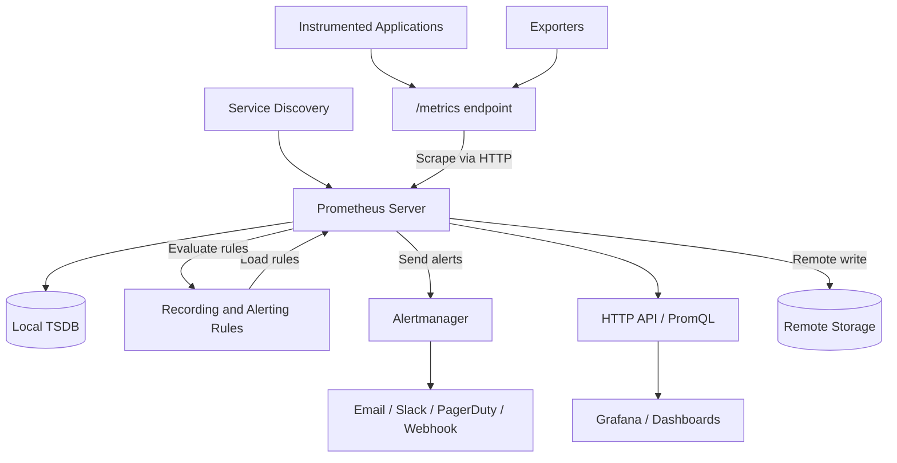

Kiến trúc trên cho thấy Prometheus server là trung tâm scrape, lưu trữ, query và đánh giá rule. Alertmanager không tự quyết định điều kiện alert, mà nhận alert từ Prometheus rồi xử lý notification.

### 4.2. Các thành phần quan trọng

| Thành phần | Vai trò |
| --- | --- |
| Prometheus server | Scrape metrics, lưu TSDB, chạy PromQL, đánh giá rules. |
| Target | Endpoint được scrape. |
| Exporter | Chuyển metrics từ hệ thống không có `/metrics` native thành format Prometheus. |
| Client library | Thư viện instrument code application để expose metrics. |
| TSDB | Time series database cục bộ của Prometheus. |
| PromQL engine | Thực thi query PromQL. |
| Recording rules | Tính trước query và ghi thành series mới. |
| Alerting rules | Đánh giá điều kiện alert. |
| Alertmanager | Group, deduplicate, silence, inhibit và gửi notification. |
| Service discovery | Tự phát hiện target. |
| Remote write | Gửi sample sang backend lưu trữ hoặc hệ thống trung tâm. |
| promtool | Kiểm tra config, rules và hỗ trợ debug. |

### 4.3. Luồng scrape metrics

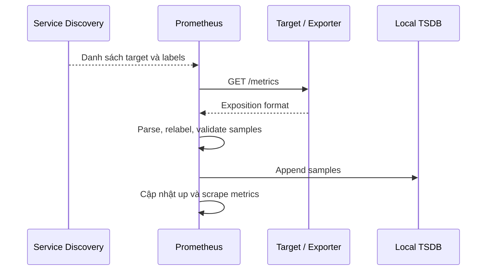

Nếu target không trả lời hoặc trả dữ liệu lỗi, Prometheus ghi `up=0` cho target đó.

### 4.4. Luồng query PromQL

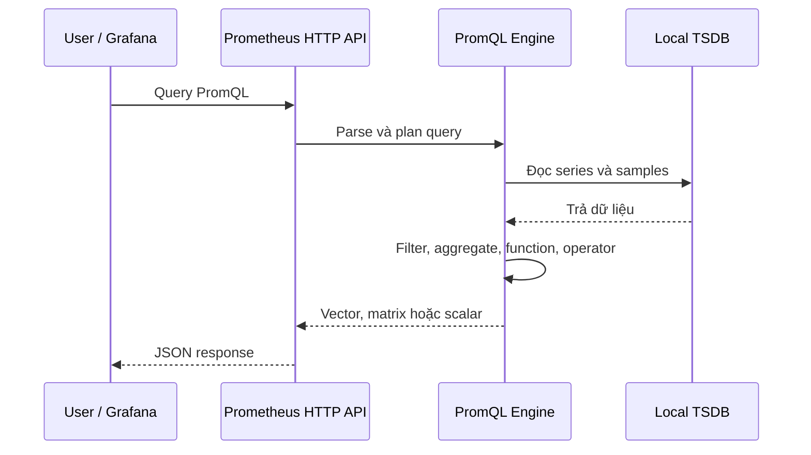

Grafana thường gọi Prometheus HTTP API để vẽ dashboard.

### 4.5. Luồng alerting

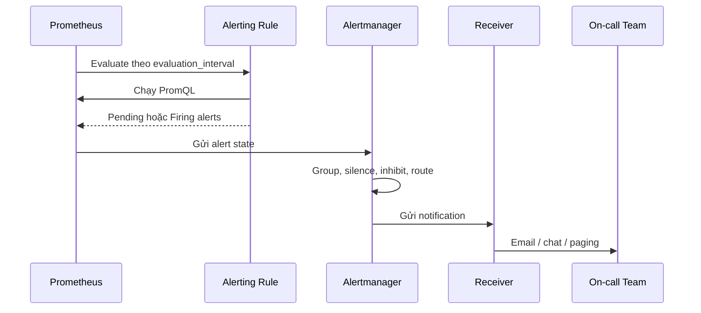

Prometheus xác định điều kiện cảnh báo. Alertmanager chịu trách nhiệm gửi cảnh báo đúng cách.

### 4.6. Kiến trúc local và production

Local learning:

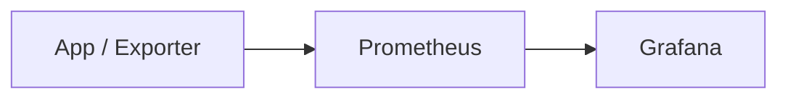

Production đơn giản:

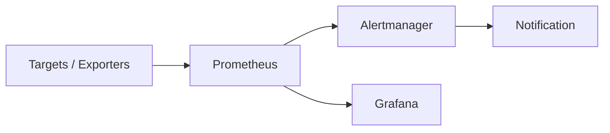

Production lớn hơn:

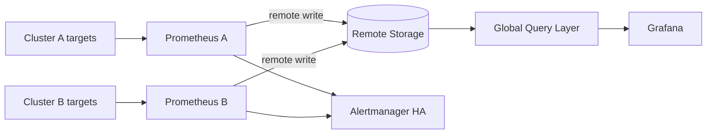

Prometheus server đơn lẻ không tự cung cấp global long-term distributed storage. Khi cần lưu lâu hoặc query toàn bộ nhiều cluster, thường dùng remote write, federation hoặc hệ sinh thái như Thanos, Mimir, Cortex hay VictoriaMetrics.

## 5. Vòng đời xử lý với Prometheus

### 5.1. Luồng học Prometheus cơ bản

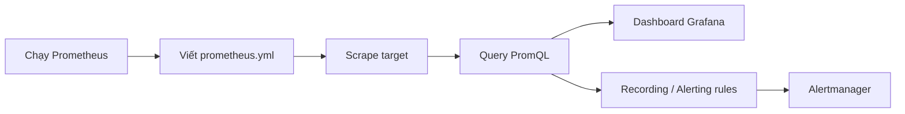

Một người mới học nên bắt đầu bằng:

1. Chạy Prometheus local.
2. Scrape chính Prometheus.
3. Query metric `up`.
4. Scrape Node Exporter hoặc app demo.
5. Viết PromQL với `rate`, `sum by`, `histogram_quantile`.
6. Tạo recording rule.
7. Tạo alert rule.
8. Kết nối Grafana.

### 5.2. Luồng instrument application

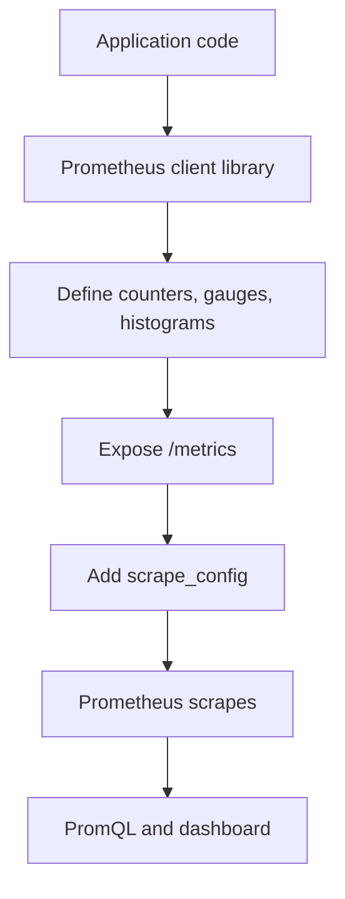

Ví dụ FastAPI hoặc backend API cần instrument:

- Tổng request theo method, route, status.
- Latency request bằng histogram.
- Số request đang xử lý.
- Error theo loại.
- Dependency latency, ví dụ database, Redis, external API.
- Queue depth hoặc worker job count nếu có worker.

### 5.3. Luồng thêm exporter

```mermaid
flowchart LR
    System[Database / Host / Service] --> Exporter[Exporter]
    Exporter --> Metrics[/metrics]
    Prom[Prometheus] -->|scrape| Metrics
    Prom --> Grafana[Dashboard]
```

Exporter phù hợp khi hệ thống không expose Prometheus metrics native. Ví dụ:

- Node Exporter cho host.
- Blackbox Exporter cho probe HTTP/TCP/ICMP.
- PostgreSQL Exporter cho PostgreSQL.
- MySQL Exporter cho MySQL.
- Redis Exporter cho Redis.
- cAdvisor cho container metrics.

### 5.4. Luồng tạo alert

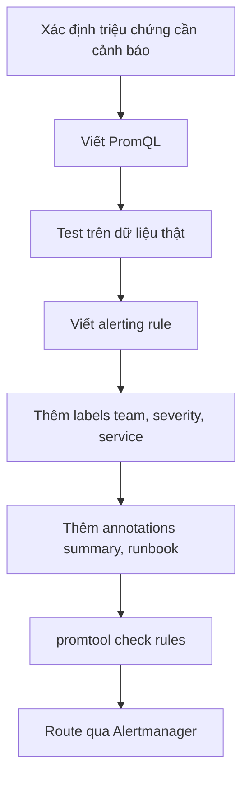

Alert nên bắt đầu từ triệu chứng có tác động, không phải từ mọi metric có thể vượt ngưỡng.

### 5.5. Luồng reload cấu hình

Prometheus có thể reload cấu hình bằng signal hoặc HTTP endpoint nếu bật lifecycle API.

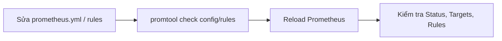

Quy trình an toàn:

```bash
promtool check config prometheus.yml
promtool check rules rules/*.yml
```

Sau đó mới reload hoặc restart.

## 6. Các khái niệm cốt lõi

### 6.1. `prometheus.yml`

`prometheus.yml` là file cấu hình chính của Prometheus. Nó mô tả:

- Cấu hình global.
- Rule files.
- Scrape configs.
- Alertmanager configs.
- Remote write/read nếu có.
- Storage hoặc feature liên quan qua command-line flags.

Ví dụ tối giản:

```yaml
global:
  scrape_interval: 15s
  evaluation_interval: 15s

rule_files:
  - rules/*.yml

scrape_configs:
  - job_name: prometheus
    static_configs:
      - targets:
          - localhost:9090
```

### 6.2. Global config

Phần `global` chứa giá trị mặc định:

```yaml
global:
  scrape_interval: 15s
  scrape_timeout: 10s
  evaluation_interval: 15s
  external_labels:
    cluster: dev
    replica: prometheus-1
```

Ý nghĩa:

| Trường | Vai trò |
| --- | --- |
| `scrape_interval` | Tần suất scrape mặc định. |
| `scrape_timeout` | Timeout mặc định cho mỗi scrape. |
| `evaluation_interval` | Tần suất đánh giá rule. |
| `external_labels` | Label gắn vào series/alert khi giao tiếp bên ngoài, thường dùng cho cluster/replica. |

### 6.3. Scrape config

Một `scrape_config` định nghĩa một job scrape.

Ví dụ:

```yaml
scrape_configs:
  - job_name: api
    metrics_path: /metrics
    scheme: http
    scrape_interval: 15s
    static_configs:
      - targets:
          - api-1:8000
          - api-2:8000
        labels:
          service: checkout
          environment: dev
```

Mỗi target sẽ có label `job="api"` và `instance="<host>:<port>"`.

### 6.4. Relabeling

Relabeling cho phép chỉnh label target trước khi scrape hoặc chỉnh metric sau khi scrape.

`relabel_configs` thường dùng để:

- Đổi label từ service discovery thành label chuẩn.
- Drop target không cần scrape.
- Rewrite `instance`.
- Chọn target dựa trên annotation Kubernetes.

`metric_relabel_configs` thường dùng để:

- Drop metric quá nhiều series.
- Drop label gây cardinality cao.
- Rename hoặc normalize label sau scrape.

Cần thận trọng với `metric_relabel_configs` vì nó chạy trên sample đã scrape, có thể làm Prometheus tốn CPU nếu dùng quá nhiều regex nặng.

### 6.5. Service discovery

Service discovery giúp Prometheus tự tìm target thay vì cấu hình thủ công.

Một số kiểu thường gặp:

| Kiểu | Khi dùng |
| --- | --- |
| Static config | Lab, target ít, cấu hình đơn giản. |
| File service discovery | Target được tool khác ghi ra file JSON/YAML. |
| DNS service discovery | Target qua DNS records. |
| Kubernetes service discovery | Cluster Kubernetes. |
| Consul service discovery | Hệ thống dùng Consul catalog. |
| Cloud service discovery | EC2, Azure, GCE hoặc hệ thống cloud. |

Với môi trường dynamic, service discovery là bắt buộc để tránh sửa config thủ công liên tục.

### 6.6. Exporter

Exporter là process expose metrics cho hệ thống khác.

Ví dụ:

| Exporter | Dùng cho |
| --- | --- |
| Node Exporter | Host Linux/macOS, CPU, memory, disk, network. |
| Windows Exporter | Host Windows. |
| Blackbox Exporter | Probe HTTP, HTTPS, TCP, ICMP, DNS. |
| PostgreSQL Exporter | PostgreSQL metrics. |
| MySQL Exporter | MySQL metrics. |
| Redis Exporter | Redis metrics. |
| cAdvisor | Container metrics. |
| kube-state-metrics | Kubernetes object state. |

Exporter không sửa hệ thống được monitor, nó chỉ đọc trạng thái và expose metrics.

### 6.7. Exposition format

Target expose metrics dạng text trên `/metrics`.

Ví dụ:

```text
# HELP http_requests_total Total number of HTTP requests.
# TYPE http_requests_total counter
http_requests_total{method="GET",status="200"} 1027
http_requests_total{method="GET",status="500"} 12
```

Prometheus scrape endpoint này, parse dòng metrics và ghi vào TSDB.

### 6.8. TSDB

Prometheus lưu dữ liệu trong local TSDB. Dữ liệu gồm:

- Write-ahead log, viết tắt là WAL.
- Head block cho dữ liệu mới.
- Block dữ liệu đã compact.
- Index và chunks.

Các flag quan trọng khi chạy Prometheus:

```text
--storage.tsdb.path=/prometheus
--storage.tsdb.retention.time=15d
--storage.tsdb.retention.size=50GB
```

Retention theo thời gian và dung lượng cần thiết kế theo sample rate, disk và nhu cầu điều tra.

### 6.9. Staleness

Khi target biến mất hoặc series không còn được scrape, Prometheus đánh dấu series là stale. Điều này giúp query phản ánh rằng dữ liệu không còn mới.

Ví dụ nếu pod bị xóa, metric của pod đó không nên tiếp tục xuất hiện như thể pod vẫn sống. Pull model giúp vòng đời series gắn với target rõ hơn so với push model.

### 6.10. Cardinality

Cardinality là số lượng series Prometheus phải lưu và query.

Ví dụ metric:

```text
http_requests_total{service, method, route, status, instance}
```

Nếu có:

- 20 service.
- 5 method.
- 100 route.
- 5 status group.
- 10 instance mỗi service.

Số series có thể là:

```text
20 * 5 * 100 * 5 * 10 = 500000
```

Cardinality tăng nhanh theo số label và số giá trị label. Đây là một trong những rủi ro lớn nhất khi vận hành Prometheus.

## 7. Cài đặt và chạy Prometheus cơ bản

### 7.1. Chạy bằng Docker CLI

Chạy nhanh Prometheus với cấu hình mẫu:

```bash
docker run -d \
  --name prometheus \
  -p 9090:9090 \
  prom/prometheus
```

Mở UI:

```text
http://localhost:9090
```

Kiểm tra container:

```bash
docker ps
docker logs prometheus
```

Dừng và xóa:

```bash
docker stop prometheus
docker rm prometheus
```

Chạy nhanh như trên phù hợp để thử, nhưng chưa lưu dữ liệu bền vững và chưa dùng config riêng.

### 7.2. Chạy Docker với config và volume

Tạo `prometheus.yml`:

```yaml
global:
  scrape_interval: 15s
  evaluation_interval: 15s

scrape_configs:
  - job_name: prometheus
    static_configs:
      - targets:
          - localhost:9090
```

Tạo volume:

```bash
docker volume create prometheus-data
```

Chạy Prometheus:

```bash
docker run -d \
  --name prometheus \
  -p 9090:9090 \
  -v ./prometheus.yml:/etc/prometheus/prometheus.yml:ro \
  -v prometheus-data:/prometheus \
  prom/prometheus \
  --config.file=/etc/prometheus/prometheus.yml \
  --storage.tsdb.path=/prometheus \
  --storage.tsdb.retention.time=15d
```

Lưu ý trên Windows PowerShell, dấu xuống dòng bằng backtick khác với Bash. Nếu chạy trực tiếp trên PowerShell, có thể viết một dòng hoặc dùng cú pháp PowerShell tương ứng.

### 7.3. Chạy bằng Docker Compose

Ví dụ `compose.yaml`:

```yaml
services:
  prometheus:
    image: prom/prometheus
    container_name: prometheus
    restart: unless-stopped
    ports:
      - "9090:9090"
    command:
      - --config.file=/etc/prometheus/prometheus.yml
      - --storage.tsdb.path=/prometheus
      - --storage.tsdb.retention.time=15d
      - --web.enable-lifecycle
    volumes:
      - ./prometheus.yml:/etc/prometheus/prometheus.yml:ro
      - ./rules:/etc/prometheus/rules:ro
      - prometheus-data:/prometheus

volumes:
  prometheus-data:
```

Chạy:

```bash
docker compose up -d
```

Xem log:

```bash
docker compose logs -f prometheus
```

Dừng:

```bash
docker compose down
```

Xóa cả dữ liệu:

```bash
docker compose down -v
```

Chỉ dùng `down -v` khi chắc chắn không cần dữ liệu Prometheus trong volume.

### 7.4. Kiểm tra target

Mở:

```text
http://localhost:9090/targets
```

Kiểm tra:

- Target có trạng thái `UP` không.
- Last scrape có lỗi không.
- Scrape duration có quá gần timeout không.
- Labels có đúng không.

Query cơ bản:

```promql
up
```

Nếu `up == 0`, Prometheus không scrape được target.

### 7.5. Reload cấu hình

Nếu bật:

```text
--web.enable-lifecycle
```

có thể reload bằng:

```bash
curl -X POST http://localhost:9090/-/reload
```

Trước khi reload:

```bash
docker exec prometheus promtool check config /etc/prometheus/prometheus.yml
```

Với rule:

```bash
docker exec prometheus promtool check rules /etc/prometheus/rules/*.yml
```

## 8. Cấu hình Prometheus trong thực tế

### 8.1. Cấu trúc thư mục đề xuất

Ví dụ cho lab hoặc project nhỏ:

```text
monitoring/
  compose.yaml
  prometheus.yml
  rules/
    api.rules.yml
    node.rules.yml
  alertmanager/
    alertmanager.yml
```

Ví dụ cho production GitOps:

```text
monitoring/
  prometheus/
    base/
      prometheus.yml
      rules/
    overlays/
      dev/
      staging/
      production/
  alertmanager/
  grafana/
```

Mục tiêu là cấu hình có thể review, rollback và tái tạo.

### 8.2. Scrape Prometheus chính nó

```yaml
scrape_configs:
  - job_name: prometheus
    static_configs:
      - targets:
          - localhost:9090
```

Một số metric hữu ích:

```promql
up{job="prometheus"}
prometheus_tsdb_head_series
rate(prometheus_tsdb_head_samples_appended_total[5m])
prometheus_rule_group_last_duration_seconds
prometheus_remote_storage_samples_pending
```

Prometheus cần tự monitor chính nó, vì nếu monitoring lỗi thì các alert khác cũng mất độ tin cậy.

### 8.3. Scrape Node Exporter

Ví dụ Docker Compose:

```yaml
services:
  prometheus:
    image: prom/prometheus
    ports:
      - "9090:9090"
    volumes:
      - ./prometheus.yml:/etc/prometheus/prometheus.yml:ro
      - prometheus-data:/prometheus

  node-exporter:
    image: prom/node-exporter
    ports:
      - "9100:9100"

volumes:
  prometheus-data:
```

`prometheus.yml`:

```yaml
scrape_configs:
  - job_name: node
    static_configs:
      - targets:
          - node-exporter:9100
```

Query thử:

```promql
up{job="node"}
rate(node_cpu_seconds_total[5m])
node_memory_MemAvailable_bytes
node_filesystem_avail_bytes
```

### 8.4. Scrape application

Ví dụ app expose metrics ở `api:8000/metrics`:

```yaml
scrape_configs:
  - job_name: api
    metrics_path: /metrics
    static_configs:
      - targets:
          - api:8000
        labels:
          service: checkout
          environment: dev
```

Query:

```promql
up{job="api"}
rate(http_requests_total{service="checkout"}[5m])
```

### 8.5. File service discovery

File service discovery phù hợp khi target do script, inventory hoặc automation tạo ra.

`prometheus.yml`:

```yaml
scrape_configs:
  - job_name: file-sd-api
    file_sd_configs:
      - files:
          - /etc/prometheus/targets/api/*.json
```

Ví dụ file target:

```json
[
  {
    "targets": ["10.0.1.10:8000", "10.0.1.11:8000"],
    "labels": {
      "service": "checkout",
      "environment": "production"
    }
  }
]
```

Khi file thay đổi, Prometheus tự reload target discovery theo interval.

### 8.6. Relabel target

Ví dụ rewrite `instance` thành label dễ đọc:

```yaml
scrape_configs:
  - job_name: api
    static_configs:
      - targets:
          - api-1.internal:8000
          - api-2.internal:8000
    relabel_configs:
      - source_labels: [__address__]
        target_label: instance
```

Ví dụ drop target theo label:

```yaml
relabel_configs:
  - source_labels: [environment]
    regex: dev
    action: drop
```

### 8.7. Metric relabel để giảm cardinality

Ví dụ drop label nguy hiểm:

```yaml
metric_relabel_configs:
  - action: labeldrop
    regex: "request_id|user_id|session_id"
```

Ví dụ drop metric không cần thiết:

```yaml
metric_relabel_configs:
  - source_labels: [__name__]
    regex: "go_memstats_.*"
    action: drop
```

Không nên dùng metric relabel để che vấn đề instrumentation xấu nếu có thể sửa ở source code.

## 9. PromQL trong thực tế

### 9.1. Instant vector và range vector

Instant vector lấy giá trị tại một thời điểm:

```promql
up
http_requests_total{service="checkout"}
```

Range vector lấy chuỗi sample trong một khoảng:

```promql
http_requests_total{service="checkout"}[5m]
```

Nhiều function như `rate`, `increase`, `avg_over_time` cần range vector.

### 9.2. Label selector

Filter exact match:

```promql
http_requests_total{service="checkout", status="500"}
```

Regex match:

```promql
http_requests_total{status=~"5.."}
```

Not equal:

```promql
http_requests_total{environment!="dev"}
```

Not regex:

```promql
http_requests_total{route!~"/internal/.*"}
```

Regex rộng có thể làm query nặng. Nên dùng label cụ thể khi có thể.

### 9.3. `rate` và `increase`

Dùng `rate()` cho counter để tính tốc độ mỗi giây:

```promql
rate(http_requests_total[5m])
```

Dùng `increase()` để tính tổng tăng trong khoảng:

```promql
increase(http_requests_total[1h])
```

Không nên dùng `rate()` cho Gauge.

### 9.4. Aggregation

Tổng request rate theo service:

```promql
sum(rate(http_requests_total[5m])) by (service)
```

Tổng request rate toàn hệ thống:

```promql
sum(rate(http_requests_total[5m]))
```

Loại bỏ label instance:

```promql
sum without (instance) (rate(http_requests_total[5m]))
```

Giữ label cần phân tích, bỏ label gây nhiễu.

### 9.5. Error rate

Error rate theo service:

```promql
sum(rate(http_requests_total{status=~"5.."}[5m])) by (service)
/
sum(rate(http_requests_total[5m])) by (service)
```

Nếu hệ thống dùng status group:

```promql
sum(rate(http_requests_total{status_class="5xx"}[5m])) by (service)
/
sum(rate(http_requests_total[5m])) by (service)
```

Cần cẩn thận khi traffic rất thấp, vì một vài lỗi có thể tạo tỷ lệ rất cao nhưng impact nhỏ.

### 9.6. Latency p95 từ histogram

```promql
histogram_quantile(
  0.95,
  sum(rate(http_request_duration_seconds_bucket[5m])) by (le, service)
)
```

Theo route:

```promql
histogram_quantile(
  0.95,
  sum(rate(http_request_duration_seconds_bucket[5m])) by (le, service, route)
)
```

Không bỏ label `le` khi tính `histogram_quantile` với classic histogram.

### 9.7. CPU usage từ Node Exporter

CPU usage tổng:

```promql
1 - avg(rate(node_cpu_seconds_total{mode="idle"}[5m])) by (instance)
```

CPU usage theo mode:

```promql
sum(rate(node_cpu_seconds_total[5m])) by (instance, mode)
```

### 9.8. Memory usage từ Node Exporter

Memory available:

```promql
node_memory_MemAvailable_bytes
```

Memory usage ratio:

```promql
1 - (
  node_memory_MemAvailable_bytes
  /
  node_memory_MemTotal_bytes
)
```

### 9.9. Disk usage

Disk usage ratio:

```promql
1 - (
  node_filesystem_avail_bytes{fstype!~"tmpfs|overlay"}
  /
  node_filesystem_size_bytes{fstype!~"tmpfs|overlay"}
)
```

Thường nên filter `fstype`, `mountpoint` để tránh filesystem ảo gây nhiễu.

### 9.10. Queue backlog

Nếu có metric:

```text
queue_depth{queue="email"}
```

Query:

```promql
max(queue_depth) by (queue)
```

Nếu queue có traffic vào/ra:

```promql
sum(rate(queue_messages_published_total[5m])) by (queue)
sum(rate(queue_messages_consumed_total[5m])) by (queue)
```

Backlog tăng khi publish rate lớn hơn consume rate trong thời gian dài.

### 9.11. Join vector

PromQL hỗ trợ vector matching nhưng dễ viết sai. Ví dụ join metadata:

```promql
rate(http_requests_total[5m])
* on (service) group_left(team)
service_info
```

Chỉ dùng join khi thật sự cần. Nếu label có thể gắn từ instrumentation hoặc relabeling, thường đơn giản hơn.

### 9.12. Query performance

Query có thể chậm khi:

- Time range quá dài.
- Selector quá rộng.
- Regex phức tạp.
- Series cardinality cao.
- Aggregation trên quá nhiều series.
- Dashboard refresh quá nhanh.
- Không dùng recording rule cho query lặp lại nặng.

Tối ưu:

- Filter label càng sớm càng tốt.
- Dùng recording rule cho query phổ biến.
- Giảm cardinality từ nguồn.
- Dùng dashboard interval hợp lý.
- Không query raw histogram bucket quá rộng nếu không cần.

## 10. Instrumentation và exporters

### 10.1. Instrumentation là gì

Instrumentation là việc thêm metrics vào application hoặc system để Prometheus có thể scrape.

Ví dụ application expose:

```text
/metrics
```

Endpoint này trả về:

```text
http_requests_total{method="GET",route="/health",status="200"} 1234
http_request_duration_seconds_bucket{le="0.1",route="/health"} 1200
```

Instrumentation tốt giúp đi từ alert đến dashboard rồi đến code nhanh hơn.

### 10.2. Metrics nên có cho online service

Với HTTP API hoặc RPC service:

| Metric | Type | Ý nghĩa |
| --- | --- | --- |
| `http_requests_total` | Counter | Tổng request theo route/method/status. |
| `http_request_duration_seconds` | Histogram | Latency request. |
| `http_requests_in_flight` | Gauge | Request đang xử lý. |
| `http_request_size_bytes` | Histogram | Kích thước request nếu cần. |
| `http_response_size_bytes` | Histogram | Kích thước response nếu cần. |
| `dependency_request_duration_seconds` | Histogram | Latency gọi DB/cache/API ngoài. |
| `dependency_errors_total` | Counter | Lỗi khi gọi dependency. |

Golden signals:

- Traffic.
- Errors.
- Latency.
- Saturation.

### 10.3. Metrics nên có cho worker/offline processing

Với worker hoặc pipeline:

| Metric | Type | Ý nghĩa |
| --- | --- | --- |
| `jobs_processed_total` | Counter | Tổng job xử lý. |
| `jobs_failed_total` | Counter | Tổng job lỗi. |
| `job_duration_seconds` | Histogram | Thời gian xử lý job. |
| `queue_depth` | Gauge | Số item đang chờ. |
| `worker_in_progress_jobs` | Gauge | Job đang xử lý. |
| `last_success_timestamp_seconds` | Gauge | Lần xử lý thành công gần nhất. |

Với pipeline nhiều stage, nên đo input, output, error và latency theo từng stage.

### 10.4. Metrics nên có cho batch job

Batch job ngắn khó scrape vì process kết thúc nhanh. Có thể:

- Chạy job đủ lâu để Prometheus scrape nếu phù hợp.
- Dùng Pushgateway cho batch job cấp service.
- Ghi file textfile collector nếu job gắn với một host.

Metric thường dùng:

```text
batch_job_last_success_timestamp_seconds
batch_job_duration_seconds
batch_job_records_processed_total
batch_job_failures_total
```

Alert thường dựa trên "job chưa thành công trong khoảng thời gian đủ dài".

### 10.5. Client libraries

Prometheus có client libraries cho nhiều ngôn ngữ. Khi dùng client library:

- Dùng Counter cho số lần xảy ra.
- Dùng Gauge cho trạng thái hiện tại.
- Dùng Histogram cho latency hoặc size.
- Đặt tên metric có unit.
- Không đưa dimension high-cardinality vào label.
- Expose endpoint `/metrics`.

Ví dụ Python pseudo-code:

```python
from prometheus_client import Counter, Histogram

REQUESTS = Counter(
    "http_requests_total",
    "Total HTTP requests",
    ["method", "route", "status"],
)

LATENCY = Histogram(
    "http_request_duration_seconds",
    "HTTP request duration in seconds",
    ["method", "route"],
)
```

### 10.6. Exporter pattern

Exporter dùng khi không thể hoặc không nên sửa application để expose Prometheus metrics.

Ví dụ:

```text
PostgreSQL -> postgres_exporter -> /metrics -> Prometheus
Redis      -> redis_exporter    -> /metrics -> Prometheus
Host       -> node_exporter     -> /metrics -> Prometheus
```

Exporter nên chạy gần hệ thống được monitor để giảm network issue và tránh credential quá rộng.

### 10.7. Blackbox monitoring

Blackbox Exporter kiểm tra từ bên ngoài:

- HTTP status.
- TLS certificate.
- DNS.
- TCP connect.
- ICMP ping.

Whitebox monitoring nhìn metrics bên trong service. Blackbox monitoring nhìn từ góc độ người dùng hoặc dependency ngoài.

Cả hai đều cần thiết:

- Whitebox giúp debug nguyên nhân.
- Blackbox giúp phát hiện khi hệ thống bên trong tưởng ổn nhưng người dùng không truy cập được.

### 10.8. OpenTelemetry và Prometheus

OpenTelemetry có thể sinh metrics, traces và logs. Prometheus có thể scrape endpoint Prometheus exposition hoặc nhận dữ liệu qua các tích hợp phù hợp.

Khi kết hợp:

- Giữ naming và labels nhất quán.
- Tránh duplicate metrics từ nhiều pipeline.
- Kiểm soát cardinality ở collector.
- Chọn rõ nguồn sự thật cho dashboard và alert.

## 11. Recording rules và alerting rules

### 11.1. Rule file

Prometheus load rule file qua `rule_files`:

```yaml
rule_files:
  - /etc/prometheus/rules/*.yml
```

Ví dụ `rules/api.rules.yml`:

```yaml
groups:
  - name: api.rules
    interval: 30s
    rules:
      - record: job:http_requests:rate5m
        expr: sum(rate(http_requests_total[5m])) by (job)
```

Kiểm tra:

```bash
promtool check rules rules/api.rules.yml
```

### 11.2. Recording rule

Recording rule tính trước một query và lưu kết quả thành time series mới.

Ví dụ:

```yaml
groups:
  - name: api-recording
    rules:
      - record: service:http_requests:rate5m
        expr: sum(rate(http_requests_total[5m])) by (service)

      - record: service:http_errors:rate5m
        expr: sum(rate(http_requests_total{status=~"5.."}[5m])) by (service)

      - record: service:http_error_ratio:rate5m
        expr: service:http_errors:rate5m / service:http_requests:rate5m
```

Lợi ích:

- Dashboard nhanh hơn.
- Alert expression đơn giản hơn.
- Query nặng không chạy lặp lại quá nhiều.
- Naming thống nhất giữa dashboard và alert.

### 11.3. Naming recording rule

Quy ước thường gặp:

```text
level:metric:operations
```

Ví dụ:

```text
service:http_requests:rate5m
job:http_request_duration_seconds:p95_rate5m
cluster:node_cpu:ratio
```

Tên rule nên cho biết:

- Aggregation level, ví dụ service, job, cluster.
- Metric hoặc ý nghĩa.
- Operation, ví dụ rate5m, sum, ratio, p95.

### 11.4. Alerting rule

Ví dụ alert instance down:

```yaml
groups:
  - name: node-alerts
    rules:
      - alert: InstanceDown
        expr: up == 0
        for: 5m
        labels:
          severity: critical
          team: platform
        annotations:
          summary: "Instance {{ $labels.instance }} is down"
          description: "Prometheus cannot scrape {{ $labels.job }} on {{ $labels.instance }} for more than 5 minutes."
          runbook_url: "https://example.com/runbooks/instance-down"
```

Các phần chính:

| Trường | Ý nghĩa |
| --- | --- |
| `alert` | Tên alert. |
| `expr` | PromQL trả về series cần alert. |
| `for` | Điều kiện phải đúng liên tục bao lâu mới firing. |
| `keep_firing_for` | Giữ firing thêm một khoảng sau khi condition hết đúng. |
| `labels` | Metadata để route/group alert. |
| `annotations` | Nội dung mô tả cho người xử lý. |

### 11.5. Alert high error rate

Ví dụ:

```yaml
groups:
  - name: api-alerts
    rules:
      - alert: HighHttpErrorRate
        expr: |
          (
            sum(rate(http_requests_total{status=~"5.."}[5m])) by (service)
            /
            sum(rate(http_requests_total[5m])) by (service)
          ) > 0.05
        for: 10m
        labels:
          severity: critical
          team: backend
        annotations:
          summary: "High HTTP error rate on {{ $labels.service }}"
          description: "{{ $labels.service }} has more than 5% 5xx errors for 10 minutes."
```

Với service traffic thấp, nên thêm điều kiện minimum traffic:

```promql
(
  sum(rate(http_requests_total{status=~"5.."}[5m])) by (service)
  /
  sum(rate(http_requests_total[5m])) by (service)
) > 0.05
and
sum(rate(http_requests_total[5m])) by (service) > 1
```

### 11.6. Alert high latency

```yaml
groups:
  - name: latency-alerts
    rules:
      - alert: HighHttpLatencyP95
        expr: |
          histogram_quantile(
            0.95,
            sum(rate(http_request_duration_seconds_bucket[5m])) by (le, service)
          ) > 0.8
        for: 10m
        labels:
          severity: warning
          team: backend
        annotations:
          summary: "High p95 latency on {{ $labels.service }}"
          description: "p95 latency is above 800ms for 10 minutes."
```

Chọn threshold dựa trên SLO hoặc baseline thật, không copy ngẫu nhiên từ hệ thống khác.

### 11.7. Alert disk gần đầy

```yaml
groups:
  - name: node-alerts
    rules:
      - alert: DiskWillFillSoon
        expr: |
          predict_linear(
            node_filesystem_avail_bytes{fstype!~"tmpfs|overlay"}[6h],
            24 * 3600
          ) < 0
        for: 30m
        labels:
          severity: warning
          team: platform
        annotations:
          summary: "Filesystem may fill within 24 hours on {{ $labels.instance }}"
```

Capacity alert nên cảnh báo đủ sớm để có hành động.

### 11.8. Test rules

`promtool` có thể kiểm tra syntax rule:

```bash
promtool check rules rules/*.yml
```

Với rule quan trọng, có thể viết unit test rule bằng file test để kiểm tra input series và expected alert.

Lợi ích:

- Tránh lỗi syntax.
- Tránh alert rule sai logic khi refactor.
- Review rule nghiêm túc hơn.

## 12. Alertmanager

### 12.1. Vai trò của Alertmanager

Prometheus tạo alert. Alertmanager xử lý notification.

Alertmanager có nhiệm vụ:

- Group alert liên quan.
- Deduplicate alert giống nhau từ nhiều Prometheus.
- Route alert theo label.
- Silence alert trong maintenance.
- Inhibit alert cấp thấp khi đã có alert cấp cao hơn.
- Gửi notification qua Email, Slack, Microsoft Teams, PagerDuty, Opsgenie, Webhook hoặc kênh khác.

### 12.2. Kết nối Prometheus với Alertmanager

Trong `prometheus.yml`:

```yaml
alerting:
  alertmanagers:
    - static_configs:
        - targets:
            - alertmanager:9093
```

Compose ví dụ:

```yaml
services:
  prometheus:
    image: prom/prometheus
    volumes:
      - ./prometheus.yml:/etc/prometheus/prometheus.yml:ro

  alertmanager:
    image: prom/alertmanager
    ports:
      - "9093:9093"
    volumes:
      - ./alertmanager.yml:/etc/alertmanager/alertmanager.yml:ro
```

### 12.3. Cấu hình Alertmanager cơ bản

Ví dụ `alertmanager.yml`:

```yaml
global:
  resolve_timeout: 5m

route:
  receiver: default
  group_by: ["alertname", "service"]
  group_wait: 30s
  group_interval: 5m
  repeat_interval: 4h
  routes:
    - matchers:
        - severity="critical"
      receiver: critical-webhook

receivers:
  - name: default
    webhook_configs:
      - url: http://webhook-receiver:5001/alerts

  - name: critical-webhook
    webhook_configs:
      - url: http://critical-receiver:5001/alerts
```

Trong thực tế, receiver thường là Slack, PagerDuty, Email hoặc incident management system.

### 12.4. Routing

Routing dựa trên label alert.

Ví dụ label:

```text
team=platform
severity=critical
environment=production
```

Route:

```text
team=platform AND severity=critical -> PagerDuty platform
team=platform AND severity=warning  -> Slack platform
team=backend                         -> Slack backend
```

Alert rule cần label nhất quán thì routing mới đáng tin.

### 12.5. Grouping

Grouping giúp giảm spam.

Ví dụ nếu 100 instance cùng down vì một zone lỗi, Alertmanager có thể gửi một notification nhóm thay vì 100 notification.

`group_by` thường dùng:

```yaml
group_by: ["alertname", "cluster", "service"]
```

Không nên group quá rộng đến mức che mất service khác nhau. Cũng không nên group quá hẹp khiến notification quá nhiều.

### 12.6. Silence và inhibition

Silence dùng để tạm ngừng notification cho alert matching điều kiện, ví dụ maintenance:

```text
environment=staging
service=checkout
```

Inhibition dùng để chặn alert cấp thấp khi alert cấp cao đã firing.

Ví dụ:

- Nếu `ClusterDown` đang firing, inhibit `InstanceDown` trong cluster đó.
- Nếu `DatabaseDown` đang firing, inhibit alert query latency từ service phụ thuộc.

Silence và inhibition không sửa nguyên nhân, chỉ kiểm soát notification noise.

### 12.7. Alertmanager HA

Alertmanager có thể chạy nhiều instance trong cluster HA. Khi dùng HA cần:

- Cấu hình peer đúng.
- Đặt external URL đúng nếu sau reverse proxy.
- Kiểm tra deduplication.
- Đảm bảo Prometheus gửi alert đến tất cả Alertmanager hoặc qua load balancer phù hợp.

Alertmanager HA giúp notification vẫn hoạt động khi một node lỗi.

## 13. Storage, retention và remote write

### 13.1. Local storage

Prometheus lưu dữ liệu local trong đường dẫn:

```text
/prometheus
```

khi dùng Docker image phổ biến.

Flag quan trọng:

```text
--storage.tsdb.path=/prometheus
--storage.tsdb.retention.time=15d
--storage.tsdb.retention.size=50GB
```

Retention thực tế phụ thuộc:

- Số target.
- Số series mỗi target.
- Scrape interval.
- Số label và cardinality.
- Remote write có bật không.
- Dung lượng disk.

### 13.2. Ước lượng sample rate

Sample rate gần đúng:

```text
samples_per_second = total_series / scrape_interval_seconds
```

Ví dụ:

```text
1,000,000 series / 15s = 66,666 samples/s
```

Nếu giảm scrape interval từ 15s xuống 5s, sample rate tăng 3 lần. Điều này ảnh hưởng CPU, RAM, disk và remote write.

### 13.3. Scrape interval

Gợi ý:

| Use case | Scrape interval |
| --- | --- |
| Application metrics production | 15s đến 30s |
| Infrastructure metrics | 15s đến 60s |
| Batch hoặc slow-changing metrics | 1m đến 5m |
| High-resolution incident metrics | 5s đến 15s nếu backend chịu được |

Không nên đặt scrape interval quá thấp cho mọi target. Hãy chọn theo nhu cầu phát hiện và chi phí lưu trữ.

### 13.4. Retention

Local retention phổ biến:

- 7 ngày cho lab hoặc cluster nhỏ.
- 15 đến 30 ngày cho production Prometheus.
- Dài hơn nếu disk đủ và query vẫn chấp nhận được.

Nếu cần lưu nhiều tháng hoặc nhiều năm, thường dùng remote storage.

### 13.5. Remote write

Remote write gửi sample từ Prometheus sang backend khác.

Ví dụ:

```yaml
remote_write:
  - url: https://remote-storage.example.com/api/v1/write
    queue_config:
      max_shards: 10
      capacity: 10000
      max_samples_per_send: 2000
```

Use case:

- Lưu dài hạn.
- Query global nhiều cluster.
- Centralized metrics.
- Compliance hoặc backup.

Lưu ý:

- Remote write tăng CPU, memory và network.
- Nếu backend remote chậm, queue có thể backlog.
- Cần monitor `prometheus_remote_storage_samples_pending`.
- Series churn cao làm remote write tốn memory hơn.

### 13.6. Remote read

Remote read cho phép Prometheus đọc dữ liệu từ backend ngoài. Trong thực tế, nhiều hệ thống hiện đại dùng query layer riêng hơn là remote read trực tiếp từ Prometheus. Cần đọc tài liệu backend đang dùng.

### 13.7. Federation

Federation cho phép một Prometheus scrape dữ liệu từ Prometheus khác.

Use case:

- Prometheus global lấy aggregated metrics từ Prometheus leaf.
- Giảm lượng dữ liệu bằng cách chỉ lấy recording rules.
- Xây dựng view tổng quan nhiều cluster.

Ví dụ global Prometheus scrape endpoint `/federate`:

```yaml
scrape_configs:
  - job_name: federate
    metrics_path: /federate
    params:
      match[]:
        - '{job=~"api|node"}'
        - '{__name__=~"service:.*"}'
    static_configs:
      - targets:
          - prometheus-cluster-a:9090
          - prometheus-cluster-b:9090
```

Federation không thay thế hoàn toàn remote storage. Nó phù hợp hơn cho dữ liệu tổng hợp.

### 13.8. Backup

Prometheus local TSDB thường không được xem như database giao dịch cần backup từng sample. Với monitoring, mất một phần dữ liệu cũ có thể chấp nhận được hơn mất cấu hình/rules.

Cần backup:

- `prometheus.yml`.
- Rule files.
- Alertmanager config.
- Dashboard Grafana.
- Cấu hình service discovery.
- Secret liên quan.

Nếu cần backup TSDB, nên snapshot hoặc backup volume theo cách phù hợp với deployment. Cần test restore, không chỉ test backup.

## 14. Service discovery và Kubernetes

### 14.1. Vì sao cần service discovery

Trong môi trường static, target có thể khai báo thủ công:

```yaml
targets:
  - api-1:8000
  - api-2:8000
```

Trong Kubernetes hoặc cloud, pod và instance thay đổi liên tục. Sửa tay không thực tế. Service discovery giúp Prometheus tự cập nhật target.

### 14.2. Kubernetes service discovery

Prometheus có thể discover:

- Nodes.
- Services.
- Endpoints.
- Pods.
- Ingresses.

Thường dùng relabeling để chọn pod/service có annotation scrape.

Ví dụ ý tưởng annotation:

```text
prometheus.io/scrape=true
prometheus.io/port=8080
prometheus.io/path=/metrics
```

Sau discovery, relabeling chuyển metadata Kubernetes thành target address và labels.

### 14.3. kube-state-metrics

kube-state-metrics expose trạng thái Kubernetes object:

- Deployment replicas.
- Pod phase.
- Container waiting reason.
- Job completion.
- Node condition.
- Resource requests/limits.

Nó khác với metrics runtime của kubelet/cAdvisor. kube-state-metrics cho biết desired/current state của object Kubernetes.

### 14.4. cAdvisor và kubelet metrics

cAdvisor/kubelet metrics thường dùng cho:

- Container CPU.
- Container memory.
- Filesystem.
- Network.
- Pod/container runtime metrics.

Khi dùng Kubernetes, cần hiểu metric đến từ đâu:

- Application metrics từ app.
- Infrastructure metrics từ node exporter.
- Container metrics từ kubelet/cAdvisor.
- Kubernetes object state từ kube-state-metrics.

### 14.5. Prometheus Operator

Trong Kubernetes, nhiều hệ thống dùng Prometheus Operator. Nó thêm custom resources như:

- `Prometheus`.
- `Alertmanager`.
- `ServiceMonitor`.
- `PodMonitor`.
- `PrometheusRule`.

Operator giúp quản lý Prometheus bằng Kubernetes manifests thay vì viết toàn bộ `prometheus.yml` thủ công.

Khi học nền tảng, nên hiểu `prometheus.yml` trước. Khi lên Kubernetes production, Prometheus Operator giúp chuẩn hóa vận hành.

## 15. Visualization với Grafana

### 15.1. Prometheus UI

Prometheus có UI built-in để:

- Query PromQL.
- Xem graph đơn giản.
- Kiểm tra targets.
- Kiểm tra rules.
- Xem alerts.
- Xem service discovery.
- Xem runtime/status.

Prometheus UI phù hợp để debug và kiểm thử query. Dashboard production thường dùng Grafana.

### 15.2. Grafana data source

Grafana có Prometheus data source. Cấu hình thường gồm:

```text
URL: http://prometheus:9090
Access: server/proxy
```

Trong Docker Compose, Grafana gọi Prometheus bằng service name:

```text
http://prometheus:9090
```

không phải:

```text
http://localhost:9090
```

vì `localhost` bên trong Grafana container là chính container Grafana.

### 15.3. Dashboard Prometheus tốt

Dashboard service nên có:

- Request rate.
- Error rate.
- Latency p50/p95/p99.
- Saturation như CPU, memory, queue depth.
- Dependency health.
- Instance availability.
- Link sang logs/traces nếu có.

Không nên chỉ có CPU/RAM. User impact thường đến từ errors, latency và availability.

### 15.4. Query trong Grafana

Dùng biến Grafana:

```promql
sum(rate(http_requests_total{service="$service"}[$__rate_interval])) by (status)
```

Grafana hỗ trợ các biến như:

- `$__interval`
- `$__rate_interval`
- `$__range`

Với Prometheus data source, `$__rate_interval` thường hữu ích hơn range cố định khi dashboard thay đổi time range.

### 15.5. Recording rules cho dashboard

Dashboard có nhiều panel dùng cùng query nặng nên cân nhắc recording rules.

Thay vì:

```promql
histogram_quantile(
  0.95,
  sum(rate(http_request_duration_seconds_bucket[5m])) by (le, service)
)
```

có thể tạo rule:

```text
service:http_request_duration_seconds:p95_rate5m
```

rồi dashboard query metric đã tính trước.

## 16. Bảo mật và vận hành

### 16.1. Không expose Prometheus public thiếu bảo vệ

Prometheus có thể chứa thông tin nhạy cảm:

- Tên service nội bộ.
- Hostname, IP, namespace, cluster.
- Metrics business.
- Query API.
- Labels có thể lộ thông tin vận hành.

Không nên mở Prometheus trực tiếp ra Internet mà không có authentication, authorization, HTTPS và network control.

### 16.2. HTTPS và authentication

Prometheus có thể được đặt sau reverse proxy hoặc cấu hình web server options tùy deployment. Trong production thường dùng:

- Reverse proxy như Nginx, Traefik, Envoy.
- TLS termination.
- SSO hoặc basic auth ở proxy.
- Network policy hoặc firewall.
- VPN hoặc private network.

Prometheus server không nên là public admin UI cho mọi người.

### 16.3. Secret trong config

Cấu hình có thể chứa token hoặc credential khi scrape target HTTPS, basic auth hoặc remote write.

Không nên commit secret vào repository.

Nên dùng:

- Secret manager.
- Kubernetes Secret.
- Docker secret.
- Environment-specific config.
- File mount với quyền đọc hạn chế.

### 16.4. Resource sizing

Prometheus cần tài nguyên theo:

- Số series.
- Scrape interval.
- Query load.
- Recording rules.
- Remote write.
- Retention.
- Churn của series.

Metrics cần theo dõi chính Prometheus:

```promql
prometheus_tsdb_head_series
rate(prometheus_tsdb_head_samples_appended_total[5m])
prometheus_engine_query_duration_seconds
prometheus_rule_group_last_duration_seconds
prometheus_remote_storage_samples_pending
process_resident_memory_bytes{job="prometheus"}
```

### 16.5. High availability

Prometheus HA thường chạy hai Prometheus server scrape cùng target với external label khác nhau:

```yaml
global:
  external_labels:
    cluster: prod
    replica: prometheus-a
```

Prometheus B:

```yaml
global:
  external_labels:
    cluster: prod
    replica: prometheus-b
```

Remote storage hoặc Alertmanager sẽ deduplicate dựa trên label và cấu hình phù hợp.

### 16.6. Upgrade

Quy trình upgrade:

1. Đọc release notes.
2. Backup config, rules và volume nếu cần.
3. Test trên staging.
4. Kiểm tra exporter compatibility.
5. Kiểm tra PromQL query quan trọng.
6. Kiểm tra alert rule và Alertmanager.
7. Upgrade từng replica nếu chạy HA.
8. Theo dõi Prometheus self metrics sau upgrade.

Không nên dùng tag `latest` cho production.

### 16.7. Query log

Query log giúp phân tích query nặng hoặc dashboard gây tải cao. Khi bật, cần lưu ý:

- Query log có thể chứa label nhạy cảm.
- File log có thể lớn.
- Cần quy trình rotate log.
- Dùng để điều tra, không bật vô tội vạ nếu không cần.

### 16.8. Metamonitoring

Metamonitoring là monitoring chính hệ thống monitoring.

Cần alert khi:

- Prometheus không scrape được nhiều target.
- Prometheus mất quá nhiều series bất thường.
- Rule evaluation fail hoặc skipped.
- Remote write backlog tăng.
- Alertmanager không reachable.
- Notification pipeline không hoạt động.
- Disk Prometheus gần đầy.

Monitoring bị hỏng mà không ai biết là rủi ro vận hành nghiêm trọng.

## 17. Prometheus trong quy trình phát triển phần mềm

### 17.1. Development

Trong development, Prometheus giúp:

- Chạy local stack monitoring.
- Kiểm tra metrics endpoint.
- Test metric name và label.
- Viết PromQL trước khi tạo dashboard.
- Phát hiện cardinality xấu sớm.

Ví dụ local stack:

- App.
- Prometheus.
- Grafana.
- Node Exporter hoặc cAdvisor.

### 17.2. Testing

Monitoring cũng cần test:

- `/metrics` có expose được không.
- Metric type đúng không.
- Counter không giảm bất thường trừ restart.
- Label không chứa user id/request id.
- Rule file pass `promtool`.
- Alert có fire với input giả lập.
- Dashboard query không lỗi.

### 17.3. CI/CD

Pipeline có thể:

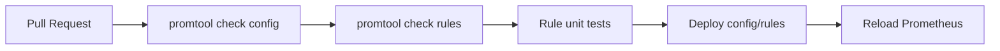

Không nên deploy rule mới trực tiếp vào production nếu chưa kiểm tra syntax.

### 17.4. Production

Production cần quan tâm:

- HA cho Prometheus và Alertmanager nếu monitoring là critical.
- Retention và disk.
- Cardinality budget.
- Recording rules cho dashboard nặng.
- Alert routing và ownership.
- Backup config/rules.
- Security và network access.
- Upgrade plan.
- Remote write hoặc long-term storage nếu cần.

Prometheus giúp nhìn thấy vấn đề, nhưng không thay thế thiết kế hệ thống tốt, logging, tracing, incident process và runbook.

## 18. So sánh Prometheus với công nghệ liên quan

### 18.1. Prometheus và Grafana

| Tiêu chí | Prometheus | Grafana |
| --- | --- | --- |
| Vai trò | Thu thập, lưu metrics, PromQL, rules | Dashboard, visualization, Explore, alert UI |
| Lưu metrics | Có | Không phải vai trò chính |
| Query language | PromQL | Phụ thuộc data source |
| Alerting | Alerting rules, gửi Alertmanager | Grafana Alerting |
| UI | Query/debug cơ bản | Dashboard mạnh |

Prometheus và Grafana thường đi cùng nhau: Prometheus là data source metrics, Grafana là dashboard.

### 18.2. Prometheus và Alertmanager

| Tiêu chí | Prometheus | Alertmanager |
| --- | --- | --- |
| Vai trò | Đánh giá alert rule | Gửi và quản lý notification |
| Logic alert | PromQL | Routing, grouping, inhibition, silencing |
| Dữ liệu | Time series | Alert states |
| Người dùng chính | SRE, backend, platform | SRE, on-call, incident process |

Prometheus không phải notification system đầy đủ. Alertmanager xử lý phần notification workflow.

### 18.3. Prometheus và InfluxDB

| Tiêu chí | Prometheus | InfluxDB |
| --- | --- | --- |
| Mô hình thu thập | Pull mặc định | Push/write thường phổ biến |
| Query | PromQL | Flux hoặc SQL tùy phiên bản |
| Cloud-native monitoring | Rất phổ biến | Phù hợp time series rộng hơn |
| Alert ecosystem | Alertmanager | Tùy stack |
| Service discovery | Mạnh | Tùy cách triển khai |

Prometheus rất mạnh cho monitoring cloud-native. InfluxDB phù hợp nhiều bài toán time series khác, đặc biệt nơi push/write model là tự nhiên.

### 18.4. Prometheus và OpenTelemetry

| Tiêu chí | Prometheus | OpenTelemetry |
| --- | --- | --- |
| Vai trò | Metrics monitoring server | Chuẩn instrumentation và telemetry pipeline |
| Metrics | Có | Có |
| Logs/traces | Không phải trọng tâm | Có cả metrics, logs, traces |
| Storage | Local TSDB | Không phải storage chính |
| Query | PromQL | Phụ thuộc backend |

OpenTelemetry có thể sinh metrics và Prometheus có thể scrape hoặc tích hợp qua pipeline. Hai công nghệ không loại trừ nhau.

### 18.5. Prometheus và Datadog/New Relic

| Tiêu chí | Prometheus self-hosted | Datadog/New Relic |
| --- | --- | --- |
| Vận hành | Tự quản lý | Managed SaaS |
| Chi phí | Hạ tầng + công vận hành | Pricing SaaS |
| Kiểm soát dữ liệu | Cao nếu self-hosted | Phụ thuộc vendor |
| Tích hợp | Exporter/client library | Agent và platform tích hợp sẵn |
| Time-to-value | Cần setup | Thường nhanh hơn |

Chọn theo ngân sách, compliance, đội vận hành, độ phức tạp hệ thống và yêu cầu dữ liệu.

## 19. Các lỗi thiết kế thường gặp

### 19.1. Dùng label cardinality cao

Không đưa vào label:

- `user_id`
- `email`
- `request_id`
- `session_id`
- URL raw chứa id

Hậu quả:

- RAM tăng mạnh.
- Disk tăng mạnh.
- Query chậm.
- Remote write tốn tài nguyên.
- Prometheus có thể OOM.

### 19.2. Dùng Counter sai

Counter chỉ tăng. Không dùng Counter cho:

- Số request đang chạy.
- Queue depth.
- Memory hiện tại.
- Temperature.

Dùng Gauge cho giá trị có thể tăng giảm.

### 19.3. Quên `rate()` cho Counter

Sai:

```promql
http_requests_total
```

để xem traffic hiện tại.

Đúng:

```promql
rate(http_requests_total[5m])
```

Counter raw chỉ cho biết tổng tích lũy, không cho biết tốc độ hiện tại.

### 19.4. Tính average latency sai

Nếu có histogram sum/count, latency trung bình:

```promql
sum(rate(http_request_duration_seconds_sum[5m])) by (service)
/
sum(rate(http_request_duration_seconds_count[5m])) by (service)
```

Không lấy average của quantile từ nhiều instance, vì quantile không aggregate tuyến tính.

### 19.5. Bỏ label `le` khi tính histogram quantile

Sai:

```promql
histogram_quantile(
  0.95,
  sum(rate(http_request_duration_seconds_bucket[5m])) by (service)
)
```

Đúng:

```promql
histogram_quantile(
  0.95,
  sum(rate(http_request_duration_seconds_bucket[5m])) by (le, service)
)
```

Classic histogram cần giữ label `le`.

### 19.6. Scrape interval quá thấp cho mọi target

Scrape 1s cho toàn bộ hệ thống có thể làm sample rate tăng rất mạnh. Chỉ dùng interval ngắn cho target thật sự cần độ phân giải cao và đã tính tài nguyên.

### 19.7. Dashboard query quá rộng

Ví dụ:

```promql
rate(http_requests_total[5m])
```

trên toàn bộ cluster nhiều triệu series có thể rất nặng. Nên filter:

```promql
sum(rate(http_requests_total{service="$service"}[5m])) by (status)
```

### 19.8. Không dùng recording rule cho query nặng

Dashboard refresh mỗi 30s với nhiều panel histogram có thể tạo tải lớn. Query nặng và lặp lại nên đưa vào recording rule.

### 19.9. Alert theo nguyên nhân nhỏ thay vì triệu chứng

Alert kiểu:

```text
CPU > 80%
```

có thể gây noise nếu user không bị ảnh hưởng. Nên ưu tiên:

- Error rate cao.
- Latency cao.
- Availability giảm.
- Batch job không thành công.
- Capacity sắp hết.

CPU/RAM vẫn hữu ích, nhưng không phải lúc nào cũng đáng page.

### 19.10. Alert thiếu `for`

Alert không có `for` dễ fire vì spike ngắn.

Nên dùng:

```yaml
for: 5m
```

hoặc phù hợp với baseline và impact.

### 19.11. Alert thiếu label `team` và `severity`

Thiếu owner làm Alertmanager route khó đúng.

Nên có:

```yaml
labels:
  team: platform
  severity: critical
  service: checkout
```

### 19.12. Không monitor chính Prometheus

Nếu Prometheus không được monitor, có thể mất cảnh báo mà không ai biết. Cần metamonitoring cho Prometheus, Alertmanager, remote write và notification path.

### 19.13. Dùng Pushgateway sai mục đích

Không dùng Pushgateway cho long-running service chỉ vì network khó. Nên đặt Prometheus gần target hoặc giải quyết network/service discovery. Pushgateway phù hợp chủ yếu cho service-level batch jobs.

### 19.14. Không lưu cấu hình trong Git

Nếu `prometheus.yml`, rules và Alertmanager config chỉ sửa tay trên server, khó review, khó rollback và dễ mất khi server lỗi.

### 19.15. Không giới hạn metric từ exporter

Một số exporter có thể expose nhiều metric hoặc label không cần thiết. Cần đọc tài liệu exporter, chọn collector phù hợp và drop metric nếu cần.

## 20. Bài tập thực hành

### Bài 1: Chạy Prometheus đầu tiên

Thực hiện:

- Chạy Prometheus bằng Docker ở port `9090`.
- Mở UI `http://localhost:9090`.
- Query `up`.
- Xem trang `/targets`.
- Xem endpoint `/metrics` của Prometheus.

### Bài 2: Dùng config và volume

Thực hiện:

- Viết `prometheus.yml`.
- Mount config vào container.
- Tạo volume `prometheus-data`.
- Restart container và kiểm tra dữ liệu còn tồn tại.

### Bài 3: Scrape Node Exporter

Thực hiện:

- Chạy `prom/node-exporter`.
- Thêm scrape config job `node`.
- Query `up{job="node"}`.
- Query CPU, memory và disk metrics.

### Bài 4: Viết PromQL cơ bản

Thực hiện với metric có sẵn:

- Dùng label selector.
- Dùng `rate()`.
- Dùng `sum by`.
- Dùng `avg_over_time`.
- Dùng `topk`.

### Bài 5: Instrument một app đơn giản

Tạo app HTTP đơn giản expose `/metrics` với:

- Counter `http_requests_total`.
- Histogram `http_request_duration_seconds`.
- Gauge `http_requests_in_flight`.
- Label `method`, `route`, `status`.

Scrape app bằng Prometheus và query request rate.

### Bài 6: Tạo recording rule

Thực hiện:

- Tạo thư mục `rules`.
- Viết rule `service:http_requests:rate5m`.
- Mount rule vào Prometheus.
- Chạy `promtool check rules`.
- Reload Prometheus.
- Query metric mới.

### Bài 7: Tạo alerting rule

Thực hiện:

- Viết alert `InstanceDown` với `up == 0`.
- Thêm `for: 5m`.
- Thêm label `team`, `severity`.
- Thêm annotation `summary`, `description`.
- Kiểm tra trong tab Alerts.

### Bài 8: Chạy Alertmanager

Thực hiện:

- Chạy Alertmanager bằng Docker Compose.
- Cấu hình Prometheus gửi alert sang Alertmanager.
- Tạo receiver webhook test.
- Kiểm tra alert đến Alertmanager.

### Bài 9: Kết nối Grafana

Thực hiện:

- Chạy Grafana cùng Prometheus.
- Thêm Prometheus data source.
- Tạo dashboard có panel `up`.
- Tạo panel CPU hoặc request rate.
- Dùng variable `$job`.

### Bài 10: Kiểm tra cardinality

Thực hiện:

- Query số series tổng.
- Tìm metric có nhiều series.
- Nhận diện label có cardinality cao.
- Đề xuất cách giảm.

Ví dụ query:

```promql
prometheus_tsdb_head_series
topk(10, count by (__name__)({__name__=~".+"}))
```

## 21. Lộ trình học đề xuất

1. Nắm khái niệm time series, metric name, label, sample, job và instance.
2. Chạy Prometheus local bằng Docker.
3. Viết `prometheus.yml` và scrape Prometheus chính nó.
4. Học PromQL cơ bản: selector, rate, increase, sum by, avg, topk.
5. Học Counter, Gauge, Histogram và Summary.
6. Scrape Node Exporter và đọc host metrics.
7. Instrument một app đơn giản với client library.
8. Tạo dashboard Grafana dùng Prometheus data source.
9. Học recording rules cho query lặp lại.
10. Học alerting rules và Alertmanager.
11. Học relabeling và service discovery.
12. Học cardinality, retention và resource sizing.
13. Học remote write hoặc federation nếu cần lưu dài hạn.
14. Học Prometheus Operator nếu triển khai trên Kubernetes.
15. Xây dựng metamonitoring cho chính stack monitoring.

## 22. Kết luận

Prometheus là nền tảng metrics monitoring mạnh, đặc biệt phù hợp với hệ thống cloud-native, microservices và môi trường có nhiều target thay đổi. Điểm quan trọng không chỉ là biết chạy Prometheus, mà là hiểu data model, labels, cardinality, scrape lifecycle, PromQL, rules, Alertmanager và cách instrument hệ thống đúng.

Dùng Prometheus tốt cần kết hợp nhiều phần:

- Instrument application có chủ đích.
- Đặt tên metric và label hợp lý.
- Tránh high cardinality.
- Chọn scrape interval và retention phù hợp.
- Viết PromQL đúng với metric type.
- Dùng recording rules cho query nặng.
- Alert theo triệu chứng và user impact.
- Route alert qua Alertmanager với owner rõ.
- Monitor chính Prometheus và Alertmanager.
- Quản lý config/rules bằng Git và kiểm tra bằng `promtool`.

Prometheus không tự làm hệ thống ổn định hơn. Nó cung cấp dữ liệu và cảnh báo để con người phát hiện, hiểu và xử lý sự cố nhanh hơn. Chất lượng monitoring phụ thuộc nhiều vào cách thiết kế metrics, labels, dashboard, alert và quy trình vận hành.

## 23. Tài liệu tham khảo

Các nguồn dưới đây là tài liệu chính thức hoặc nguồn liên quan trực tiếp được dùng để đối chiếu nội dung. Tại thời điểm tra cứu ngày 2026-07-07, các trang tài liệu Prometheus `latest` vẫn là nguồn cần đối chiếu theo phiên bản đang dùng.

- Prometheus overview: https://prometheus.io/docs/introduction/overview/
- First steps with Prometheus: https://prometheus.io/docs/introduction/first_steps/
- Prometheus installation: https://prometheus.io/docs/prometheus/latest/installation/
- Prometheus configuration: https://prometheus.io/docs/prometheus/latest/configuration/configuration/
- Prometheus data model: https://prometheus.io/docs/concepts/data_model/
- Prometheus metric types: https://prometheus.io/docs/concepts/metric_types/
- Jobs and instances: https://prometheus.io/docs/concepts/jobs_instances/
- Querying basics: https://prometheus.io/docs/prometheus/latest/querying/basics/
- PromQL operators: https://prometheus.io/docs/prometheus/latest/querying/operators/
- PromQL functions: https://prometheus.io/docs/prometheus/latest/querying/functions/
- Prometheus storage: https://prometheus.io/docs/prometheus/latest/storage/
- Recording rules: https://prometheus.io/docs/prometheus/latest/configuration/recording_rules/
- Alerting rules: https://prometheus.io/docs/prometheus/latest/configuration/alerting_rules/
- Alerting overview and Alertmanager: https://prometheus.io/docs/alerting/latest/overview/
- Alertmanager configuration: https://prometheus.io/docs/alerting/latest/configuration/
- Exporters and integrations: https://prometheus.io/docs/instrumenting/exporters/
- Client libraries: https://prometheus.io/docs/instrumenting/clientlibs/
- Metric and label naming best practices: https://prometheus.io/docs/practices/naming/
- Instrumentation best practices: https://prometheus.io/docs/practices/instrumentation/
- Histograms and summaries: https://prometheus.io/docs/practices/histograms/
- Alerting best practices: https://prometheus.io/docs/practices/alerting/
- Recording rules best practices: https://prometheus.io/docs/practices/rules/
- When to use the Pushgateway: https://prometheus.io/docs/practices/pushing/
- Remote write tuning: https://prometheus.io/docs/practices/remote_write/
- promtool documentation: https://prometheus.io/docs/prometheus/latest/command-line/promtool/
- Node Exporter guide: https://prometheus.io/docs/guides/node-exporter/
- cAdvisor guide: https://prometheus.io/docs/guides/cadvisor/
- Grafana Prometheus data source: https://grafana.com/docs/grafana/latest/datasources/prometheus/
- OpenTelemetry documentation: https://opentelemetry.io/docs/
