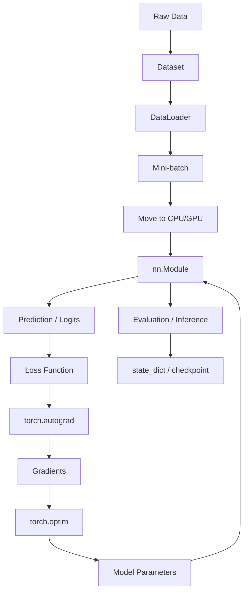
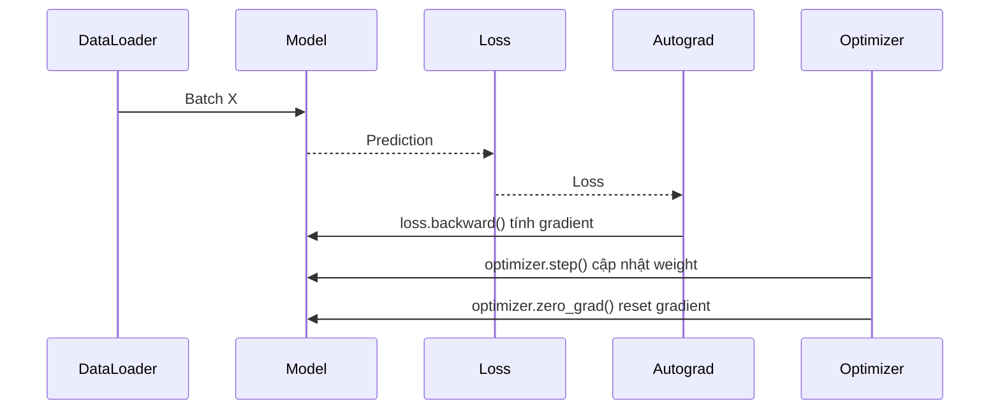
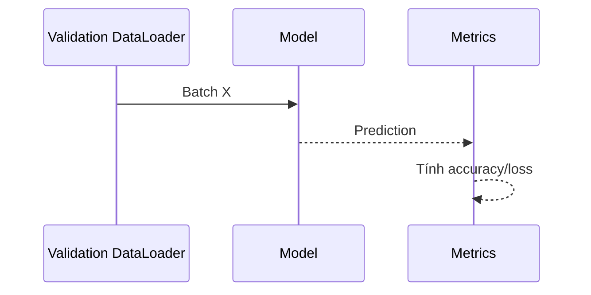

# PyTorch: Cơ sở lý thuyết, kiến trúc và thực hành

## 1. Mục tiêu tài liệu

Tài liệu này trình bày PyTorch theo hướng lý thuyết kết hợp thực hành, giúp người học nắm được:

- PyTorch là gì và vì sao nó được dùng rộng rãi trong deep learning, computer vision, NLP, multimodal AI và nghiên cứu mô hình học máy.
- Các khái niệm cốt lõi như tensor, shape, dtype, device, autograd, computational graph, `nn.Module`, loss function, optimizer, dataset và dataloader.
- Cách xây dựng model bằng `torch.nn`.
- Cách viết training loop chuẩn với forward pass, loss, backward pass và optimizer step.
- Cách dùng GPU/accelerator, mixed precision và `torch.compile` ở mức cơ bản.
- Cách lưu, tải và chạy inference với model.
- Cách tổ chức project PyTorch trong hệ thống thực tế.
- Các lỗi thường gặp khi học và triển khai PyTorch.

Tài liệu này tập trung vào PyTorch 2.x. Một số API nâng cao như compiler, distributed training, export hoặc accelerator backend có thể thay đổi theo phiên bản, vì vậy khi làm dự án thực tế nên kiểm tra tài liệu chính thức đúng phiên bản và môi trường cài đặt đang dùng.

## 2. Tổng quan về PyTorch

PyTorch là thư viện mã nguồn mở dùng để xây dựng và huấn luyện mô hình machine learning/deep learning. Cốt lõi của PyTorch là `torch.Tensor`, một cấu trúc dữ liệu giống mảng nhiều chiều, có thể chạy trên CPU, GPU hoặc accelerator khác và hỗ trợ automatic differentiation thông qua `torch.autograd`.

PyTorch thường được dùng trong:

- Computer vision: phân loại ảnh, object detection, segmentation, OCR.
- Natural language processing: text classification, language model, transformer.
- Speech/audio: speech recognition, audio classification.
- Recommendation system.
- Time series forecasting.
- Generative AI.
- Research mô hình mới.
- Fine-tuning model.
- Xây dựng embedding model hoặc neural network cho hệ thống AI.

Workflow học máy phổ biến với PyTorch:

```text
Data -> Dataset/DataLoader -> Model -> Loss -> Backpropagation -> Optimizer -> Evaluation -> Save model
```

PyTorch nổi tiếng vì phong cách **eager execution**: code chạy gần giống Python thông thường, dễ debug, dễ thử nghiệm và phù hợp với nghiên cứu. Từ PyTorch 2.x, `torch.compile` bổ sung compiled mode để tăng hiệu năng trong nhiều trường hợp mà vẫn giữ trải nghiệm eager-mode quen thuộc.

### 2.1. Đặc điểm nổi bật

| Đặc điểm | Ý nghĩa |
| --- | --- |
| Tensor library | Làm việc với mảng nhiều chiều tương tự NumPy nhưng có thể chạy trên GPU. |
| Autograd | Tự động tính gradient cho backpropagation. |
| Dynamic computation graph | Graph được tạo theo quá trình chạy code, dễ debug và linh hoạt. |
| `torch.nn` | Cung cấp module, layer, loss function và building block cho neural network. |
| `torch.optim` | Cung cấp optimizer như SGD, Adam, AdamW. |
| `Dataset` và `DataLoader` | Chuẩn hóa việc đọc dữ liệu, batching, shuffle và multiprocessing. |
| GPU/accelerator support | Có thể chạy trên CUDA, MPS, XPU hoặc backend khác tùy môi trường. |
| Mixed precision | Tăng tốc và giảm memory bằng `torch.autocast` và `torch.amp.GradScaler`. |
| `torch.compile` | Biên dịch model/function để tối ưu hiệu năng trong PyTorch 2.x. |
| Ecosystem rộng | Có torchvision, torchaudio, torchtext, torchmetrics, Lightning, Hugging Face, v.v. |

## 3. Cơ sở lý thuyết

### 3.1. Tensor

Tensor là cấu trúc dữ liệu nhiều chiều. Có thể xem tensor là phiên bản tổng quát của scalar, vector và matrix.

| Dạng | Ví dụ shape | Ý nghĩa |
| --- | --- | --- |
| Scalar | `()` | Một số đơn lẻ. |
| Vector | `(n,)` | Mảng 1 chiều. |
| Matrix | `(m, n)` | Bảng 2 chiều. |
| 3D tensor | `(batch, sequence, feature)` | Dữ liệu chuỗi hoặc batch embedding. |
| 4D tensor | `(batch, channel, height, width)` | Ảnh trong computer vision. |

Ví dụ:

```python
import torch

x = torch.tensor([[1.0, 2.0], [3.0, 4.0]])
print(x.shape)   # torch.Size([2, 2])
print(x.dtype)   # torch.float32
print(x.device)  # cpu
```

Tensor giống NumPy array nhưng có thêm:

- Chạy trên GPU/accelerator.
- Theo dõi gradient nếu `requires_grad=True`.
- Tích hợp trực tiếp với autograd và neural network.

### 3.2. Shape, dtype và device

Ba thuộc tính rất quan trọng:

| Thuộc tính | Ý nghĩa |
| --- | --- |
| `shape` | Kích thước tensor theo từng chiều. |
| `dtype` | Kiểu dữ liệu như `float32`, `int64`, `bool`. |
| `device` | Nơi tensor nằm, ví dụ `cpu`, `cuda`, `mps`. |

Ví dụ:

```python
x = torch.randn(32, 3, 224, 224)

print(x.shape)
print(x.dtype)
print(x.device)
```

Lỗi phổ biến trong PyTorch thường liên quan đến:

- Shape không khớp.
- Dtype không đúng.
- Tensor và model nằm trên device khác nhau.

### 3.3. Computational graph

Khi thực hiện phép toán trên tensor có `requires_grad=True`, PyTorch ghi lại các phép toán đó thành computational graph.

Ví dụ:

```python
x = torch.tensor(2.0, requires_grad=True)
y = x * x + 3 * x + 1
```

Graph logic:

```text
x -> x*x
x -> 3*x
x*x + 3*x + 1 -> y
```

Khi gọi:

```python
y.backward()
```

PyTorch tính đạo hàm của `y` theo `x` và lưu vào:

```python
x.grad
```

### 3.4. Autograd

Autograd là engine automatic differentiation của PyTorch. Nó tự động tính gradient cần cho backpropagation.

Ví dụ:

```python
import torch

x = torch.tensor(2.0, requires_grad=True)
y = x ** 2

y.backward()

print(x.grad)  # tensor(4.)
```

Ý nghĩa toán học:

```text
y = x^2
dy/dx = 2x
với x = 2 -> dy/dx = 4
```

Autograd là nền tảng để huấn luyện neural network:

1. Model dự đoán output.
2. Loss đo sai số.
3. `loss.backward()` tính gradient.
4. Optimizer cập nhật weight.

### 3.5. Neural network

Neural network là hàm có tham số học được. Trong PyTorch, model thường kế thừa từ `torch.nn.Module`.

Ví dụ:

```python
from torch import nn

class SimpleModel(nn.Module):
    def __init__(self):
        super().__init__()
        self.linear = nn.Linear(10, 1)

    def forward(self, x):
        return self.linear(x)
```

Các tham số học được nằm trong:

```python
model.parameters()
```

PyTorch tự đăng ký layer nếu layer được gán vào thuộc tính của `nn.Module`, ví dụ `self.linear`.

### 3.6. Forward pass và backward pass

Forward pass:

```text
input -> model -> prediction -> loss
```

Backward pass:

```text
loss.backward() -> gradient cho từng parameter
```

Training loop cơ bản:

```python
pred = model(x)
loss = loss_fn(pred, y)
loss.backward()
optimizer.step()
optimizer.zero_grad()
```

Gradient trong PyTorch được tích lũy mặc định. Vì vậy cần gọi `optimizer.zero_grad()` ở mỗi iteration để tránh cộng dồn gradient không mong muốn.

### 3.7. Loss function

Loss function đo mức độ sai giữa prediction và target.

| Bài toán | Loss phổ biến |
| --- | --- |
| Regression | `nn.MSELoss`, `nn.L1Loss` |
| Binary classification | `nn.BCEWithLogitsLoss` |
| Multi-class classification | `nn.CrossEntropyLoss` |
| Sequence modeling | `nn.CrossEntropyLoss` theo token |
| Metric learning | Triplet loss, contrastive loss |

Ví dụ:

```python
loss_fn = nn.CrossEntropyLoss()
loss = loss_fn(logits, labels)
```

Với `nn.CrossEntropyLoss`, input thường là logits chưa softmax và target là class index kiểu `torch.long`.

### 3.8. Optimizer

Optimizer cập nhật parameter dựa trên gradient.

| Optimizer | Khi dùng |
| --- | --- |
| `SGD` | Cơ bản, dễ hiểu, có thể dùng momentum. |
| `Adam` | Phổ biến, ổn định trong nhiều bài toán. |
| `AdamW` | Phổ biến trong transformer và deep learning hiện đại. |
| `RMSprop` | Một số bài toán sequence hoặc reinforcement learning. |

Ví dụ:

```python
optimizer = torch.optim.AdamW(model.parameters(), lr=1e-3)
```

Trong mỗi batch:

```python
loss.backward()
optimizer.step()
optimizer.zero_grad()
```

### 3.9. Epoch, batch và mini-batch

| Khái niệm | Ý nghĩa |
| --- | --- |
| Sample | Một điểm dữ liệu. |
| Batch | Một nhóm sample xử lý cùng lúc. |
| Mini-batch training | Cập nhật model theo từng batch nhỏ thay vì toàn bộ dataset. |
| Epoch | Một lần model đi qua toàn bộ training dataset. |
| Iteration/step | Một lần xử lý một batch. |

Mini-batch giúp:

- Tận dụng GPU tốt hơn.
- Giảm memory so với full-batch.
- Làm gradient có tính nhiễu nhẹ, đôi khi giúp generalization.

### 3.10. Training mode và evaluation mode

PyTorch model có hai chế độ:

```python
model.train()
model.eval()
```

`model.train()` dùng khi huấn luyện. `model.eval()` dùng khi validation hoặc inference.

Quan trọng với layer như:

- Dropout.
- BatchNorm.

Khi inference, thường dùng:

```python
model.eval()
with torch.inference_mode():
    pred = model(x)
```

`torch.inference_mode()` tắt tracking gradient và tối ưu hơn cho inference.

## 4. Kiến trúc PyTorch

### 4.1. Sơ đồ kiến trúc Mermaid



PyTorch tách các phần khá rõ:

- `torch` cho tensor operation.
- `torch.autograd` cho gradient.
- `torch.nn` cho neural network module.
- `torch.optim` cho optimizer.
- `torch.utils.data` cho dataset và dataloader.
- `torch.amp` cho mixed precision.
- `torch.compile` cho compiled mode.

### 4.2. Các thành phần quan trọng

| Thành phần | Vai trò |
| --- | --- |
| `torch.Tensor` | Cấu trúc dữ liệu chính. |
| `torch.autograd` | Tự động tính gradient. |
| `nn.Module` | Base class cho model/layer. |
| `nn.Parameter` | Tensor được đăng ký là parameter học được. |
| `nn.Linear`, `nn.Conv2d`, ... | Layer có sẵn. |
| Loss function | Đo sai số prediction-target. |
| `torch.optim` | Cập nhật parameter. |
| `Dataset` | Định nghĩa cách lấy một sample. |
| `DataLoader` | Tạo batch, shuffle, multiprocessing. |
| `state_dict` | Dictionary chứa weight/buffer của model. |
| `torch.save`, `torch.load` | Lưu và tải checkpoint. |
| `torch.compile` | Tối ưu model/function trong PyTorch 2.x. |

## 5. Vòng đời huấn luyện model

### 5.1. Luồng huấn luyện tổng quan



Trong một epoch:

1. Lặp qua từng batch.
2. Chuyển input/target sang device.
3. Gọi model để dự đoán.
4. Tính loss.
5. Backpropagation.
6. Optimizer update.
7. Reset gradient.

### 5.2. Luồng validation/inference



Validation khác training:

- Gọi `model.eval()`.
- Không gọi `loss.backward()`.
- Không gọi `optimizer.step()`.
- Dùng `torch.no_grad()` hoặc `torch.inference_mode()`.

Ví dụ:

```python
model.eval()
with torch.inference_mode():
    for X, y in test_loader:
        pred = model(X)
```

## 6. Các khái niệm cốt lõi

### 6.1. Tensor creation

```python
import torch

a = torch.tensor([1, 2, 3])
b = torch.zeros(2, 3)
c = torch.ones(2, 3)
d = torch.randn(2, 3)
e = torch.arange(0, 10, 2)
```

Các hàm thường dùng:

| Hàm | Ý nghĩa |
| --- | --- |
| `torch.tensor()` | Tạo tensor từ dữ liệu Python. |
| `torch.zeros()` | Tensor toàn 0. |
| `torch.ones()` | Tensor toàn 1. |
| `torch.randn()` | Tensor random theo normal distribution. |
| `torch.arange()` | Tensor dãy số. |
| `torch.empty()` | Tensor chưa khởi tạo giá trị. |

### 6.2. Tensor operation

```python
x = torch.randn(2, 3)
y = torch.randn(2, 3)

z = x + y
m = x @ y.T
s = x.sum()
mean = x.mean(dim=0)
```

Một số operation phổ biến:

| Operation | Ý nghĩa |
| --- | --- |
| `+`, `-`, `*`, `/` | Phép toán element-wise. |
| `@` hoặc `torch.matmul` | Matrix multiplication. |
| `.sum()`, `.mean()` | Reduction. |
| `.reshape()` | Đổi shape. |
| `.permute()` | Đổi thứ tự chiều. |
| `.squeeze()` | Bỏ chiều có size 1. |
| `.unsqueeze()` | Thêm chiều size 1. |

### 6.3. Broadcasting

Broadcasting cho phép PyTorch thực hiện phép toán giữa tensor có shape khác nhau nếu tương thích.

Ví dụ:

```python
x = torch.randn(32, 10)
bias = torch.randn(10)

y = x + bias
```

`bias` shape `(10,)` được broadcast thành `(32, 10)`.

Broadcasting tiện nhưng cũng có thể gây bug nếu shape không như mong đợi. Nên kiểm tra `.shape` thường xuyên khi debug.

### 6.4. Device

Chọn device:

```python
import torch

device = (
    "cuda"
    if torch.cuda.is_available()
    else "mps"
    if torch.backends.mps.is_available()
    else "cpu"
)

print(device)
```

Chuyển tensor/model:

```python
x = x.to(device)
model = model.to(device)
```

Tensor và model phải cùng device. Nếu model ở GPU nhưng input ở CPU, PyTorch sẽ báo lỗi.

### 6.5. `requires_grad`

Tensor có `requires_grad=True` sẽ được autograd theo dõi:

```python
x = torch.tensor(2.0, requires_grad=True)
y = x ** 2
y.backward()
print(x.grad)
```

Parameter của model thường tự có `requires_grad=True`.

Khi không cần gradient:

```python
with torch.no_grad():
    y = model(x)
```

Hoặc cho inference:

```python
with torch.inference_mode():
    y = model(x)
```

### 6.6. `nn.Module`

Model nên kế thừa `nn.Module`:

```python
from torch import nn

class MLP(nn.Module):
    def __init__(self, input_dim: int, hidden_dim: int, num_classes: int):
        super().__init__()
        self.net = nn.Sequential(
            nn.Linear(input_dim, hidden_dim),
            nn.ReLU(),
            nn.Linear(hidden_dim, num_classes),
        )

    def forward(self, x):
        return self.net(x)
```

Khởi tạo:

```python
model = MLP(input_dim=784, hidden_dim=128, num_classes=10)
```

In model:

```python
print(model)
```

### 6.7. Dataset

`Dataset` định nghĩa cách lấy một sample.

```python
from torch.utils.data import Dataset

class ToyDataset(Dataset):
    def __init__(self):
        self.X = torch.randn(100, 10)
        self.y = torch.randint(0, 2, (100,))

    def __len__(self):
        return len(self.X)

    def __getitem__(self, idx):
        return self.X[idx], self.y[idx]
```

Dataset cần có:

- `__len__`
- `__getitem__`

### 6.8. DataLoader

`DataLoader` tạo batch từ dataset:

```python
from torch.utils.data import DataLoader

dataset = ToyDataset()
loader = DataLoader(dataset, batch_size=32, shuffle=True)

for X, y in loader:
    print(X.shape, y.shape)
    break
```

Tham số thường dùng:

| Tham số | Ý nghĩa |
| --- | --- |
| `batch_size` | Số sample mỗi batch. |
| `shuffle` | Trộn dữ liệu mỗi epoch. |
| `num_workers` | Số process đọc dữ liệu. |
| `pin_memory` | Tối ưu transfer CPU -> GPU trong một số trường hợp. |
| `drop_last` | Bỏ batch cuối nếu không đủ size. |

### 6.9. Optimizer và scheduler

Optimizer:

```python
optimizer = torch.optim.AdamW(model.parameters(), lr=1e-3)
```

Scheduler điều chỉnh learning rate theo thời gian:

```python
scheduler = torch.optim.lr_scheduler.StepLR(
    optimizer,
    step_size=10,
    gamma=0.1,
)
```

Trong training:

```python
optimizer.step()
scheduler.step()
```

Không phải bài toán nào cũng cần scheduler, nhưng nó thường hữu ích khi train lâu.

### 6.10. `state_dict`

`state_dict` là dictionary chứa parameter và buffer của model.

```python
state = model.state_dict()
```

Lưu:

```python
torch.save(model.state_dict(), "model.pth")
```

Tải:

```python
model = MLP(input_dim=784, hidden_dim=128, num_classes=10)
model.load_state_dict(torch.load("model.pth", weights_only=True))
model.eval()
```

Lưu `state_dict` được khuyến nghị vì linh hoạt hơn so với lưu toàn bộ object model.

## 7. Cài đặt và cấu hình

### 7.1. Cài PyTorch

Lệnh cài phụ thuộc vào hệ điều hành và compute platform. Cách an toàn nhất là dùng trang cài đặt chính thức của PyTorch để chọn:

- OS: Windows, Linux, macOS.
- Package manager: pip, conda.
- Compute platform: CPU, CUDA, ROCm.

Ví dụ CPU hoặc môi trường đơn giản:

```bash
pip install torch torchvision torchaudio
```

Ví dụ CUDA cần lấy lệnh từ trang PyTorch chính thức vì version CUDA thay đổi theo thời điểm.

Kiểm tra:

```python
import torch

print(torch.__version__)
print(torch.cuda.is_available())
```

### 7.2. Tạo môi trường Python

```bash
python -m venv .venv
```

Windows PowerShell:

```powershell
.\.venv\Scripts\Activate.ps1
```

macOS/Linux:

```bash
source .venv/bin/activate
```

Cài thư viện:

```bash
pip install torch torchvision torchaudio
pip install numpy matplotlib scikit-learn tqdm
```

### 7.3. Kiểm tra GPU

```python
import torch

if torch.cuda.is_available():
    print("CUDA:", torch.cuda.get_device_name(0))
else:
    print("CUDA is not available")
```

Với Mac Apple Silicon:

```python
print(torch.backends.mps.is_available())
```

## 8. Ví dụ PyTorch cơ bản

### 8.1. Tensor và device

```python
import torch

device = "cuda" if torch.cuda.is_available() else "cpu"

x = torch.randn(4, 3).to(device)
w = torch.randn(3, 2).to(device)

y = x @ w

print(y.shape)
print(y.device)
```

### 8.2. Autograd đơn giản

```python
import torch

x = torch.tensor(3.0, requires_grad=True)
y = 2 * x ** 2 + 5 * x + 1

y.backward()

print(x.grad)
```

Đạo hàm:

```text
y = 2x^2 + 5x + 1
dy/dx = 4x + 5
với x = 3 -> 17
```

### 8.3. Linear regression từ đầu

```python
import torch
from torch import nn

torch.manual_seed(42)

X = torch.randn(100, 1)
y = 3 * X + 2 + 0.1 * torch.randn(100, 1)

model = nn.Linear(1, 1)
loss_fn = nn.MSELoss()
optimizer = torch.optim.SGD(model.parameters(), lr=0.1)

for epoch in range(100):
    pred = model(X)
    loss = loss_fn(pred, y)

    loss.backward()
    optimizer.step()
    optimizer.zero_grad()

print("weight:", model.weight.item())
print("bias:", model.bias.item())
```

Model sẽ học weight gần 3 và bias gần 2.

### 8.4. Classification model

```python
import torch
from torch import nn

class Classifier(nn.Module):
    def __init__(self, input_dim: int, num_classes: int):
        super().__init__()
        self.net = nn.Sequential(
            nn.Linear(input_dim, 128),
            nn.ReLU(),
            nn.Linear(128, num_classes),
        )

    def forward(self, x):
        return self.net(x)


model = Classifier(input_dim=20, num_classes=3)

X = torch.randn(32, 20)
y = torch.randint(0, 3, (32,))

logits = model(X)
loss_fn = nn.CrossEntropyLoss()
loss = loss_fn(logits, y)

print(logits.shape)
print(loss.item())
```

Với multi-class classification:

- Model trả logits shape `(batch_size, num_classes)`.
- Target là class index shape `(batch_size,)`.
- Target dtype thường là `torch.long`.

## 9. Training loop hoàn chỉnh

### 9.1. Dataset và DataLoader

```python
import torch
from torch import nn
from torch.utils.data import Dataset, DataLoader


class SyntheticDataset(Dataset):
    def __init__(self, n_samples=1000, input_dim=20, num_classes=3):
        self.X = torch.randn(n_samples, input_dim)
        true_w = torch.randn(input_dim, num_classes)
        logits = self.X @ true_w
        self.y = logits.argmax(dim=1)

    def __len__(self):
        return len(self.X)

    def __getitem__(self, idx):
        return self.X[idx], self.y[idx]


train_dataset = SyntheticDataset()
train_loader = DataLoader(train_dataset, batch_size=64, shuffle=True)
```

### 9.2. Model

```python
class MLP(nn.Module):
    def __init__(self, input_dim=20, hidden_dim=64, num_classes=3):
        super().__init__()
        self.net = nn.Sequential(
            nn.Linear(input_dim, hidden_dim),
            nn.ReLU(),
            nn.Linear(hidden_dim, num_classes),
        )

    def forward(self, x):
        return self.net(x)
```

### 9.3. Train loop

```python
device = "cuda" if torch.cuda.is_available() else "cpu"

model = MLP().to(device)
loss_fn = nn.CrossEntropyLoss()
optimizer = torch.optim.AdamW(model.parameters(), lr=1e-3)

epochs = 5

for epoch in range(epochs):
    model.train()
    total_loss = 0.0

    for X, y in train_loader:
        X = X.to(device)
        y = y.to(device)

        logits = model(X)
        loss = loss_fn(logits, y)

        loss.backward()
        optimizer.step()
        optimizer.zero_grad()

        total_loss += loss.item()

    avg_loss = total_loss / len(train_loader)
    print(f"epoch={epoch + 1}, loss={avg_loss:.4f}")
```

### 9.4. Evaluation loop

```python
def evaluate(model, dataloader, device):
    model.eval()
    correct = 0
    total = 0

    with torch.inference_mode():
        for X, y in dataloader:
            X = X.to(device)
            y = y.to(device)

            logits = model(X)
            pred = logits.argmax(dim=1)

            correct += (pred == y).sum().item()
            total += y.numel()

    return correct / total


accuracy = evaluate(model, train_loader, device)
print(f"accuracy={accuracy:.4f}")
```

## 10. Lưu và tải model

### 10.1. Lưu model cho inference

```python
torch.save(model.state_dict(), "model.pth")
```

### 10.2. Tải model

```python
model = MLP()
state_dict = torch.load("model.pth", weights_only=True, map_location="cpu")
model.load_state_dict(state_dict)
model.eval()
```

Nếu inference trên GPU:

```python
model = model.to(device)
```

### 10.3. Lưu checkpoint để resume training

```python
checkpoint = {
    "epoch": epoch,
    "model_state_dict": model.state_dict(),
    "optimizer_state_dict": optimizer.state_dict(),
    "loss": loss.item(),
}

torch.save(checkpoint, "checkpoint.pth")
```

Tải:

```python
checkpoint = torch.load("checkpoint.pth", weights_only=True, map_location=device)

model.load_state_dict(checkpoint["model_state_dict"])
optimizer.load_state_dict(checkpoint["optimizer_state_dict"])
start_epoch = checkpoint["epoch"] + 1
```

Khi load checkpoint từ nguồn không tin cậy, cần cẩn thận vì `torch.load` dựa trên cơ chế pickle. Nên dùng `weights_only=True` khi phù hợp và chỉ load file đáng tin.

## 11. GPU, mixed precision và `torch.compile`

### 11.1. Chạy trên GPU

```python
device = "cuda" if torch.cuda.is_available() else "cpu"

model = model.to(device)

for X, y in train_loader:
    X = X.to(device)
    y = y.to(device)
```

Quy tắc:

- Model và tensor input phải cùng device.
- Loss và target cũng cần cùng device.
- Không chuyển từng tensor qua lại CPU/GPU nhiều lần nếu không cần.

### 11.2. Automatic Mixed Precision

Mixed precision có thể tăng tốc và giảm memory trên GPU phù hợp.

Ví dụ training với AMP trên CUDA:

```python
scaler = torch.amp.GradScaler("cuda")

for X, y in train_loader:
    X = X.to(device)
    y = y.to(device)

    with torch.autocast(device_type="cuda", dtype=torch.float16):
        logits = model(X)
        loss = loss_fn(logits, y)

    scaler.scale(loss).backward()
    scaler.step(optimizer)
    scaler.update()
    optimizer.zero_grad()
```

Không phải mọi model hoặc device đều hưởng lợi giống nhau. Cần benchmark và kiểm tra độ ổn định loss.

### 11.3. `torch.compile`

PyTorch 2.x cung cấp `torch.compile` để tối ưu model hoặc function.

```python
model = torch.compile(model)
```

Sau đó training/inference gần như giữ nguyên:

```python
logits = model(X)
```

Lưu ý:

- `torch.compile` có thể cần warm-up.
- Không phải mọi code đều compile tốt.
- Dynamic control flow hoặc Python side effect có thể gây graph break.
- Nên benchmark trước và sau khi compile.
- Khi debug, có thể tắt compile để lỗi dễ đọc hơn.

## 12. PyTorch trong hệ thống AI thực tế

### 12.1. PyTorch và FastAPI

Một mô hình đã train có thể được deploy qua FastAPI:

```text
Client -> FastAPI -> preprocess -> PyTorch model -> postprocess -> response
```

Lưu ý khi deploy:

- Load model một lần khi app start.
- Gọi `model.eval()`.
- Dùng `torch.inference_mode()`.
- Không train trong request API thông thường.
- Kiểm soát batch size và latency.

### 12.2. PyTorch và vector database

PyTorch thường được dùng để tạo embedding:

```text
Text/Image -> PyTorch model -> embedding vector -> Qdrant/Milvus
```

Trong hệ thống RAG hoặc semantic search:

- PyTorch model tạo embedding.
- Vector database lưu embedding.
- LangChain/LangGraph điều phối retrieval.
- MinIO lưu file gốc.
- PostgreSQL lưu metadata.

### 12.3. PyTorch và Docker

Khi chạy PyTorch trong Docker:

- Image CPU nhẹ hơn image GPU.
- GPU cần NVIDIA Container Toolkit nếu dùng CUDA.
- Cần chọn đúng CUDA runtime tương thích với PyTorch build.
- Không nên rebuild image lớn quá thường xuyên nếu có thể cache layer.
- Model weights lớn nên lưu ngoài image nếu cần cập nhật thường xuyên.

## 13. So sánh PyTorch với công cụ khác

### 13.1. PyTorch và NumPy

| Tiêu chí | NumPy | PyTorch |
| --- | --- | --- |
| Mục tiêu | Tính toán số học tổng quát | Deep learning và tensor computation |
| GPU | Không phải trọng tâm | Hỗ trợ GPU/accelerator |
| Autograd | Không có sẵn | Có `torch.autograd` |
| Neural network | Không có module chính thức | Có `torch.nn` |
| Training loop | Tự viết hoàn toàn | Có building block đầy đủ |

Nếu chỉ xử lý mảng số học đơn giản, NumPy có thể đủ. Nếu cần gradient và neural network, PyTorch phù hợp hơn.

### 13.2. PyTorch và scikit-learn

| Tiêu chí | scikit-learn | PyTorch |
| --- | --- | --- |
| ML cổ điển | Rất mạnh | Có thể nhưng không phải trọng tâm |
| Deep learning | Hạn chế | Rất mạnh |
| Training custom | Ít linh hoạt hơn | Linh hoạt cao |
| GPU | Không phải trọng tâm | Hỗ trợ tốt |
| Dễ dùng cho tabular nhỏ | Rất tốt | Có thể hơi dư |

Scikit-learn phù hợp cho ML truyền thống. PyTorch phù hợp khi cần neural network, deep learning hoặc custom training.

### 13.3. PyTorch và TensorFlow

| Tiêu chí | PyTorch | TensorFlow |
| --- | --- | --- |
| Phong cách | Pythonic, eager-first | Hệ sinh thái production lớn, graph/runtime mạnh |
| Nghiên cứu | Rất phổ biến | Cũng mạnh nhưng phong cách khác |
| Debug | Dễ vì giống Python thường | Có thể cần hiểu graph/runtime |
| Deployment | TorchScript/export/ONNX/ExecuTorch, ecosystem đang phát triển | TensorFlow Serving, TFLite, TF ecosystem |
| API | Linh hoạt | Có Keras API cấp cao |

Không có lựa chọn tốt nhất cho mọi trường hợp. Nên chọn theo đội ngũ, hạ tầng, ecosystem và bài toán.

## 14. Tổ chức project PyTorch

### 14.1. Cấu trúc project đề xuất

```text
project/
  data/
    raw/
    processed/
  notebooks/
  src/
    datasets/
      custom_dataset.py
    models/
      mlp.py
      cnn.py
    training/
      train.py
      evaluate.py
    utils/
      seed.py
      metrics.py
      checkpoint.py
  configs/
    train.yaml
  checkpoints/
  README.md
```

Ý nghĩa:

| Thư mục | Vai trò |
| --- | --- |
| `data/raw` | Dữ liệu gốc, thường không commit nếu lớn. |
| `data/processed` | Dữ liệu đã xử lý. |
| `notebooks` | Thử nghiệm, EDA. |
| `src/datasets` | Dataset và transform. |
| `src/models` | Kiến trúc model. |
| `src/training` | Train/evaluate loop. |
| `configs` | Hyperparameter và cấu hình. |
| `checkpoints` | Model checkpoint, thường không commit nếu lớn. |

### 14.2. Tách notebook và production code

Notebook phù hợp để:

- Khám phá dữ liệu.
- Test model nhanh.
- Vẽ biểu đồ.
- Debug một batch.

Production/training code nên nằm trong file `.py`:

- Dễ chạy lại.
- Dễ version control.
- Dễ viết test.
- Dễ chạy trong Docker/CI.

### 14.3. Quản lý seed

Để kết quả dễ tái lập hơn:

```python
import random
import numpy as np
import torch

def set_seed(seed: int = 42):
    random.seed(seed)
    np.random.seed(seed)
    torch.manual_seed(seed)
    torch.cuda.manual_seed_all(seed)
```

Tái lập tuyệt đối có thể khó nếu dùng GPU, distributed training hoặc một số operation không deterministic. Nhưng đặt seed vẫn là thói quen tốt.

## 15. Tối ưu và vận hành

### 15.1. Theo dõi metric

Nên log:

- Train loss.
- Validation loss.
- Accuracy/F1/AUC tùy bài toán.
- Learning rate.
- GPU memory.
- Thời gian mỗi epoch.
- Checkpoint tốt nhất.

Có thể dùng:

- TensorBoard.
- Weights & Biases.
- MLflow.
- Log file đơn giản.

### 15.2. Overfitting

Dấu hiệu overfitting:

- Train loss giảm.
- Validation loss tăng hoặc không cải thiện.
- Train accuracy cao nhưng validation accuracy thấp.

Cách xử lý:

- Thêm dữ liệu.
- Data augmentation.
- Regularization.
- Dropout.
- Weight decay.
- Early stopping.
- Model nhỏ hơn.

### 15.3. DataLoader performance

Khi GPU chờ dữ liệu quá lâu:

- Tăng `num_workers`.
- Dùng `pin_memory=True` khi training CUDA.
- Preprocess dữ liệu trước.
- Tránh đọc file quá nhỏ quá nhiều lần nếu có thể.
- Cache dữ liệu phù hợp.

Ví dụ:

```python
loader = DataLoader(
    dataset,
    batch_size=64,
    shuffle=True,
    num_workers=4,
    pin_memory=True,
)
```

### 15.4. Gradient clipping

Gradient exploding có thể làm training không ổn định.

```python
torch.nn.utils.clip_grad_norm_(model.parameters(), max_norm=1.0)
```

Thường dùng trong RNN, transformer hoặc training không ổn định.

### 15.5. Checkpoint tốt nhất

Nên lưu model tốt nhất theo validation metric:

```python
if val_loss < best_val_loss:
    best_val_loss = val_loss
    torch.save(model.state_dict(), "best_model.pth")
```

Không nên chỉ lưu model ở epoch cuối.

## 16. Các lỗi thiết kế thường gặp

### 16.1. Quên `optimizer.zero_grad()`

Gradient trong PyTorch được tích lũy. Nếu quên reset, gradient sẽ cộng dồn qua nhiều batch.

### 16.2. Quên `model.train()` và `model.eval()`

Dropout và BatchNorm hành xử khác giữa training và evaluation. Quên đổi mode có thể làm metric sai.

### 16.3. Shape không khớp

Ví dụ:

```text
logits shape: (batch, num_classes)
target shape: (batch,)
```

Nếu target one-hot nhưng dùng `CrossEntropyLoss`, sẽ dễ lỗi hoặc kết quả sai tùy shape/dtype.

### 16.4. Dtype target sai

Với `nn.CrossEntropyLoss`, target class index thường cần dtype `torch.long`.

```python
y = y.long()
```

### 16.5. Model và tensor khác device

Lỗi thường gặp:

```text
Expected all tensors to be on the same device
```

Cần chuyển cả model và tensor:

```python
model.to(device)
X = X.to(device)
y = y.to(device)
```

### 16.6. Dùng softmax trước `CrossEntropyLoss`

`nn.CrossEntropyLoss` nhận logits thô. Không cần `softmax` trước loss.

Sai phổ biến:

```python
prob = torch.softmax(logits, dim=1)
loss = nn.CrossEntropyLoss()(prob, y)
```

Nên dùng:

```python
loss = nn.CrossEntropyLoss()(logits, y)
```

### 16.7. Không dùng `torch.no_grad()` hoặc `torch.inference_mode()` khi inference

Nếu không tắt gradient khi inference, sẽ tốn memory và chậm hơn.

### 16.8. Lưu toàn bộ model object thay vì `state_dict`

Lưu toàn bộ object model phụ thuộc vào class definition và môi trường Python. Lưu `state_dict` linh hoạt hơn.

### 16.9. Không kiểm tra data leakage

Nếu dữ liệu train và validation bị trộn, metric sẽ đẹp giả. Cần split dữ liệu đúng theo bài toán.

### 16.10. Không theo dõi validation

Chỉ nhìn train loss không đủ. Cần validation metric để biết model generalize hay không.

## 17. Bài tập thực hành

### Bài 1: Tensor cơ bản

Tạo tensor `x` shape `(4, 3)` và tensor `w` shape `(3, 2)`. Tính `y = x @ w` và in shape của `y`.

### Bài 2: Autograd

Cho:

```text
y = 3x^2 + 2x + 1
```

Tạo tensor `x = 5` với `requires_grad=True`, tính `y.backward()` và kiểm tra `x.grad`.

### Bài 3: Linear regression

Tạo dữ liệu:

```text
y = 4x - 1 + noise
```

Huấn luyện `nn.Linear(1, 1)` để học weight và bias.

### Bài 4: Classification model

Tạo dataset synthetic có 3 class. Viết:

- `Dataset`
- `DataLoader`
- `nn.Module`
- Train loop
- Evaluation loop

### Bài 5: Save/load

Sau khi train, lưu `model.state_dict()` vào file `model.pth`, sau đó tạo model mới và load lại để inference.

### Bài 6: GPU

Viết helper chọn device:

```python
device = "cuda" if torch.cuda.is_available() else "cpu"
```

Chuyển model và batch sang device.

### Bài 7: Debug shape

Tạo model classification và cố tình truyền target sai shape. Ghi lại lỗi và sửa lỗi.

## 18. Lộ trình học đề xuất

1. Học tensor, shape, dtype, device.
2. Học autograd với ví dụ đạo hàm đơn giản.
3. Học `nn.Module`, `nn.Linear`, activation và forward pass.
4. Học loss function và optimizer.
5. Viết training loop bằng dataset synthetic.
6. Học `Dataset` và `DataLoader`.
7. Train model trên dataset thật nhỏ như FashionMNIST hoặc CIFAR-10.
8. Học save/load checkpoint.
9. Học GPU, mixed precision và performance.
10. Học CNN, RNN hoặc Transformer tùy bài toán.
11. Học transfer learning với model pretrained.
12. Học deploy inference bằng FastAPI hoặc batch job.

## 19. Kết luận

PyTorch là thư viện nền tảng cho deep learning hiện đại. Cốt lõi của PyTorch gồm tensor computation, autograd, neural network module, optimizer và data loading. Phong cách eager execution giúp PyTorch dễ học, dễ debug và rất phù hợp với nghiên cứu cũng như phát triển mô hình thực tế.

Về mặt kỹ thuật, workflow PyTorch xoay quanh việc chuẩn bị dữ liệu bằng `Dataset`/`DataLoader`, định nghĩa model bằng `nn.Module`, tính loss, gọi `backward()`, cập nhật parameter bằng optimizer và đánh giá model ở chế độ `eval`. Khi triển khai, cần biết cách lưu/tải `state_dict`, chọn device, tối ưu DataLoader, dùng mixed precision hoặc `torch.compile` khi phù hợp.

Trong hệ thống AI lớn hơn, PyTorch thường là lớp tạo hoặc chạy model. Nó có thể kết hợp với FastAPI để deploy inference, Qdrant/Milvus để lưu embedding, MinIO để lưu dữ liệu/model artifact, PostgreSQL để lưu metadata và LangChain/LangGraph để điều phối workflow LLM/RAG. Nắm chắc PyTorch giúp hiểu sâu hơn cách các mô hình AI được huấn luyện, fine-tune và vận hành.

## 20. Tài liệu tham khảo

- PyTorch Documentation: https://docs.pytorch.org/docs/stable/
- PyTorch Get Started: https://pytorch.org/get-started/locally/
- PyTorch Learn the Basics: https://docs.pytorch.org/tutorials/beginner/basics/intro.html
- PyTorch Quickstart: https://docs.pytorch.org/tutorials/beginner/basics/quickstart_tutorial.html
- PyTorch Tensors: https://docs.pytorch.org/tutorials/beginner/basics/tensor_tutorial.html
- PyTorch Datasets and DataLoaders: https://docs.pytorch.org/tutorials/beginner/basics/data_tutorial.html
- PyTorch Transforms: https://docs.pytorch.org/tutorials/beginner/basics/transforms_tutorial.html
- PyTorch Build Model: https://docs.pytorch.org/tutorials/beginner/basics/buildmodel_tutorial.html
- PyTorch Autograd: https://docs.pytorch.org/tutorials/beginner/basics/autogradqs_tutorial.html
- PyTorch Optimization: https://docs.pytorch.org/tutorials/beginner/basics/optimization_tutorial.html
- PyTorch Saving and Loading Models: https://docs.pytorch.org/tutorials/beginner/saving_loading_models.html
- PyTorch `torch.nn`: https://docs.pytorch.org/docs/stable/nn.html
- PyTorch `torch.compile`: https://docs.pytorch.org/docs/stable/generated/torch.compile.html
- PyTorch Automatic Mixed Precision: https://docs.pytorch.org/docs/stable/notes/amp_examples.html
